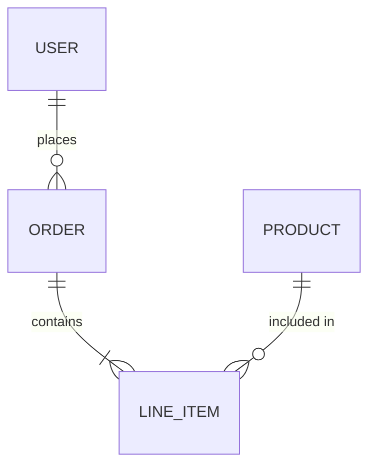

# Activity: Generate Technical Specification
> **RFC 2119 Notice:** The key words **MUST**, **MUST NOT**, **REQUIRED**, **SHALL**, **SHALL NOT**, **SHOULD**, **SHOULD NOT**, **RECOMMENDED**, **MAY**, and **OPTIONAL** in this document are to be interpreted as described in [RFC 2119](https://www.rfc-editor.org/rfc/rfc2119).


## Goal

Transform refined requirements (PRD) into an actionable technical design by synthesizing them with the project's Technical Guidelines. The specification bridges "what to build" (PRD) and "how to build it" (implementation).

## Context

This activity assumes the following documents already exist:
- `product-context.md` — Product understanding
- `technical-guidelines.md` — Technical standards and patterns
- `prd-[feature-name].md` — Feature requirements (produced by the **refine** activity)

## Document Changelog Convention

Every specification produced by this activity **MUST** include a **Changelog** table as the **first section** after the document title. The changelog tracks the version history of the document.

- The initial version **MUST** be `1.0`.
- Every subsequent update **MUST** increment the minor version (e.g., `1.1`, `1.2`, …).
- Major structural rewrites **SHOULD** increment the major version (e.g., `2.0`).
- The **Author** column **MUST** include the name of the person or agent responsible for the change (e.g., `@username`, `developer-agent`, `planner-agent`).

```markdown
## Changelog

| Version | Date       | Summary                  | Author              |
|---------|------------|--------------------------|----------------------|
| 1.0     | YYYY-MM-DD | Initial version          | @user / agent-name   |
```

## Process

1. **Receive References:** User points to the existing PRD and confirms Technical Guidelines are available.
2. **Analyze Documents:** You **MUST** read and analyze both the PRD and Technical Guidelines to identify integration points.
3. **Ask Specification Questions:** You **SHOULD** ask targeted questions about specific technical decisions and implementation approach.
4. **Generate Specification:** You **MUST** create a comprehensive technical specification using the structure below.
5. **Save Output.**

## Clarifying Questions

Focus on technical decisions and implementation approach:

- **Affected Repositories:** "Which repositories are affected? What role does each play (backend, frontend, shared lib, infra)?"  
- **System Design:** "Based on the feature requirements and our technical guidelines, what is the proposed system architecture for this feature?"
- **Data Model:** "What data entities and relationships are needed? How do they map to our database design?"
- **API Endpoints:** "What API endpoints will be needed? How do they fit our API design standards?"
- **Integration Points:** "Which existing systems or services will we integrate with? What integration method?"
- **Authentication/Authorization:** "How will this feature enforce authentication and authorization per our guidelines?"
- **Performance Approach:** "How will we ensure performance targets are met? Any caching or optimization strategies?"
- **Error Handling:** "How should errors be handled and reported to users?"
- **Validation Logic:** "What validation rules need to be enforced? Client-side and/or server-side?"
- **External Dependencies:** "Are there new third-party services or tools to integrate?"
- **Feature Flags:** "Will feature flags or toggles be used for rollout?"
- **Backward Compatibility:** "Are there backward compatibility concerns with existing APIs or data?"

## Output Structure

The generated Specification document **MUST** include:

0. **Changelog** — Version history table (see Document Changelog Convention above)
1. **Executive Summary** — How the PRD will be technically implemented (2-3 sentences)
2. **Reference Documents** — Links to the PRD and relevant Technical Guidelines sections
3. **Affected Repositories** — Table of repositories impacted by this specification. For each repo, describe the role it plays (e.g., API backend, web frontend, shared library) and the scope of changes expected. Format: `| Repository | Role | Scope of Changes |`
4. **System Architecture** — Data flow, component interactions, external integrations, how this fits the broader system
5. **Data Model & Database Design** — Entity relationships, schema overview, naming conventions, migration strategy
6. **API Design** — Endpoint specifications, request/response schemas, auth per endpoint, rate limiting, versioning
7. **Authentication & Authorization Design** — Auth implementation, permission matrix, session/token management
8. **Business Logic Implementation** — Key algorithms, business rule enforcement locations, validation rules, state machines
9. **Integration Details** — Third-party integrations, methods, retry/failure handling, credentials
10. **User Interface & Client Behavior** — Page/screen flow, UI components, client-side validation, responsive design
11. **Performance & Scalability Approach** — Caching, query optimization, pagination, expected metrics
12. **Security Implementation** — Encryption, input sanitization, OWASP considerations, PII handling, audit logging
13. **Error Handling & Logging** — Error formats, logging strategy, recovery behavior, monitoring
14. **Testing Strategy** — Unit/integration/E2E scope, mock strategy, coverage targets
15. **Deployment & Rollout** — Feature flags, migration steps, backward compatibility, rollback plan
16. **Dependencies & Risks** — Technology dependencies, known risks, mitigation strategies
17. **Open Questions** — Remaining technical decisions

## Diagram Guidelines

The specification **MUST** include embedded Mermaid diagrams to visually communicate architecture, data models, and key flows. Use fenced code blocks with the `mermaid` language tag.

Required and recommended diagrams:

| Diagram Type | Requirement | Target Section |
|---|---|---|
| **Component / C4-style diagram** | **MUST** include — shows services, repos, and their interactions | System Architecture |
| **Entity-Relationship diagram** | **MUST** include when new or modified data entities exist | Data Model & Database Design |
| **Sequence diagram** | **SHOULD** include for key API flows or multi-service interactions | API Design or Business Logic Implementation |
| **State diagram** | **SHOULD** include when entities have meaningful state transitions | Business Logic Implementation |
| **Deployment diagram** | **MAY** include for complex multi-environment rollouts | Deployment & Rollout |

Example embedding:

````markdown

````

Rules:
- Diagrams **MUST** be embedded inline in the relevant section, not collected at the end.
- Each diagram **MUST** have a brief introductory sentence explaining what it shows.
- Keep diagrams focused — one concern per diagram. Split large diagrams rather than cramming everything into one.
- Use consistent naming across diagrams and prose (same component/entity/endpoint names).
- ER diagrams **SHOULD** include cardinality and key attributes.
- Sequence diagrams **SHOULD** include error/alternate paths when relevant.

## Key Synthesis Points

The specification **MUST** clearly show how:
- Each PRD requirement is addressed technically
- Technical Guidelines are applied to this specific feature
- The system integrates with existing architecture
- Technology stack choices support the requirements

## Output

- **Format:** Markdown (`.md`)
- **Location:** `/workstream/`
- **Filename:** `specification-[prd-name].md`

## Final Instructions

1. You **MUST NOT** start implementing.
2. You **MUST** read the referenced PRD and Technical Guidelines documents.
3. You **SHOULD** ask clarifying questions about the technical implementation approach.
4. You **MUST** ensure the specification clearly maps PRD requirements to technical solutions.
5. You **MUST** present the specification for user review.
6. You **MUST** save the finalized version.
7. When updating an existing specification, you **MUST** add a new row to the Changelog table with an incremented version, the current date, a summary of changes, and the responsible author/agent.
