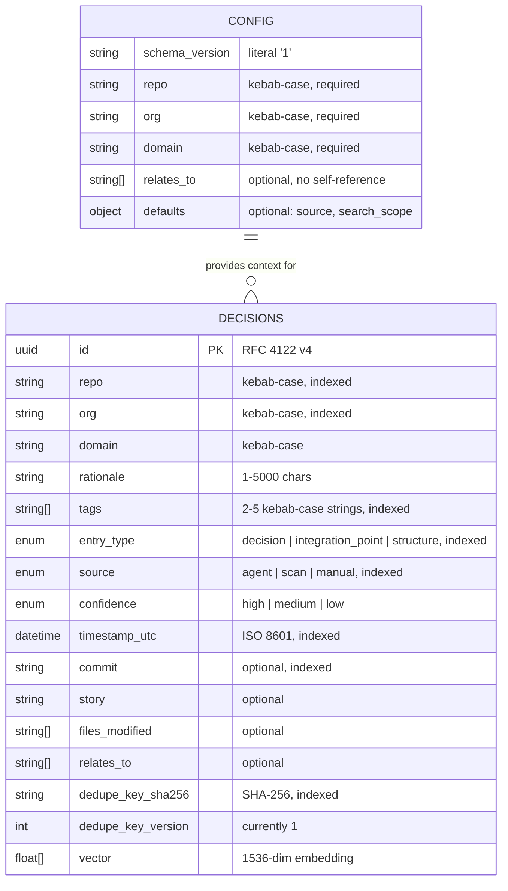
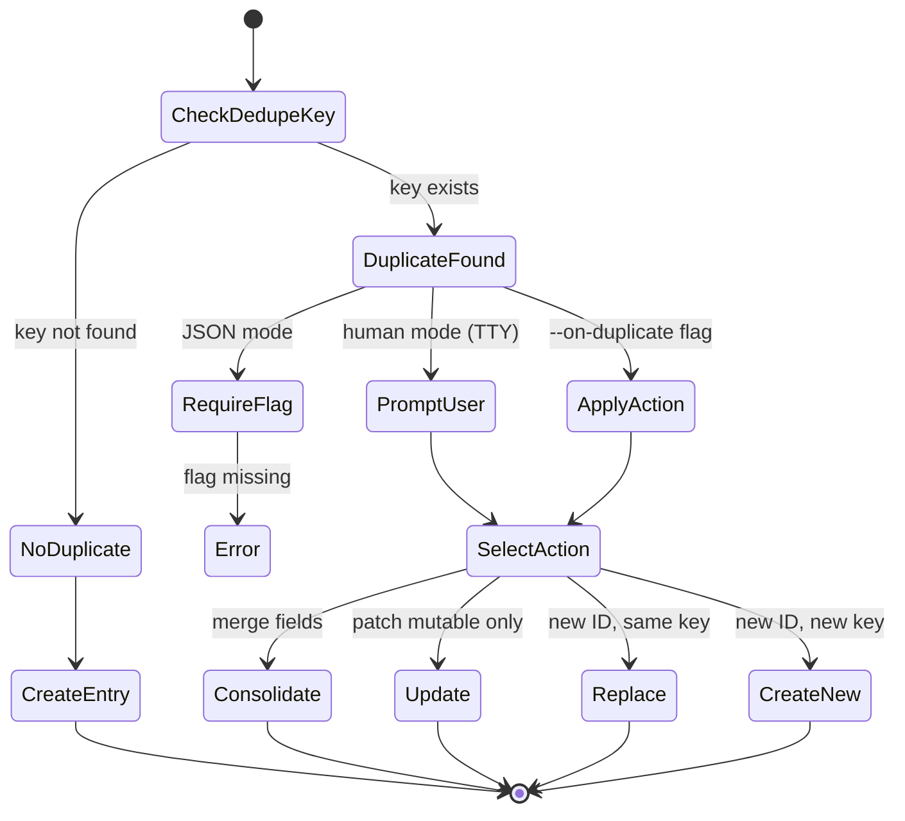

# Data Model — Memo CLI

> `@memo-ai/cli` v1.0 — Current-state documentation

---

## Qdrant Collection

**Collection name:** `decisions`

All entries from all repositories and organizations are stored in a single collection. Logical isolation is achieved via the `repo` and `org` payload fields.

| Property | Value |
|----------|-------|
| Distance metric | Cosine |
| Vector dimensions | 1536 (OpenAI `text-embedding-3-small`) |
| Auto-bootstrap | Yes — created on first write, search, or list |

---

## Entity-Relationship Diagram

---

## Entry Payload Schema

Validated at write time via Zod (`EntryPayloadSchema`):

| Field | Type | Required | Constraints | Notes |
|-------|------|----------|-------------|-------|
| `id` | UUID | Yes | RFC 4122 v4 | Generated by CLI at write time |
| `repo` | string | Yes | kebab-case | Repository identifier |
| `org` | string | Yes | kebab-case | Organization identifier |
| `domain` | string | Yes | kebab-case | Domain/product area |
| `rationale` | string | Yes | 1–5000 chars | The decision text; primary semantic content |
| `tags` | string[] | Yes | 2–5 items, kebab-case | Classification tags for filtering |
| `entry_type` | enum | Yes | `decision` \| `integration_point` \| `structure` | Category of knowledge |
| `source` | enum | Yes | `agent` \| `scan` \| `manual` | How the entry was created |
| `confidence` | enum | Yes | `high` \| `medium` \| `low` | Inferred from source |
| `timestamp_utc` | datetime | Yes | ISO 8601 | Auto-generated at write time |
| `dedupe_key_sha256` | string | Yes | SHA-256 hex | Hash of canonical deduplication string |
| `dedupe_key_version` | integer | Yes | Currently `1` | Version of dedupe key algorithm |
| `commit` | string | No | — | Git commit SHA |
| `story` | string | No | — | Story/task identifier |
| `files_modified` | string[] | No | — | Affected file paths |
| `relates_to` | string[] | No | — | Related repository identifiers |

### Payload Indexes

| Field | Index Type | Purpose |
|-------|-----------|---------|
| `repo` | keyword | Pre-filter by repository |
| `org` | keyword | Pre-filter by organization |
| `entry_type` | keyword | Filter by entry category |
| `source` | keyword | Filter by creation source |
| `tags` | keyword | AND-semantics tag filtering |
| `timestamp_utc` | datetime | Chronological ordering and date-range queries |
| `commit` | keyword | Lookup by commit SHA |
| `dedupe_key_sha256` | keyword | Duplicate detection lookup |

---

## Deduplication

### Key Generation

Canonical string format: `v1|<repo>|<commit_or_na>|<story_or_na>|<entry_type>|<source>`

The canonical string is hashed with SHA-256 to produce `dedupe_key_sha256`.

### Duplicate Resolution

When a write detects an existing entry with the same dedupe key:

### Merge Rules (Consolidate)

| Field | Rule |
|-------|------|
| `tags` | Union, deduplicate, cap at 5 (prefer incoming first) |
| `files_modified` | Union, deduplicate |
| `relates_to` | Union, deduplicate |
| `confidence` | Keep strongest (`high` > `medium` > `low`) |
| `rationale` | Keep longer text |
| `timestamp_utc` | Preserve existing |

---

## Local Config Schema

File: `memo.config.json` (per-repository, created by `memo setup init`)

Validated via Zod (`MemoConfigSchema`):

| Field | Type | Required | Default | Constraints |
|-------|------|----------|---------|-------------|
| `schema_version` | string | Yes | — | Literal `"1"` |
| `repo` | string | Yes | — | kebab-case |
| `org` | string | Yes | — | kebab-case |
| `domain` | string | Yes | — | kebab-case |
| `relates_to` | string[] | No | `[]` | No duplicates, no self-reference |
| `defaults.source` | enum | No | — | `agent` \| `scan` \| `manual` |
| `defaults.search_scope` | enum | No | — | `repo` \| `related` |

The schema uses `.passthrough()` to preserve unknown keys for forward compatibility.

---

## Invariants

1. Every entry has a unique `id` (UUID v4) and a `dedupe_key_sha256`.
2. `tags` array always contains 2–5 kebab-case strings.
3. `entry_type` and `source` are restricted to their respective enum values.
4. `confidence` is inferred from `source` (`agent` → `high`, `manual` → `medium`), not set by the user in v1.
5. `timestamp_utc` is auto-generated at write time; not user-settable.
6. Config `relates_to` cannot contain the repo itself and cannot have duplicates.
7. Collection bootstrap is idempotent — safe to run repeatedly.

---

## Schema Evolution Policy

- Additive changes only (new optional fields) within v1.x.
- Readers ignore unknown fields and preserve them during pass-through.
- Breaking schema changes require a major version bump.
- No dedicated migration tooling in v1; compatibility is handled in runtime parsers.
