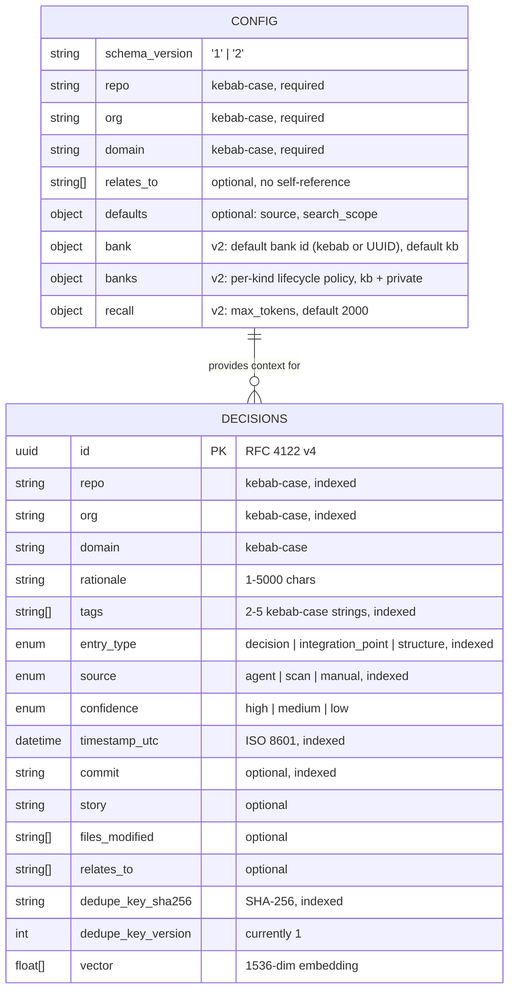
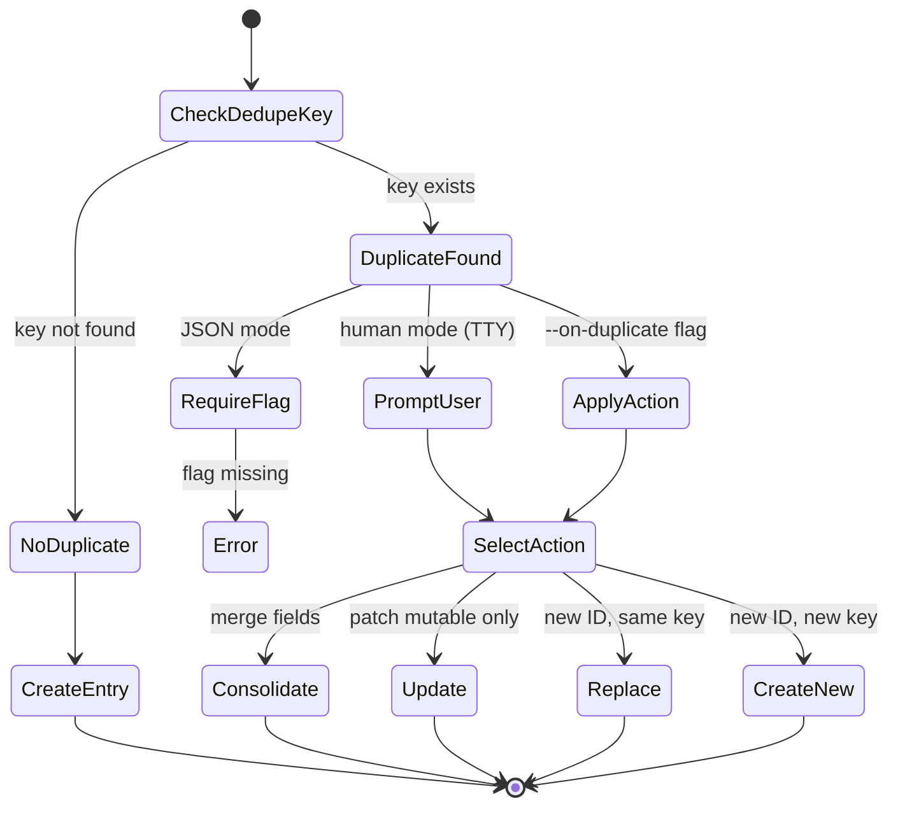

# Data Model — Memo CLI

> `@memo-ai/cli` v1.0 — Current-state documentation

---

## Qdrant Collection

**Collection name:** `decisions`

All entries from all repositories and organizations are stored in a single collection. Logical isolation is achieved via the `repo` and `org` payload fields.

| Property          | Value                                         |
| ----------------- | --------------------------------------------- |
| Distance metric   | Cosine                                        |
| Vector dimensions | 1536 (OpenAI `text-embedding-3-small`)        |
| Auto-bootstrap    | Yes — created on first write, search, or list |

---

## Entity-Relationship Diagram

```mermaid
erDiagram
    DECISIONS {
        uuid id PK "RFC 4122 v4"
        string repo "kebab-case, indexed"
        string org "kebab-case, indexed"
        string domain "kebab-case"
        string rationale "1-5000 chars"
        string[] tags "2-5 kebab-case strings, indexed"
        enum entry_type "decision | integration_point | structure, indexed"
        enum source "agent | scan | manual, indexed"
        enum confidence "high | medium | low"
        datetime timestamp_utc "ISO 8601, indexed"
        string commit "optional, indexed"
        string story "optional"
        string[] files_modified "optional"
        string[] relates_to "optional"
        string dedupe_key_sha256 "SHA-256, indexed"
        int dedupe_key_version "currently 1"
        float[] vector "1536-dim embedding"
    }

    CONFIG {
        string schema_version "'1' | '2'"
        string repo "kebab-case, required"
        string org "kebab-case, required"
        string domain "kebab-case, required"
        string[] relates_to "optional, no self-reference"
        object defaults "optional: source, search_scope"
        object bank "v2: default bank id (kebab or UUID), default kb"
        object banks "v2: per-kind lifecycle policy, kb + private"
        object recall "v2: max_tokens, default 2000"
    }

    CONFIG ||--o{ DECISIONS : "provides context for"
```

---

## Entry Payload Schema

Validated at write time via Zod (`EntryPayloadSchema`):

| Field                | Type     | Required | Constraints                                      | Notes                                       |
| -------------------- | -------- | -------- | ------------------------------------------------ | ------------------------------------------- |
| `id`                 | UUID     | Yes      | RFC 4122 v4                                      | Generated by CLI at write time              |
| `repo`               | string   | Yes      | kebab-case                                       | Repository identifier                       |
| `org`                | string   | Yes      | kebab-case                                       | Organization identifier                     |
| `domain`             | string   | Yes      | kebab-case                                       | Domain/product area                         |
| `rationale`          | string   | Yes      | 1–5000 chars                                     | The decision text; primary semantic content |
| `tags`               | string[] | Yes      | 2–5 items, kebab-case                            | Classification tags for filtering           |
| `entry_type`         | enum     | Yes      | `decision` \| `integration_point` \| `structure` | Category of knowledge                       |
| `source`             | enum     | Yes      | `agent` \| `scan` \| `manual`                    | How the entry was created                   |
| `confidence`         | enum     | Yes      | `high` \| `medium` \| `low`                      | Inferred from source                        |
| `timestamp_utc`      | datetime | Yes      | ISO 8601                                         | Auto-generated at write time                |
| `dedupe_key_sha256`  | string   | Yes      | SHA-256 hex                                      | Hash of canonical deduplication string      |
| `dedupe_key_version` | integer  | Yes      | Currently `1`                                    | Version of dedupe key algorithm             |
| `commit`             | string   | No       | —                                                | Git commit SHA                              |
| `story`              | string   | No       | —                                                | Story/task identifier                       |
| `files_modified`     | string[] | No       | —                                                | Affected file paths                         |
| `relates_to`         | string[] | No       | —                                                | Related repository identifiers              |

### Payload Indexes

| Field               | Index Type | Purpose                                             |
| ------------------- | ---------- | --------------------------------------------------- |
| `repo`              | keyword    | Pre-filter by repository                            |
| `org`               | keyword    | Pre-filter by organization                          |
| `entry_type`        | keyword    | Filter by entry category                            |
| `source`            | keyword    | Filter by creation source                           |
| `tags`              | keyword    | AND-semantics tag filtering                         |
| `timestamp_utc`     | datetime   | Chronological ordering and date-range queries       |
| `commit`            | keyword    | Lookup by commit SHA                                |
| `dedupe_key_sha256` | keyword    | Duplicate detection lookup                          |
| `rationale`         | text       | Lexical identifier matching (issue #62)             |
| `files_modified`    | text       | Lexical identifier matching (issue #62)             |
| `bank`              | keyword    | Bank isolation (PRD-004 Phase 2, issue #81)         |
| `kind`              | keyword    | Filter by memory kind (episodic/semantic/self, #81) |
| `session_id`        | keyword    | Filter/group episodic entries by session (#81)      |
| `contexts`          | keyword    | AND-semantics context filtering (#81)               |
| `seq`               | integer    | Ordered scans within a session (#81)                |
| `archived`          | bool       | Default-exclude archived entries (#81)              |
| `superseded`        | bool       | Default-exclude superseded entries (#81)            |
| `consolidated`      | bool       | Filter by consolidation state (#81)                 |
| `pinned`            | bool       | Filter by pinned state (#81)                        |
| `valid_to`          | datetime   | Point-in-time (`--as-of`) validity queries (#81)    |
| `expires_at`        | datetime   | Expiry-based staleness/archival queries (#81)       |
| `archived_at`       | datetime   | Archival timestamp queries (#81)                    |

The two `text` indexes use `tokenizer: word`, `lowercase: true`, `min_token_len: 2`,
`max_token_len: 20` — mirrored client-side by `src/lib/lexical.ts`'s `tokenizeWord` so a
locally computed match agrees with what the index would report. Verified live against Qdrant
1.18.2 that a `text` index on an array field (`files_modified`) tokenizes each element
independently (a query token present in only one array element still matches, one present in
neither does not) — no rationale-only fallback is needed.

`QdrantRepository.ensureIndexes()` reconciles this table against the collection's current
`payload_schema` on every `memo search`/`memo write` invocation and creates only what is
missing — idempotent, additive-only (it never rewrites a stored point), and safe to run
against a collection created by an earlier memo-cli version: the new indexes backfill onto
every existing point automatically. `ensureCollection()` calls `ensureIndexes()` internally
after creating the collection (if needed), so no separate migration step is required.

---

## Deduplication

### Key Generation

Canonical string format: `v1|<repo>|<commit_or_na>|<story_or_na>|<entry_type>|<source>`

The canonical string is hashed with SHA-256 to produce `dedupe_key_sha256`.

### Duplicate Resolution

When a write detects an existing entry with the same dedupe key:

```mermaid
stateDiagram-v2
    [*] --> CheckDedupeKey
    CheckDedupeKey --> NoDuplicate: key not found
    CheckDedupeKey --> DuplicateFound: key exists

    NoDuplicate --> CreateEntry
    CreateEntry --> [*]

    DuplicateFound --> PromptUser: human mode (TTY)
    DuplicateFound --> RequireFlag: JSON mode
    DuplicateFound --> ApplyAction: --on-duplicate flag

    RequireFlag --> Error: flag missing
    PromptUser --> SelectAction
    ApplyAction --> SelectAction

    SelectAction --> Consolidate: merge fields
    SelectAction --> Update: patch mutable only
    SelectAction --> Replace: new ID, same key
    SelectAction --> CreateNew: new ID, new key

    Consolidate --> [*]
    Update --> [*]
    Replace --> [*]
    CreateNew --> [*]
```

### Merge Rules (Consolidate)

| Field            | Rule                                                 |
| ---------------- | ---------------------------------------------------- |
| `tags`           | Union, deduplicate, cap at 5 (prefer incoming first) |
| `files_modified` | Union, deduplicate                                   |
| `relates_to`     | Union, deduplicate                                   |
| `confidence`     | Keep strongest (`high` > `medium` > `low`)           |
| `rationale`      | Keep longer text                                     |
| `timestamp_utc`  | Preserve existing                                    |

---

## Local Config Schema

File: `memo.config.json` (per-repository, created by `memo setup init`)

Validated via Zod (`MemoConfigSchema`):

| Field                                     | Type     | Required | Default                                    | Constraints                                                                |
| ----------------------------------------- | -------- | -------- | ------------------------------------------ | -------------------------------------------------------------------------- |
| `schema_version`                          | string   | Yes      | —                                          | `"1"` \| `"2"`                                                             |
| `repo`                                    | string   | Yes      | —                                          | kebab-case                                                                 |
| `org`                                     | string   | Yes      | —                                          | kebab-case                                                                 |
| `domain`                                  | string   | Yes      | —                                          | kebab-case                                                                 |
| `relates_to`                              | string[] | No       | `[]`                                       | No duplicates, no self-reference                                           |
| `defaults.source`                         | enum     | No       | —                                          | `agent` \| `scan` \| `manual`                                              |
| `defaults.search_scope`                   | enum     | No       | —                                          | `repo` \| `related`                                                        |
| `ranking.w_similarity`                    | number   | No       | `0.6`                                      | `[0, 1]`; weight-sum rule below                                            |
| `ranking.w_recency`                       | number   | No       | `0.3`                                      | `[0, 1]`; weight-sum rule below                                            |
| `ranking.w_source`                        | number   | No       | `0.1`                                      | `[0, 1]`; weight-sum rule below                                            |
| `ranking.recency_half_life_days`          | number   | No       | `365`                                      | Positive, finite                                                           |
| `ranking.tag_boost_factor`                | number   | No       | `0.05`                                     | Non-negative, finite; `0` disables tag boosting (issue #36)                |
| `ranking.confidence_thresholds`           | object   | No       | `{ exact: 0.88, high: 0.75, medium: 0.6 }` | Each in `[0, 1]`, strictly descending `exact > high > medium` (issue #35)  |
| `ranking.staleness_threshold_days`        | number   | No       | `120`                                      | Non-negative, finite (issue #38)                                           |
| `ranking.staleness_tag_overlap_threshold` | number   | No       | `0.5`                                      | `[0, 1]` (issue #38)                                                       |
| `ranking.lexical`                         | boolean  | No       | `true`                                     | `false` (or `--lexical off`) disables the extra lexical scroll (issue #62) |
| `ranking.lexical_boost_factor`            | number   | No       | `0.15`                                     | Non-negative, finite; `0` disables lexical boosting (issue #62)            |

The schema uses `.passthrough()` to preserve unknown keys for forward compatibility.

`ranking` (issue #34) is additive and fully optional: a v1 config without it, or with an empty `{}`, resolves every field to its default. `w_similarity + w_recency + w_source` must sum to `1.0` within `±0.001` (float tolerance) once defaults are resolved for any missing field — this rejects a partial override that breaks the sum (e.g. `{ "w_similarity": 0.5 }` alone), while a partial override that leaves all three weights untouched (e.g. only `recency_half_life_days`) still passes.

`recency_half_life_days` defaults to `365`, not the originally-proposed `90` — landing composite ranking at `90` regressed the relevance-eval floor from 92.9% to 85.7% (AC21); a one-factor sweep (task 8.0's methodology, applied to this story) found `365` inside a wide, robust plateau (~260-700+ days) that restores 96.4%, without changing the weights. See `README.md`'s relevance-eval subsection and PR #67 for the full sweep.

### Config v2 (issue #53 / S2-01)

Additive when introduced in S2-01 (no command wired these blocks into read/write paths yet); `memo write` (S2-04, below) is the first command to read `banks.*` policy via `policyFor()`/`resolveBank()`. Read-side wiring (`search`/`list`/`tags`/`read`) remains S2-05. A v1.2.0 config parses unchanged; `bank`, `banks`, and `recall` resolve to their documented defaults even when entirely absent from the file.

| Field                         | Type    | Default        | Constraints                                |
| ----------------------------- | ------- | -------------- | ------------------------------------------ |
| `bank.default`                | string  | `"kb"`         | Kebab-case bank id or UUID (`KebabOrUuid`) |
| `banks.kb.episodic.*`         | object  | §8.4 row below | See `KindPolicySchema` fields below        |
| `banks.kb.semantic.*`         | object  | §8.4 row below | See `KindPolicySchema` fields below        |
| `banks.private.self.soft_cap` | integer | `50`           | Positive integer                           |
| `banks.private.episodic.*`    | object  | §8.4 row below | See `KindPolicySchema` fields below        |
| `banks.private.semantic.*`    | object  | §8.4 row below | See `KindPolicySchema` fields below        |
| `recall.max_tokens`           | integer | `2000`         | Positive integer                           |

`KindPolicySchema` fields (`initial_stability_days`, `expires_in_days`, `archive_threshold`, `archive_noisy`, `promoted_grace_days`, `superseded_grace_days`, `purge_after_days`) carry no per-field default — each bank/kind combination supplies its own full default row (below) so a partial override of one bank/kind (e.g. only `banks.private.self.soft_cap`) does not blank out sibling policy blocks. `purge_after_days: null` means "never purge automatically"; absent (when the enclosing object is explicitly present but the key is omitted) resolves to `undefined`.

| Bank type / kind       | `initial_stability_days` | `expires_in_days` | `archive_threshold` | `archive_noisy` | `promoted_grace_days` | `superseded_grace_days` | `purge_after_days` |
| ---------------------- | ------------------------ | ----------------- | ------------------- | --------------- | --------------------- | ----------------------- | ------------------ |
| `private` / `self`     | —                        | —                 | —                   | —               | —                     | —                       | — (`soft_cap: 50`) |
| `private` / `episodic` | 3                        | 30                | —                   | —               | 7                     | —                       | 30                 |
| `private` / `semantic` | 30                       | —                 | 0.05                | `true`          | —                     | 30                      | 90                 |
| `kb` / `episodic`      | 3                        | 90                | —                   | —               | 7                     | —                       | `null` (never)     |
| `kb` / `semantic`      | 90                       | —                 | 0.05                | `false`         | —                     | 30                      | `null` (never)     |

### Entry Payload Schema v2 (issue #53 / S2-01)

`EntryPayloadV2Schema` (`src/types/entry.ts`) is a write-time superset of the v1 schema, which remains exported and unchanged. New fields: `schema_version` (`literal('2')`, defaults to `'2'`), `bank` (`KebabOrUuid`), `kind` (`self | episodic | semantic`), `session_id`, `seq`, `contexts`, `provenance`, `valid_from`, `valid_to`, `superseded`, `superseded_by`, `consolidated`, `consolidated_at`, `pinned`, `archived`, `archived_reason`, `archived_at`, `expires_at`, `stability`, `stability_since`, `last_retrieved_at`, `retrieval_count`, `used_count`, `pending_contradiction`, and a widened `dedupe_key_version` (`v1 | v2`). `entry_type` gains `policy`/`observation`; `source` gains `scan` (`sourceToConfidence('scan') === 'low'`). `repo`/`org`/`domain` become optional at the schema level.

A single `superRefine` enforces PRD §2.5's rules:

| Rule                                 | Check                                                                                                |
| ------------------------------------ | ---------------------------------------------------------------------------------------------------- |
| K1 — `self` only in private banks    | `kind === 'self' && bank === 'kb'` rejected (path: `kind`)                                           |
| K2 — scope required in `kb`          | `bank === 'kb' && !(repo && org && domain)` rejected (path: `repo`)                                  |
| episodic needs a session             | `kind === 'episodic' && !session_id` rejected (path: `session_id`)                                   |
| K3 — agent semantic needs provenance | `kind === 'semantic' && source === 'agent' && provenance` empty/absent rejected (path: `provenance`) |
| `self` carries no retention fields   | `kind === 'self'` with `stability`/`expires_at`/`retrieval_count` rejected (path: `kind`)            |
| `seq` only on episodic               | `seq !== undefined && kind !== 'episodic'` rejected (path: `seq`)                                    |

`normalizeEntry()` (`src/lib/entry-normalize.ts`, pure) is the read boundary: `bank ??= 'kb'`, `kind ??= 'semantic'`, `schema_version ??= '1'`, every boolean (`archived`, `superseded`, `consolidated`, `pinned`, `pending_contradiction`) `??= false`, and `valid_from ??= timestamp_utc` when `kind !== 'episodic'`. `memo write --supersedes` (S2-04, below) is the first command to call it, to check the target's `bank`/`kind`/`superseded` state before writing; other read-side commands remain S2-05.

### `memo write` v2 (issue #83 / S2-04)

`src/commands/write.ts` implements spec §18.6's eleven-step order on top of the S2-01–S2-03 building blocks (`resolveBank`, `defaultKind`, `policyFor`, `buildDedupeKeyV2`, `normalizeEntry`) — none of them are reimplemented here:

1. Resolve `bank` (`--bank` / `MEMO_BANK` / `config.bank.default` / `kb`), `kind` (`--kind` or `defaultKind(bank)`), and `policy` (`policyFor`) — this alone enforces K1 (`--kind self` in `kb` fails `VALIDATION_FAILED`) before any I/O.
2. Scope: `repo`/`org`/`domain` are required in `kb` (`REPO_CONTEXT_UNRESOLVED` on miss, unchanged from v1) and optional everywhere else.
3. `--manual` forces `source = 'manual'`; `entry_type` defaults to `observation` for `episodic`, `decision` otherwise.
4. Build the v2 payload: retention fields (`stability`, `stability_since`, `retrieval_count`, `used_count`) from policy except for `self`; episodic entries get `session_id`, auto-incremented `seq` (`nextSeq`, `scrollOrdered` on `{ bank, kind: episodic, session_id }` ordered `seq desc, limit 1`, `+1`, `0` when empty) and `expires_at` from `--expires-in` (`src/lib/duration.ts`, `\d+[dhm]`) or the policy default.
5. Validate with `EntryPayloadV2Schema`.
6. `--supersedes <id>`: `getById` (`ENTRY_NOT_FOUND` on miss) then `normalizeEntry` the target — mismatched `bank`/`kind` or an already-superseded target fails `VALIDATION_FAILED`; a self-reference (`target.id === id`) is rejected before any I/O.
7. `self` soft-cap: one `count()` of non-superseded `self` entries in the bank; `>= policy.soft_cap` emits a non-blocking warning with the pre-write count (`self entries in <bank>: <n> (soft cap <cap>)`).
8. Dedupe via `buildDedupeKeyV2`; a `kb` semantic write also probes the v1 `buildDedupeKey` so a pre-migration duplicate is still caught; `self` never dedupes.
9. Embed and `upsert`, as in v1.
10. If step 6 applied, `setPayload` the target (`valid_to`, `superseded: true`, `superseded_by`) — not transactional; a failure here after the upsert succeeded exits 2 with `QDRANT_OPERATION_FAILED` naming both the new and target ids.
11. Result JSON: the full v2 payload plus `created`/`updated`/`duplicate_detected`/`superseded?`/`warnings?`.

Migration note: this story writes v2 payloads but does not migrate existing data. Existing v1 points remain v1 and stay readable via `normalizeEntry` (S2-09 owns the bulk rewrite, `memo migrate --to-v2`). A v2 point written here is still readable by memo-cli 1.2.x as an ordinary entry — its new fields are simply ignored by a reader that never parses `schema_version`.

---

## Invariants

1. Every entry has a unique `id` (UUID v4) and a `dedupe_key_sha256`.
2. `tags` array always contains 2–5 kebab-case strings.
3. `entry_type` and `source` are restricted to their respective enum values.
4. `confidence` is inferred from `source` (`agent` → `high`, `manual` → `medium`), not set by the user in v1.
5. `timestamp_utc` is auto-generated at write time; not user-settable.
6. Config `relates_to` cannot contain the repo itself and cannot have duplicates.
7. Collection bootstrap is idempotent — safe to run repeatedly.

---

## Schema Evolution Policy

- Additive changes only (new optional fields) within v1.x.
- Readers ignore unknown fields and preserve them during pass-through.
- Breaking schema changes require a major version bump.
- No dedicated migration tooling in v1; compatibility is handled in runtime parsers.
