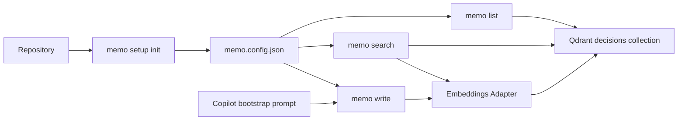
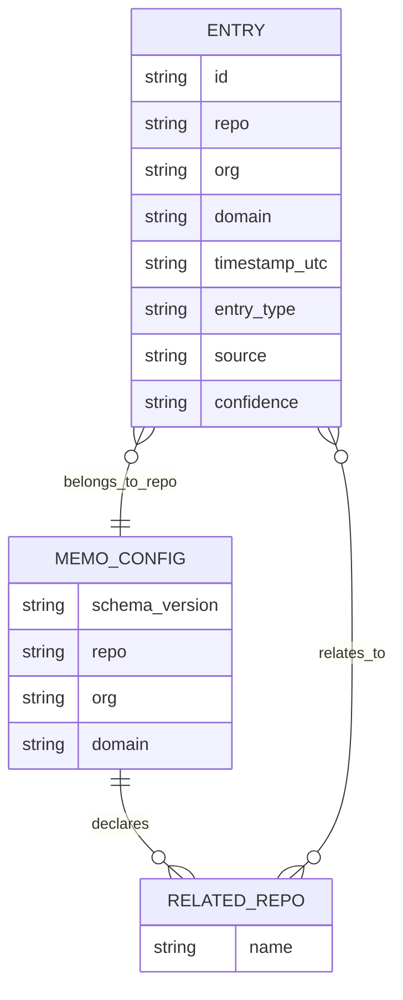

# PRD-001 — Memo MVP Core Loop

## Changelog

| Version | Date       | Summary         | Author         |
| ------- | ---------- | --------------- | -------------- |
| 1.0     | 2026-04-01 | Initial version | GitHub Copilot |

## 1. Executive Summary

PRD-001 defines the MVP of Memo as a repo-aware CLI that can initialize local configuration, persist architectural decisions, and retrieve them reliably through semantic search and chronological listing. The MVP also includes a guided bootstrap path for creating initial structure and integration memory from existing repositories without implementing the full automated scan pipeline.

## 2. Feature Overview

The MVP delivers the first complete value loop for Memo:

1. A developer or agent initializes Memo in a repository with `memo setup init`.
2. The repository receives a local `memo.config.json` that defines its identity and related repositories.
3. An agent writes decisions with `memo write`.
4. Developers and agents retrieve prior knowledge with `memo search` and `memo list`.
5. A minimal Copilot-assisted bootstrap flow creates baseline `structure` and `integration_point` entries for an existing repository.

The MVP intentionally stops short of full multi-repo orchestration, automated scan, and ecosystem Q&A, but it establishes the contracts those later phases depend on.

This diagram shows the MVP user flow and its core artifacts.



## 3. Goals & Objectives

1. Enable explicit repository onboarding through a local Memo configuration file.
2. Make decision capture consistent, machine-readable, and low-friction for agents.
3. Support repo-scoped semantic retrieval with optional related-repo expansion driven by config.
4. Provide chronological review of stored entries ordered by indexed timestamps.
5. Validate that a guided bootstrap prompt can generate useful baseline entries before automated scan is built.

## 4. Affected Repositories

| Repository       | Role / Impact                                                                                                                      |
| ---------------- | ---------------------------------------------------------------------------------------------------------------------------------- |
| `llipe/memo-cli` | Primary implementation repository for the CLI, local config scaffolding, write/search/list commands, and bootstrap prompt workflow |

## 5. Target Users

### Primary Users

- AI coding agents using CLI tools during implementation workflows
- Solo developers using AI assistance across repeated sessions
- Developer teams managing architectural knowledge inside a repository and across directly related repositories

### Secondary Users

- Tech leads auditing recent decisions
- New developers onboarding into a repository
- Devs performing guided bootstrap of legacy repos into Memo

## 6. User Stories

1. As an AI agent, I want to initialize Memo in a repository so that later commands can infer repo context without manual repetition.
2. As an AI agent, I want to write a decision with minimal required flags so that I can capture rationale at task completion time.
3. As a developer, I want to search for prior decisions in the current repo and related repos so that I can reuse existing architecture knowledge.
4. As a tech lead, I want to list recent entries chronologically so that I can audit changes over time.
5. As a developer, I want a guided bootstrap prompt so that I can seed Memo for an existing repository without waiting for full scan automation.

## 7. Functional Requirements

1. The CLI **MUST** provide `memo setup init` to scaffold a local `memo.config.json` in the current repository.
2. `memo setup init` **MUST** support interactive prompting in human mode and a fully non-interactive flag-based mode for agents.
3. The local config file **MUST** contain at minimum `repo`, `org`, `domain`, and `relates_to`.
4. The local config file **MAY** include optional future-facing fields, but the MVP reader **MUST** ignore unknown keys.
5. The global/central config reader **MUST** merge local config with remote config when available in later phases and **MUST** enrich reciprocal relationships so that if repo `A` declares `relates_to: [B]`, repo `B` is treated as related to `A` in the resolved graph.
6. The MVP **MUST** rely on the local `memo.config.json` as the default source of repo, org, and domain context.
7. `memo write` **MUST** auto-create the `decisions` collection and required indexes on first run if they do not already exist.
8. `memo write` **MUST** validate inputs against the entry payload schema before embedding or persistence.
9. `memo write` **MUST** support explicit `--relates-to` input so callers can associate a decision with other repositories when relevant.
10. `memo write` **MUST NOT** expose `--confidence` as a user-facing flag in MVP.
11. `memo write` **MUST** infer `confidence` from the write path:
    - `agent` writes default to `high`
    - `manual` bootstrap writes default to `medium`
    - reserved future automated scan writes default to `low`
12. `memo write` **MUST** support the following entry types only in MVP: `decision`, `integration_point`, `structure`.
13. `memo write` **MUST** support the following source values only in MVP: `agent`, `manual`, `scan`, where `scan` is reserved for future automation and not the normal bootstrap default.
14. `memo search` **MUST** perform semantic vector search using the natural-language query plus normalized tag terms when `--tags` is supplied.
15. `memo search` **MUST** apply exact-match filters as pre-filters before vector search.
16. Multi-tag search filtering **MUST** use AND semantics, meaning every requested tag must be present in a matched entry.
17. `memo search` **MUST** support repo-scope expansion using `relates_to` from local config when the caller requests related-repo scope.
18. `memo list` **MUST** return entries ordered by `timestamp_utc` descending using indexed `order_by` behavior.
19. The storage layer **MUST** index `timestamp_utc` in addition to other query fields.
20. JSON responses for `memo write`, `memo search`, and `memo list` **MUST** return all persisted payload fields.
21. `memo search --json` **MUST** also include `similarity` for each result.
22. Empty search or list results **MUST** return success with zero exit code and an empty `results` array.
23. Human output for empty results **MUST** clearly say that no entries were found and echo the active filters or scope.
24. The MVP **MUST** include a documented bootstrap prompt that instructs Copilot to emit strict JSON objects that can be mapped into `memo write` calls.
25. The bootstrap flow **MUST** support generating `structure` and `integration_point` entries with `source=manual`.

## 8. Business Rules

- Repository identity is explicit, not inferred heuristically, once `memo.config.json` exists.
- `relates_to` represents directed declarations in source config, but resolved relationship graphs should behave bidirectionally after enrichment.
- Tags are intended as both retrieval hints and exact filters; multi-tag filters are restrictive, not loose.
- A lack of matches is a valid outcome, not an operational failure.
- The bootstrap assistant flow is a controlled import path, not a substitute for future automated scan.

## 9. Data Requirements

### Entry Payload

The MVP entry payload must include:

- `id`
- `repo`
- `org`
- `domain`
- `story`
- `commit`
- `timestamp_utc`
- `files_modified`
- `tags`
- `relates_to`
- `rationale`
- `entry_type`
- `source`
- `confidence`

### Local Config Schema

The MVP local config should follow this shape:

```json
{
  "schema_version": "1",
  "repo": "memo-cli",
  "org": "llipe",
  "domain": "developer-tools",
  "relates_to": ["platform-docs", "shared-auth"],
  "defaults": {
    "entry_source": "agent",
    "search_scope": "repo"
  }
}
```

Rules:

- `schema_version` is required for the config file even though payload versioning remains implicit in MVP.
- `repo`, `org`, and `domain` are required strings.
- `relates_to` is required and may be an empty array.
- `defaults` is optional but recommended for future extensibility.
- Unknown keys are preserved and ignored by MVP readers.

### Local Config Field Definitions

| Field                   | Required | Type       | Expected format                                | Allowed values / meaning                                                                                                                                                                             | Example                                               |
| ----------------------- | -------- | ---------- | ---------------------------------------------- | ---------------------------------------------------------------------------------------------------------------------------------------------------------------------------------------------------- | ----------------------------------------------------- |
| `schema_version`        | Yes      | `string`   | Numeric string for config contract version     | MVP requires `"1"` only. Future readers may accept newer additive versions.                                                                                                                          | `"1"`                                                 |
| `repo`                  | Yes      | `string`   | Lowercase kebab-case repository identifier     | Logical repository name used as the default `repo` value for writes and searches. Should match the repository's canonical working name, not a display title.                                         | `"memo-cli"`                                          |
| `org`                   | Yes      | `string`   | Lowercase kebab-case or lowercase slug         | Organization, company, or top-level ownership namespace used for company-scope filtering.                                                                                                            | `"llipe"`                                             |
| `domain`                | Yes      | `string`   | Lowercase kebab-case domain slug               | Business or technical domain this repo belongs to. Used as descriptive metadata and future grouping/filtering.                                                                                       | `"developer-tools"`                                   |
| `relates_to`            | Yes      | `string[]` | Array of lowercase kebab-case repo identifiers | Declares repositories directly related to this repo for dependency or integration lookup. Source declarations are directional; the resolved graph becomes reciprocal after enrichment. May be empty. | `["platform-docs", "shared-auth"]`                    |
| `defaults`              | No       | `object`   | JSON object with known optional keys           | Stores command defaults that reduce repetition in daily use. Unknown keys are ignored in MVP.                                                                                                        | `{ "entry_source": "agent", "search_scope": "repo" }` |
| `defaults.entry_source` | No       | `string`   | Lowercase keyword                              | Default source for `memo write` when the user does not pass `--source`. Allowed MVP values: `"agent"`, `"manual"`. `"scan"` is reserved and should not be emitted by setup defaults.                 | `"agent"`                                             |
| `defaults.search_scope` | No       | `string`   | Lowercase keyword                              | Default search scope used when no explicit scope flag is provided. Allowed MVP values: `"repo"`, `"related"`. `"company"` is reserved for broader cross-repo flows and later config integration.     | `"repo"`                                              |

### Local Config Validation Rules

- `repo`, `org`, `domain`, and every item in `relates_to` should match this pattern in MVP: `^[a-z0-9]+(?:-[a-z0-9]+)*$`
- `relates_to` must not contain duplicates.
- `relates_to` must not contain the same value as `repo`.
- Leading and trailing whitespace must be trimmed before validation and persistence.
- Empty strings are invalid for all required string fields.
- `defaults.entry_source` and `defaults.search_scope` are optional, but if present they must match the allowed enumerated values above.
- Unknown top-level keys are allowed and ignored by MVP readers, but known keys with invalid values must fail validation.

### Local Config Semantics

- The local config is the authoritative default context for repo-scoped commands in MVP.
- CLI flags override local config values on a per-command basis.
- `relates_to` expands the candidate repo set only when the caller explicitly opts into related-repo search behavior.
- Future central config support may enrich `relates_to`, but it must not silently overwrite explicit local declarations without a merge rule.

This diagram shows the main entity relationships for the MVP.



## 10. Non-Goals (Out of Scope)

- Full automated `memo scan` with filesystem walking and LLM orchestration
- `memo ask` ecosystem-level Q&A
- Remote central config authoring UX
- Team-level RBAC or multi-tenant authorization
- Additional embedding providers in the first release
- Telemetry collection in MVP delivery

## 11. Design Considerations

- `memo setup init` should make first-run setup feel explicit and safe, not magical.
- Human-mode setup should show a preview of the config before writing it.
- Human-mode empty results should be informational rather than alarming.
- JSON mode must stay compact, stable, and lossless enough for agents to chain commands reliably.

## 12. Technical Considerations

### Setup Command Proposal

The MVP setup command surface should be:

```bash
memo setup init [--repo <name>] [--org <name>] [--domain <name>] [--relates-to <csv>] [--json]
memo setup show [--json]
memo setup validate [--json]
```

Rationale:

- `init` is the actual scaffolding command.
- `show` gives a low-cost way to inspect effective local config.
- `validate` gives agents and CI a deterministic config check without writing.

### Write Command Proposal

The MVP `memo write` command surface should be:

```bash
memo write \
  --rationale "<text>" \
  --tags "tag1,tag2" \
  [--entry-type decision|integration_point|structure] \
  [--story <id>] \
  [--commit <sha>] \
  [--files <csv-paths>] \
  [--relates-to <csv-repos>] \
  [--repo <name>] \
  [--org <name>] \
  [--domain <name>] \
  [--source agent|manual] \
  [--json]
```

Contract:

- Required flags: `--rationale`, `--tags`
- Optional with defaults from config: `--repo`, `--org`, `--domain`
- Optional metadata: `--story`, `--commit`, `--files`, `--relates-to`
- Optional classification: `--entry-type`, `--source`
- Forbidden in MVP: `--confidence`

### Similarity Proposal

- `similarity` in JSON search results should expose the raw Qdrant score as returned by the search engine.
- The field name remains `similarity` to keep the API semantic and vendor-neutral.
- Human mode may present it as a rounded percentage or relevance label later, but JSON mode should remain raw and stable.

### Empty Result Proposal

- `memo search` and `memo list` return exit code `0` when no results are found.
- JSON mode returns:

```json
{
  "results": [],
  "count": 0,
  "message": "No entries found for the requested scope and filters."
}
```

- Human mode returns a short success-style informational message stating no entries were found and which scope or filters were applied.

### Bootstrap Prompt Proposal

Use the following prompt template for the MVP pilot:

```text
You are extracting durable architectural memory for Memo from a bounded repository sample.

Analyze only the provided artifacts and produce JSON only.
Do not include markdown, explanations, or commentary.

Goal:
- Identify stable architectural structure or integration knowledge worth storing in Memo.
- Prefer facts that will still be useful in future tasks.
- Do not invent details that are not supported by the artifacts.

Output rules:
- Return a JSON array.
- Each item must include exactly these keys:
  - entry_type
  - tags
  - files_modified
  - rationale
  - relates_to
- entry_type must be one of: decision, integration_point, structure
- tags must contain 2 to 5 short lowercase strings
- files_modified must be repository-relative paths
- rationale must be 2 to 5 sentences and explain what exists, why it matters, and how it should be understood or integrated
- relates_to must list other repositories only when the artifact explicitly references them or makes the dependency obvious
- Do not include confidence, title, score, or any extra fields

Selection rules:
- Prefer modules, boundaries, APIs, auth patterns, event contracts, external integrations, and database structure
- Skip trivial utilities, generated files, and implementation details with low reuse value
- If evidence is weak, omit the candidate instead of guessing

Return only valid JSON.
```

## 13. Acceptance Criteria

- [ ] Running `memo setup init` in a repository creates a valid `memo.config.json` scaffold.
- [ ] The generated config contains `repo`, `org`, `domain`, and `relates_to`.
- [ ] `memo write` can succeed using repo/org/domain defaults from local config.
- [ ] `memo write` accepts `--relates-to` and persists it in the entry payload.
- [ ] `memo write` infers `confidence` and does not require a user-supplied confidence value.
- [ ] The first successful data command auto-creates the `decisions` collection and indexes, including `timestamp_utc`.
- [ ] `memo search` uses pre-filters before vector search.
- [ ] Multi-tag search requires all requested tags to match.
- [ ] `memo search --json` returns full payload fields plus `similarity`.
- [ ] `memo list` returns entries ordered by descending `timestamp_utc`.
- [ ] Empty search and list results return success with clear no-results messaging.
- [ ] The documented bootstrap prompt can produce valid JSON objects suitable for conversion into `memo write` commands.

## 14. Success Metrics

| Metric                    | Target                                                                                  |
| ------------------------- | --------------------------------------------------------------------------------------- |
| Setup completion success  | ≥ 95% of first-time setup runs produce a valid local config without manual file editing |
| Write success rate        | ≥ 95% of valid writes succeed on first attempt                                          |
| Search usefulness         | Top 3 results considered relevant in at least 80% of validation queries                 |
| Empty-result clarity      | 100% of no-result cases return exit code 0 and explicit no-result messaging             |
| Bootstrap prompt validity | ≥ 90% of generated bootstrap items validate without schema correction                   |

## 15. Assumptions

- Users initialize a repository with `memo setup init` before regular use.
- Qdrant and embeddings credentials are available through environment variables.
- Repo relationships defined locally are sufficient for MVP-level scope expansion.
- Raw Qdrant score is acceptable as the initial similarity contract.

## 16. Constraints & Dependencies

- Depends on local Qdrant or Qdrant Cloud availability.
- Depends on an embeddings provider, with OpenAI as the default MVP choice.
- Depends on Node.js 24 LTS runtime.
- Central config enrichment is designed now but not shipped as a full remote management workflow in MVP.

## 17. Security & Compliance

- No credentials are stored in `memo.config.json`.
- Config scaffolding must never echo secrets.
- JSON outputs must not include secret values or internal exception stacks.
- Bootstrap prompt usage must remain bounded to explicitly provided artifacts.

## 18. Open Questions

- Should `memo setup init` support auto-detecting initial `repo` from the git remote and offering it as a default, or should MVP keep setup fully explicit?
- Should related-repo scope expansion be an explicit `--scope related` mode in MVP search, or should it be a boolean flag such as `--include-related`?
- Should `memo setup validate` be allowed to fetch remote config in later phases, or remain strictly local and deterministic?
