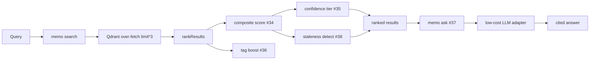

# PRD-002 — Search Ranking & Retrieval Improvements

## Changelog

| Version | Date       | Summary                                                     | Author           |
| ------- | ---------- | ----------------------------------------------------------- | ---------------- |
| 0.1     | 2026-04-15 | Initial draft covering issues #34, #36, #35, #38, #37       | product-engineer |

## 1. Executive Summary

PRD-002 upgrades `memo search` from raw cosine-similarity ordering to a trustworthy, agent-actionable retrieval layer. It introduces composite ranking that weights semantic similarity, recency, and source reliability; tag-overlap boosting; dynamic confidence tiers; passive staleness detection; and a new advisory `memo ask` command that synthesizes cited answers from the knowledge base. The goal is to make the most actionable and current decisions surface first, and to give agents reliable signals for deciding whether to act on a result.

## 2. Feature Overview

Today `memo search` returns results ordered purely by cosine similarity from Qdrant. A highly relevant but stale decision can outrank a fresher, more specific one, and every result carries a static `confidence: "high"` field that never changes. This PRD delivers five coordinated improvements that share a common ranking core:

1. **Composite ranking score (#34)** — post-retrieval scoring that blends similarity, recency (exponential decay), and source reliability. Foundation for the rest.
2. **Tag overlap boosting (#36)** — entries whose tags match query terms get a small boost at zero extra latency. Independent of #34.
3. **Dynamic confidence tiers (#35)** — `exact` / `high` / `medium` / `low` derived from the composite score, giving agents a programmatic act/verify/discard signal.
4. **Staleness detection (#38)** — a passive `stale` flag when an older entry is superseded by a newer one with overlapping tags in the same repo. Never hides results.
5. **`memo ask` (#37)** — retrieves ranked, tier-annotated candidates, passes them to a configurable low-cost LLM, and returns a concise cited answer grounded only in stored decisions.

## 3. Goals & Objectives

1. Order results by actionability and trust, not similarity alone.
2. Give agents a reliable, configurable confidence signal per result.
3. Warn agents when a retrieved decision is likely superseded.
4. Reward direct tag relevance without extra query cost.
5. Provide a grounded, cited advisory answer via `memo ask` at negligible LLM cost.
6. Preserve all existing flags, output shapes, exit codes, and performance targets; every change is additive and backward-compatible.

## 4. Affected Repositories

| Repository       | Role / Impact                                                                                             |
| ---------------- | --------------------------------------------------------------------------------------------------------- |
| `llipe/memo-cli` | Primary implementation: ranking library, staleness library, LLM adapter, `search` and new `ask` commands. |

## 5. Target Users

### Primary Users

- AI coding agents consuming `memo search` and `memo ask` before starting tasks.
- Solo developers relying on AI assistance across sessions.

### Secondary Users

- Tech leads and architects asking ecosystem-level questions.
- New team members using `memo ask` to understand prior decisions.

## 6. User Stories

Detailed stories and dependency map live in `workstream/user-stories-ranking-retrieval.md`. Issues:

| Story | Issue                                              | Title                                       | Depends on |
| ----- | -------------------------------------------------- | ------------------------------------------- | ---------- |
| 1     | [#34](https://github.com/llipe/memo-cli/issues/34) | Composite ranking score for search results  | —          |
| 2     | [#36](https://github.com/llipe/memo-cli/issues/36) | Tag overlap boosting in search results      | —          |
| 3     | [#35](https://github.com/llipe/memo-cli/issues/35) | Dynamic confidence tiers in search output   | #34        |
| 4     | [#38](https://github.com/llipe/memo-cli/issues/38) | Staleness detection flag on search results  | #34        |
| 5     | [#37](https://github.com/llipe/memo-cli/issues/37) | `memo ask` command with LLM re-ranking      | #34, #35   |

## 7. Functional Requirements

### 7.1 Composite ranking (#34)

- `final_score = similarity*w_similarity + recency_score*w_recency + source_score*w_source`; weights must sum to 1.0 (±0.001).
- `recency_score = exp(-λ*age_in_days)`, `λ = ln(2)/half_life_days`, default `half_life_days = 90`.
- `source_score`: `agent = 1.0`, `manual = 0.8`, `scan = 0.5`.
- Over-fetch `limit*3` candidates from Qdrant (capped at 50), then slice to `--limit` after scoring.
- JSON output replaces `similarity`-only ordering: each result exposes `final_score`, `similarity`, `recency_score`, `source_score`. Human output shows `final_score` as the percentage prefix.
- New optional `ranking` block in `memo.config.json`; missing fields fall back to defaults; `memo setup validate` fails on invalid weight sums.

### 7.2 Tag overlap boosting (#36)

- `tag_boost = matched_tags / total_query_terms * boost_factor`, default `boost_factor = 0.05`, set `0` to disable.
- Applied to `final_score` when #34 is present, else to `similarity`; `boosted_score` capped at 1.0.
- Whole-word, case-insensitive matching; stopwords excluded (`a, the, is, for, of, in, to, with`).
- `tag_boost` present in JSON per result; no human-output format change.

### 7.3 Confidence tiers (#35)

- Tiers from `final_score`: `exact ≥ 0.88`, `high 0.75–0.87`, `medium 0.60–0.74`, `low < 0.60`.
- Thresholds configurable under `ranking.confidence_thresholds`; `memo setup validate` rejects invalid ordering.
- JSON exposes `confidence_tier`; the static `confidence: "high"` field is removed from output. Human output shows `[tier]` prefix.

### 7.4 Staleness detection (#38)

- Flag `stale: true` when `age_in_days > staleness_threshold_days` (default 120) AND a newer same-repo entry has Jaccard tag overlap ≥ `staleness_tag_overlap_threshold` (default 0.5).
- Include `superseded_by` (newest overlapping entry ID) when stale; omit the `stale` key entirely when false in JSON.
- Requires one Qdrant scroll per invocation (not per result), cached for the command's duration. Does not affect `final_score`.
- Human output shows an inline `⚠ STALE — superseded by <id>` warning.

### 7.5 `memo ask` (#37)

- `memo ask "<question>"` over-fetches via search (`--limit 10`), filters out `confidence_tier: low`, sends survivors plus the question to the LLM with a structured prompt.
- LLM answers only from provided context, cites entry IDs, returns `"No stored decisions address this question."` when nothing is relevant, and keeps answers ≤ 150 words.
- Flags: `--scope`, `--limit`, `--json`. JSON output includes the answer, cited entry IDs, and a `grounded` boolean.
- Config `ask` block: `model` (default `gpt-4.1-nano`), `max_tokens` (default 300), `candidate_limit` (default 10).
- Exit codes: `1` for missing `memo.config.json`, `2` for unreachable LLM API.

### 7.6 LLM provider / cost policy (#37)

- Reuse the existing `openai` SDK and the planned `LLMAdapter` interface; no new SDK dependency.
- Default model `gpt-4.1-nano` (lower cost and stronger instruction-following than `gpt-4o-mini`).
- Support Ollama (`LLM_PROVIDER=ollama`) for a zero-cost, offline path, consistent with the "no internet required for core" constraint.
- OpenAI-compatible endpoints (Gemini Flash-Lite, DeepSeek, Groq) are reachable via configuration, not new code.

## 8. Delivery Phases

| Phase | Scope                        | Issues     | Rationale                                                        |
| ----- | ---------------------------- | ---------- | ---------------------------------------------------------------- |
| A     | Ranking foundation + boost   | #34, #36   | Independent, high-leverage, no LLM cost. #34 unlocks B and C.    |
| B     | Agent-facing signals         | #35, #38   | Cheap annotations built on #34; improve agent decision quality.  |
| C     | Advisory answer              | #37        | Highest value; adds an LLM dependency — gated behind A and B.    |

## 9. Success Metrics

| Metric                         | Target                                                                                  |
| ------------------------------ | --------------------------------------------------------------------------------------- |
| Top-3 relevance                | ≥ 80% of eval-set queries return a relevant result in the top 3 (see §9.1)              |
| Ranking correctness            | A fresh mid-similarity entry outranks a stale high-similarity entry under default config |
| `memo ask` grounding           | 100% of answers either cite a stored entry ID or return the explicit no-decisions reply |
| Cost per `ask`                 | < $0.005 per call at default config                                                     |
| Performance                    | `memo search` stays < 2.5s; `memo ask` < 5s end-to-end                                  |
| Coverage                       | ≥ 80% overall maintained; `lib/` ≥ 85%                                                   |

### 9.1 Relevance evaluation set

- A small labeled evaluation set (target 15–25 query/expected-entry pairs) is created and versioned under `tests/fixtures/relevance/` (or equivalent), seeded against a fixed set of decision entries.
- A repeatable evaluation script computes top-3 hit rate before and after ranking changes, so relevance is measured, not assumed.
- The eval set is the acceptance backstop for the ≥ 80% top-3 target and is run when ranking weights or thresholds change.

## 10. Non-Goals

- No new embedding provider work (covered by existing adapter roadmap).
- No RBAC, multi-tenancy, or per-user identity.
- No schema migration tooling; all changes are additive per the schema-evolution policy.
- No new LLM SDK; providers are reached through the existing OpenAI-compatible adapter.
- Transversal org-wide standards (PRD-003) are out of scope here, but §7.1's `source` weighting is the intended hook for pinning them later.

## 11. Dependencies & Configuration

- New optional `ranking` and `ask` blocks in `memo.config.json`; all fields optional with documented defaults; unknown-key pass-through preserved.
- `memo setup validate` extended to check weight sums and threshold ordering.
- New libraries `src/lib/ranking.ts`, `src/lib/staleness.ts`, `src/lib/llm.ts` and adapter `src/adapters/openai-llm.ts`; `ask` registered in `src/index.ts`.
- Full file and task breakdown in `workstream/tasks-ranking-retrieval-plan.md`.

## 12. Risks & Mitigations

| Risk                                                            | Mitigation                                                                 |
| --------------------------------------------------------------- | -------------------------------------------------------------------------- |
| Output shape change (`similarity` → `final_score`) breaks agents | Keep `similarity` in output alongside `final_score`; document in changelog. |
| Staleness scroll adds latency on large repos                    | One cached scroll per invocation; measure against the < 2.5s target.        |
| LLM hallucination in `memo ask`                                 | Strict grounding prompt, low-confidence filtering, explicit no-answer path. |
| Default weights tuned poorly                                    | Validate against the §9.1 eval set before finalizing defaults.              |

## 13. Open Questions

1. Should `similarity` be retained in JSON output permanently for backward compatibility, or deprecated with a notice? (Current assumption: retain.)
2. What fixed entry set seeds the §9.1 eval set — a synthetic fixture or a snapshot of real decisions?
3. Should `memo ask` default `--scope` to `repo` or `related`?
