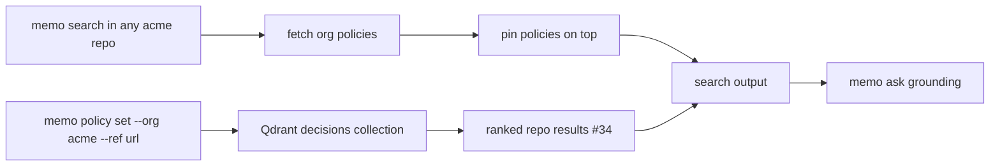

# PRD-003 — Transversal Org-Wide Architectural Policies

## Changelog

| Version | Date       | Summary                                                              | Author           |
| ------- | ---------- | -------------------------------------------------------------------- | ---------------- |
| 0.1     | 2026-04-15 | Initial draft: org-wide policy entries, surfacing, self-service help | product-engineer |

## 1. Executive Summary

PRD-003 introduces **policies**: normative, org-wide architectural standards that apply to every repository in an organization, independent of any single repo's decision history. Unlike a repo `decision` (a historical record of what was chosen), a policy is a forward-looking rule — for example, "all projects use CQRS with a 5-minute read cache across on-prem and cloud environments" — optionally carrying a reference URL to fuller documentation. Policies are captured via a dedicated `memo policy` command family, are surfaced by default in every `memo search` and `memo ask` for their org, and are pinned above ordinary results. The PRD also standardizes the CLI help system so `memo help` and per-command help are fully self-service.

## 2. Feature Overview

Memo today stores repo-scoped entries (`decision`, `integration_point`, `structure`) that are retrieved with a `repo` (optionally `related`) filter. There is no way to express a rule that transcends repositories. Teams that want a single source of truth for cross-cutting standards have to duplicate the same decision in every repo, and agents working in a given repo never see standards defined elsewhere.

PRD-003 closes that gap:

1. **Policy entries** — a new `entry_type: policy` with `applies_to: "org"` and an optional `reference_url`. High-authority (`source: manual`, `confidence: high`).
2. **`memo policy` command family** — `set`, `list`, and `delete` for authoring and auditing org policies, reusing the existing dedupe/merge and Qdrant repository layers.
3. **Default surfacing** — applicable org policies are injected into every `memo search` result set for that org and pinned above ranked results, with an opt-out flag.
4. **`memo ask` grounding** — applicable policies are always included as grounding context so advisory answers respect org policy.
5. **Self-service help** — standardized, example-rich help across all commands so `memo help` and `memo <command> --help` fully explain usage without external docs.

## 3. Goals & Objectives

1. Let an org express architectural standards once and have them apply to every repo.
2. Ensure agents see applicable policies by default, without opting in.
3. Keep policies high-authority and visually/programmatically distinct from repo decisions.
4. Preserve backward compatibility — all data-model and output changes are additive.
5. Make the CLI fully self-documenting through standardized help.

## 4. Affected Repositories

| Repository       | Role / Impact                                                                                         |
| ---------------- | ----------------------------------------------------------------------------------------------------- |
| `llipe/memo-cli` | Primary implementation: policy entry type, `memo policy` commands, search/ask surfacing, help system. |

## 5. Target Users

### Primary Users

- Tech leads and architects defining org-wide standards.
- AI coding agents that must respect org policy while working in any repo.

### Secondary Users

- Solo developers who want their standards applied consistently across their repos.
- New team members discovering the org's architectural rules via `memo search` / `memo ask`.

## 6. Dependencies

- **Hard dependency on PRD-002 issue #34 (composite ranking).** Policy pinning/boosting rides on the `source`/authority weighting introduced by composite ranking; PRD-003 implementation starts after #34 ships.
- Reuses `QdrantRepository`, `dedupe.ts`, `config.ts`, and `output.ts`.

## 7. Functional Requirements

### 7.1 Policy data model (additive)

- New `entry_type` value: `policy` (alongside `decision | integration_point | structure`).
- New optional `applies_to` field: `"repo"` (default) | `"org"`. Policies set `applies_to: "org"` and carry `org`.
- New optional `reference_url` field, validated as a URL (Zod `.url()`), optional on all entry types.
- Policies default to `source: manual`, `confidence: high`.
- All fields optional/additive; unknown-key pass-through and the schema-evolution policy are preserved. No migration tooling required (existing entries default to `applies_to: "repo"` at read time).

### 7.2 `memo policy` command family

- `memo policy set` — create/update a policy. Flags: `--org <org>` (defaults to config org), `--rationale <text>`, `--tags <list>` (2–5, kebab-case), `--ref <url>` (optional), plus `--json`, `--on-duplicate`. Reuses dedupe/merge; dedupe key incorporates `applies_to`/`policy`.
- `memo policy list` — list policies for an org. Flags: `--org <org>`, `--json`. Human output shows rationale, tags, and reference URL.
- `memo policy delete --id <id>` — remove a policy, reusing existing delete guardrails (confirmation unless `--json`/`--yes`).
- All commands honor the standard exit-code catalog and JSON output contract.

### 7.3 Default surfacing in `memo search`

- On every `memo search`, applicable org policies (`applies_to: "org" AND org = <current org>`) are retrieved and **included by default**, regardless of the `--repo`/`--scope` pre-filter.
- Policies are **pinned above** ranked repo results (or in a clearly labeled "Applicable policies" section), leveraging #34's authority weighting.
- Opt-out flag `--no-policies` (and equivalent config default) excludes policies from the result set.
- JSON output distinguishes policies from ranked results (e.g., a `policies` array separate from `results`, or a `entry_type: policy` marker with a `pinned: true` field). Exact shape decided in the spec; it MUST be backward-compatible for consumers ignoring the new key.
- Policy retrieval uses at most one additional Qdrant query per invocation.

### 7.4 `memo ask` grounding

- Applicable org policies are always included in the `memo ask` grounding context (subject to `--no-policies`), so synthesized answers respect org policy.
- Cited policies are attributed by entry ID like any other grounding entry.

### 7.5 Self-service help (cross-cutting)

- `memo help` and `memo help <command>` present a consistent, complete overview of every command, its purpose, flags, and at least one usage example.
- Every command and subcommand (including the new `memo policy *`) MUST define a clear `description` and example help text (Commander `addHelpText`), following a shared template.
- Help output is plain text and free of ANSI codes when not a TTY / when `NO_COLOR` is set.
- A documented help style/template is added to the technical guidelines so future commands stay consistent.
- Acceptance backstop: a test asserts every registered command exposes a non-empty description and example help text.

### 7.6 Governance note (v1 constraint)

- v1 has no RBAC; any repo in the shared cluster can author org policies. This inherits the documented shared-cluster access model. `memo policy list` provides visibility; human review is the control. RBAC remains deferred.

## 8. Success Metrics

| Metric                      | Target                                                                                 |
| --------------------------- | -------------------------------------------------------------------------------------- |
| Policy surfacing            | 100% of `memo search` runs in an org with policies surface them unless `--no-policies` |
| Pinning correctness         | Applicable policies always appear above ranked repo results                            |
| `memo ask` policy grounding | Policies included in grounding context on 100% of `ask` runs (unless opted out)        |
| Help completeness           | 100% of commands/subcommands expose a description and ≥ 1 example                      |
| Backward compatibility      | Existing entries and consumers unaffected; all changes additive                        |
| Performance                 | ≤ 1 extra Qdrant query per search; `memo search` stays < 2.5s                          |

## 9. Non-Goals

- No RBAC, per-user identity, or policy approval workflow.
- No enforcement/linting of code against policies — policies are advisory memory, not a compliance engine.
- No central-config-driven policy sync (may reuse `MEMO_CONFIG_URL` later; out of scope here).
- No changes to ranking math beyond consuming #34's authority weighting for pinning.

## 10. Risks & Mitigations

| Risk                                               | Mitigation                                                                |
| -------------------------------------------------- | ------------------------------------------------------------------------- |
| Policies drown out repo-specific results           | Pin in a distinct, capped section; `--no-policies` opt-out.               |
| JSON shape change breaks existing search consumers | Additive keys only; consumers ignoring new keys are unaffected; document. |
| Anyone can write org policies (no RBAC)            | `memo policy list` visibility + human review; document limitation.        |
| Extra Qdrant query adds latency                    | One query per invocation; measure against < 2.5s target.                  |

## 11. Open Questions

1. Search JSON shape: separate `policies` array vs inline `entry_type: policy` with `pinned: true`? (Spec decision.)
2. Should policies support `applies_to: "domain"` in addition to `"org"` for domain-wide (not org-wide) standards? (Deferred unless needed now.)
3. Should `--no-policies` also be settable as a config default, or flag-only?
