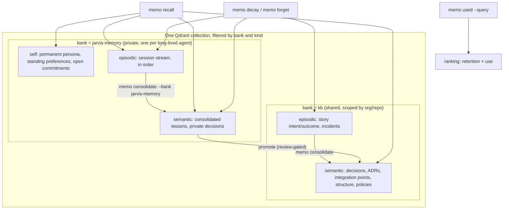
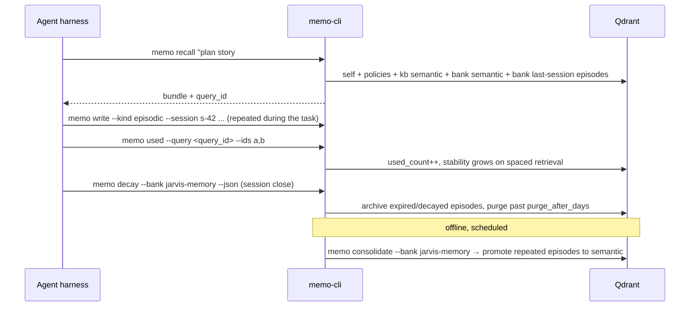
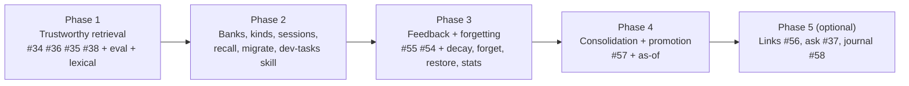

# PRD-004 — Long-Lived Agent Memory: Banks, Memory Kinds, Recall, Feedback, and Forgetting

## Changelog

| Version | Date       | Summary                                                                                                                                                                                                                                                                                                                                                                                                                                                                                                                                                                                                                                                                                                                                                                                                                                                                                                                                                                                                                                                                                                                                                                                                                                                                                                                                                                                                                                                                                                                                                                                                                                                                                                                                                                                                                                                                                                              | Author           |
| ------- | ---------- | -------------------------------------------------------------------------------------------------------------------------------------------------------------------------------------------------------------------------------------------------------------------------------------------------------------------------------------------------------------------------------------------------------------------------------------------------------------------------------------------------------------------------------------------------------------------------------------------------------------------------------------------------------------------------------------------------------------------------------------------------------------------------------------------------------------------------------------------------------------------------------------------------------------------------------------------------------------------------------------------------------------------------------------------------------------------------------------------------------------------------------------------------------------------------------------------------------------------------------------------------------------------------------------------------------------------------------------------------------------------------------------------------------------------------------------------------------------------------------------------------------------------------------------------------------------------------------------------------------------------------------------------------------------------------------------------------------------------------------------------------------------------------------------------------------------------------------------------------------------------------------------------------------------------- | ---------------- |
| 1.0     | 2026-09-19 | Initial draft. Consolidates PRD-002 ranking work and issues #53–#58 into one phased memory-model roadmap.                                                                                                                                                                                                                                                                                                                                                                                                                                                                                                                                                                                                                                                                                                                                                                                                                                                                                                                                                                                                                                                                                                                                                                                                                                                                                                                                                                                                                                                                                                                                                                                                                                                                                                                                                                                                            | product-engineer |
| 1.1     | 2026-09-19 | Review round 1: agent identity types, SELF recall section, PRD-002 folded in and superseded, purge default confirmed, issue reuse deferred to spec.                                                                                                                                                                                                                                                                                                                                                                                                                                                                                                                                                                                                                                                                                                                                                                                                                                                                                                                                                                                                                                                                                                                                                                                                                                                                                                                                                                                                                                                                                                                                                                                                                                                                                                                                                                  | product-engineer |
| 1.2     | 2026-09-19 | Review round 2: replace spaces/agent ids with memory banks keyed by a unique id; collapse purpose-typed entries into three kinds (`self`, `episodic`, `semantic`); rewrite §2.4–§2.6 as the binding memory and deletion contract; name who purges.                                                                                                                                                                                                                                                                                                                                                                                                                                                                                                                                                                                                                                                                                                                                                                                                                                                                                                                                                                                                                                                                                                                                                                                                                                                                                                                                                                                                                                                                                                                                                                                                                                                                   | product-engineer |
| 1.3     | 2026-09-19 | Spec alignment: lexical matching is a boost in the unified formula (not RRF); retention-based archive applies to `semantic` only; `stability_since` anchors the retention clock; initial stabilities 90/30/3 days; per-kind dedupe keys.                                                                                                                                                                                                                                                                                                                                                                                                                                                                                                                                                                                                                                                                                                                                                                                                                                                                                                                                                                                                                                                                                                                                                                                                                                                                                                                                                                                                                                                                                                                                                                                                                                                                             | product-engineer |
| 1.4     | 2026-09-19 | Phase 1 story generation: the staleness annotation is named `stale_by` so it never collides with the Phase 2 stored `superseded_by` payload field.                                                                                                                                                                                                                                                                                                                                                                                                                                                                                                                                                                                                                                                                                                                                                                                                                                                                                                                                                                                                                                                                                                                                                                                                                                                                                                                                                                                                                                                                                                                                                                                                                                                                                                                                                                   | product-engineer |
| 1.5     | 2026-09-19 | Story S1-01 (issue #61) delivered: relevance evaluation harness, baseline **placeholder** recorded — overall top-3 hit rate **85.71%** (concept 87.5%, identifier 87.5%, cross-repo 83.33%, recency 83.33%) over 44 fixture entries / 28 queries. This baseline is synthetically constructed (no live `QDRANT_URL`/`EMBEDDINGS_API_KEY` credentials were available in the implementation environment to run a real `--seed`/`--record` round trip) and **must be re-recorded against live Qdrant + OpenAI embeddings** before Story S1-02 relies on it as a real regression floor; see the S1-01 PR body for the full rationale.                                                                                                                                                                                                                                                                                                                                                                                                                                                                                                                                                                                                                                                                                                                                                                                                                                                                                                                                                                                                                                                                                                                                                                                                                                                                                     | developer        |
| 1.6     | 2026-09-20 | Story S1-01 real baseline recorded against live Qdrant Cloud + OpenAI embeddings, superseding the 1.5 placeholder — overall top-3 hit rate **92.9%** (concept 100%, identifier 100%, cross-repo 66.7%, recency 100%) over the same 44 fixture entries / 28 queries. `decisions` (production, 170 points) confirmed untouched with zero overlap against the 44 fixture ids; `memo_eval` holds exactly 44 points after two `--seed` runs (idempotency confirmed). Also fixes a `--seed`/`--record` execution bug: `eval:relevance`'s `node --loader ts-node/esm` invocation raised fatal spurious type diagnostics on the `openai` import unrelated to credentials; fixed via `TS_NODE_TRANSPILE_ONLY=true` scoped to that script only (`pnpm run typecheck` already covers `src/**` correctly and is unaffected).                                                                                                                                                                                                                                                                                                                                                                                                                                                                                                                                                                                                                                                                                                                                                                                                                                                                                                                                                                                                                                                                                                     | developer        |
| 1.7     | 2026-09-21 | Story S1-02 (issue #34) delivered: composite ranking (`final_score = 0.6*similarity + 0.3*recency + 0.1*source`, default weights) lands in `memo search`, superseding raw-similarity ordering. **AC21 (`user-stories-prd-004-phase-1.md:170`) does NOT currently pass and is intentionally left failing, not silently resolved:** the recorded floor `tests/fixtures/relevance/baseline.json` stays fixed at S1-01's **92.9%** identity/similarity-ordering value (per `user-stories-prd-004-phase-1.md:96`); replaying the same fixtures through the new composite ranking at the shipped default weights measures **85.7%** (concept 100%→75.0%, identifier 100%→87.5%, cross-repo 66.7%→83.3%, recency 100%→100%), which is below that floor. `tests/relevance/replay.test.ts` asserts `>= baseline` unweakened and is expected to fail until this is resolved. The drop is consistent with the refinement's already-documented R1 risk (recency weighting can bury a genuinely correct older decision), not an implementation defect. Per the plan's Execution Notes, default-weight tuning is reserved for task 8.0's exit gate, not an earlier story — this is routed to `product-engineer` as an open decision, not fixed here by retuning weights or moving the floor.                                                                                                                                                                                                                                                                                                                                                                                                                                                                                                                                                                                                                                       | developer        |
| 1.8     | 2026-09-21 | Story S1-02 AC21 resolved by explicit user decision to apply the task 8.0 tuning-sweep methodology to this story rather than leave it deferred. A one-factor sweep over `recency_half_life_days` (weights held at their spec values, 0.6/0.3/0.1 — D1-D9 untouched) against the recorded `candidates.json` found a wide, robust plateau: every half-life from ~260 to 700+ days measured **96.4%** overall (concept 100%, identifier 100%, cross-repo 83.3%, recency 100%), well clear of the 92.9% S1-01 floor. `recency_half_life_days`'s default is now **365** (`src/lib/ranking.ts`, `src/types/config.ts`), chosen as the simplest, most legible value inside that plateau. Re-recorded against live Qdrant Cloud (`MEMO_COLLECTION=memo_eval`) for the real, legitimate new floor: `tests/fixtures/relevance/baseline.json`/`candidates.json` now hold the 96.4% composite-ranking result, and `tests/relevance/replay.test.ts` passes unweakened. Sweep grid (11 combinations tried) and the live re-recording are documented in full in PR #67.                                                                                                                                                                                                                                                                                                                                                                                                                                                                                                                                                                                                                                                                                                                                                                                                                                                             | developer        |
| 1.9     | 2026-09-21 | Story S1-06 (issue #62) delivered: lexical identifier matching (`src/lib/lexical.ts`), additive over the unioned candidate set per Decision A4. Verified live against Qdrant 1.18.2 that a `text` index on the array field `files_modified` tokenizes each element independently, so both `rationale` and `files_modified` are indexed (no rationale-only fallback needed). `ensureIndexes()` verified live against the pre-existing `decisions` collection (171 points, created before #62): created exactly the 2 missing indexes, backfilled onto all 171/98 existing points, points_count unchanged, and a second run created nothing (idempotent). `pnpm run eval:relevance` run live against `memo_eval` with lexical on and off produced **identical** overall (**96.4%**) and per-category numbers (concept 100%, identifier 100%, cross-repo 83.3%, recency 100%) — this fixture set's dense embeddings already rank every `identifier`-category query's expected entry in the top 3 without lexical help, so lexical matching neither regresses (AC10 satisfied: `96.4% >= 96.4%` baseline) nor measurably lifts this particular small (44-entry) fixture set's headline number. A manual live comparison (`--lexical on` vs `off` against a real multi-candidate identifier query) confirmed the mechanism is functioning end-to-end: with lexical on, a second same-file candidate stays in the top 3 with `confidence_tier: high` (final_score 0.761); with lexical off it drops out of the top 3 and the top result's tier falls to `medium` (final_score 0.611) — see PR body for the full transcript. `tests/relevance/replay.test.ts` (the automated regression gate) is unaffected by this story: it replays `candidates.json`, which `--record` always captures dense-only by design, so the S1-02 96.4% floor this file protects never shifts based on this story's optional retrieval widening. | developer        |

## 1. Executive Summary

memo-cli today is a single shared knowledge base of repo-scoped decisions with cosine-similarity search. dev-tasks agents write intent, outcome, and ADR entries into it, but retrieval is noisy, nothing is ever forgotten, and no signal flows back about whether a retrieved entry was useful. PRD-004 turns memo-cli into a long-lived memory layer for autonomous agents: **memory banks** keyed by a unique id (the shared knowledge base is one bank; each long-lived agent owns another), three **memory kinds** with explicit lifecycles (`self` is permanent, `episodic` is short-term and sequential, `semantic` is long-term), a one-call **`memo recall`** bundle, a **feedback loop** (`memo used`) that drives ranking and forgetting, and a **deletion contract** that states for every kind what removes it, who runs that removal, and when. Delivery is phased so retrieval quality is measured first. PRD-002 is folded into this PRD and superseded by it.

## 2. Feature Overview

### 2.1 Where we are

| Area          | Shipped (v1.1.4)                                                                | Refined, not built                                     | Proposed in issues, not refined                                                     |
| ------------- | ------------------------------------------------------------------------------- | ------------------------------------------------------ | ----------------------------------------------------------------------------------- |
| Store         | One Qdrant collection `decisions`, isolation by `repo`/`org` payload            | —                                                      | `kind: episodic \| semantic` (#53), event journal (#58)                             |
| Write         | `memo write` with `rationale`, 2–5 tags, `entry_type`, dedupe by story/commit   | —                                                      | `memo add --kind/--context/--session` (#53), links (#56)                            |
| Retrieval     | `memo search` = cosine similarity + exact pre-filters; `memo list`; `memo read` | composite score, tag boost, tiers, staleness (#34–#38) | retention factor (#54), use ratio (#55), link-aware ranking and `--expand` (#56)    |
| Feedback      | none                                                                            | —                                                      | `memo used --query <id>` (#55)                                                      |
| Forgetting    | `memo delete` (hard delete, bulk blocked in `--json`)                           | —                                                      | `memo decay` → archive (#54), reconsolidation with `valid_to`/`superseded_by` (#57) |
| Consolidation | none                                                                            | —                                                      | `memo consolidate` offline LLM job (#57)                                            |
| Ownership     | none (`source: agent` only)                                                     | —                                                      | `source_agent`, `contexts` (#53)                                                    |

Three gaps block the vision and are not covered by any existing artifact:

1. **No notion of whose memory it is.** A long-lived agent (a defined loop, tool set, prompt, and data) has nowhere to keep its permanent self-description, its short-term session stream, and its long-term lessons apart from the team's decision record, so it cannot resume months later as the same persona. Today its per-story intent/outcome entries land in the shared KB and crowd out durable decisions.
2. **No single recall primitive.** dev-tasks agents run four commands at session start and synthesize by hand. There is no ranked, deduplicated, token-budgeted bundle.
3. **No governed forgetting.** The only removal path is hard delete. There is no retention policy, no soft archive, and no statement of what gets removed, by whom, and when.

Issues #53–#58 were written against a CLI vocabulary that does not exist (`memo add`, `memo get`, `content`, `source_agent`, `tier`), and #56 declares that it "replaces" the ranking formula #34 was refined against. This PRD reconciles both into the shipped vocabulary and a single ranking function.

### 2.2 Target model



### 2.3 Lifecycle of one session



### 2.4 Memory banks

A **memory bank** is a store identified by one unique key, `bank` (kebab-case string or UUID, for example `kb`, `jarvis-memory`, `planner-memory`). memo-cli does not model agents, roles, or personas. It models banks. What owns a bank is the caller's concern.

| Rule | Statement                                                                                                                                                                                           |
| ---- | --------------------------------------------------------------------------------------------------------------------------------------------------------------------------------------------------- |
| B1   | The shared knowledge base is the bank `kb`. It keeps today's `org`/`repo` scoping and is the default bank for every command, so existing callers see no change.                                     |
| B2   | Any other bank id is a **private bank**. Private banks are not scoped by repo by default (their owner works across repos); entries may still carry `repo`/`org` for filtering.                      |
| B3   | Bank resolution order: `--bank <id>`, then `MEMO_BANK`, then `config.bank.default`, then `kb`.                                                                                                      |
| B4   | There is no cross-bank search. Knowledge crosses from a private bank into `kb` only through promotion (§7.4), which is review-gated by default.                                                     |
| B5   | `memo bank init --id <id>` creates a bank by writing its first `self` entry. `memo bank list` shows bank ids with counts per kind. `memo bank show --id <id>` prints the `self` entries and counts. |
| B6   | Deleting a bank is `memo forget --bank <id> --purge`, human-confirmed or `--yes`, never in `--json` mode. It writes one tombstone per entry.                                                        |

### 2.5 Memory kinds (binding contract)

Every entry has exactly one `kind`. `kind` is orthogonal to `entry_type` (`decision`, `integration_point`, `structure`, `policy`, `observation`), which remains the content category; `observation` is the default `entry_type` for episodic entries.

| Kind       | What it is                                                                                                                                 | Allowed in         | How it is written                                                                                                                                        | How it is retrieved                                                                                                                       | How it leaves the store (exhaustive)                                                                                                                                                                                                                                                                            |
| ---------- | ------------------------------------------------------------------------------------------------------------------------------------------ | ------------------ | -------------------------------------------------------------------------------------------------------------------------------------------------------- | ----------------------------------------------------------------------------------------------------------------------------------------- | --------------------------------------------------------------------------------------------------------------------------------------------------------------------------------------------------------------------------------------------------------------------------------------------------------------- |
| `self`     | Permanent memory of the bank owner: persona, tone, standing instructions, settled preferences, open commitments, who it works with. Small. | private banks only | `memo write --kind self`, explicit. `memo bank init` seeds one. Replace with `memo write --kind self --supersedes <id>`. Soft cap 50 per bank (warning). | Whole, unranked, newest first, as the first section of `memo recall`; `memo bank show`. Excluded from `memo search` unless `--kind self`. | Only two ways: (1) superseded via `--supersedes`, which sets `valid_to` and `superseded_by` and hides it from `recall`; (2) `memo forget --id` or `--bank … --purge`. Never by `memo decay`, expiry, or consolidation.                                                                                          |
| `episodic` | Short-term, sequential: what happened, in session order. High volume, low individual value.                                                | all banks          | `memo write --kind episodic --session <id> [--seq <n>]`. Default kind in private banks. `expires_at` set from bank policy unless `--expires-in`.         | `memo timeline` (sequence order, never ranked); `recall` LAST SESSION section; `memo search --kind episodic \| all`.                      | Exactly two exits: (a) **promoted**: `memo consolidate` folds it into a `semantic` entry, marks it `consolidated`, and it is then removed by policy after a grace period; (b) **not promoted**: it expires or decays, is archived, and is purged by policy. Either way it ends deleted.                         |
| `semantic` | Long-term: decontextualized facts, decisions, lessons, contracts. Low volume, durable.                                                     | all banks          | `memo write --kind semantic` with `--provenance <ids>` (agent) or `--manual` (human). Default kind in `kb`. Also produced by `memo consolidate`.         | `memo search` (ranked, §8.2), `recall` SHARED and MINE sections, `memo search --as-of <date>` for history.                                | Three ways: (a) **superseded** by a newer fact (reconsolidation or `--supersedes`), then archived after grace; (b) **irrelevant or unused**: retention below threshold, or noisy (retrieved often, rarely used), archived by `memo decay`, then purged by policy; (c) `memo forget`. `pinned` entries skip (b). |

Application rules:

- K1 `kind` is required on every v2 write. Missing `kind` resolves by bank: `semantic` in `kb`, `episodic` in private banks. `--kind self` in `kb` fails with `VALIDATION_FAILED`.
- K2 `episodic` entries in a private bank need no `repo`; in `kb` they need `repo` like every other entry today.
- K3 A `semantic` entry written with `source: agent` must carry at least one `provenance` id unless `--manual` is passed. Provenance ids are an audit trail; the semantic entry must stand on its own text, because its episodes will be deleted.
- K4 `self` entries are never ranked, never decay, never consolidate, and never count toward retrieval statistics.
- K5 An entry never changes kind in place. Promotion creates a new `semantic` entry; the episode keeps its kind and is later deleted.

### 2.6 Deletion contract (who removes what, when)

Every removal passes through one state machine. Automated jobs only ever move entries along the arrows labeled `memo decay`; humans and owners use `memo forget`.

```mermaid
stateDiagram-v2
  [*] --> active
  active --> consolidated: memo consolidate (episodic only)
  active --> superseded: --supersedes or reconsolidation (self, semantic)
  active --> archived: memo decay (expired, retention < threshold, noisy) or memo forget (default)
  consolidated --> archived: memo decay after promoted_grace_days
  superseded --> archived: memo decay after superseded_grace_days (semantic only; self stays superseded)
  archived --> active: memo restore --id
  archived --> [*]: memo decay --purge-expired after purge_after_days, or memo forget --purge
  active --> [*]: memo forget --purge or memo delete (explicit, tombstoned)
```



| Kind / bank type     | Archived when                                                                                                          | Archived by        | Purged when                             | Purged by                              | Defaults                                      |
| -------------------- | ---------------------------------------------------------------------------------------------------------------------- | ------------------ | --------------------------------------- | -------------------------------------- | --------------------------------------------- |
| `self` / private     | never automatically                                                                                                    | `memo forget` only | never automatically                     | `memo forget --purge` (owner or human) | no policy keys                                |
| `episodic` / private | `expires_at` passed (30 d after write), or `consolidated` and `promoted_grace_days` (7 d) passed                       | `memo decay`       | `purge_after_days` (30 d) after archive | `memo decay --purge-expired`           | archive on, **purge on**                      |
| `episodic` / `kb`    | `expires_at` passed (90 d), or `consolidated` + grace                                                                  | `memo decay`       | never automatically                     | `memo forget --purge`                  | archive on, purge off                         |
| `semantic` / private | superseded + `superseded_grace_days` (30 d), or retention < 0.05, or noisy (`retrieval_count ≥ 10`, `use_ratio < 0.1`) | `memo decay`       | `purge_after_days` (90 d) after archive | `memo decay --purge-expired`           | archive on, purge on                          |
| `semantic` / `kb`    | superseded + grace (30 d), or retention < 0.05, or noisy; `pinned` exempt                                              | `memo decay`       | never automatically                     | `memo forget --purge`, `memo delete`   | archive on, purge off, `archive_noisy: false` |

Who runs `memo decay`:

- **The bank owner's harness, at session close.** dev-tasks agent prompts end a session with `memo decay --bank <id> --json`. The command is idempotent, needs one scroll and one batched payload update, and exits 0 on no-op.
- **A scheduler for `kb`.** A weekly cron or CI job runs `memo decay --bank kb --json`. It archives; it never purges in `kb`.
- **A human**, via `memo forget`, for anything the policy does not cover.

Guarantees:

- D1 `memo decay` never touches `self`, never purges in `kb`, never deletes anything that is not already archived past `purge_after_days`, and never runs an LLM.
- D2 Every purge, by any command, appends a tombstone (`id`, `bank`, `kind`, selector, actor, timestamp) to `~/.memo/forget.jsonl`.
- D3 `memo restore --id` un-archives an entry as long as it has not been purged.
- D4 `--dry-run` on `memo decay` and `memo forget` prints the exact selector and the per-bank, per-kind counts and writes nothing.
- D5 `memo forget --purge` in `--json` mode accepts only `--id` and `--session` selectors. Bank-wide purge requires a TTY or `--yes` outside `--json`.
- D6 A semantic entry's `provenance` may point at deleted episodes. `memo read` shows them as `(deleted)`. No provenance-protection rule exists; long-term entries must be self-contained (K3).

## 3. Goals & Objectives

1. **Measured retrieval quality.** Top-3 relevance on a versioned evaluation set rises from the measured baseline to ≥ 80%, and every ranking change is gated on that set.
2. **Private memory banks.** A long-lived agent can persist its permanent self, its session stream, and its lessons in its own bank, then recall, consolidate, and forget them without polluting or being polluted by `kb`, and resume as the same persona after months.
3. **One call to restore context.** `memo recall` replaces the four-command session start with a ranked, deduplicated, token-budgeted bundle that carries a `query_id`.
4. **Close the feedback loop.** Agents report which recalled memories they used; that signal changes ranking, retention, and consolidation.
5. **Forget on purpose, never by accident.** The deletion contract in §2.6 is exhaustive, every removal is attributable, automated jobs never hard-delete outside declared policy, and short-term memory always ends either promoted or deleted.
6. **Backward compatibility.** Every payload and config change is additive; existing flags and JSON envelopes keep working. Existing entries remain in default search results after migration.
7. **Cost discipline.** No new paid infrastructure. LLM calls only in `memo consolidate`, always with `--dry-run` available and cost reported.

## 4. Affected Repositories

| Repository        | Role / Impact                                                                                                                                                                                                                                                                                                                                                    |
| ----------------- | ---------------------------------------------------------------------------------------------------------------------------------------------------------------------------------------------------------------------------------------------------------------------------------------------------------------------------------------------------------------- |
| `llipe/memo-cli`  | Primary implementation: payload schema v2 (`bank`, `kind`, session, provenance, validity, stability, archive fields), ranking library, new commands (`recall`, `timeline`, `used`, `decay`, `forget`, `restore`, `stats`, `consolidate`, `migrate`, `bank`), config v2, eval harness, docs.                                                                      |
| `llipe/dev-tasks` | Consumer changes: `memo-cli-usage` skill and the `developer`, `product-engineer`, `technical-writer`, `planner` prompts. Each long-lived agent definition declares a bank id; session start becomes `memo recall`; intent/outcome entries go to the agent's bank as episodic; ADRs and decisions stay in `kb`; session close calls `memo used` and `memo decay`. |

## 5. Target Users

### Primary Users

- **Long-lived agents** (a defined loop, tools, prompt, and data) that run many sessions over months and need a private bank with permanent self, short-term stream, and long-term lessons.
- **Worker agents** (developer, technical-writer) that need a fast, relevant context bundle at session start and a cheap way to report what helped.
- **dev-tasks maintainers** who own the prompts and skill that call memo-cli.

### Secondary Users

- **Tech leads** auditing what the team and its agents believe, what is stale, and what was forgotten and why.
- **Solo developers** running one agent across repos who want it to stop repeating mistakes.

## 6. User Stories

1. As a long-lived agent, I want a private bank keyed by my own id so that my memories never mix with the team's decision record.
2. As a long-lived agent, I want permanent `self` entries that no job can remove so that a session started months later begins with the same persona and open commitments.
3. As a long-lived agent, I want episodic entries tagged with a session id so that I can replay what I did, in order, in a later session.
4. As any agent, I want one `memo recall "<task>"` call that returns my self entries, applicable policies, relevant shared decisions, my own lessons, and my last session, within a token budget, so that I restore context without hand-synthesizing four outputs.
5. As any agent, I want to report which recalled entries I used so that future recall ranks them higher and unused noise ranks lower.
6. As a developer agent, I want search to match exact identifiers (file names, issue numbers, flag names) as well as meaning.
7. As a tech lead, I want results ordered by trust and actionability with a confidence tier and a stale flag so that agents can decide act/verify/discard programmatically.
8. As a tech lead, I want superseded decisions to keep their history (`valid_to`, `superseded_by`) and be queryable as of a date so that nothing is overwritten in place.
9. As an agent harness, I want `memo decay --bank <id>` at session close to archive and purge my short-term memory per policy so that my bank never grows without bound.
10. As an operator, I want `memo forget` to remove a session, a bank, or entries matching a filter, with dry-run and tombstones, so that forgetting is explicit and reviewable.
11. As an operator, I want per-bank, per-kind retention policy in config so that "what to forget" is policy, not a runtime judgment.
12. As a long-lived agent, I want an offline `memo consolidate --bank <id>` job that turns repeated episodes into durable lessons with provenance so that my long-term memory grows from experience and my short-term memory can be deleted.
13. As a tech lead, I want promotion of a private bank's lessons into `kb` to require review so that LLM-generated generalizations do not silently become team truth.
14. As an operator, I want `memo migrate --to-v2 --dry-run` to show how every existing entry will be classified before anything changes.
15. As an operator, I want `memo stats` to show noisy memories, stability distribution, and archive and purge counts per bank so that I can tune retention.
16. As any agent, I want `memo search --explain` to print every ranking factor.
17. As a human at the terminal, I want `memo ask "<question>"` to synthesize a cited answer from the same bundle `recall` builds (optional, Phase 5).

## 7. Functional Requirements

### 7.1 Phase 1 — Trustworthy retrieval (formerly PRD-002 Phases A and B, plus measurement)

- FR-1.1 Ship a versioned relevance evaluation set under `tests/fixtures/relevance/` (20–30 query/expected-id pairs seeded from real dev-tasks queries: story planning, file-name lookups, cross-repo contracts) and a script that reports top-3 hit rate. The baseline **MUST** be recorded in this changelog before any ranking change merges.
- FR-1.2 Composite ranking (#34), tag overlap boosting (#36), dynamic confidence tiers (#35), and staleness detection (#38) **MUST** be implemented as refined in `workstream/issue-34-composite-ranking-score-refinement.md` and the corresponding issues, with the single change that `final_score` is produced by the unified formula in §8.2.
- FR-1.3 `memo search` **MUST** add lexical matching: a Qdrant full-text payload index on `rationale` and `files_modified`, queried alongside the dense vector; lexical candidates join the candidate set and receive a `lexical_boost` in the unified formula (§8.2). `--lexical off` disables it.
- FR-1.4 Every `memo search` response **MUST** include a `query_id` (UUID). Phase 1 stores nothing for it; Phase 3 makes it actionable.
- FR-1.5 `memo search --explain` **MUST** print each ranking factor and the final score per result.

### 7.2 Phase 2 — Banks, kinds, sessions, recall

- FR-2.1 The payload **MUST** gain `bank`, `kind`, `session_id`, `seq`, `contexts`, `provenance`, `valid_from`, `valid_to`, `superseded_by`, `consolidated`, `pinned`, `expires_at`, and `schema_version: "2"`. All additive; indexed where filtered (§9).
- FR-2.2 `memo write` **MUST** accept `--bank`, `--kind`, `--session`, `--seq`, `--context` (repeatable), `--provenance`, `--manual`, `--supersedes <id>`, `--pin`, `--expires-in <duration>`. Defaults per §2.4 B3 and §2.5 K1. `--supersedes` **MUST** set `valid_to = now` and `superseded_by = <new id>` on the target in the same bank and fail if the target is a different kind.
- FR-2.3 The dedupe key **MUST** become kind-aware: semantic `v2|<bank>|<repo_or_na>|<commit_or_na>|<story_or_na>|na|semantic|<entry_type>|<source>`; episodic adds `<session>|<seq>` so consecutive episodes never collide; `self` entries bypass dedupe. v1 keys remain readable.
- FR-2.4 `memo search`, `memo list`, `memo tags list` **MUST** accept `--bank`, `--kind self|episodic|semantic|all`, `--session`, `--include-archived`, `--include-superseded`, `--as-of <date>`. Defaults: `bank = kb`, `kind = all` minus `self`, archived and superseded excluded.
- FR-2.5 `memo timeline --bank <id> [--session <id>] [--last <n>] [--since <date>]` **MUST** return episodic entries in `seq` then `timestamp_utc` order, never re-ranked.
- FR-2.6 `memo recall "<task>" [--bank <id>] [--scope repo|related] [--max-tokens <n>] [--json]` **MUST** return one bundle with sections in this order: `SELF` (all valid `self` entries of the bank, never trimmed), `POLICIES` (when PRD-003 is present), `SHARED` (`kb` semantic for the task), `MINE` (bank semantic for the task), `LAST SESSION` (bank episodic, most recent session, chronological), `CONFLICTS` (`pending_contradiction` entries). Lower sections are trimmed first to honor `--max-tokens` (characters ÷ 4). One `query_id` covers every entry; ids are deduplicated across sections. With `bank = kb`, `SELF`, `MINE`, and `LAST SESSION` are omitted.
- FR-2.7 `memo bank init|list|show` per §2.4 B5. `memo restore --id` per §2.6 D3.
- FR-2.8 `memo migrate --to-v2 [--dry-run] [--rules <file>]` **MUST** apply the ordered rules below to every point lacking `schema_version = "2"`, print counts per rule, be idempotent, and write nothing under `--dry-run`.

  | Order | Condition on the existing entry       | Result                                                                                               |
  | ----- | ------------------------------------- | ---------------------------------------------------------------------------------------------------- |
  | 1     | `tags` contains `intent` or `outcome` | `kind = episodic`, `session_id = story` (or `legacy` if absent), `expires_at = timestamp_utc + 90 d` |
  | 2     | any other entry                       | `kind = semantic`, `valid_from = timestamp_utc`                                                      |
  | all   | every migrated entry                  | `bank = kb`, `schema_version = "2"`, `consolidated = false`, counters `0`, `stability` per §8.4      |

  Rule 2 defaults to `semantic` because a decision misclassified as episodic would expire and vanish, while an episode misclassified as semantic is only today's noise and can be re-tagged. Nothing is archived or deleted by migration.

- FR-2.9 `memo read --id` **MUST** print the full v2 payload, provenance ids with `(deleted)` markers, and validity fields.
- FR-2.10 `dev-tasks`: the `memo-cli-usage` skill and prompts **MUST** be updated so that each long-lived agent definition declares its bank id (exported as `MEMO_BANK`), session start is `memo recall`, intent/outcome entries are episodic in the agent's bank with `--session ISSUE-<n>`, ADR and decision entries stay in `kb` as semantic, and session close runs `memo used` then `memo decay --bank <id> --json`.

### 7.3 Phase 3 — Feedback and forgetting

- FR-3.1 `memo used --query <query_id> --ids <csv> [--wrong <csv>]` **MUST** validate that every id belongs to that query's result set (exit 1 otherwise), increment `used_count`, apply the used bonus to stability, and append a `usage_event` to `~/.memo/usage.jsonl`. `--wrong` ids are flagged `pending_contradiction = true` and receive no bonus. Result sets are persisted at `~/.memo/queries/<query_id>.json` with a 7-day TTL.
- FR-3.2 `memo search` and `memo recall` **MUST** increment `retrieval_count` and, when spaced (outside `min_spacing_hours`, default 12), update `stability` and `last_retrieved_at` per #54, in one batched payload update per invocation, adding ≤ 300 ms. `self` entries are excluded (K4).
- FR-3.3 `retention = exp(-t / stability)` is computed at ranking time, never stored, and applied per §8.2; `t` counts from `last_retrieved_at`, else from `stability_since` (set at write or migration). Initial stability per §8.4, cap `max_stability_days` 365. Retention drives archiving for `semantic` only; `episodic` entries archive on expiry or promotion.
- FR-3.4 `memo decay [--bank <id>] [--dry-run] [--purge-expired] [--verbose] [--json]` **MUST** implement §2.6 exactly: archive per the table, purge only entries archived longer than `purge_after_days` and only where policy sets it, skip `self` and `pinned`, never call an LLM, be idempotent, and print counts per bank and kind.
- FR-3.5 `memo forget` **MUST** support selectors `--id`, `--session`, `--bank`, `--kind`, `--older-than <duration>`, `--tags`, combinable with AND semantics, plus `--dry-run`, `--yes`, `--purge`, `--json`, with the guards in §2.6 D2, D4, D5. Default action is archive with `archived_reason = forget`.
- FR-3.6 Retention policy keys per bank type and kind (§8.4) **MUST** drive `expires_at` at write time and `memo decay` behavior.
- FR-3.7 `memo stats [--bank <id>] [--json]` **MUST** show per kind: active, archived, superseded, consolidated, pinned counts; stability distribution; top entries by `use_ratio`; the noisy list; and purge counts from tombstones.
- FR-3.8 `memo decay` and `memo consolidate` **MUST** be safe from a scheduler: `--json`, exit 0 on no-op.

### 7.4 Phase 4 — Consolidation and promotion

- FR-4.1 `memo consolidate --bank <id> [--dry-run] [--limit] [--since] [--report json|text]` **MUST** implement the #57 pipeline within one bank: select `episodic` where `consolidated = false` and not archived → cluster by embedding and tags → LLM proposes candidate facts as strict JSON citing episode ids → gate on `min_episodes` 3, `min_contexts` 2, `min_span_days` 7, and consistency with existing semantic facts → write promoted facts as `semantic` with `provenance`, `valid_from`, self-contained text → mark episodes `consolidated = true` → report. Candidates citing ids outside their cluster are rejected. Running twice on unchanged data produces no duplicates.
- FR-4.2 Reconsolidation never overwrites: the old fact gets `valid_to` and `superseded_by`; the new fact gets `valid_from` and provenance including the contradicting episodes. A contradiction from one episode in one context does not supersede; it writes the candidate at the lowest tier with `pending_contradiction = true`.
- FR-4.3 Promotion into `kb` is a separate step, `memo consolidate --bank <id> --promote-to kb`, governed by `consolidation.promote_to_kb` (`review` default | `auto` | `off`). `review` writes candidates to `workstream/memo-promotions-<date>.md`; `auto` or `--yes` writes them as `source: agent`, `confidence: medium`, tagged `promoted-from:<bank>`.
- FR-4.4 `memo search --as-of <date>` returns the semantic facts valid at that date.
- FR-4.5 The consolidation report includes token usage and estimated cost.

### 7.5 Phase 5 — Associative memory, advisory answer, event journal (optional)

- FR-5.1 Links (#56): `links_out`, `links_in_count`, `links_in_contexts`; `memo link`, `memo unlink`, `memo write --link`, `memo reindex-links`; link factor in §8.2; `memo search --expand` with `N = clamp(round(6 / sqrt(|links_out|)), 1, 5)`.
- FR-5.2 `memo ask "<question>" [--bank] [--scope] [--json]` (formerly #37): builds the `recall` bundle, drops `confidence_tier: low`, sends it to the `LLMAdapter` from Phase 4 with the #37 grounding prompt, returns `answer`, `sources`, `grounded`. Human-facing; agents use `recall` directly.
- FR-5.3 Event journal (#58): append-only `~/.memo/episodes.jsonl`, `memo verify`, `memo rebuild-semantic [--dry-run]`. Ships only if Phase 4 shows consolidation parameters change often enough to need replay.

## 8. Business Rules

### 8.1 Banks and kinds

Rules B1–B6 (§2.4), K1–K5 (§2.5), and D1–D6 (§2.6) are normative and take precedence over any other section.

### 8.2 Unified ranking formula

One function, `rankResults`, in `src/lib/ranking.ts`. Factors not yet implemented, or missing on a payload, evaluate to their neutral value so every phase ships independently. `self` entries are never ranked.

```
base        = w_similarity * sim + w_recency * recency + w_source * source      # #34, weights sum to 1.0
boosted     = min(1, base + tag_boost + lexical_boost)                            # #36, FR-1.3
final_score = min(1,
              boosted
              * (0.5 + 0.5 * retention)          # #54, neutral 1 when stability absent
              * (1 + BETA * use_ratio)           # #55, neutral 1 when counters absent; BETA 0.3
              * (1 + ALPHA * log(1 + links_in_count) * diversity)   # #56, neutral 1; ALPHA 0.15
            )
confidence_tier = tier(final_score)                                               # #35
stale           = staleness(entry, same-scope newer entries)                       # #38, annotation only (stale_by names the superseder)
```

- R1 `similarity` clamped to `[0, 1]`; `final_score` always in `[0, 1]`.
- R2 Tie-break: `final_score` desc, `timestamp_utc` desc, `id` asc.
- R3 Archived and superseded entries are excluded before ranking unless explicitly included; `pinned` gets no bonus.
- R4 Weights and factors live in `memo.config.json` under `ranking`; invalid values fail `memo setup validate` and `loadConfig`.
- R5 Issue #56's "replaces the composite formula" statement is superseded; #56 contributes the link factor only.
- R6 Default weights are re-validated against the evaluation set at the end of every phase; a phase that lowers top-3 hit rate does not close.

### 8.3 Feedback

- FB1 `memo used` is the only positive signal; absence of a report is not a negative signal.
- FB2 `--wrong` is the only negative signal; it flags, it never archives or supersedes on its own.
- FB3 `memo search --auto-used` (top-1 counts as used) is off by default and marked weak in the usage log.
- FB4 dev-tasks agents call `memo used` at story completion with the ids they cited or acted on.

### 8.4 Retention policy defaults (config keys under `banks.<kb|private>.<kind>`)

| Bank type / kind     | Initial stability | `expires_in_days` | `archive_threshold` | `archive_noisy` | `promoted_grace_days` | `superseded_grace_days` | `purge_after_days` |
| -------------------- | ----------------- | ----------------- | ------------------- | --------------- | --------------------- | ----------------------- | ------------------ |
| private / `self`     | n/a               | none              | n/a                 | n/a             | n/a                   | n/a (stays superseded)  | never              |
| private / `episodic` | 3 days            | 30                | n/a (ranking only)  | n/a             | 7                     | n/a                     | 30                 |
| private / `semantic` | 30 days           | none              | 0.05                | true            | n/a                   | 30                      | 90                 |
| `kb` / `episodic`    | 3 days            | 90                | n/a (ranking only)  | n/a             | 7                     | n/a                     | never              |
| `kb` / `semantic`    | 90 days           | none              | 0.05                | false           | n/a                   | 30                      | never              |

`never` means the key is absent and `memo decay --purge-expired` skips that class. Setting `purge_after_days` on `kb` is allowed but requires an explicit value; there is no default.

## 9. Data Requirements

Single collection `decisions`, cosine, 1536 dims (unchanged). All new fields are optional at read time; v1 points remain readable.

```mermaid
erDiagram
    MEMORY {
        uuid id PK
        string schema_version "absent = v1, \"2\" = v2"
        string bank "unique bank key, indexed (new); absent = kb"
        enum kind "self | episodic | semantic, indexed (new)"
        string repo "indexed; optional in private banks"
        string org "indexed"
        string domain
        string rationale "1-5000 chars, full-text indexed (new index)"
        string[] tags "2-5 kebab, indexed"
        enum entry_type "decision | integration_point | structure | policy | observation"
        enum source "agent | manual | scan"
        enum confidence "payload only; output uses confidence_tier"
        datetime timestamp_utc "indexed"
        string session_id "episodic, indexed (new)"
        int seq "episodic, optional (new)"
        string[] contexts "kebab (new)"
        uuid[] provenance "semantic; audit only, may dangle (new)"
        datetime valid_from "self, semantic (new)"
        datetime valid_to "null = valid, indexed (new)"
        uuid superseded_by "(new)"
        bool consolidated "episodic, indexed (new)"
        bool pinned "(new)"
        bool archived "indexed (new)"
        enum archived_reason "expired | decayed | noisy | promoted | superseded | forget (new)"
        datetime archived_at "(new)"
        datetime expires_at "episodic (new)"
        float stability "days (new)"
        datetime last_retrieved_at "(new)"
        int retrieval_count "(new)"
        int used_count "(new)"
        bool pending_contradiction "(new)"
        uuid[] links_out "Phase 5"
        int links_in_count "Phase 5"
        string[] links_in_contexts "Phase 5"
        string commit "indexed"
        string story
        string[] files_modified "full-text indexed (new index)"
        string[] relates_to
        string dedupe_key_sha256 "indexed"
        enum dedupe_key_version "v1 | v2"
    }
    MEMORY ||--o{ MEMORY : "provenance / superseded_by / links_out"
```

Local files (mode `0600`, never credentials):

| Path                              | Purpose                                                   | Format     |
| --------------------------------- | --------------------------------------------------------- | ---------- |
| `~/.memo/queries/<query_id>.json` | Result-set snapshot for `memo used` validation, 7-day TTL | JSON       |
| `~/.memo/usage.jsonl`             | Append-only usage events                                  | JSON lines |
| `~/.memo/forget.jsonl`            | Tombstones for every purge                                | JSON lines |
| `~/.memo/episodes.jsonl`          | Phase 5 optional episodic journal                         | JSON lines |
| `tests/fixtures/relevance/`       | Evaluation set and seed entries                           | JSON       |

Config v2 (`memo.config.json`, additive; v1 files stay valid):

```json
{
  "schema_version": "2",
  "repo": "memo-cli",
  "org": "llipe",
  "domain": "ai",
  "bank": { "default": "kb" },
  "banks": {
    "kb": {
      "episodic": { "expires_in_days": 90, "promoted_grace_days": 7 },
      "semantic": { "superseded_grace_days": 30, "archive_noisy": false }
    },
    "private": {
      "episodic": { "expires_in_days": 30, "promoted_grace_days": 7, "purge_after_days": 30 },
      "semantic": { "superseded_grace_days": 30, "archive_noisy": true, "purge_after_days": 90 }
    }
  },
  "ranking": {
    "w_similarity": 0.6,
    "w_recency": 0.3,
    "w_source": 0.1,
    "recency_half_life_days": 365,
    "tag_boost_factor": 0.05,
    "confidence_thresholds": { "exact": 0.88, "high": 0.75, "medium": 0.6 },
    "staleness_threshold_days": 120,
    "staleness_tag_overlap_threshold": 0.5,
    "use_beta": 0.3,
    "link_alpha": 0.15,
    "lexical": true
  },
  "retention": {
    "min_spacing_hours": 12,
    "base_gain": 1.6,
    "used_bonus": 0.5,
    "max_stability_days": 365,
    "archive_threshold": 0.05,
    "noisy_min_retrievals": 10,
    "noisy_max_use_ratio": 0.1
  },
  "consolidation": {
    "min_episodes": 3,
    "min_contexts": 2,
    "min_span_days": 7,
    "model": "gpt-4.1-nano",
    "promote_to_kb": "review"
  }
}
```

Sensitivity: private banks may contain task narratives and file paths; the "no secrets" rule applies. Bank ids are labels, not identities.

## 10. Non-Goals (Out of Scope)

- RBAC, per-user identity, or access control between banks beyond the `bank` filter (the shared-cluster policy of v1 stands).
- A standalone PRD-002 track. PRD-002 is superseded by this PRD.
- Org-wide policies (PRD-003). `recall` includes them when present; it does not implement them.
- Layered credential configuration (#33).
- Procedural memory (skills, prompts). Per #53, that belongs in versioned skill files.
- Entry types that encode purpose (profile, preference, goal, lesson). Purpose lives in the text; the store models only `kind`.
- Multiple Qdrant collections, other vector databases, or a graph database.
- Web UI, real-time multi-machine sync beyond what Qdrant provides.

## 11. Design Considerations

No UI. CLI output rules from `docs/technical-guidelines.md` §4 apply. Additions:

- `memo recall` prints section headers (`SELF`, `POLICIES`, `SHARED`, `MINE`, `LAST SESSION`, `CONFLICTS`) and one line per entry: tier, score, first sentence, id. `SELF` lines have no score.
- `memo search --explain` prints an aligned factor table per result.
- `memo decay --dry-run` and `memo forget --dry-run` print the selector, counts per bank and kind, and up to 20 sample ids per class.
- Archived and superseded entries, when included, are prefixed `[archived]` / `[superseded]`.

## 12. Technical Considerations

- **Single collection, payload isolation.** One Qdrant collection filtered by `bank` and `kind`. `deleteByFilter`, facets, and `recall` already work on payload filters; the free-tier cost constraint favors one index. "Forget this bank" is a filter delete with a dry-run preview.
- **Ranking stays post-retrieval and pure** (`src/lib/ranking.ts`, injected `now`). Over-fetch `max(limit, min(limit * 3, 50))`; lexical fusion over-fetches the same from the text index.
- **Lexical index.** Qdrant `text` payload index on `rationale` and `files_modified`; `ensureCollection` creates missing indexes idempotently.
- **Retrieval counters.** One `setPayload` batch per search; best-effort, logged under `MEMO_DEBUG`.
- **Deletion jobs.** `memo decay` is one scroll per bank and one batched payload update, plus one filter delete for purges. No LLM. `memo consolidate` is the only LLM consumer and uses the `LLMAdapter` (OpenAI SDK, Ollama-compatible).
- **Migration** is a scroll-and-update pass, resumable, idempotent, no vector reindex.
- **Performance.** `search` < 2.5 s including counters; `recall` < 4 s; `decay` on a 10K-entry bank < 30 s; `consolidate` offline, reports progress.
- **Testing.** Ranking, retention, the §2.6 state machine, and migration rules are pure, table-driven unit tests. Commands are integration-tested against a mocked `QdrantRepository`. The evaluation script is a CI job that fails below the recorded baseline.
- **dev-tasks coupling.** The skill and prompt changes ship in Phase 2 with `recall` and Phase 3 with `used`/`decay`; the old sequence remains valid.

Phase dependency graph:



## 13. Acceptance Criteria

Phase-level exit criteria. Story-level criteria are produced in each phase's spec and stories.

**Phase 1**

- [ ] AC-1.1 Evaluation set exists with ≥ 20 labeled queries; baseline top-3 hit rate is recorded in this changelog.
- [ ] AC-1.2 Under default config, a fresh mid-similarity entry outranks a stale high-similarity one (#34 AC2 scenario).
- [ ] AC-1.3 A query containing an exact file name returns the entry listing that file in the top 3; with `--lexical off` it may not.
- [ ] AC-1.4 JSON output carries `query_id`, `final_score`, `similarity`, `recency_score`, `source_score`, `tag_boost`, `lexical_boost`, `confidence_tier`, and `stale`/`stale_by` when applicable; existing envelope keys are unchanged.
- [ ] AC-1.5 Top-3 hit rate is ≥ 80% or ≥ baseline + 15 points, whichever is lower, and never below baseline.

**Phase 2**

- [ ] AC-2.1 `memo write --kind self` in bank `kb` exits 1 with `VALIDATION_FAILED`; with `MEMO_BANK=jarvis-memory` it succeeds and the point carries `bank = jarvis-memory`, `kind = self`.
- [ ] AC-2.2 `memo write` in a private bank with no `--kind` produces `kind = episodic`; in `kb` it produces `kind = semantic`.
- [ ] AC-2.3 `memo search` with no new flags returns exactly the entries it returned before migration.
- [ ] AC-2.4 `memo search --bank a-memory` never returns entries of `b-memory` (tested with two banks).
- [ ] AC-2.5 `memo timeline --bank x --session s-42` returns entries in `seq` then `timestamp_utc` order regardless of similarity.
- [ ] AC-2.6 `memo recall --bank x` returns `SELF` first with every valid `self` entry, omits superseded `self` entries, keeps `SELF` intact under `--max-tokens` trimming, deduplicates ids across sections, and returns one `query_id`.
- [ ] AC-2.7 `memo migrate --to-v2 --dry-run` writes nothing; a real run applies the FR-2.8 rules; a second run reports 0 changes; no entry is archived or deleted.
- [ ] AC-2.8 `memo write --kind self --supersedes <id>` hides the old entry from `recall` and `memo bank show`; `memo read` still returns it with `valid_to` set.
- [ ] AC-2.9 dev-tasks `developer` prompt uses `memo recall` at session start and writes intent/outcome entries as episodic in the agent's bank with `--session ISSUE-<n>`.

**Phase 3**

- [ ] AC-3.1 `memo used` with an id not in the query's result set exits 1; with valid ids it increments `used_count` and appends one usage event per id.
- [ ] AC-3.2 Two retrievals within `min_spacing_hours` increment `retrieval_count` twice and change `stability` once; `self` entries are never counted.
- [ ] AC-3.3 `memo decay --dry-run` writes nothing. A real run on a private bank: archives episodic entries past `expires_at`, archives consolidated episodic entries past `promoted_grace_days`, archives semantic entries below `archive_threshold` or noisy, never touches `self` or `pinned`, and never calls delete unless `--purge-expired` is passed (asserted on the mock).
- [ ] AC-3.4 `memo decay --purge-expired` on a private bank deletes only entries archived longer than `purge_after_days` and writes one tombstone each; on `kb` it deletes nothing.
- [ ] AC-3.5 A `self` entry with `last_retrieved_at` 400 days ago and a `pinned` semantic entry with retention 0.001 survive `memo decay`.
- [ ] AC-3.6 `memo forget --session s-42 --dry-run` lists ids; without `--dry-run` it archives them with `archived_reason = forget`; `--purge` deletes them with tombstones; `--purge --bank x --json` is rejected; `memo restore --id` brings an archived entry back.
- [ ] AC-3.7 An entry with `use_ratio` 0.8 outranks an otherwise identical entry with `use_ratio` 0.
- [ ] AC-3.8 `memo stats` lists a noisy entry in a fixture with `retrieval_count` 12 and `used_count` 0, and reports purge counts from tombstones.

**Phase 4**

- [ ] AC-4.1 `memo consolidate --dry-run` with a mocked LLM prints candidates and writes nothing; a real run promotes only clusters meeting all thresholds; a candidate with evidence in one context is rejected regardless of count; promoted episodes are marked `consolidated`.
- [ ] AC-4.2 A contradicting cluster sets `valid_to` and `superseded_by` on the old fact and never mutates its `rationale`; `memo search --as-of <before>` returns the old fact.
- [ ] AC-4.3 `--promote-to kb` with `promote_to_kb = review` writes a review file and no `kb` points; with `--yes` it writes points tagged `promoted-from:<bank>`.
- [ ] AC-4.4 The report includes token usage and cost; running twice on unchanged data produces no new facts.
- [ ] AC-4.5 After promotion and `promoted_grace_days`, `memo decay` archives the source episodes and `memo read` on the semantic entry shows their ids as `(deleted)` once purged.

**All phases**

- [ ] AC-0.1 `pnpm test`, `lint`, `format:check`, `typecheck`, `audit` pass; coverage ≥ 80% overall, `lib/` ≥ 85%.
- [ ] AC-0.2 `README.md`, `docs/data-model.md`, `docs/system-overview.md`, `docs/technical-guidelines.md`, and the dev-tasks `memo-cli-usage` skill are updated in the same PR as the behavior they describe.

## 14. Success Metrics

| Metric                                                                        | Baseline            | Target                                    | Phase |
| ----------------------------------------------------------------------------- | ------------------- | ----------------------------------------- | ----- |
| Top-3 relevance on evaluation set                                             | measured in Phase 1 | ≥ 80%                                     | 1     |
| Session-start commands per agent session                                      | 4                   | 1 (`memo recall`)                         | 2     |
| Persona resume                                                                | n/a                 | `SELF` section complete in one call       | 2     |
| Share of default search results that are archived or superseded               | n/a                 | 0%                                        | 3     |
| Stories with a `memo used` report                                             | 0%                  | ≥ 80% of dev-tasks stories                | 3     |
| Use ratio of `recall` results                                                 | unknown             | ≥ 30% of returned ids reported used       | 3     |
| Private-bank episodic entries older than `expires_in_days + purge_after_days` | n/a                 | 0 after each `memo decay --purge-expired` | 3     |
| Noisy entries (`retrieval ≥ 10`, `use_ratio < 0.1`)                           | unknown             | trending down month over month            | 3     |
| Removals without a tombstone or an `archived_reason`                          | n/a                 | 0                                         | 3     |
| Consolidation cost                                                            | n/a                 | < $0.05 per 100 episodes at default model | 4     |
| `memo search` latency                                                         | < 2.5 s             | < 2.5 s including counters                | 1–3   |
| `memo recall` latency                                                         | n/a                 | < 4 s                                     | 2     |

## 15. Assumptions

- A bank id is chosen by the caller and stable for the life of the agent definition. dev-tasks derives it from the agent definition name (for example `planner-memory`). One bank serves one session at a time.
- The dev-tasks harness can export `MEMO_BANK`.
- Existing dev-tasks entries carry the `intent`/`outcome` tags the skill mandates; entries that do not are classified semantic and can be re-tagged.
- Qdrant ≥ 1.7 supports full-text payload indexes and batch payload updates.
- One OpenAI-compatible LLM provider (Ollama for offline) is sufficient for consolidation.
- Current volume (hundreds to low thousands of entries per bank) makes scroll-based jobs acceptable below ~100K points.

## 16. Constraints & Dependencies

- **Ordering.** Phase 1 before Phase 2 (`recall` relies on tiers and staleness); Phase 3 relies on `query_id` persistence and `kind`; Phase 4 relies on `provenance`, `valid_*`, and retention; Phase 5 is optional.
- **Existing issues.** Phase 1 covers #34, #36, #35, #38; Phase 2 covers #53's intent with the vocabulary of this PRD; Phase 3 covers #54 and #55 with the deletion contract of §2.6 replacing #54's provenance-protection rule; Phase 4 covers #57; Phase 5 covers #56, #37, #58. Whether each issue is reused with a "Refined Scope" comment or closed and replaced is decided during the spec for the phase that covers it.
- **PRD-002** is superseded by this PRD. **PRD-003 (policies)** stays a parallel track; `recall` consumes policies when they exist.
- **Cost.** No new paid infrastructure. LLM spend only in `consolidate`, reported per run.
- **Compatibility.** Semver minor for Phases 1–3 (additive). The dedupe key change is additive (v1 keys still match). No major bump is required by this PRD.
- **dev-tasks release coupling.** Skill and prompt changes ship as dev-tasks minor releases aligned with memo-cli Phases 2 and 3.

## 17. Security & Compliance

- Credentials remain env-only; files under `~/.memo/` hold ids, timestamps, selectors, and bank labels only, mode `0600`.
- Banks are a namespace, not a security boundary; the v1 shared-cluster policy applies and is stated in the docs.
- Irreversible operations (`--purge`, `memo delete`, `--purge-expired`) require `--yes`, a TTY confirmation, or declared policy; every one writes a tombstone; bank-wide purge is blocked in `--json` mode.
- Consolidation prompts contain memory text only.
- Query result snapshots expire after 7 days and are pruned on the next `memo` invocation.

## 18. Open Questions

1. **Purge default for private episodic memory.** v1.1 recorded "purge off". v1.2 sets `purge_after_days: 30` for private episodic entries because short-term memory must end deleted or promoted (§2.5). Confirm the flip, or set the default back to `never` and accept that archived episodes accumulate until a human runs `memo forget --purge`.
2. **Migration rule 2 default.** Confirm that entries without `intent`/`outcome` tags become `semantic` (FR-2.8) and that `story` becomes `session_id` on migrated episodic entries.
3. **Recency vs retention overlap.** Both are time-based. Keep both with defaults and tune on the evaluation set, or lower `w_recency` once retention exists? Default: keep both, tune at Phase 3 exit.
4. **Promotion review location.** A file under `workstream/` versus a GitHub issue per promotion batch. Default: file, because it works outside GitHub-backed repos.
5. **`self` soft cap.** 50 entries per bank with a warning, no hard limit. Confirm.
