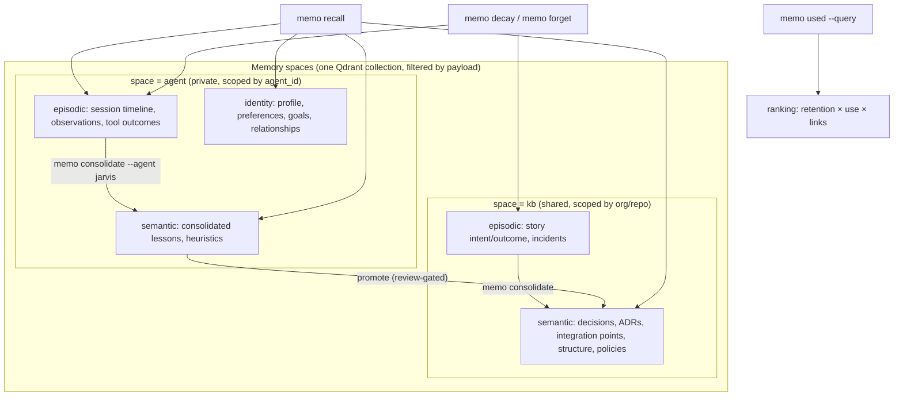
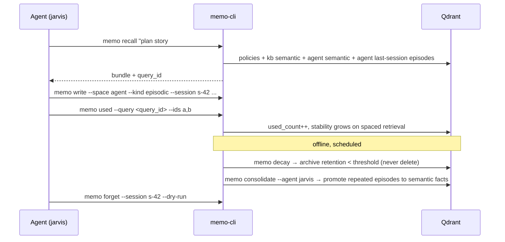
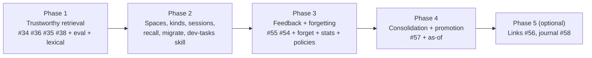

# PRD-004 — Long-Lived Agent Memory: Spaces, Episodic/Semantic Kinds, Recall, Feedback, and Forgetting

## Changelog

| Version | Date       | Summary                                                                                                                                                                                                                       | Author           |
| ------- | ---------- | ----------------------------------------------------------------------------------------------------------------------------------------------------------------------------------------------------------------------------- | ---------------- |
| 1.0     | 2026-09-19 | Initial draft. Consolidates PRD-002 ranking work and issues #53–#58 into one phased memory-model roadmap.                                                                                                                     | product-engineer |
| 1.1     | 2026-09-19 | Review round 1: agent memory bank gets identity-class entry types and a SELF recall section; PRD-002 folded in and superseded (`memo ask` moves to Phase 5, optional); purge default confirmed; issue reuse deferred to spec. | product-engineer |

## 1. Executive Summary

memo-cli today is a single shared knowledge base of repo-scoped decisions with cosine-similarity search. dev-tasks agents write intent, outcome, and ADR entries into it, but retrieval is noisy, nothing is ever forgotten, and no signal flows back about whether a retrieved entry was useful. PRD-004 turns memo-cli into a long-lived memory layer for autonomous agents: it introduces **memory spaces** (a shared knowledge base per org/repo plus a private memory bank per named agent), **episodic and semantic kinds** with a sequential session timeline, a one-call **`memo recall`** context bundle, a **feedback loop** (`memo used`) that drives ranking, and a principled **forgetting** model (decay, supersession, explicit `memo forget`) that never silently destroys data. Delivery is phased so retrieval quality is measured first and every later phase is gated on that measurement. PRD-002 (search ranking and retrieval) is folded into this PRD and superseded by it.

## 2. Feature Overview

### 2.1 Where we are

| Area           | Shipped (v1.1.4)                                                                | Refined, not built                                     | Proposed in issues, not refined                                                     |
| -------------- | ------------------------------------------------------------------------------- | ------------------------------------------------------ | ----------------------------------------------------------------------------------- |
| Store          | One Qdrant collection `decisions`, isolation by `repo`/`org` payload            | —                                                      | `kind: episodic \| semantic` (#53), event journal (#58)                             |
| Write          | `memo write` with `rationale`, 2–5 tags, `entry_type`, dedupe by story/commit   | —                                                      | `memo add --kind/--context/--session` (#53), links (#56)                            |
| Retrieval      | `memo search` = cosine similarity + exact pre-filters; `memo list`; `memo read` | composite score, tag boost, tiers, staleness (#34–#38) | retention factor (#54), use ratio (#55), link-aware ranking and `--expand` (#56)    |
| Feedback       | none                                                                            | —                                                      | `memo used --query <id>` (#55)                                                      |
| Forgetting     | `memo delete` (hard delete, bulk blocked in `--json`)                           | —                                                      | `memo decay` → archive (#54), reconsolidation with `valid_to`/`superseded_by` (#57) |
| Consolidation  | none                                                                            | —                                                      | `memo consolidate` offline LLM job (#57)                                            |
| Agent identity | none (`source: agent` only)                                                     | —                                                      | `source_agent`, `contexts` (#53)                                                    |

Three gaps block the vision and are not covered by any existing artifact:

1. **No notion of whose memory it is.** An agent is a defined loop, tool set, prompt, and data. Such an agent has nowhere to keep its own identity, preferences, open commitments, short-term episodes, and long-term lessons apart from the team's decision record, so it cannot resume months later as the same persona. Today its per-story intent/outcome entries land in the shared KB and crowd out durable decisions.
2. **No single recall primitive.** dev-tasks agents run four commands at session start (`list`, `tags list`, two `search`es) and synthesize by hand. There is no ranked, deduplicated, token-budgeted bundle.
3. **No governed forgetting.** The only removal path is hard delete. There is no retention policy, no soft archive, no "what should I forget and why" report.

Issues #53–#58 were also written against a CLI vocabulary that does not exist (`memo add`, `memo get`, `content`, `source_agent`, `tier`) and #56 declares that it "replaces" the ranking formula #34 was refined against. This PRD reconciles both into the shipped vocabulary and a single ranking function.

### 2.2 Target model



Short-term memory is the episodic stream of the current and recent sessions (low initial stability, retention policy per space). Long-term memory is semantic: either written directly by a human or an agent with provenance, or promoted by consolidation. "Sequential" memory is the episodic timeline ordered by `session_id` and `timestamp_utc`.

### 2.3 Lifecycle of a memory



### 2.4 The agent memory bank

An agent memory bank is the `agent` space for one `agent_id`. It holds entry types that exist only there and are never accepted in `kb`:

| Entry type     | Kind     | Class     | Purpose                                                                                    | Removed by                     |
| -------------- | -------- | --------- | ------------------------------------------------------------------------------------------ | ------------------------------ |
| `profile`      | semantic | identity  | Who the agent is: persona, tone, standing instructions, capabilities, definition reference | supersession, explicit forget  |
| `preference`   | semantic | identity  | How it likes to work; choices it has settled                                               | supersession, explicit forget  |
| `goal`         | semantic | identity  | Open commitments and in-flight work with `status: open \| done \| dropped`                 | status change, explicit forget |
| `relationship` | semantic | identity  | People, agents, and repos it works with and how                                            | supersession, explicit forget  |
| `lesson`       | semantic | knowledge | Heuristic learned from experience; written explicitly or promoted by consolidation         | decay, supersession, forget    |
| `observation`  | episodic | event     | What happened, in session order                                                            | expiry, decay, forget          |

Identity-class entries are exempt from decay and expiry: a persona must survive months of silence. They change only by supersession (a new `profile` entry with `--supersedes <id>`) or explicit forget. Knowledge and event entries follow the retention ladder in §8.3. The existing shared types (`decision`, `integration_point`, `structure`) remain valid in an agent space for private notes.

`memo recall --agent <id>` opens with a `SELF` section (current profile, preferences, open goals, relationships) so that the agent restores its persona before it restores task context.

## 3. Goals & Objectives

1. **Measured retrieval quality.** Top-3 relevance on a versioned evaluation set rises from the measured baseline to ≥ 80%, and every ranking change is gated on that set.
2. **Separate private agent memory from the shared knowledge base.** A defined agent can persist its identity, preferences, open goals, episodes, and lessons, then recall, consolidate, and forget them without polluting or being polluted by the org/repo KB, and resume as the same persona after months.
3. **One call to restore context.** `memo recall` replaces the four-command session-start sequence with a ranked, deduplicated, token-budgeted bundle that carries a `query_id`.
4. **Close the feedback loop.** Agents report which recalled memories they used; that signal changes ranking, retention, and consolidation.
5. **Forget on purpose, never by accident.** Retention policies, decay to archive, supersession, and an explicit `memo forget` with dry-run and audit. Automated jobs never hard-delete.
6. **Backward compatibility.** Every payload and config change is additive; existing `write`/`search`/`list`/`read`/`delete` flags and JSON envelopes keep working. Existing entries remain in default search results after migration.
7. **Cost discipline.** Stays within the product constraint of near-zero infrastructure cost; LLM calls only in offline jobs with `--dry-run` and cost reporting.

## 4. Affected Repositories

| Repository        | Role / Impact                                                                                                                                                                                                                                                                                                      |
| ----------------- | ------------------------------------------------------------------------------------------------------------------------------------------------------------------------------------------------------------------------------------------------------------------------------------------------------------------ |
| `llipe/memo-cli`  | Primary implementation: payload schema v2 (`space`, `agent_id`, `kind`, session, provenance, validity, stability, archive fields), ranking library, new commands (`recall`, `timeline`, `used`, `decay`, `forget`, `stats`, `consolidate`, `migrate`), config v2, eval harness, docs.                              |
| `llipe/dev-tasks` | Consumer changes: `memo-cli-usage` skill and the `developer`, `product-engineer`, `technical-writer`, `planner` prompts. Session start becomes `memo recall`; per-story intent/outcome entries move to the agent space (episodic); ADRs and decisions stay in `kb` (semantic); story completion calls `memo used`. |

## 5. Target Users

### Primary Users

- **Long-lived orchestrator agents** (e.g. a planner instance "Jarvis") that run many sessions over weeks and need their own short-term and long-term memory.
- **Worker agents** (developer, technical-writer) that need a fast, relevant context bundle at session start and a cheap way to report what helped.
- **dev-tasks maintainers** who own the agent prompts and skill that call memo-cli.

### Secondary Users

- **Tech leads** auditing what the team and its agents "believe", what is stale, and what was forgotten and why.
- **Solo developers** running one agent across repos who want the agent to stop repeating mistakes.

## 6. User Stories

1. As a planner agent, I want a private memory bank keyed by my agent id so that my session notes and learned heuristics do not mix with the team's decision record.
2. As a planner agent, I want to write episodic entries tagged with a session id so that I can replay what I did, in order, in a later session.
3. As any agent, I want one `memo recall "<task>"` call that returns applicable policies, relevant shared decisions, my own relevant lessons, and my last session's episodes, within a token budget, so that I restore context without hand-synthesizing four command outputs.
4. As any agent, I want to report which recalled entries I actually used so that future recall ranks them higher and unused noise ranks lower.
5. As a developer agent, I want search to match exact identifiers (file names, issue numbers, flag names) as well as meaning so that "why does `search-filters.ts` build `should` clauses" finds the entry that names that file.
6. As a tech lead, I want search results ordered by trust and actionability (similarity, recency, source, retention, use) with a confidence tier and a stale flag so that agents can decide act/verify/discard programmatically.
7. As a tech lead, I want superseded decisions to keep their history (`valid_to`, `superseded_by`) and be queryable as of a date so that nothing is overwritten in place.
8. As an operator, I want a scheduled `memo decay` that archives memories whose retention dropped below a threshold, never deletes, and can be dry-run, so that noise shrinks without data loss.
9. As an agent or operator, I want `memo forget` to remove a session, an agent's short-term memory, or entries matching a filter, with a dry-run and an audit record, so that forgetting is explicit and reviewable.
10. As an operator, I want per-space retention policies in config (for example, agent episodic entries archive after 30 days unless pinned or cited as provenance) so that "what to forget" is a policy, not a judgment call at runtime.
11. As a planner agent, I want an offline `memo consolidate --agent jarvis` job that turns repeated episodes into durable semantic lessons with provenance so that my long-term memory grows from experience.
12. As a tech lead, I want promotion of an agent's consolidated facts into the shared KB to require review so that LLM-generated generalizations do not silently become team truth.
13. As an operator, I want `memo migrate --to-v2 --dry-run` to show how every existing entry will be classified before anything changes so that migration is safe.
14. As an operator, I want `memo stats` to show noisy memories (retrieved often, rarely used), stability distribution, and archive counts per space so that I can tune retention.
15. As any agent, I want `memo search --explain` to print every ranking factor so that I can understand and tune why something ranked where it did.
16. As a long-lived agent, I want my profile, preferences, open goals, and relationships stored as identity-class entries that never decay so that a session started months later begins with the same persona and open commitments.
17. As a tech lead or human at the terminal, I want `memo ask "<question>"` to synthesize a cited answer from the same bundle `recall` builds so that I do not have to read raw entries (optional, Phase 5).

## 7. Functional Requirements

Requirements are grouped by phase. "MUST" items are required for the phase to close.

### 7.1 Phase 1 — Trustworthy retrieval (PRD-002 Phases A and B, plus measurement)

- FR-1.1 The CLI **MUST** ship a versioned relevance evaluation set under `tests/fixtures/relevance/` (target 20–30 query/expected-id pairs seeded from real dev-tasks queries: story planning, file-name lookups, cross-repo contracts) and a script that reports top-3 hit rate. The baseline **MUST** be recorded in the PRD changelog before any ranking change merges.
- FR-1.2 Composite ranking (#34), tag overlap boosting (#36), dynamic confidence tiers (#35), and staleness detection (#38) **MUST** be implemented exactly as refined in `workstream/issue-34-composite-ranking-score-refinement.md` and the corresponding issues, with the single change that `final_score` is produced by the unified formula in §8.2 (multiplicative factors default to 1 until later phases land).
- FR-1.3 `memo search` **MUST** add lexical matching: a Qdrant full-text payload index on `rationale` (and `files_modified`), queried alongside the dense vector and fused by reciprocal rank fusion. Exact tokens such as file names, issue references, and flag names **MUST** be matchable. A `--lexical off` escape hatch **MUST** exist.
- FR-1.4 Every `memo search` response **MUST** include a `query_id` (UUID) in JSON output. Phase 1 stores nothing for it; Phase 3 makes it actionable.
- FR-1.5 `memo search --explain` **MUST** print each ranking factor and the final score per result (human and JSON).

### 7.2 Phase 2 — Memory model: spaces, kinds, sessions, recall

- FR-2.1 The payload **MUST** gain `space` (`kb` | `agent`), `agent_id` (required when `space = agent`), `kind` (`episodic` | `semantic`), `session_id`, `seq`, `contexts`, `provenance`, `valid_from`, `valid_to`, `superseded_by`, `consolidated`, `pinned`, and `schema_version: "2"`. All are additive and indexed where filtered (see §9).
- FR-2.2 `memo write` **MUST** accept `--space`, `--agent`, `--kind`, `--session`, `--seq`, `--context` (repeatable), `--provenance`, `--pin`. Defaults: `space = kb`; `kind = semantic` in `kb`, `episodic` in `agent`; `agent_id` from `--agent`, then `MEMO_AGENT`, then `config.agent.default_id`. A write with `space = agent` and no resolvable `agent_id` **MUST** fail with `VALIDATION_FAILED`. The agent-only entry types in §2.4 (`profile`, `preference`, `goal`, `relationship`, `lesson`, `observation`) **MUST** be rejected in `space = kb` with `VALIDATION_FAILED`; `goal` entries carry `status` (`open` default) and `--status done|dropped` closes them without deleting.
- FR-2.3 A `semantic` entry written by `source: agent` **MUST** carry at least one `provenance` id unless `--manual` is passed; `--manual` sets `source: manual`.
- FR-2.4 The dedupe key **MUST** become `v2|<space>|<agent_or_na>|<repo>|<commit_or_na>|<story_or_na>|<session_or_na>|<entry_type>|<source>` so that the same story in two spaces or two sessions does not collide. v1 keys remain readable.
- FR-2.5 `memo search`, `memo list`, `memo tags list` **MUST** accept `--space`, `--agent`, `--kind`, `--session`, `--include-archived`, `--include-superseded`, and `--as-of <date>`. Default search scope is `space = kb`, `kind = all`, archived and superseded excluded. Searching `space = agent` **MUST** require a resolved `agent_id`; there is no cross-agent search.
- FR-2.6 `memo timeline --session <id> | --agent <id> [--last <n>] [--since <date>]` **MUST** return episodic entries in sequence order (`seq`, then `timestamp_utc`), never re-ranked.
- FR-2.7 `memo recall "<task>" [--agent <id>] [--scope repo|related] [--max-tokens <n>] [--json]` **MUST** return one bundle with labeled sections in this order: `SELF` (when `--agent` is resolved: current profile, preferences, open goals, relationships; never trimmed), applicable policies (when PRD-003 is present), shared semantic entries for the task, the agent's semantic entries, the agent's most recent session episodes (chronological), and open contradictions or `pending_contradiction` flags. Sections are trimmed from the bottom to honor `--max-tokens` (approximated as characters ÷ 4). The bundle **MUST** carry one `query_id` covering every entry it contains and **MUST** deduplicate by id across sections.
- FR-2.8 `memo migrate --to-v2 [--dry-run] [--rules <file>]` **MUST** classify every existing point using an ordered rule table (default: tags containing `intent` or `outcome` → `kind = episodic`, `session_id = story`; `entry_type` in `integration_point`, `structure`, `policy` or tags containing `adr` → `semantic`; everything else → `semantic` with `source` unchanged), set `space = kb`, `schema_version = "2"`, `consolidated = false`, and print the classification counts. It **MUST** be idempotent and **MUST** write nothing under `--dry-run`. Points already at v2 are skipped.
- FR-2.9 `memo read --id` **MUST** print the full v2 payload including the provenance chain (ids and first line of each provenance entry) and validity fields.
- FR-2.10 `dev-tasks`: the `memo-cli-usage` skill and agent prompts **MUST** be updated so that session start is `memo recall`, per-story intent/outcome entries are written to `space = agent` as episodic with `--session ISSUE-<n>`, ADR and decision entries stay in `kb` as semantic, and each defined agent resolves its own `agent_id` (one per agent definition, with the role added as a context).
- FR-2.11 `memo agent init --id <id> [--description <text>] [--definition-ref <ref>]` **MUST** create the agent space's first `profile` entry and set `config.agent.default_id` when unset. `memo agent show [--id <id>]` **MUST** print the current profile, preferences, open goals, relationships, entry counts per kind, and last session id. `memo agent list` **MUST** list agent ids with counts, without content.
- FR-2.12 `profile` entries **SHOULD** carry `agent_definition_ref` (a path, version, or hash of the loop, tools, prompt, and data that define the agent). When the ref passed to `memo recall --definition-ref` differs from the one on the current profile, `recall` **MUST** print a `DEFINITION_CHANGED` notice in the `SELF` section; it never blocks.

### 7.3 Phase 3 — Feedback and forgetting

- FR-3.1 `memo used --query <query_id> --ids <csv> [--wrong <csv>] [--agent <id>]` **MUST** validate that every id belongs to the result set of that `query_id` (exit 1 on mismatch), increment `used_count`, apply the used bonus to stability, and append a `usage_event` to a local append-only log (`~/.memo/usage.jsonl`). Ids passed with `--wrong` **MUST** be flagged `pending_contradiction = true` and receive no bonus. Query result sets **MUST** be persisted locally (`~/.memo/queries/<query_id>.json`) with a 7-day TTL so validation works across processes.
- FR-3.2 Every `memo search` and `memo recall` **MUST** increment `retrieval_count` and, when the retrieval is spaced (outside `MIN_SPACING_HOURS`, default 12), update `stability` and `last_retrieved_at` per the formulas in #54. Retrieval updates **MUST** be batched into one Qdrant payload update per invocation and **MUST NOT** add more than 300 ms to search latency.
- FR-3.3 `retention = exp(-t / stability)` **MUST** be computed at ranking time (never stored) and applied as the multiplicative factor in §8.2. Initial stability: `1.0` (episodic), `7.0` (semantic), `MAX_STABILITY` 365 days, all configurable.
- FR-3.4 `memo decay [--space] [--agent] [--dry-run] [--threshold <n>] [--verbose]` **MUST** set `archived = true`, `archived_reason = decay`, `archived_at` on memories with `retention < ARCHIVE_THRESHOLD` (default 0.05), except memories that are `pinned`, or are cited in `provenance` of a currently valid semantic fact. It **MUST NOT** delete. It **MUST** honor per-space policy (§8.4). It **MUST** be idempotent and print counts per space and kind.
- FR-3.5 `memo forget` **MUST** support selectors `--id`, `--session`, `--agent` (whole agent space), `--space`, `--older-than <duration>`, `--tags`, `--kind`, combinable with AND semantics, plus `--dry-run`, `--yes`, `--json`. Default action is soft archive with `archived_reason = forget`. `--purge` performs a hard delete and **MUST** write a tombstone record (`id`, selector, actor, timestamp) to `~/.memo/forget.jsonl`. In `--json` mode, `--purge` **MUST** be limited to `--id` or `--session` selectors (mirrors the ADR-001 bulk-delete guard). Pinned entries are skipped unless `--include-pinned`.
- FR-3.6 Per-space retention policy in config (§8.4) **MUST** drive `memo decay` defaults and an optional `expires_at` on episodic writes (`--expires-in <duration>` or policy default); expiry archives, never deletes. Purge of archived entries is opt-in per space via `purge_after_days` and only ever executed by an explicit `memo decay --purge-expired`.
- FR-3.7 `memo stats [--space] [--agent] [--json]` **MUST** show per space and kind: counts (active, archived, superseded, pinned), stability distribution, top entries by `use_ratio`, and a "noisy" list (`retrieval_count ≥ 10` and `use_ratio < 0.1`).
- FR-3.8 `memo decay` and `memo consolidate` **MUST** be safe to run from a scheduler (cron, CI) with `--json` output and exit code 0 on no-op.

### 7.4 Phase 4 — Consolidation and promotion

- FR-4.1 `memo consolidate --space kb|agent [--agent <id>] [--dry-run] [--limit] [--since] [--report json|text]` **MUST** implement the pipeline in #57 (select unconsolidated episodes → cluster by embedding + tags → LLM proposes candidate facts as strict JSON with cited episode ids → gate on `MIN_EPISODES` 3, `MIN_CONTEXTS` 2, `MIN_SPAN_DAYS` 7, and schema consistency → write promoted facts with `provenance`, `valid_from`, `links_out = provenance` → mark episodes `consolidated = true` → demote or archive stale facts → report). Candidates citing ids outside their cluster **MUST** be rejected. Running twice on unchanged data **MUST** produce no duplicates.
- FR-4.2 Reconsolidation **MUST** never overwrite a semantic fact in place: the old fact gets `valid_to = now` and `superseded_by`; the new fact gets `valid_from = now` and provenance including the contradicting episodes. A contradiction from a single episode in a single context **MUST NOT** supersede; it writes the candidate at the lowest tier with `pending_contradiction = true`.
- FR-4.3 Consolidation within an agent space (agent episodes → agent semantic) **MAY** run autonomously on a schedule. Promotion from an agent space into `kb` **MUST** be a separate step, `memo consolidate --promote-to kb`, that writes candidates to a review file (`workstream/memo-promotions-<date>.md`) or, with `--yes`, writes them as `source: agent`, `confidence: medium`, tagged `promoted-from:<agent_id>`. The config key `consolidation.promote_to_kb` (`review` | `auto` | `off`, default `review`) governs this.
- FR-4.4 `memo search --as-of <date>` **MUST** return the semantic facts that were valid at that date.
- FR-4.5 The consolidation report **MUST** include LLM token usage and estimated cost per run.

### 7.5 Phase 5 — Associative memory and event journal (optional)

- FR-5.1 Links (#56): `links_out`, `links_in_count`, `links_in_contexts`; `memo link`, `memo unlink`, `memo write --link`, `memo reindex-links`; link factor in §8.2; `memo search --expand` with the fan-out rule `N = clamp(round(6 / sqrt(|links_out|)), 1, 5)`.
- FR-5.2 Event journal (#58): append-only `~/.memo/episodes.jsonl` mirror of episodic writes, `memo verify` drift report, `memo rebuild-semantic [--dry-run]`. Optional; ships only if Phase 4 shows consolidation parameters change often enough to need replay.
- FR-5.3 `memo ask "<question>" [--agent] [--scope] [--json]` (formerly PRD-002 #37): builds the `recall` bundle, drops `confidence_tier: low`, sends it to the `LLMAdapter` introduced in Phase 4 with the grounding prompt from #37 (answer only from context, cite ids, return the fixed no-answer sentence, ≤ 150 words), and returns `answer`, `sources`, `grounded`. Human-facing convenience; agents use `recall` directly.

## 8. Business Rules

### 8.1 Spaces

| Rule | Statement                                                                                                                                                                   |
| ---- | --------------------------------------------------------------------------------------------------------------------------------------------------------------------------- |
| S1   | Exactly two space types exist: `kb` (scoped by `org`, `repo`) and `agent` (scoped by `agent_id`, optionally `org`/`repo`). No other space types in this PRD.                |
| S2   | An agent space is readable and writable only when its `agent_id` is resolved. There is no cross-agent search. Cross-agent knowledge flows only through promotion into `kb`. |
| S3   | `kb` remains the default space for every command, so existing callers see no behavior change.                                                                               |
| S4   | `memo inspect` reports agent spaces as counts per `agent_id` without exposing their content.                                                                                |
| S5   | One `agent_id` per agent definition (loop, tools, prompt, data). Roles are `contexts`. Two definitions never share a bank.                                                  |
| S6   | Agent-only entry types (§2.4) are rejected in `kb`; identity-class entries are exempt from every automated removal level.                                                   |

### 8.2 Unified ranking formula

One function, `rankResults`, in `src/lib/ranking.ts`. Factors not yet implemented, or missing on a given payload, evaluate to their neutral value so every phase can ship independently.

```
base        = w_similarity * sim + w_recency * recency + w_source * source      # #34, weights sum to 1.0
boosted     = min(1, base + tag_boost)                                            # #36
final_score = min(1,
              boosted
              * (0.5 + 0.5 * retention)          # #54 — neutral 1 when stability absent
              * (1 + BETA * use_ratio)           # #55 — neutral 1 when counters absent; BETA 0.3
              * (1 + ALPHA * log(1 + links_in_count) * diversity)   # #56 — neutral 1; ALPHA 0.15
            )
confidence_tier = tier(final_score)                                               # #35
stale           = staleness(entry, same-scope newer entries)                       # #38, annotation only
```

Rules:

- R1 `similarity` is clamped to `[0, 1]`; `final_score` is always in `[0, 1]`.
- R2 Tie-break: `final_score` desc, `timestamp_utc` desc, `id` asc.
- R3 Archived and superseded entries are excluded before ranking unless explicitly included; `pinned` entries get no ranking bonus (pinning protects, it does not promote).
- R4 Weights, `BETA`, `ALPHA`, half-life, thresholds live in `memo.config.json` under `ranking`; invalid values fail `memo setup validate` and `loadConfig` (fail fast, per #34 D7).
- R5 Issue #56's "replaces the composite formula" statement is superseded by this section; #56 contributes the link factor only.
- R6 Default weights are re-validated against the evaluation set at the end of every phase; a phase that lowers top-3 hit rate does not close.

### 8.3 Forgetting ladder

| Level | Mechanism                                  | Trigger                                                            | Reversible | Data loss |
| ----- | ------------------------------------------ | ------------------------------------------------------------------ | ---------- | --------- |
| 0     | Ranking demotion (retention, use ratio)    | automatic at query time                                            | yes        | none      |
| 1     | Supersession (`valid_to`, `superseded_by`) | reconsolidation, `memo write --supersedes <id>`                    | yes        | none      |
| 2     | Archive (`archived = true`)                | `memo decay`, `expires_at`, `memo forget` default                  | yes        | none      |
| 3     | Purge (hard delete + tombstone)            | `memo forget --purge`, `memo decay --purge-expired`, `memo delete` | no         | yes       |

Rules:

- F1 No automated job crosses level 2 unless `purge_after_days` is explicitly set for that space.
- F2 An episodic entry cited as `provenance` by a currently valid semantic fact cannot be archived or purged while that fact is valid; `memo forget --purge` on it fails with `PROVENANCE_PROTECTED` unless `--cascade` is passed, which supersedes the dependent fact first.
- F3 `pinned` entries are exempt from levels 2 and 3 unless `--include-pinned`.
- F4 Every level-3 action writes a tombstone record; `memo stats` reports purge counts.
- F5 Identity-class entries (`profile`, `preference`, `goal`, `relationship`) never reach levels 2 or 3 through `memo decay` or expiry; only supersession, a `goal` status change, or `memo forget` with an explicit `--id` or `--agent` selector removes them.

### 8.4 Default retention policy per space

| Space / kind       | Initial stability | Archive threshold | `expires_at` default | Purge after archive |
| ------------------ | ----------------- | ----------------- | -------------------- | ------------------- |
| `kb` / semantic    | 7 days            | 0.05              | none                 | never               |
| `kb` / episodic    | 1 day             | 0.05              | 90 days              | never               |
| `agent` / semantic | 7 days            | 0.05              | none                 | never               |
| `agent` / episodic | 1 day             | 0.05              | 30 days              | off (opt-in)        |
| `agent` / identity | n/a (no decay)    | n/a               | none                 | never               |

All values are config keys under `spaces.<space>.<kind>`.

### 8.5 Feedback

- FB1 `memo used` is the only positive signal; absence of a report is not a negative signal (many agents cannot call back).
- FB2 `--wrong` is the only negative signal; it flags, it never archives or supersedes on its own.
- FB3 `memo search --auto-used` (top-1 counts as used) is off by default and marked as a weak signal in the usage log.
- FB4 dev-tasks agents call `memo used` at story completion with the ids they cited in intent/outcome entries or acted on.

## 9. Data Requirements

Single collection `decisions`, cosine, 1536 dims (unchanged). All new fields are optional at read time; v1 points remain readable.

```mermaid
erDiagram
    MEMORY {
        uuid id PK
        string schema_version "\"1\" (absent) or \"2\""
        enum space "kb | agent, indexed (new)"
        string agent_id "kebab, indexed, required when space=agent (new)"
        enum kind "episodic | semantic, indexed (new)"
        string repo "indexed"
        string org "indexed"
        string domain
        string rationale "1-5000 chars, full-text indexed (new index)"
        string[] tags "2-5 kebab, indexed"
        enum entry_type "decision | integration_point | structure | policy | profile | preference | goal | relationship | lesson | observation"
        enum status "goal only: open | done | dropped (new)"
        string agent_definition_ref "profile only (new)"
        enum source "agent | manual | scan"
        enum confidence "payload only; output uses confidence_tier"
        datetime timestamp_utc "indexed"
        string session_id "episodic, indexed (new)"
        int seq "episodic, optional (new)"
        string[] contexts "kebab (new)"
        uuid[] provenance "semantic (new)"
        datetime valid_from "semantic (new)"
        datetime valid_to "semantic, null = valid, indexed (new)"
        uuid superseded_by "semantic (new)"
        bool consolidated "episodic (new)"
        bool pinned "(new)"
        bool archived "indexed (new)"
        enum archived_reason "decay | forget | superseded | expired (new)"
        datetime archived_at "(new)"
        datetime expires_at "(new)"
        float stability "days (new)"
        datetime last_retrieved_at "(new)"
        int retrieval_count "(new)"
        int used_count "(new)"
        bool pending_contradiction "(new)"
        uuid[] links_out "Phase 5"
        int links_in_count "Phase 5"
        string[] links_in_contexts "Phase 5"
        string commit "indexed"
        string story
        string[] files_modified "full-text indexed (new index)"
        string[] relates_to
        string dedupe_key_sha256 "indexed"
        enum dedupe_key_version "v1 | v2"
    }
    MEMORY ||--o{ MEMORY : "provenance / superseded_by / links_out"
```

Local files (never contain credentials):

| Path                              | Purpose                                                   | Format     |
| --------------------------------- | --------------------------------------------------------- | ---------- |
| `~/.memo/queries/<query_id>.json` | Result-set snapshot for `memo used` validation, 7-day TTL | JSON       |
| `~/.memo/usage.jsonl`             | Append-only usage events                                  | JSON lines |
| `~/.memo/forget.jsonl`            | Tombstones for purges                                     | JSON lines |
| `~/.memo/episodes.jsonl`          | Phase 5 optional episodic journal                         | JSON lines |
| `tests/fixtures/relevance/`       | Evaluation set and seed entries                           | JSON       |

Config v2 (`memo.config.json`, additive, `schema_version: "2"` optional; v1 files stay valid):

```json
{
  "schema_version": "2",
  "repo": "memo-cli",
  "org": "llipe",
  "domain": "ai",
  "agent": { "default_id": "jarvis" },
  "spaces": {
    "kb": { "episodic": { "expires_in_days": 90 } },
    "agent": { "episodic": { "expires_in_days": 30, "purge_after_days": null } }
  },
  "ranking": {
    "w_similarity": 0.6,
    "w_recency": 0.3,
    "w_source": 0.1,
    "recency_half_life_days": 90,
    "tag_boost_factor": 0.05,
    "confidence_thresholds": { "exact": 0.88, "high": 0.75, "medium": 0.6 },
    "staleness_threshold_days": 120,
    "staleness_tag_overlap_threshold": 0.5,
    "use_beta": 0.3,
    "link_alpha": 0.15,
    "lexical": true
  },
  "retention": {
    "min_spacing_hours": 12,
    "base_gain": 1.6,
    "used_bonus": 0.5,
    "max_stability_days": 365,
    "archive_threshold": 0.05
  },
  "consolidation": {
    "min_episodes": 3,
    "min_contexts": 2,
    "min_span_days": 7,
    "model": "gpt-4.1-nano",
    "promote_to_kb": "review"
  }
}
```

Sensitivity: agent spaces may contain task narratives and file paths; they are subject to the same "no secrets" rule as the KB. No PII is introduced. Agent ids are labels, not user identities.

## 10. Non-Goals (Out of Scope)

- RBAC, per-user identity, or access control between agents beyond the `agent_id` filter (the shared-cluster policy of v1 stands).
- A standalone PRD-002 track. PRD-002 is superseded by this PRD: its Phases A and B are Phase 1 here, its evaluation set is FR-1.1, its LLM adapter ships with Phase 4, and `memo ask` is FR-5.3 (optional).
- Org-wide policies (PRD-003). `recall` includes them when present; it does not implement them.
- Layered credential configuration (#33).
- Procedural memory (skills, prompts). Per #53, that belongs in versioned skill files.
- Multiple Qdrant collections, other vector databases, or a graph database.
- Web UI, real-time multi-machine sync beyond what Qdrant provides.
- Automatic hard deletion by any scheduled job.

## 11. Design Considerations

No UI. CLI output rules from `docs/technical-guidelines.md` §4 apply. Additions:

- `memo recall` human output prints section headers (`POLICIES`, `SHARED`, `MINE`, `LAST SESSION`, `CONFLICTS`) and one line per entry: tier, score, first sentence, id.
- `memo search --explain` prints an aligned factor table per result.
- `memo forget --dry-run` and `memo decay --dry-run` print the exact selector, counts per space and kind, and up to 20 sample ids.
- Archived and superseded entries, when included, are prefixed `[archived]` / `[superseded]`.
- `NO_COLOR` and non-TTY behavior unchanged.

## 12. Technical Considerations

- **Single collection, payload isolation.** Chosen over one collection per space because `deleteByFilter`, facets, and cross-space `recall` already work on payload filters, and the free-tier cost constraint favors one index. Trade-off: "forget everything Jarvis knows" is a filter delete, not a collection drop; mitigated by `memo forget --agent <id> --dry-run` previews.
- **Ranking stays post-retrieval and pure.** `src/lib/ranking.ts` is side-effect free with injected `now` (per #34 constraints). Over-fetch `max(limit, min(limit * 3, 50))` remains; lexical fusion over-fetches the same amount from the text index.
- **Lexical index.** Qdrant `text` payload index on `rationale` and `files_modified` with word tokenizer, min 2 / max 20 token length. Adding an index to an existing collection is online in Qdrant; `ensureCollection` **MUST** create missing indexes idempotently.
- **Retrieval counters.** One `setPayload` batch per search. On failure the search result still returns (counters are best-effort, logged under `MEMO_DEBUG`).
- **LLM usage** is confined to `memo consolidate`, uses the `LLMAdapter` planned in PRD-002 §7.6 (OpenAI SDK, Ollama-compatible), and always reports cost.
- **Migration** is a scroll-and-update pass with `--dry-run`, resumable, idempotent (skips `schema_version = "2"`). No reindex of vectors.
- **Performance targets.** `search` < 2.5 s (unchanged) including counters; `recall` < 4 s; `decay` and `consolidate` are offline and unbounded but report progress.
- **Testing.** Ranking, retention, forgetting-ladder, and migration rules are pure functions with table-driven unit tests; commands are integration-tested against a mocked `QdrantRepository`; the evaluation script is a CI job that fails on regression below the recorded baseline.
- **dev-tasks coupling.** The skill update ships in the same phase as `recall` (Phase 2) so agents adopt the new flow immediately; the old four-command sequence remains valid.

Phase dependency graph:



## 13. Acceptance Criteria

Phase-level exit criteria. Story-level criteria are produced in the spec and stories for each phase.

**Phase 1**

- [ ] AC-1.1 Evaluation set exists with ≥ 20 labeled queries; baseline top-3 hit rate is recorded in this PRD's changelog.
- [ ] AC-1.2 Under default config, a fresh mid-similarity entry outranks a stale high-similarity one (#34 AC2 scenario).
- [ ] AC-1.3 A query containing an exact file name returns the entry that lists that file in `files_modified` in the top 3, with `--lexical off` it may not.
- [ ] AC-1.4 JSON output carries `query_id`, `final_score`, `similarity`, `recency_score`, `source_score`, `tag_boost`, `confidence_tier`, and `stale`/`superseded_by` when applicable; existing envelope keys are unchanged.
- [ ] AC-1.5 Top-3 hit rate on the evaluation set is ≥ 80% or ≥ baseline + 15 points, whichever is lower, and never below baseline.

**Phase 2**

- [ ] AC-2.1 `memo write --space agent` without a resolvable `agent_id` exits 1 with `VALIDATION_FAILED`; with `MEMO_AGENT=jarvis` it succeeds and the point carries `space = agent`, `agent_id = jarvis`, `kind = episodic`.
- [ ] AC-2.2 `memo search` with no new flags returns exactly the entries it returned before migration (default scope `kb`, archived/superseded excluded, none exist yet).
- [ ] AC-2.3 `memo search --space agent --agent jarvis` never returns another agent's entries (tested with two agents).
- [ ] AC-2.4 `memo timeline --session s-42` returns entries in `seq` then `timestamp_utc` order regardless of similarity.
- [ ] AC-2.5 `memo recall` returns all five sections when data exists, deduplicates ids across sections, respects `--max-tokens` by trimming from the bottom, and returns one `query_id`.
- [ ] AC-2.6 `memo migrate --to-v2 --dry-run` writes nothing; a real run classifies intent/outcome-tagged entries as episodic and everything else as semantic; a second run reports 0 changes.
- [ ] AC-2.7 dev-tasks `developer` prompt uses `memo recall` at session start and writes intent/outcome entries with `--space agent --session ISSUE-<n>`.
- [ ] AC-2.8 `memo write --entry-type profile` in `kb` exits 1 with `VALIDATION_FAILED`; in `space = agent` it succeeds. `memo recall --agent jarvis` returns a `SELF` section listing the profile, preferences, open goals, and relationships and omits goals with `status = done`; `SELF` survives `--max-tokens` trimming.
- [ ] AC-2.9 `memo agent init --id jarvis` creates exactly one `profile` entry; running it twice reports the existing profile and creates nothing.

**Phase 3**

- [ ] AC-3.1 `memo used` with an id not in the query's result set exits 1; with valid ids it increments `used_count` and appends one usage event per id.
- [ ] AC-3.2 Two retrievals within `min_spacing_hours` increment `retrieval_count` twice and change `stability` once.
- [ ] AC-3.3 `memo decay --dry-run` archives nothing; a real run archives entries below threshold, skips pinned, identity-class, and provenance-protected entries, and never calls delete (asserted on the mock). A `profile` entry with `last_retrieved_at` 400 days ago is not archived.
- [ ] AC-3.4 `memo forget --session s-42 --dry-run` lists the matching ids; without `--dry-run` it archives them with `archived_reason = forget`; `--purge` deletes them and writes tombstones; `--purge --space agent --json` is rejected.
- [ ] AC-3.5 An entry with `use_ratio` 0.8 outranks an otherwise identical entry with `use_ratio` 0 under default `use_beta`.
- [ ] AC-3.6 `memo stats` lists at least one noisy entry in a fixture where one entry has `retrieval_count` 12 and `used_count` 0.

**Phase 4**

- [ ] AC-4.1 `memo consolidate --dry-run` with a mocked LLM prints candidates and writes nothing; a real run promotes only clusters meeting all thresholds; a candidate with evidence in one context is rejected regardless of count.
- [ ] AC-4.2 A contradicting cluster sets `valid_to` and `superseded_by` on the old fact and never mutates its `rationale`; `memo search --as-of <before>` returns the old fact.
- [ ] AC-4.3 `--promote-to kb` with `promote_to_kb = review` writes a review file and no KB points; with `--yes` it writes points tagged `promoted-from:<agent_id>`.
- [ ] AC-4.4 The report includes token usage and cost; running twice on unchanged data produces no new facts.

**All phases**

- [ ] AC-0.1 `pnpm test`, `lint`, `format:check`, `typecheck`, `audit` pass; coverage ≥ 80% overall, `lib/` ≥ 85%.
- [ ] AC-0.2 `README.md`, `docs/data-model.md`, `docs/system-overview.md`, `docs/technical-guidelines.md`, and the dev-tasks `memo-cli-usage` skill are updated in the same PR as the behavior they describe.

## 14. Success Metrics

| Metric                                                          | Baseline            | Target                                    | Phase |
| --------------------------------------------------------------- | ------------------- | ----------------------------------------- | ----- |
| Top-3 relevance on evaluation set                               | measured in Phase 1 | ≥ 80%                                     | 1     |
| Session-start commands per agent session                        | 4                   | 1 (`memo recall`)                         | 2     |
| Share of default search results that are archived or superseded | n/a                 | 0%                                        | 3     |
| Stories with a `memo used` report                               | 0%                  | ≥ 80% of dev-tasks stories                | 3     |
| Use ratio of `recall` results                                   | unknown             | ≥ 30% of returned ids reported used       | 3     |
| Noisy entries (`retrieval ≥ 10`, `use_ratio < 0.1`)             | unknown             | trending down month over month            | 3     |
| Hard deletes by automated jobs                                  | n/a                 | 0                                         | 3     |
| Consolidation cost                                              | n/a                 | < $0.05 per 100 episodes at default model | 4     |
| `memo search` latency                                           | < 2.5 s             | < 2.5 s including counters                | 1–3   |
| `memo recall` latency                                           | n/a                 | < 4 s                                     | 2     |
| Persona resume                                                  | n/a                 | `SELF` section complete in one call       | 2     |

## 15. Assumptions

- An agent is a defined loop, tool set, prompt, and data; each definition owns one `agent_id` and one memory bank. Roles (`planner`, `developer`) are `contexts`. One agent runs one session at a time.
- The dev-tasks harness can inject `MEMO_AGENT` or pass `--agent`.
- Existing entries written by dev-tasks are distinguishable by the `intent`/`outcome` tags the skill mandates; entries that do not follow the skill are classified semantic and can be re-classified by hand.
- Qdrant ≥ 1.7 supports full-text payload indexes and batch payload updates (true since 1.1).
- One LLM provider (OpenAI-compatible, Ollama for offline) is sufficient for consolidation.
- The current low volume (hundreds to low thousands of entries per org) makes scroll-based jobs acceptable; no pagination redesign is needed before ~100K points.

## 16. Constraints & Dependencies

- **Ordering.** Phase 1 must land before Phase 2 because `recall` relies on tiers and staleness; Phase 3 relies on `query_id` persistence and `kind`; Phase 4 relies on `provenance`, `valid_*`, and retention; Phase 5 is optional.
- **Existing issues.** Phase 1 reuses #34, #36, #35, #38 (already refined; only the formula section of #34's refinement changes). Phase 2 supersedes the CLI vocabulary of #53 and adds spaces. Phase 3 reuses #54 and #55. Phase 4 reuses #57. Phase 5 reuses #56 and #58. Whether each existing issue is reused with a "Refined Scope" comment or closed and replaced is decided during the spec for the phase that covers it; #56's formula note is corrected either way.
- **PRD-002** is superseded by this PRD (changelog row added there). **PRD-003 (policies)** stays a parallel track; `recall` consumes policies when they exist.
- **Cost.** No new paid infrastructure. LLM spend only in `consolidate`, reported per run.
- **Compatibility.** Semver minor for Phases 1–3 (additive). Phase 2's dedupe key change is additive (v1 keys still match). A major bump is only needed if the `confidence` payload field is ever removed, which this PRD does not do.
- **dev-tasks release coupling.** The skill and prompt changes ship as a dev-tasks minor release aligned with memo-cli Phase 2.

## 17. Security & Compliance

- Credentials remain env-only; new local files under `~/.memo/` contain ids, timestamps, selectors, and agent labels only. They are created with mode `0600`.
- Agent spaces are a namespace, not a security boundary; the v1 shared-cluster policy applies. This is stated in the docs.
- `--purge` and `memo delete` are the only irreversible operations; both require `--yes` or a TTY confirmation, write tombstones (purge) and are blocked for whole-space selectors in `--json` mode.
- Consolidation prompts contain memory content only; no credentials, no file contents beyond what agents already wrote into `rationale`.
- Query result snapshots expire after 7 days and are pruned on the next `memo` invocation.

## 18. Open Questions

1. **Agent identity model.** Resolved in v1.1: one `agent_id` per agent definition; identity-class entry types live only in the agent bank (§2.4).
2. **Migration default.** This PRD classifies existing entries by tag and defaults the rest to `semantic` so default search stays populated. #53 proposed "everything episodic" and a first consolidation run. Confirm the tag-based rule and whether `story` should become `session_id` on migrated episodic entries.
3. **Recency vs retention overlap.** Both are time-based. Keep both with defaults and tune on the evaluation set, or drop `w_recency` to 0.15 once retention exists? Default assumed: keep both, tune in Phase 3 exit.
4. **Purge policy for agent short-term memory.** Resolved in v1.1: archive at 30 days, purge off unless `purge_after_days` is set.
5. **Promotion review location.** A file under `workstream/` versus a GitHub issue per promotion batch via `github-ops`. Default assumed: file, because it works outside GitHub-backed repos.
6. **Consolidation model and runner.** OpenAI `gpt-4.1-nano` by default with Ollama fallback; should consolidation run in CI on a schedule or only by hand until Phase 4 exit metrics are met? Default assumed: by hand with `--dry-run` first.
7. **Negative feedback scope.** Is `--wrong` sufficient, or do agents need a `--not-useful` signal that lowers stability directly? Default assumed: `--wrong` only.
8. **`memo ask` placement.** Resolved in v1.1: PRD-002 is superseded; `memo ask` is FR-5.3, optional.
9. **Agent definition reference.** Should `agent_definition_ref` be a content hash computed by dev-tasks from the agent's prompt and tool list, or a free-form version string? Default assumed: free-form string; hashing is a dev-tasks concern.
