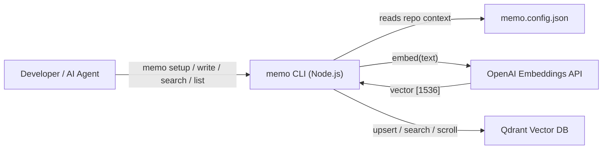

# System Overview — Memo CLI

> `@memo-ai/cli` v1.0 — Current-state documentation

---

## Purpose

Memo CLI is an agent-first command-line tool that captures, stores, and retrieves architectural decisions, technical rationale, and integration contracts generated during software development. It uses a Qdrant vector store for semantic search and chronological retrieval.

Primary consumers are AI agents (GitHub Copilot, Claude, Cursor) and developers who want persistent, cross-session memory of project decisions.

---

## High-Level Architecture

---

## Core Components

### Commands (`src/commands/`)

| Command            | File         | Purpose                                                                        |
| ------------------ | ------------ | ------------------------------------------------------------------------------ |
| `memo setup`       | `setup.ts`   | Initialize `memo.config.json`, show effective config, validate config          |
| `memo write`       | `write.ts`   | Capture a decision with duplicate detection, embed rationale, upsert to Qdrant |
| `memo search`      | `search.ts`  | Semantic vector search with exact pre-filters (repo, tags, scope)              |
| `memo list`        | `list.ts`    | Chronological entry listing with optional date-range filtering                 |
| `memo tags list`   | `tags.ts`    | Browse all unique tags stored in the collection with counts and sort options    |
| `memo inspect`     | `inspect.ts` | Discover orgs, repos, and domains across the knowledge base with facet filters |
| `memo delete`      | `delete.ts`  | Safely delete a single entry by ID or bulk-delete by repo/org                  |

All commands support `--json` for machine-readable output. Human mode uses colored text via chalk.

### Libraries (`src/lib/`)

| Module              | Purpose                                                                                            |
| ------------------- | -------------------------------------------------------------------------------------------------- |
| `qdrant.ts`         | `QdrantRepository` — collection bootstrap, upsert, search, scroll, delete by ID and by filter     |
| `facets.ts`         | Scroll-based aggregation utility — `aggregateField()` and `aggregateMultipleFields()` for tag/org/repo/domain faceting |
| `embeddings.ts`     | `EmbeddingsAdapter` interface + `createEmbeddingsAdapter()` factory                                |
| `config.ts`         | Load, write, and validate `memo.config.json`                                                       |
| `registry.ts`       | Resolve related repositories from config for cross-repo search scope                               |
| `output.ts`         | Centralized human/JSON output with chalk colors and ora spinners                                   |
| `errors.ts`         | `MemoError` class with typed error codes and deterministic exit codes                              |
| `dedupe.ts`         | Deduplication key generation (SHA-256), confidence inference, merge strategies                     |
| `search-filters.ts` | Build Qdrant pre-filter objects for search operations                                              |
| `list-filters.ts`   | Build Qdrant pre-filter objects for list with date range support                                   |
| `retry.ts`          | Generic exponential backoff wrapper (max 3 attempts, 500ms base)                                   |
| `debug.ts`          | Conditional debug logging to stderr (`MEMO_DEBUG=true`)                                            |

### Adapters (`src/adapters/`)

| Adapter                | Purpose                                           |
| ---------------------- | ------------------------------------------------- |
| `openai-embeddings.ts` | OpenAI `text-embedding-3-small` (1536 dimensions) |

Additional providers (Voyage, Cohere, Ollama) ship via the same `EmbeddingsAdapter` interface in future phases.

### Type Schemas (`src/types/`)

| File        | Purpose                                                    |
| ----------- | ---------------------------------------------------------- |
| `entry.ts`  | `EntryPayloadSchema` — Zod schema for decision entries     |
| `config.ts` | `MemoConfigSchema` — Zod schema for `memo.config.json`     |
| `cli.ts`    | Shared CLI flag interfaces (placeholder for consolidation) |

---

## Integrations

| System                    | Method                                          | Purpose                                               |
| ------------------------- | ----------------------------------------------- | ----------------------------------------------------- |
| **Qdrant**                | `@qdrant/js-client-rest` via `QdrantRepository` | Vector storage, semantic search, chronological scroll |
| **OpenAI**                | `openai` SDK via `OpenAIEmbeddingsAdapter`      | Text-to-vector embedding for rationale                |
| **Local filesystem**      | Node.js `fs`                                    | Read/write `memo.config.json`                         |
| **Environment variables** | `dotenv` (dev) / process.env (production)       | Credential management                                 |

---

## Key Runtime Flows

### Write Flow

1. Parse and validate CLI flags (rationale, tags, entry-type, source)
2. Load `memo.config.json` for repo/org/domain context
3. Compute deduplication key (SHA-256 of canonical string)
4. Validate full entry payload via Zod
5. Auto-bootstrap Qdrant collection if needed
6. Check for existing entry by dedupe key
7. If duplicate found: resolve via interactive prompt (human) or `--on-duplicate` flag (agent)
8. Embed rationale text via OpenAI
9. Upsert entry to Qdrant
10. Output result (JSON or human-readable)

### Search Flow

1. Parse query string and filter flags (scope, tags, entry-type, source, limit)
2. Load config, resolve related repos if `--scope related`
3. Build Qdrant pre-filters
4. Embed query text (plus tag terms when present)
5. Execute vector search with pre-filters
6. Format and output results with similarity scores

### List Flow

1. Parse filter flags (from, to, tags, entry-type, limit)
2. Load config, resolve repo scope
3. Build list filters with optional date-range boundaries
4. Execute Qdrant scroll (ordered by `timestamp_utc` descending)
5. Format and output results chronologically

### Tags Flow

1. Load config to resolve current repo; fail with `REPO_CONTEXT_UNRESOLVED` if missing
2. Resolve target repos — current repo only (`--scope repo`) or including `relates_to` repos (`--scope related`)
3. Build repo pre-filter and scroll all matching entries via `aggregateField('tags', scroll, filter)`
4. Count each tag occurrence individually (tags is an array field)
5. Sort by alpha (default) or frequency (`--sort frequency`)
6. Output tag list with counts (human or `--json`)

### Inspect Flow

1. Auto-bootstrap Qdrant collection if needed
2. Scroll all entries (no repo filter — global view) via `aggregateMultipleFields(scroll)`
3. Simultaneously accumulate counts for `org`, `repo`, and `domain` fields in a single pass
4. Apply facet flags (`--orgs`, `--repos`, `--domains`) to narrow displayed sections
5. Output grouped facet sections with counts (human or `--json`)

### Delete Flow

1. Validate mutually exclusive flag combination: exactly one of `--id`, `--all-by-repo`, `--all-by-org`
2. Reject bulk flags (`--all-by-repo`, `--all-by-org`) when `--json` is present (agent-mode guard)
3. **Single delete:** scroll to verify entry exists → show preview → prompt for confirmation (unless `--json` or `--yes`) → `deleteById(id)` → output result
4. **Bulk delete:** scroll to count matching entries → prompt for confirmation (unless `--yes`) → `deleteByFilter(filter)` → output deleted count
5. Empty-match bulk delete returns exit 0 with a no-entries-found message

---

## Non-Functional Posture

| Concern            | Approach                                                                                       |
| ------------------ | ---------------------------------------------------------------------------------------------- |
| **Error handling** | Typed `MemoError` with 12 error codes; exit code 0 (success), 1 (user error), 2 (system error) |
| **Retry**          | Exponential backoff for Qdrant and embeddings API calls (3 attempts, 500ms base)               |
| **Security**       | Credentials via env vars only; never logged; `.env` gitignored; no shell injection surface     |
| **Performance**    | CLI startup < 200ms; write < 3s; search < 2.5s; lazy command loading                           |
| **Testing**        | 202+ test cases across unit and integration; 80% coverage threshold                            |
| **Observability**  | `MEMO_DEBUG=true` for verbose stderr logging; no structured logging in v1                      |
