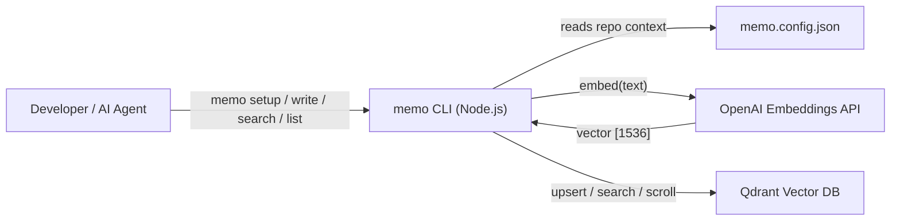
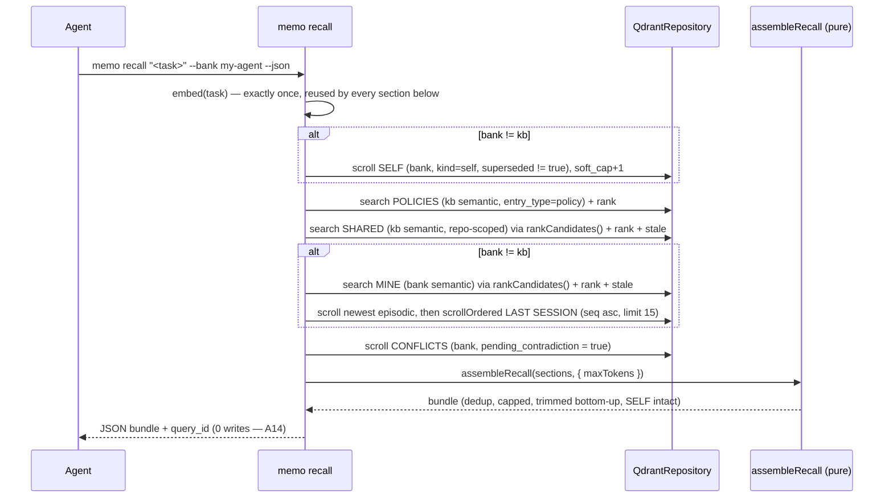

# System Overview — Memo CLI

> `@memo-ai/cli` v1.0 — Current-state documentation

---

## Purpose

Memo CLI is an agent-first command-line tool that captures, stores, and retrieves architectural decisions, technical rationale, and integration contracts generated during software development. It uses a Qdrant vector store for semantic search and chronological retrieval.

Primary consumers are AI agents (GitHub Copilot, Claude, Cursor) and developers who want persistent, cross-session memory of project decisions.

---

## High-Level Architecture

```mermaid
graph LR
    User["Developer / AI Agent"]
    CLI["memo CLI (Node.js)"]
    Config["memo.config.json"]
    Qdrant["Qdrant Vector DB"]
    OpenAI["OpenAI Embeddings API"]

    User -->|"memo setup / write / search / list"| CLI
    CLI -->|"reads repo context"| Config
    CLI -->|"embed(text)"| OpenAI
    CLI -->|"upsert / search / scroll"| Qdrant
    OpenAI -->|"vector [1536]"| CLI
```

---

## Core Components

### Commands (`src/commands/`)

| Command          | File          | Purpose                                                                                                                                                      |
| ---------------- | ------------- | ------------------------------------------------------------------------------------------------------------------------------------------------------------ |
| `memo setup`     | `setup.ts`    | Initialize `memo.config.json`, show effective config, validate config                                                                                        |
| `memo write`     | `write.ts`    | Capture a decision with duplicate detection, embed rationale, upsert to Qdrant                                                                               |
| `memo search`    | `search.ts`   | Semantic vector search with exact pre-filters (repo, tags, scope)                                                                                            |
| `memo list`      | `list.ts`     | Chronological entry listing with optional date-range filtering                                                                                               |
| `memo tags list` | `tags.ts`     | Browse all unique tags stored in the collection with counts and sort options                                                                                 |
| `memo inspect`   | `inspect.ts`  | Discover orgs, repos, and domains across the knowledge base with facet filters                                                                               |
| `memo delete`    | `delete.ts`   | Safely delete a single entry by ID or bulk-delete by repo/org                                                                                                |
| `memo read`      | `read.ts`     | Read one exact entry by ID with human or JSON output                                                                                                         |
| `memo timeline`  | `timeline.ts` | Replay `episodic` memory in sequence order — `seq` asc within a session, else grouped by session; never embeds, never ranks (spec §18.8, S2-06)              |
| `memo recall`    | `recall.ts`   | One call to restore context: SELF/POLICIES/SHARED/MINE/LAST SESSION/CONFLICTS within a token budget; read-only, embeds exactly once (spec §8.5/§18.9, S2-07) |

All commands support `--json` for machine-readable output. Human mode uses colored text via chalk.

### Libraries (`src/lib/`)

| Module               | Purpose                                                                                                                                                                          |
| -------------------- | -------------------------------------------------------------------------------------------------------------------------------------------------------------------------------- |
| `qdrant.ts`          | `QdrantRepository` — collection bootstrap, upsert, search, scroll, delete by ID and by filter                                                                                    |
| `facets.ts`          | Scroll-based aggregation utility — `aggregateField()` and `aggregateMultipleFields()` for tag/org/repo/domain faceting                                                           |
| `embeddings.ts`      | `EmbeddingsAdapter` interface + `createEmbeddingsAdapter()` factory                                                                                                              |
| `config.ts`          | Load, write, and validate `memo.config.json`                                                                                                                                     |
| `registry.ts`        | Resolve related repositories from config for cross-repo search scope                                                                                                             |
| `output.ts`          | Centralized human/JSON output with chalk colors and ora spinners                                                                                                                 |
| `errors.ts`          | `MemoError` class with typed error codes and deterministic exit codes                                                                                                            |
| `dedupe.ts`          | Deduplication key generation (SHA-256), confidence inference, merge strategies                                                                                                   |
| `search-filters.ts`  | Build Qdrant pre-filter objects for search operations                                                                                                                            |
| `ranking.ts`         | Pure composite ranking score for `memo search` — `computeRecencyScore`, `computeSourceScore`, `computeCompositeScore`, `rankResults` (issue #34)                                 |
| `staleness.ts`       | Pure staleness detection for `memo search` — `computeJaccardOverlap`, `detectStaleness` (issue #38)                                                                              |
| `lexical.ts`         | Pure lexical identifier matching for `memo search` — `extractIdentifierTokens`, `tokenizeWord`, `cosine`, `computeLexicalBoost` (issue #62)                                      |
| `list-filters.ts`    | Build Qdrant pre-filter objects for list with date range support                                                                                                                 |
| `retry.ts`           | Generic exponential backoff wrapper (max 3 attempts, 500ms base)                                                                                                                 |
| `debug.ts`           | Conditional debug logging to stderr (`MEMO_DEBUG=true`)                                                                                                                          |
| `bank.ts`            | Bank resolution (`resolveBank`, PRD B3), `isPrivateBank`, `defaultKind`, `policyFor` (spec §18.2/§18.5)                                                                          |
| `filters.ts`         | `buildBaseFilter` — the one shared bank/kind/state/session/as-of predicate for every read command (spec §8.1/§18.5); `mergeFilters`                                              |
| `entry-normalize.ts` | `normalizeEntry` — v1→v2 read-side field defaults (spec §18.3); `projectV2Fields` — additive-only JSON projection for `search`/`list` (S2-05 AC8)                                |
| `read-flags.ts`      | `parseReadFlags` — shared `--bank`/`--kind`/`--session`/`--include-archived`/`--include-superseded`/`--as-of` parsing for `search`/`list`/`tags list`/`read` (spec §18.7, S2-05) |
| `recall.ts`          | `assembleRecall` — pure section dedup/cap/trim for `memo recall` (spec §8.5/§18.9, S2-07); no I/O                                                                                |

### Adapters (`src/adapters/`)

| Adapter                | Purpose                                           |
| ---------------------- | ------------------------------------------------- |
| `openai-embeddings.ts` | OpenAI `text-embedding-3-small` (1536 dimensions) |

Additional providers (Voyage, Cohere, Ollama) ship via the same `EmbeddingsAdapter` interface in future phases.

### Type Schemas (`src/types/`)

| File        | Purpose                                                    |
| ----------- | ---------------------------------------------------------- |
| `entry.ts`  | `EntryPayloadSchema` — Zod schema for decision entries     |
| `config.ts` | `MemoConfigSchema` — Zod schema for `memo.config.json`     |
| `cli.ts`    | Shared CLI flag interfaces (placeholder for consolidation) |

---

## Integrations

| System                    | Method                                          | Purpose                                               |
| ------------------------- | ----------------------------------------------- | ----------------------------------------------------- |
| **Qdrant**                | `@qdrant/js-client-rest` via `QdrantRepository` | Vector storage, semantic search, chronological scroll |
| **OpenAI**                | `openai` SDK via `OpenAIEmbeddingsAdapter`      | Text-to-vector embedding for rationale                |
| **Local filesystem**      | Node.js `fs`                                    | Read/write `memo.config.json`                         |
| **Environment variables** | `dotenv` (dev) / process.env (production)       | Credential management                                 |

---

## Key Runtime Flows

### Write Flow

1. Parse and validate CLI flags (rationale, tags, entry-type, source)
2. Load `memo.config.json` for repo/org/domain context
3. Compute deduplication key (SHA-256 of canonical string)
4. Validate full entry payload via Zod
5. Auto-bootstrap Qdrant collection if needed
6. Check for existing entry by dedupe key
7. If duplicate found: resolve via interactive prompt (human) or `--on-duplicate` flag (agent)
8. Embed rationale text via OpenAI
9. Upsert entry to Qdrant
10. Output result (JSON or human-readable)

### Search Flow

1. Parse query string and filter flags (scope, tags, entry-type, source, limit)
2. Load config, resolve related repos if `--scope related`; an invalid config (including invalid `ranking` weights) fails fast with `CONFIG_INVALID` rather than falling back to defaults
3. Parse the shared read-side flags via `src/lib/read-flags.ts`'s `parseReadFlags` (spec §18.7, story S2-05): `--bank`, `--kind` (case-insensitive `self`/`episodic`/`semantic`/`all`), `--session`, `--include-archived`, `--include-superseded`, `--as-of` (date-only or full ISO 8601; implies `--include-superseded` only). Invalid `--kind`/`--as-of` fail `VALIDATION_FAILED`.
4. Build the shared `base` filter via `src/lib/filters.ts`'s `buildBaseFilter` (bank/kind/state/session/as-of) and merge it into `buildSearchFilters` — this is the one `base` shared by the dense query, the lexical scroll, and the staleness corpus below (AC4); no downstream call builds its own copy
5. **`--kind self` is a distinct, unranked path** (AC5): issue one `scroll` (no embeddings call, no dense/lexical search, no staleness corpus), return results newest-first with `final_score`/`similarity`/`confidence_tier` entirely absent — `self` never enters `rankResults` in any other mode either
6. Embed query text (plus tag terms when present) — skipped entirely for `--kind self`
7. Compute the over-fetch limit `max(limit, min(limit * 3, 50))` and execute vector search with the merged pre-filters against that many candidates
   7a. Lexical identifier matching (issue #62): extract identifier-shaped tokens from the query via `src/lib/lexical.ts`'s `extractIdentifierTokens` (file paths, dotted names, kebab/snake_case, `#123`, `PROJ-45`, `--flag`, CamelCase). When at least one identifier is present and `ranking.lexical` is `true` (default), issue exactly one extra `scroll` against the `rationale`/`files_modified` text indexes (`should` per identifier, `min_should: 1`, same merged pre-filters, `limit 50`, `with_vector: true`), then union-dedupe its results into the candidate set by id: candidates already found by the dense search keep their Qdrant score; lexical-only candidates get a locally computed cosine similarity (`src/lib/lexical.ts`'s `cosine`) against the query vector. If the scroll fails, degrade to dense-only results (logged under `MEMO_DEBUG`, exit code unchanged) rather than failing the command. Every candidate then gets `lexical_boost = identifiers_matched / total_identifiers * ranking.lexical_boost_factor` (all-or-nothing per identifier), computed from the candidate's own payload regardless of which retrieval path found it.
8. Rank candidates via `src/lib/ranking.ts`'s composite score (`final_score = w_similarity * similarity + w_recency * recency_score + w_source * source_score`, weights from `memo.config.json`'s `ranking` block or its defaults, plus `tag_boost` and `lexical_boost` added before the `1.0` cap), slice back down to `--limit`
9. Attach `confidence_tier` to every ranked candidate via `computeConfidenceTier(final_score, thresholds)` (issue #35): thresholds come from `ranking.confidence_thresholds` or its defaults, and the tier is derived from the already-final `final_score` — it never feeds back into scoring or ordering
10. Detect staleness (issue #38, bank-aware per decision A12/S2-05 AC4): when there is at least one ranked result, fetch the staleness corpus once via `QdrantRepository.fetchStalenessCorpus(base)` (a `scroll`, not `search`, bounded at 1,000 entries by default, ordered by `timestamp_utc` desc) — the same `base` filter as the dense query and lexical scroll, plus a `repo` any-match clause layered on top only for the shared `kb` bank (a private bank's corpus is bank-scoped only, so a private bank's entries are never flagged stale by `kb` entries, or vice versa). `fetchByRepo` no longer exists (removed by S2-05; superseded by `fetchStalenessCorpus`). Cache the corpus for the command, then run `src/lib/staleness.ts`'s pure `detectStaleness(results, corpus, config, now)` against the already-ranked, already-sliced results. A result is flagged when its age exceeds `ranking.staleness_threshold_days` (default 120) **and** a strictly newer same-corpus entry has Jaccard tag overlap `>= ranking.staleness_tag_overlap_threshold` (default 0.5); the newest qualifying entry wins as `stale_by`. Detection never feeds back into `final_score` or ordering
11. Format and output results: human mode prefixes each result with `[tier]`, and additionally with `[archived]`/`[superseded]` when included (S2-05 AC6), no longer shows the stored `confidence` field, and renders an inline `⚠ STALE — superseded by <id>` warning under any flagged result; `--json` exposes `final_score`, `similarity`, `recency_score`, `source_score`, and `confidence_tier` on every result, with the stored `confidence` field dropped from the projection (it remains in `memo read`/`memo list`/`memo write` output and in the stored payload — search is the only place it is removed), plus `stale`/`stale_by` when flagged (omitted entirely, not `false`/`null`, when not stale). Every result also gains `bank`/`kind` (always present, via `src/lib/entry-normalize.ts`'s `projectV2Fields`) and `session_id`/`seq`/`valid_from`/`valid_to`/`superseded_by`/`archived`/`superseded`/`pinned` (present only when set on the source entry — no existing key changes, S2-05 AC8). The envelope's `filters` gains `bank`, `kind`, `session?`, `as_of?`.
12. Attach a fresh `query_id` (UUID v4, `randomUUID`) to the envelope on every invocation (issue #63) — inert in Phase 1, nothing is persisted or read back; it only establishes the contract Phase 3 fills in. When `--explain` is set, project the full factor bag (`similarity`, `recency_score`, `source_score`, `tag_boost`, `lexical_boost`, and the Phase-2/3-neutral `retention: 1.0`, `use_ratio: 0`, `link_factor: 1.0`) onto every `--json` result as `factors`, and append an aligned factor table plus a `query_id: <uuid>` footer line in human mode. `--explain` never changes ordering, scores, or which results return, and issues no extra Qdrant or embeddings call.

**AC-2.3 (identical default results):** with no new flags, the default `base` (`bank = kb`, `kind = all` minus `self`, archived/superseded excluded) matches every v1 point via the `is_empty`/absent-bank fallback, so `memo search`/`memo list` return exactly the same entries they returned in v1.2.0 — verified by `tests/relevance/replay.test.ts`'s filter-path identity extension. **AC-2.4 (bank isolation):** `--bank a-memory` never returns a `b-memory` entry, and vice versa — there is no cross-bank search.

### List Flow

1. Parse filter flags (from, to, tags, entry-type, limit)
2. Load config, resolve repo scope
3. Parse the shared read-side flags (same `parseReadFlags`/`buildBaseFilter` as Search Flow steps 3–4) and merge `base` into `buildListFilters`
4. Execute Qdrant scroll (ordered by `timestamp_utc` descending) against the merged filter
5. Format and output results chronologically; JSON rows gain the same additive v2 fields as Search Flow step 11, and human rows gain the `[archived]`/`[superseded]` prefix; the envelope's `filters` gains `bank`, `kind`, `session?`, `as_of?`

### Tags Flow

1. Load config to resolve current repo; fail with `REPO_CONTEXT_UNRESOLVED` if missing
2. Resolve target repos — current repo only (`--scope repo`) or including `relates_to` repos (`--scope related`)
3. Parse the shared read-side flags and build `base` (same as Search/List flows); merge it with the repo pre-filter — the repo clause is applied only for the shared `kb` bank (`tags list` has no `--repo` flag, so a private bank is always repo-unscoped: its entries need not carry a `repo` at all)
4. Scroll all matching entries via `aggregateField('tags', scroll, filter)`
5. Count each tag occurrence individually (tags is an array field)
6. Sort by alpha (default) or frequency (`--sort frequency`)
7. Output tag list with counts (human or `--json`), including the resolved `bank`/`kind` (and `session`/`as_of` when supplied)

### Inspect Flow

1. Auto-bootstrap Qdrant collection if needed
2. Scroll all entries (no repo filter — global view) via `aggregateMultipleFields(scroll)`
3. Simultaneously accumulate counts for `org`, `repo`, and `domain` fields in a single pass
4. Apply facet flags (`--orgs`, `--repos`, `--domains`) to narrow displayed sections
5. Output grouped facet sections with counts (human or `--json`)

### Delete Flow

1. Validate mutually exclusive flag combination: exactly one of `--id`, `--all-by-repo`, `--all-by-org`
2. Reject bulk flags (`--all-by-repo`, `--all-by-org`) when `--json` is present (agent-mode guard)
3. **Single delete:** scroll to verify entry exists → show preview → prompt for confirmation (unless `--json` or `--yes`) → `deleteById(id)` → output result
4. **Bulk delete:** scroll to count matching entries → prompt for confirmation (unless `--yes`) → `deleteByFilter(filter)` → output deleted count
5. Empty-match bulk delete returns exit 0 with a no-entries-found message

### Read Flow

1. Validate `--id` and normalize non-empty value; reject `--bank`/`--kind`/`--session`/`--as-of` with `VALIDATION_FAILED` (S2-05 AC1/EC-12 — an id is explicit, so bank/kind disambiguation does not apply). `--include-archived`/`--include-superseded` are accepted for CLI-surface consistency but have no filtering effect, since `getById` already fetches the exact id regardless of state.
2. Auto-bootstrap Qdrant collection if needed
3. Execute exact lookup by ID via `getById(id)`
4. If no entry is found: return `ENTRY_NOT_FOUND` (exit code 1)
5. If found: normalize the payload via `src/lib/entry-normalize.ts`'s `normalizeEntry` (S2-05 AC9) — unlike Search/List's additive-only, present-when-true-only projection, `read` is a full diagnostic view and shows every v1-fallback default (`bank`, `kind`, `schema_version`, `archived`, `superseded`, `consolidated`, `pinned`, `pending_contradiction`, `valid_from`) alongside every other field present on the entry
6. If the entry's `provenance` field is an array of ids: resolve it with exactly one `scroll({ has_id: provenance })` call (capped at the array's own length — never a `getById`-per-id loop, never batched or truncated regardless of size) and replace it with `provenance: [{ id, deleted }]`; an id missing from the scroll result is `deleted: true` and suffixed `(deleted)` in human output
7. Return the full payload + `id` as flat object (`--json`) or ordered human-readable fields

### Timeline Flow (spec §18.8, S2-06)

1. Resolve `--bank` (PRD B3), validate and normalize `--since` (date-only → midnight UTC; invalid → `VALIDATION_FAILED`), and validate/clamp `--last` (default 50; `0` or negative → `VALIDATION_FAILED`; above 500 clamps to 500 with a stderr-only warning — never a JSON `warnings` field, spec §18.14 item 8)
2. Build the base filter via `buildBaseFilter({ bank, kind: 'episodic', session? })` (default `archived`/`superseded` exclusions apply; no `--include-archived`/`--include-superseded` flags on this command) and merge in a `timestamp_utc >= since` clause via `mergeFilters` when `--since` is present
3. **With `--session`:** `scrollOrdered(filter, { orderBy: { key: 'seq', direction: 'asc' }, limit })`, then a client-side stable sort (`seq` asc, `timestamp_utc` asc tie-break) that never trusts the returned order — ties are only possible with an explicit `--seq` collision
4. **Without `--session`:** the shipped `scroll(filter, limit)` (`timestamp_utc` desc), then grouped by `session_id` client-side, preserving both first-appearance group order and each entry's relative order within its group
5. Never constructs an embeddings adapter and never calls `rankResults` — this file imports neither
6. JSON: session shape `{ bank, session_id, entries, count }`; grouped shape `{ bank, sessions: [{ session_id, entries }], count }`. Human: `seq  timestamp  lead  id` per line (spec §10), with a `session: <id>` header per group in the grouped shape. An empty bank/session exits `0` with `count: 0`, never an error.

### Recall Flow (spec §8.5/§18.9, S2-07, PRD FR-2.6/AC-2.6)

`memo recall` is the headline Phase 2 command — one call that restores an agent's context. Command-side gathering (`src/commands/recall.ts`) is separated from assembly (`src/lib/recall.ts`'s pure `assembleRecall`) so caps/dedup/trimming stay unit-testable without any Qdrant/embeddings mock:

```mermaid
sequenceDiagram
  participant A as Agent
  participant C as memo recall
  participant Q as QdrantRepository
  participant R as assembleRecall (pure)
  A->>C: memo recall "<task>" --bank my-agent --json
  C->>C: embed(task) — exactly once, reused by every section below
  alt bank != kb
    C->>Q: scroll SELF (bank, kind=self, superseded != true), soft_cap+1
  end
  C->>Q: search POLICIES (kb semantic, entry_type=policy) + rank
  C->>Q: search SHARED (kb semantic, repo-scoped) via rankCandidates() + rank + stale
  alt bank != kb
    C->>Q: search MINE (bank semantic) via rankCandidates() + rank + stale
    C->>Q: scroll newest episodic, then scrollOrdered LAST SESSION (seq asc, limit 15)
  end
  C->>Q: scroll CONFLICTS (bank, pending_contradiction = true)
  C->>R: assembleRecall(sections, { maxTokens })
  R-->>C: bundle (dedup, capped, trimmed bottom-up, SELF intact)
  C-->>A: JSON bundle + query_id (0 writes — A14)
```

1. Gather, in order, per the §18.9 table: `SELF` (omitted at `bank = kb`), `POLICIES` (never omitted), `SHARED` (never omitted), `MINE` (omitted at `bank = kb`), `LAST SESSION` (omitted at `bank = kb`), `CONFLICTS` (never omitted, always empty until Phase 4's contradiction detection ships)
2. `SHARED`/`MINE` reuse `src/commands/search.ts`'s extracted `rankCandidates()` helper (over-fetch, lexical union, `rankResults`, staleness) — the exact same ranking pipeline `memo search` uses, with no parallel copy (S2-07 task 7.4, no behavior change to `memo search` itself). `POLICIES` uses a simpler dense-search-then-rank pipeline (no lexical union, no staleness annotation) per the table's literal wording
3. `assembleRecall` (`src/lib/recall.ts`, pure — no I/O) then: (a) deduplicates ids across sections in canonical order `self, policies, shared, mine, last_session, conflicts`, dropping a later duplicate before any cap is applied; (b) applies section caps (`SHARED` 8, `MINE` 5, `LAST SESSION` 15 most-recent-by-`seq`, `CONFLICTS` 5; `SELF`/`POLICIES` uncapped); (c) trims lowest-priority-first — `conflicts → last_session (oldest first) → mine → shared → policies` — stopping at the first budget that fits; `SELF` is never trimmed, even when it alone exceeds `--max-tokens` (in which case every other active section is trimmed to empty and named in `truncated`, and `budget.used_tokens` is reported honestly, never clamped)
4. Read-only per decision A14: no `setPayload`/`batchSetPayload` call and no `~/.memo/` filesystem write occurs anywhere in the command — `query_id` is emitted but no snapshot is persisted (that lands in Phase 3 alongside `memo used`)
5. JSON: `{ query_id, bank, budget: { max_tokens, used_tokens }, sections: { self?, policies, shared, mine?, last_session?: { session_id, entries }, conflicts }, truncated }` — `self`/`mine`/`last_session` are **omitted keys**, not empty arrays, at `bank = kb` (FR-2.6). Human: uppercase section headers, one line per entry (`[tier] score  lead  id`; `SELF`/`CONFLICTS` omit tier/score; `LAST SESSION` is `seq`-prefixed), footer `budget: <used>/<max> tokens · truncated: <list or none>`

---

## Non-Functional Posture

| Concern            | Approach                                                                                       |
| ------------------ | ---------------------------------------------------------------------------------------------- |
| **Error handling** | Typed `MemoError` with 12 error codes; exit code 0 (success), 1 (user error), 2 (system error) |
| **Retry**          | Exponential backoff for Qdrant and embeddings API calls (3 attempts, 500ms base)               |
| **Security**       | Credentials via env vars only; never logged; `.env` gitignored; no shell injection surface     |
| **Performance**    | CLI startup < 200ms; write < 3s; search < 2.5s; lazy command loading                           |
| **Testing**        | 202+ test cases across unit and integration; 80% coverage threshold                            |
| **Observability**  | `MEMO_DEBUG=true` for verbose stderr logging; no structured logging in v1                      |
