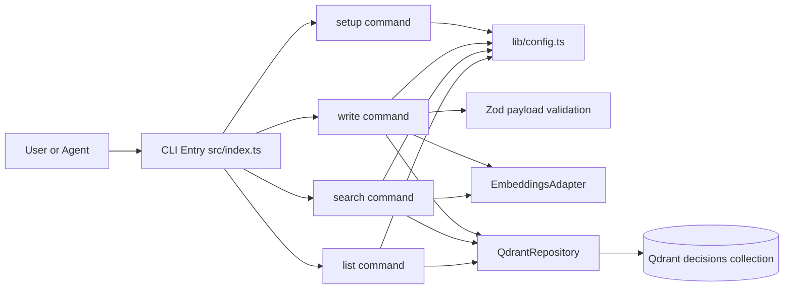
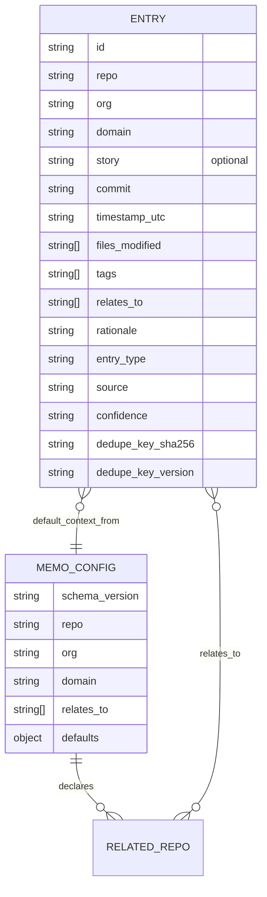
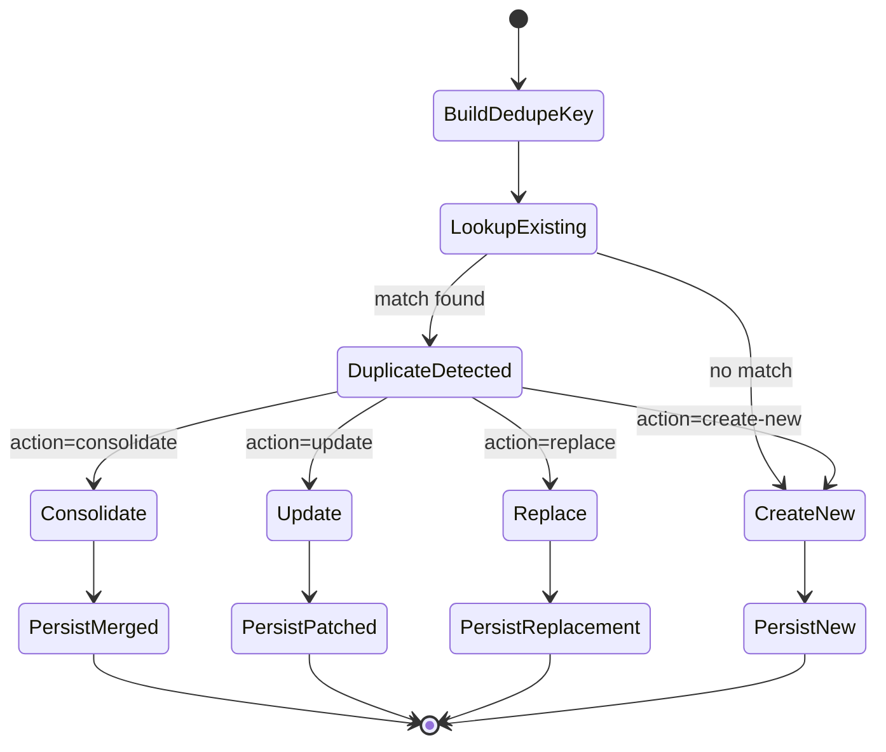

# Specification — PRD-001 Memo MVP Core Loop

## Changelog

| Version | Date       | Summary                                                                                                                 | Author         |
| ------- | ---------- | ----------------------------------------------------------------------------------------------------------------------- | -------------- |
| 1.0     | 2026-04-10 | Initial technical specification from PRD-001 and technical guidelines.                                                  | GitHub Copilot |
| 1.1     | 2026-04-10 | Feedback pass: optional `story` field, `entry_type` enum doc, `relates_to` semantics, expanded interactive mode design. | GitHub Copilot |

## 1. Executive Summary

This specification defines how Memo MVP will implement repo initialization, write, search, list, and guided bootstrap using a strict CLI-first architecture. The solution uses local repository config as primary context, Qdrant for vector and filtered retrieval, and strongly typed payload validation and output contracts for agent-safe automation. MVP includes setup/show/validate, duplicate-detection with user choice during writes, and first-release deployment/install instructions.

## 2. Reference Documents

- PRD: [docs/requirements/prd-001-mvp.md](docs/requirements/prd-001-mvp.md)
- Technical Guidelines: [docs/technical-guidelines.md](docs/technical-guidelines.md)
- Product Context: [docs/product-context.md](docs/product-context.md)

## 3. Affected Repositories

| Repository     | Role                    | Scope of Changes                                                                                                                                                 |
| -------------- | ----------------------- | ---------------------------------------------------------------------------------------------------------------------------------------------------------------- |
| llipe/memo-cli | API/CLI backend package | Command surfaces (`setup`, `write`, `search`, `list`), config resolver, Qdrant repository/bootstrap, validation, output contracts, tests, docs, release pipeline |

## 4. System Architecture

Memo MVP is a single-package TypeScript CLI with command modules orchestrating shared libraries for config, schema validation, embeddings, and storage. The local `memo.config.json` is the default context source; Qdrant is the persistence/search backend; embeddings are provided through adapter interfaces.

This diagram shows runtime component boundaries and interactions.



### Key Architectural Decisions

- Local-first context resolution in MVP: command flags override local config; remote registry is deferred for execution but interfaces remain forward-compatible.
- Collection bootstrap executes on first data command (`write`, `search`, or `list`) for resilience and deterministic behavior.
- Duplicate write handling is interactive in human mode and explicit in agent mode through action flags (consolidate/update/replace/create-new).

## 5. Data Model & Database Design

### Entity Overview

- `MemoConfig`: local repository identity and defaults.
- `Entry`: persisted architectural memory object.
- `RelatedRepo`: logical relationship values used for search scope expansion.

This ER diagram shows entity relationships and key attributes.



### entry_type Enum

| Value               | Meaning                                                                                                                     | Typical producer                    |
| ------------------- | --------------------------------------------------------------------------------------------------------------------------- | ----------------------------------- |
| `decision`          | A task or story decision made by an agent or developer — captures _why_ a path was chosen                                   | `agent`, `manual`                   |
| `integration_point` | How another system, module, or external service is consumed in this repo — useful for onboarding and cross-repo integration | `agent`, `manual`                   |
| `structure`         | High-level architectural or module-level structure; useful for bootstrap knowledge of existing codebases                    | `manual` (bootstrap), future `scan` |

### `relates_to` Semantics

`relates_to` is a cross-repo association array present in two places:

**In `memo.config.json`** (repo-level):

- Declares which other repositories this repo directly depends on or integrates with.
- Declarations are directional: if repo `A` declares `relates_to: ["B"]`, it means A knows about B. The inverse is not automatically true at the local config level.
- Search scope expansion uses this list: when `--scope related` is active, queries run against the declaring repo plus all entries where `repo` matches any value in `relates_to`.

**In an entry payload** (entry-level):

- Optional array passed via `--relates-to` on `memo write`.
- Captures which other repositories are _explicitly referenced or affected_ by the decision or integration being recorded.
- Entries with `relates_to: ["repo-b"]` are discoverable when anyone searches with `--scope related` from any repo that includes `repo-b` in its config `relates_to`.

In both cases, `relates_to` values must be valid kebab-case repository identifiers. An empty array `[]` is valid and means no cross-repo scope is declared.

### Schema and Indexing

- Qdrant collection: `decisions`
- Vector size: 1536 (OpenAI default)
- Payload indexes: `repo`, `org`, `entry_type`, `source`, `tags`, `timestamp_utc`, `commit`, `dedupe_key_sha256`

### Migration Strategy

- No standalone migration framework in MVP.
- Bootstrap path is idempotent and creates missing collection/indexes.
- Additive schema policy: unknown fields ignored by readers.

## 6. API Design

CLI commands are the external API. All commands support human output and `--json` machine output.

### Command Contracts

- `memo setup init [--repo] [--org] [--domain] [--relates-to] [--entry-source] [--search-scope] [--json]`
- `memo setup show [--json]`
- `memo setup validate [--json]`
- `memo write --rationale --tags [--entry-type] [--story] [--commit] [--files] [--relates-to] [--repo] [--org] [--domain] [--source] [--on-duplicate consolidate|update|replace|create-new] [--json]`
- `memo search <query> [--scope repo|related] [--repo] [--org] [--tags] [--entry-type] [--source] [--limit] [--json]`
- `memo list [--scope repo|related] [--repo] [--org] [--entry-type] [--source] [--from] [--to] [--limit] [--json]`

### Duplicate Handling Design (write)

When an entry with same repo+commit (or same `dedupe_key_sha256`) exists:

- Human mode: prompt for action: `consolidate`, `update`, `replace`, or `create-new`.
- Agent mode: require `--on-duplicate` or fail with `VALIDATION_FAILED` and actionable message.

### JSON Response Examples

Example `memo write --json` success (with optional `story` field present):

```json
{
  "created": true,
  "updated": false,
  "duplicate_detected": false,
  "entry": {
    "id": "06b38042-b492-4e9b-bec5-9e73e2d640e0",
    "repo": "memo-cli",
    "org": "llipe",
    "domain": "developer-tools",
    "story": "S-001",
    "commit": "6d1e2c6f4f91ad5532f3d70fb2c25ea95b933e4f",
    "timestamp_utc": "2026-04-10T14:25:02.431Z",
    "files_modified": ["src/commands/write.ts", "src/lib/qdrant.ts"],
    "tags": ["write-flow", "qdrant", "validation"],
    "relates_to": ["platform-docs"],
    "rationale": "Write path now validates and persists entries before returning structured output.",
    "entry_type": "decision",
    "source": "agent",
    "confidence": "high",
    "dedupe_key_version": "v1",
    "dedupe_key_sha256": "8f31ff6578f90f14d7495ad0f3df5b9b8d66c3a5d48fb8672524ce9f2ea3de11"
  }
}
```

Example `memo write --json` success (no `story` — field is omitted when not provided):

```json
{
  "created": true,
  "updated": false,
  "duplicate_detected": false,
  "entry": {
    "id": "1a2e4c8d-fcd3-4920-aeb3-1234b5678abc",
    "repo": "memo-cli",
    "org": "llipe",
    "domain": "developer-tools",
    "commit": "a0c55fe872c14e7f68ef22bb8391be2fa3cf16d7",
    "timestamp_utc": "2026-04-10T18:00:00.000Z",
    "files_modified": [],
    "tags": ["bootstrap", "integration_point"],
    "relates_to": [],
    "rationale": "Auth module exposes token refresh via POST /v1/auth/refresh — consumers should call this before issuing user-facing requests with expired tokens.",
    "entry_type": "integration_point",
    "source": "manual",
    "confidence": "medium",
    "dedupe_key_version": "v1",
    "dedupe_key_sha256": "c3d9e0a1f78b4556c12efab9781065340ffd2aa35cb1b7f1e8d03c4e5679f200"
  }
}
```

Example duplicate prompt response in agent mode:

```json
{
  "error": "Duplicate entry detected for repo+commit. Re-run with --on-duplicate consolidate|update|replace|create-new.",
  "code": "VALIDATION_FAILED"
}
```

Example `memo search --json` with full filters (result without `story` field — omitted when absent):

```json
{
  "query": "how do we persist decisions",
  "filters": {
    "scope": "related",
    "repo": "memo-cli",
    "org": "llipe",
    "tags": ["qdrant", "write-flow"],
    "entry_type": ["decision", "structure"],
    "source": ["agent", "manual"],
    "limit": 10
  },
  "results": [
    {
      "id": "06b38042-b492-4e9b-bec5-9e73e2d640e0",
      "repo": "memo-cli",
      "org": "llipe",
      "domain": "developer-tools",
      "commit": "6d1e2c6f4f91ad5532f3d70fb2c25ea95b933e4f",
      "timestamp_utc": "2026-04-10T14:25:02.431Z",
      "files_modified": ["src/commands/write.ts"],
      "tags": ["qdrant", "write-flow", "validation"],
      "relates_to": ["platform-docs"],
      "rationale": "Entries are persisted through QdrantRepository after schema validation. The write path first validates with Zod, then upserts via the repository abstraction — callers never interact with Qdrant directly.",
      "entry_type": "decision",
      "source": "agent",
      "confidence": "high",
      "similarity": 0.8129
    }
  ]
}
```

> **`relates_to` in search results:** When scope is `related`, Memo queries entries for the local repo _and_ entries where `repo` is any value in the local config's `relates_to` list. The per-entry `relates_to` array in results additionally indicates which other repositories the decision explicitly references, giving callers full cross-repo context.

Example empty `memo list --json`:

```json
{
  "filters": {
    "scope": "repo",
    "repo": "memo-cli",
    "from": "2026-01-01T00:00:00.000Z",
    "to": "2026-01-31T23:59:59.999Z",
    "entry_type": ["integration_point"],
    "source": ["manual"],
    "limit": 20
  },
  "results": [],
  "count": 0,
  "message": "No entries found for the requested scope and filters."
}
```

### Auth per Command and Rate Limits

- Auth is environment-driven credentials (Qdrant/provider keys).
- No CLI-level request rate limiting in MVP; external retries/backoff handled in adapters/repository.

## 7. Authentication & Authorization Design

- No internal user account model in MVP.
- Authorization is controlled by infrastructure credentials and network boundaries.
- Repo/org fields are logical scope filters, not hard security boundaries.

Permission matrix (MVP):

| Operation               | Requirement                                   |
| ----------------------- | --------------------------------------------- |
| `setup`                 | local filesystem write/read permissions       |
| `write/search/list`     | valid env credentials and Qdrant reachability |
| related scope expansion | valid local config with `relates_to`          |

## 8. Business Logic Implementation

### Validation and Default Resolution

- Required write fields: `--rationale`, `--tags`.
- `repo/org/domain` default from `memo.config.json` when not explicitly provided.
- `confidence` inferred by source path: `agent=high`, `manual=medium`, `scan=low`.
- Multi-tag filters use AND semantics.

### Duplicate State Flow

This diagram shows duplicate detection and write decision handling.



### Duplicate Resolution Rules

- `consolidate`: union tags/files/relates_to, preserve stronger confidence, keep existing rationale unless new rationale adds substantial detail.
- `update`: patch mutable fields and keep immutable identity fields.
- `replace`: create a new entry, mark old entry as superseded metadata where supported.
- `create-new`: bypass duplicate conflict and persist independently.

## 9. Integration Details

### Qdrant

- Wrapped by `QdrantRepository` for bootstrap, upsert, vector search, scroll list.
- Pre-filters are always applied before vector search.

### Embeddings

- Adapter interface with provider-specific implementations.
- Search vector input uses `query + normalized tags` when tags supplied.

### Bootstrap Deliverable (Recommended)

For MVP, deliver bootstrap as a documented prompt workflow (not a dedicated scan command):

- Add documentation section/file with strict prompt template and conversion examples to `memo write` calls.
- Keep full automated `memo scan` command deferred.

Rationale: this keeps MVP smaller and stable while still proving bootstrap value quickly.

## 10. User Interface & Client Behavior

### Guiding Principles

- Every interactive action has a mirror direct-invocation (agent-safe flags) that produces `--json` output.
- Interactive prompts are only activated when output is a TTY and `--json` is not set.
- All interactive flows use a consistent scheme: colorized labels, keyboard navigation, and clear confirmation before destructive actions.

### Human Mode — Interactive Design

Interactive prompts follow these display rules:

| Role                      | Color (chalk)     | Usage                             |
| ------------------------- | ----------------- | --------------------------------- |
| Prompt label              | `cyan`            | Identifies what is being asked    |
| Current/default value     | `gray`            | Shown inline next to prompt       |
| Selected option           | `bold` + `green`  | Active item in a selection list   |
| Unselected option         | default           | Inactive items                    |
| Warning / duplicate alert | `yellow` + `bold` | Alerts before destructive actions |
| Success confirmation      | `green`           | After write succeeds              |
| Error / abort             | `red`             | Validation failures or interrupts |

#### `memo setup init` interactive flow

When run in human mode with no flags, `setup init` presents a sequential wizard:

```
╔  Memo Setup
║
║  Repo name  (kebab-case)  ›  _
║  Org        (kebab-case)  ›  _
║  Domain     (kebab-case)  ›  _
║  Related repos (comma-separated, optional)  ›  _
║  Default source  [agent / manual]  ›  agent
║  Default scope   [repo / related]  ›  repo
╚

  Preview:

  {
    "schema_version": "1",
    "repo": "my-app",
    ...
  }

  ✔  Write memo.config.json?  [Y/n]
```

- Arrow keys or tab move between fields.
- Each field validates inline before advancing.
- Preview step renders the full JSON before writing.

#### `memo write` duplicate resolution prompt

When a duplicate is detected in human mode:

```
  ⚠  Duplicate entry found
  ┌  repo: memo-cli  commit: 6d1e2c…  entry_type: decision
  └  stored: 2026-04-09T10:00:00Z

  Choose an action:
  ❯  consolidate  — merge fields (union tags, keep stronger rationale and confidence)
     update       — patch metadata fields only (keep existing rationale)
     replace      — overwrite with new entry
     create-new   — persist as a separate independent entry
     abort        — cancel write

  ↑/↓ navigate   Enter to confirm
```

- Highlighted option shown with `❯` prefix in `green bold`.
- Warning header in `yellow bold`.
- Existing entry metadata shown in `gray`.

#### Empty result display

```
  info  No entries found.

  Active filters:
    scope:      repo
    repo:       memo-cli
    tags:       [auth, jwt]
    entry_type: decision

  Tip: Try broadening your search with --scope related or removing a --tags filter.
```

### Agent-Safe Direct Invocation Equivalents

Every interactive prompt has a direct non-interactive equivalent:

| Interactive action     | Direct invocation                                                     | JSON support |
| ---------------------- | --------------------------------------------------------------------- | ------------ |
| `setup init` wizard    | `memo setup init --repo x --org y --domain z --relates-to a,b --json` | ✅           |
| Duplicate: consolidate | `memo write ... --on-duplicate consolidate --json`                    | ✅           |
| Duplicate: update      | `memo write ... --on-duplicate update --json`                         | ✅           |
| Duplicate: replace     | `memo write ... --on-duplicate replace --json`                        | ✅           |
| Duplicate: create-new  | `memo write ... --on-duplicate create-new --json`                     | ✅           |
| Config preview/show    | `memo setup show --json`                                              | ✅           |
| Config validation      | `memo setup validate --json`                                          | ✅           |

All non-interactive invocations never prompt; missing required flags return `VALIDATION_FAILED` with clear message.

### JSON Mode

- Deterministic object contracts defined in Section 6.
- No ANSI output.
- Errors emitted to `stderr` as `{ "error": "...", "code": "..." }`.

### Conditional Interactive Activation

- TTY detection: prompts activate only when `process.stdout.isTTY === true`.
- When `--json` flag is present, all interactive paths are bypassed regardless of TTY.
- When `NO_COLOR` env var is set, chalk colors are disabled automatically.

## 11. Performance & Scalability Approach

- Command lazy loading and minimal startup work to preserve sub-200ms target.
- Qdrant pre-filters reduce vector candidate set before semantic matching.
- Long-rationale embedding summarization is deferred; MVP embeds full rationale text.
- Retry policy: exponential backoff (3 attempts, 500ms base, x2 multiplier).

## 12. Security Implementation

- Secrets loaded from environment only.
- No secret echoing in errors or logs.
- Input validation through Zod and command parsing constraints.
- No shell interpolation from user inputs.
- OWASP-focused controls: injection avoidance, dependency audit in CI, sensitive-data handling.

## 13. Error Handling & Logging

### Error Contract

- Exit codes: `0` success, `1` user/config/validation error, `2` infrastructure/system error.
- Stable error catalog from technical guidelines (e.g., `CONFIG_INVALID`, `QDRANT_UNREACHABLE`).

### Logging

- User-facing output routed through output formatter.
- Debug logs only via explicit debug mode.

### Recovery Behavior

- Collection bootstrap failure aborts current command with actionable diagnostics.
- Search/list no-results returns success with empty array.

## 14. Testing Strategy

- Unit tests for config validation, dedupe key generation, duplicate resolution logic, filter builders.
- Integration tests for setup/write/search/list command behavior and JSON contracts.
- Contract tests for `--json` examples and empty result cases.
- Manual tests for bootstrap documentation flow using sample repository artifacts.

Minimum coverage targets follow technical guidelines:

- `lib/` >= 85%
- `adapters/` >= 80%
- `commands/` >= 75%
- overall >= 80%

## 15. Deployment & Rollout

### Rollout Task Sequence (High-Level)

1. **Task 0.0 — Development Environment Setup (must be first)**
   - Install Node.js 24 LTS and pnpm 9.x.
   - Configure `.env` from `.env.example` with Qdrant and provider keys.
   - Run `pnpm install`, `pnpm lint`, `pnpm test`, `pnpm build` locally.
2. Implement setup commands (`init/show/validate`).
3. Implement write command with duplicate handling and inferred confidence.
4. Implement search/list full filter flags and related-scope behavior.
5. Add bootstrap prompt documentation and command conversion examples.
6. Complete integration tests and JSON contract verification.
7. Validate package build and CLI binary behavior.

### First Deployment and Installation Instructions

Release flow:

1. Ensure CI is green on `main`.
2. Bump package version (`pnpm version patch|minor|major`).
3. Push branch and tag (`git push && git push --tags`).
4. Publish package to npm (`npm publish --access public`) via configured workflow or local release process.

Consumer install flow:

```bash
npm install -g @memo-ai/cli
memo --help
memo setup init
```

Alternative registries are supported if package scope/mirror settings are configured in `.npmrc`.

### Backward Compatibility and Rollback

- CLI flags are additive in MVP; avoid breaking changes.
- Rollback by re-pointing npm tag/version and redeploying previous stable package.

## 16. Dependencies & Risks

### Dependencies

- Qdrant availability and credentials.
- Embeddings provider uptime and key management.
- Node.js 24 runtime and pnpm tooling consistency.

### Risks and Mitigations

- Duplicate handling ambiguity: mitigate with explicit action options and deterministic defaults.
- Search relevance variance: mitigate through tag normalization and pre-filter enforcement.
- Bootstrap quality drift: mitigate via strict JSON prompt schema and validation before write.

## 17. Open Questions

- None blocking for MVP specification drafting after latest decisions.
- Future-phase question to revisit: central config fetch policy (`setup validate` local-only vs optional remote check).

## 18. Requirement-to-Design Traceability Summary

- FR 1-6: implemented via `setup init/show/validate`, local config schema, strict validation, and default resolution.
- FR 7-13: implemented via write path bootstrap + validation + source/entry type constraints + inferred confidence.
- FR 14-17: implemented via semantic search with pre-filters, AND-tag semantics, and related scope expansion using config.
- FR 18-23: implemented via indexed timestamp listing, full JSON payload outputs, similarity in search JSON, and empty-result success semantics.
- FR 24-25: implemented via documented bootstrap prompt and manual source generation path for `structure`/`integration_point`.
