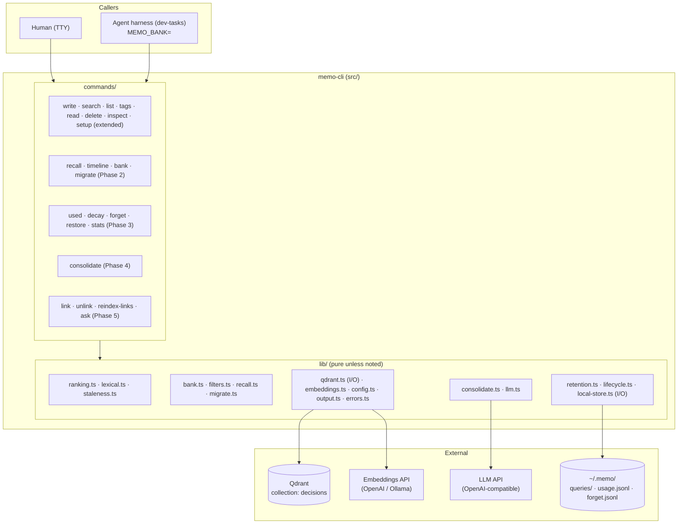
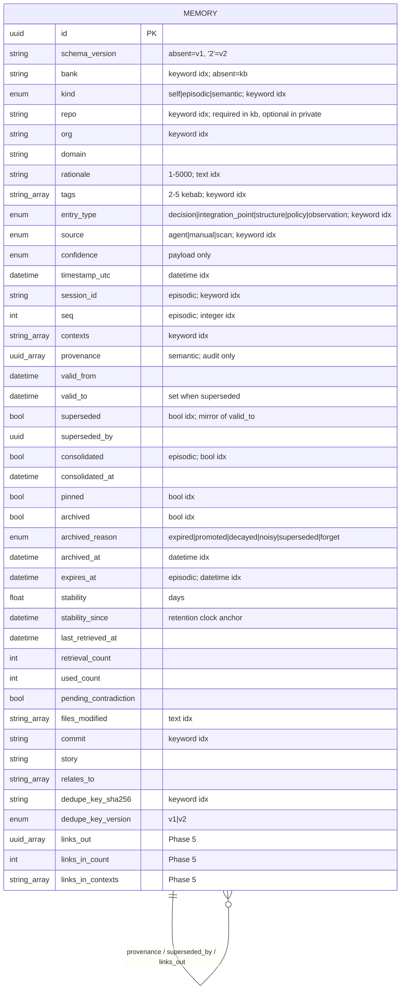
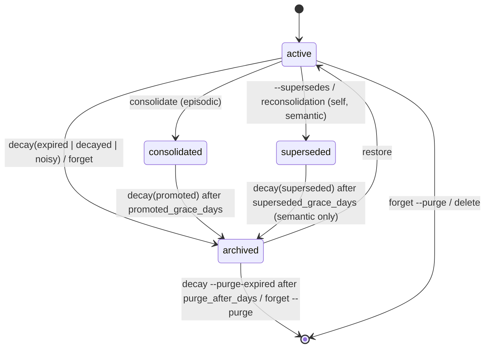

# Specification — PRD-004 Long-Lived Agent Memory

## Changelog

| Version | Date       | Summary                                                                                                                   | Author           |
| ------- | ---------- | ------------------------------------------------------------------------------------------------------------------------- | ---------------- |
| 1.1     | 2026-09-19 | Phase 1 stories: staleness annotation renamed `stale_by`; eval collection isolated via `MEMO_COLLECTION`.                 | product-engineer |
| 1.0     | 2026-09-19 | Initial specification for PRD-004 v1.3. Covers all five phases; Phases 1–3 at contract depth, Phases 4–5 at design depth. | product-engineer |

## 1. Executive Summary

PRD-004 is implemented as an additive v2 of the existing single-collection design: new indexed payload fields (`bank`, `kind`, session, validity, retention counters, archive state), a set of pure libraries (`ranking`, `lexical`, `retention`, `lifecycle`, `recall`, `migrate`, `consolidate`) that hold every rule from PRD-004 §2.4–§2.6 and §8, and thin Commander commands over them. `QdrantRepository` gains index reconciliation, paginated scroll, vector-bearing scroll, and batched payload updates; nothing else touches Qdrant. Local state that must survive processes (query snapshots, usage events, tombstones) lives as JSON lines under `~/.memo/`.

## 2. Reference Documents

- PRD: [`docs/requirements/prd-004-long-lived-agent-memory.md`](../docs/requirements/prd-004-long-lived-agent-memory.md) v1.3. §2.4–§2.6 (banks, kinds, deletion contract) and §8.2 (ranking) are normative.
- Superseded PRD: `docs/requirements/prd-002-search-ranking-retrieval.md` (history only).
- Ranking refinement: `workstream/issue-34-composite-ranking-score-refinement.md` (decisions D1–D9, defects DEF-1/DEF-2 still apply).
- Technical guidelines: `docs/technical-guidelines.md` §3 (patterns, no global state), §4 (CLI/output/exit codes/error catalog), §7 (data), §8 (integration, retry), §11 (testing), §12 (quality).
- Current data model: `docs/data-model.md`. Current flows: `docs/system-overview.md`.
- Consumer skill: `dev-tasks/.claude/skills/memo-cli-usage/SKILL.md` and agent prompts under `dev-tasks/.claude/agents/`, `dev-tasks/.claude/commands/`.

## 3. Affected Repositories

| Repository        | Role                            | Scope of Changes                                                                                                                                                                                                                                                                                  |
| ----------------- | ------------------------------- | ------------------------------------------------------------------------------------------------------------------------------------------------------------------------------------------------------------------------------------------------------------------------------------------------- |
| `llipe/memo-cli`  | CLI, storage adapter, all logic | Schema v2 (`src/types/entry.ts`, `src/types/config.ts`); new libs under `src/lib/`; new commands under `src/commands/`; `QdrantRepository` extensions; `~/.memo/` local store; eval harness under `tests/fixtures/relevance/` and `scripts/`; docs (`README.md`, `docs/*.md`).                    |
| `llipe/dev-tasks` | Consumer prompts and skill      | `memo-cli-usage` SKILL.md and REFERENCE.md; `developer`, `technical-writer` agents; `product-engineer`, `planner` commands: bank id per agent definition, `memo recall` at start, episodic writes to the agent bank, `memo used` and `memo decay` at close. Shipped with memo-cli Phases 2 and 3. |

## 4. System Architecture

The component diagram shows the target layering. Commands stay thin; every rule lives in a pure library; only `QdrantRepository` and `LocalStore` perform I/O.



### Key architectural decisions

| #   | Decision                                                                                                                                                                     | Rationale                                                                                                                                                 |
| --- | ---------------------------------------------------------------------------------------------------------------------------------------------------------------------------- | --------------------------------------------------------------------------------------------------------------------------------------------------------- |
| A1  | One collection; `bank` and `kind` are indexed payload keywords.                                                                                                              | Reuses `deleteByFilter`, facets, and filter builders; free-tier cost; PRD §12.                                                                            |
| A2  | Boolean mirrors for state: `archived`, `superseded`, `consolidated`, `pinned` are indexed booleans; datetimes (`archived_at`, `valid_to`, `consolidated_at`) carry the when. | Qdrant filters on booleans are exact and index-backed; avoids `is_null` semantics on v1 points. `must_not archived=true` passes points lacking the field. |
| A3  | Every rule is a pure function with injected `now` and returns a plan (`{ archive: [...], purge: [...] }`); commands execute plans.                                           | Deterministic, table-driven tests; `--dry-run` is "print the plan".                                                                                       |
| A4  | Lexical matching is an additive boost in the unified formula, not reciprocal rank fusion.                                                                                    | Qdrant `text` indexes give boolean token matches, not BM25 scores; a second ranked list would be synthetic. Candidate union + boost keeps one formula.    |
| A5  | Retention-based archive applies to `semantic` only; `episodic` archives on expiry or promotion.                                                                              | With `expires_at` already bounding episodes, a second clock adds no value and risks archiving "last session" before the next session.                     |
| A6  | `stability_since` anchors the retention clock for entries never retrieved.                                                                                                   | Without it, migration would compute a year of decay for legacy decisions and archive them on the first `memo decay`.                                      |
| A7  | Dedupe applies per kind: semantic keeps the story/commit key, episodic adds `seq`, `self` bypasses dedupe.                                                                   | A session writes many episodes with identical repo/story/source; the v1 key would flag every one as a duplicate.                                          |
| A8  | Query snapshots and logs are local JSON lines, not Qdrant points.                                                                                                            | Cheap, append-only, replayable, and keeps Qdrant to memories only. Cross-machine `memo used` is out of scope.                                             |
| A9  | The only LLM consumer is `memo consolidate` (and `memo ask` in Phase 5); both go through one `LLMAdapter`.                                                                   | PRD §7 cost discipline; adapter pattern from technical guidelines §8.                                                                                     |

## 5. Data Model & Database Design

### 5.1 Entity overview

One point type. New fields are optional at read time; v2 writes require `bank` and `kind`.



### 5.2 Zod schema (`src/types/entry.ts`)

`EntryPayloadSchema` becomes a v2 superset. Field groups and their write-time rules:

| Group     | Fields                                                                                                       | Rule                                                                                                                                                  |
| --------- | ------------------------------------------------------------------------------------------------------------ | ----------------------------------------------------------------------------------------------------------------------------------------------------- |
| identity  | `id`, `schema_version: '2'`, `bank`, `kind`                                                                  | `bank` kebab or UUID; `kind` enum; `kind = self` requires `bank !== 'kb'` (`superRefine`).                                                            |
| scope     | `repo`, `org`, `domain`                                                                                      | Required when `bank = kb`; optional in private banks (`superRefine`).                                                                                 |
| content   | `rationale`, `tags`, `entry_type`, `source`, `confidence`, `commit`, `story`, `files_modified`, `relates_to` | Unchanged constraints. `entry_type` gains `policy` (reserved for PRD-003) and `observation`.                                                          |
| episodic  | `session_id`, `seq`, `expires_at`, `consolidated`, `consolidated_at`                                         | `session_id` required when `kind = episodic`; `seq` integer ≥ 0; `consolidated` defaults `false`.                                                     |
| semantic  | `provenance`, `valid_from`, `valid_to`, `superseded`, `superseded_by`, `pinned`                              | `provenance` non-empty when `kind = semantic` and `source = agent` unless `--manual` set `source = manual`. `valid_from` defaults to `timestamp_utc`. |
| retention | `stability`, `stability_since`, `last_retrieved_at`, `retrieval_count`, `used_count`                         | Set by the write path from policy; never user-settable. Absent on `self`.                                                                             |
| archive   | `archived`, `archived_reason`, `archived_at`                                                                 | Default `false`; only `lifecycle` and `forget` set them.                                                                                              |
| links     | `links_out`, `links_in_count`, `links_in_contexts`                                                           | Phase 5.                                                                                                                                              |

Reads use `EntryPayloadSchema.partial().passthrough()` so v1 points and future fields survive.

### 5.3 Payload indexes

`PAYLOAD_INDEXES` (in `src/lib/qdrant.ts`) becomes the reconciliation source of truth:

| Field                                                  | Index    | Options                                                                       | Phase |
| ------------------------------------------------------ | -------- | ----------------------------------------------------------------------------- | ----- |
| existing 8                                             | as today |                                                                               | —     |
| `rationale`                                            | text     | `tokenizer: word`, `lowercase: true`, `min_token_len: 2`, `max_token_len: 20` | 1     |
| `files_modified`                                       | text     | same                                                                          | 1     |
| `bank`, `kind`, `session_id`, `contexts`, `entry_type` | keyword  |                                                                               | 2     |
| `seq`                                                  | integer  |                                                                               | 2     |
| `archived`, `superseded`, `consolidated`, `pinned`     | bool     |                                                                               | 2     |
| `archived_at`, `expires_at`, `valid_to`                | datetime |                                                                               | 2–3   |

The collection name resolves from `MEMO_COLLECTION` (default `decisions`) so the relevance harness can seed an isolated collection. `ensureCollection()` is split: `ensureCollection()` creates the collection when absent; `ensureIndexes()` reads `getCollection().payload_schema` and creates any index in `PAYLOAD_INDEXES` that is missing. Both are idempotent and run on every command that touches Qdrant (one extra `getCollection` call, already made today).

### 5.4 Config schema v2 (`src/types/config.ts`)

Additive blocks, all optional with defaults, `.passthrough()` preserved:

```ts
bank:          { default: KebabOrUuid.default('kb') }
banks:         { kb: BankPolicy, private: BankPolicy }        // per-kind policy, see §8.4
ranking:       { w_similarity, w_recency, w_source, recency_half_life_days, tag_boost_factor,
                 lexical_boost_factor, lexical: boolean, confidence_thresholds,
                 staleness_threshold_days, staleness_tag_overlap_threshold, use_beta, link_alpha }
retention:     { min_spacing_hours, base_gain, used_bonus, max_stability_days,
                 archive_threshold, noisy_min_retrievals, noisy_max_use_ratio, feedback_window_days }
consolidation: { min_episodes, min_contexts, min_span_days, cluster_similarity,
                 duplicate_similarity, model, promote_to_kb }
```

`superRefine` rules: weights sum to `1.0 ± 0.001`, each in `[0,1]`; thresholds strictly ordered `exact > high > medium`; half-life and stabilities `> 0`; `purge_after_days` on `banks.kb.*` must be explicit (no default). Invalid config fails `loadConfig` (fail fast, #34 D7) and `memo setup validate`.

### 5.5 Migration strategy

No collection or vector change. `memo migrate --to-v2` is a paginated scroll (`scrollAll`, batch 256) that, per point lacking `schema_version = '2'`, computes the FR-2.8 rule result and issues one `batchUpdate` of `set_payload` operations per batch. Idempotent by construction. `--dry-run` runs the same planner and prints counts per rule. The planner is `src/lib/migrate.ts: planMigration(points, now, rules) -> MigrationPlan` (pure).

Migration sets for every point: `schema_version`, `bank = 'kb'`, `kind`, `consolidated = false`, `archived = false`, `superseded = false`, `pinned = false`, `retrieval_count = 0`, `used_count = 0`, `stability` (policy initial for its kind), `stability_since = now`, `dedupe_key_version` unchanged (v1 keys remain valid), and for rule 1: `session_id = story ?? 'legacy'`, `expires_at = timestamp_utc + banks.kb.episodic.expires_in_days`; for rule 2: `valid_from = timestamp_utc`.

## 6. API Design

The CLI is the API. Every command supports `--json`; exit codes follow the catalog (0 / 1 / 2). Unchanged flags keep their meaning. New shared flags:

| Flag                                         | Commands                              | Semantics                                                                                                                           |
| -------------------------------------------- | ------------------------------------- | ----------------------------------------------------------------------------------------------------------------------------------- |
| `--bank <id>`                                | all data commands                     | Bank selector; resolution `--bank` → `MEMO_BANK` → `config.bank.default` → `kb`.                                                    |
| `--kind <k>`                                 | write, search, list, tags, forget     | `self \| episodic \| semantic \| all`. Search/list default `all` minus `self`.                                                      |
| `--session <id>`                             | write, timeline, forget, search, list | Episodic session grouping.                                                                                                          |
| `--include-archived`, `--include-superseded` | search, list, tags, read              | Lift the default exclusion.                                                                                                         |
| `--as-of <date>`                             | search, list                          | Semantic entries valid at that instant: `valid_from <= as_of` and (`valid_to` absent or `> as_of`). Implies `--include-superseded`. |
| `--dry-run`                                  | decay, forget, migrate, consolidate   | Plan only; nothing written; exit 0.                                                                                                 |

### 6.1 Command contracts by phase

**Phase 1**

| Command                     | Change                                                                                                                                                                                                                                                                                                                                                                                                                                                                                                                       |
| --------------------------- | ---------------------------------------------------------------------------------------------------------------------------------------------------------------------------------------------------------------------------------------------------------------------------------------------------------------------------------------------------------------------------------------------------------------------------------------------------------------------------------------------------------------------------- |
| `memo search <query>`       | Over-fetch `max(limit, min(limit*3, 50))` dense; if `ranking.lexical` and identifier tokens exist, one lexical scroll (§8.2) with vectors; union; rank via `rankResults`; slice. Adds `--explain`, `--lexical <on\|off>`. JSON adds `query_id`, per-result `final_score`, `similarity`, `recency_score`, `source_score`, `tag_boost`, `lexical_boost`, `confidence_tier`, `stale?`, `stale_by?`, and with `--explain` a `factors` object. Human output shows `final_score` % in the existing position and a `[tier]` prefix. |
| `memo setup validate`       | Validates `ranking` block.                                                                                                                                                                                                                                                                                                                                                                                                                                                                                                   |
| `scripts/eval-relevance.ts` | `pnpm run eval:relevance [--record]` (§14).                                                                                                                                                                                                                                                                                                                                                                                                                                                                                  |

**Phase 2**

| Command                                                                             | Contract                                                                                                                                                                                                                                                                                                                     |
| ----------------------------------------------------------------------------------- | ---------------------------------------------------------------------------------------------------------------------------------------------------------------------------------------------------------------------------------------------------------------------------------------------------------------------------- |
| `memo write`                                                                        | New flags `--bank`, `--kind`, `--session`, `--seq`, `--context` (repeatable), `--provenance <csv>`, `--manual`, `--supersedes <id>`, `--pin`, `--expires-in <duration>`. Defaults per PRD K1. Auto-`seq` when `--session` given without `--seq` (one scroll ordered by `seq` desc, limit 1). JSON result adds all v2 fields. |
| `memo search`, `memo list`, `memo tags list`                                        | New shared flags. Base filter from `buildBaseFilter` (§8.1) composed with existing builders.                                                                                                                                                                                                                                 |
| `memo read --id`                                                                    | Prints v2 fields; provenance ids annotated `(deleted)` when `getById` misses.                                                                                                                                                                                                                                                |
| `memo timeline --bank <id> [--session <id>] [--last <n>] [--since <date>] [--json]` | Scroll `kind = episodic` ordered by `seq` asc when `--session`, else by `timestamp_utc` desc grouped by session; never ranked. JSON: `{ bank, session_id?, entries: [...], count }`.                                                                                                                                         |
| `memo recall "<task>" [--bank] [--scope] [--max-tokens <n>] [--json]`               | §8.5. JSON: `{ query_id, bank, budget: { max_tokens, used_tokens }, sections: { self: [], policies: [], shared: [], mine: [], last_session: { session_id, entries: [] }, conflicts: [] }, truncated: string[] }`.                                                                                                            |
| `memo bank init --id <id> [--rationale <text>] [--tags <csv>] [--json]`             | Writes the first `self` entry (`entry_type = structure`, `source = manual`, tags default `bank,self`), sets `config.bank.default` if unset. Second run: prints existing, writes nothing.                                                                                                                                     |
| `memo bank list [--json]`, `memo bank show --id <id> [--json]`                      | Facet scroll on `bank` (reuses `facets.ts`); `show` prints valid `self` entries newest first plus counts per kind and last `session_id`.                                                                                                                                                                                     |
| `memo migrate --to-v2 [--dry-run] [--rules <file>] [--json]`                        | §5.5. JSON: `{ scanned, migrated, skipped, by_rule: { "1": n, "2": n }, dry_run }`.                                                                                                                                                                                                                                          |
| `memo inspect`                                                                      | Adds a `banks` facet (counts only).                                                                                                                                                                                                                                                                                          |

**Phase 3**

| Command                                                                                                                       | Contract                                                                                                                                                                                                                                                                                                                           |
| ----------------------------------------------------------------------------------------------------------------------------- | ---------------------------------------------------------------------------------------------------------------------------------------------------------------------------------------------------------------------------------------------------------------------------------------------------------------------------------- |
| `memo used --query <id> --ids <csv> [--wrong <csv>] [--json]`                                                                 | Loads snapshot; ids ⊄ snapshot → `VALIDATION_FAILED`; unknown/expired query → `QUERY_NOT_FOUND` (exit 1). Batch update: `used_count += 1`, `stability = min(cap, stability * (1 + used_bonus))`; `--wrong`: `pending_contradiction = true`. Appends usage events. JSON: `{ query_id, used: [...], wrong: [...], events_written }`. |
| `memo search` / `memo recall`                                                                                                 | After ranking, one `batchUpdate` on returned ids (not over-fetched ones): `retrieval_count += 1`; if spaced, `stability *= base_gain` (capped), `last_retrieved_at = now`. `self` excluded. Failure logged under `MEMO_DEBUG`, never fatal.                                                                                        |
| `memo decay [--bank <id>] [--dry-run] [--purge-expired] [--verbose] [--json]`                                                 | §8.4. JSON: `{ bank, dry_run, archived: { by_kind_reason: {...}, ids?: [] }, purged: { count, ids?: [] }, skipped: { self, pinned } }`.                                                                                                                                                                                            |
| `memo forget [--id] [--session] [--bank] [--kind] [--older-than <dur>] [--tags <csv>] [--dry-run] [--purge] [--yes] [--json]` | AND of selectors; at least one required. Default = archive with reason `forget`. `--purge` = delete + tombstones. Guards: PRD D5. JSON: `{ selector, dry_run, action: "archive"\|"purge", count, ids }`.                                                                                                                           |
| `memo restore --id <id> [--json]`                                                                                             | Clears `archived*`; `ENTRY_NOT_FOUND` if absent.                                                                                                                                                                                                                                                                                   |
| `memo stats [--bank <id>] [--json]`                                                                                           | Counts per kind and state, stability histogram (buckets 1/7/30/90/365+), top 10 by `use_ratio`, noisy list, tombstone counts.                                                                                                                                                                                                      |

**Phase 4**

| Command                                                                                                                   | Contract                                                                                                       |
| ------------------------------------------------------------------------------------------------------------------------- | -------------------------------------------------------------------------------------------------------------- |
| `memo consolidate --bank <id> [--dry-run] [--limit <n>] [--since <date>] [--promote-to kb] [--yes] [--report json\|text]` | §8.6. Report: clusters, candidates, promoted, duplicates, held, contradicted, skipped, tokens, estimated cost. |

**Phase 5**: `memo link`, `memo unlink`, `memo reindex-links`, `memo search --expand`, `memo ask` per PRD FR-5.x; contracts specified in that phase's spec revision.

### 6.2 JSON response examples

`memo search --json` (Phase 1 additions only):

```json
{
  "query": "why does search-filters.ts build should clauses",
  "query_id": "6f1c…",
  "filters": { "scope": "repo", "repo": "memo-cli", "limit": 5 },
  "results": [
    {
      "id": "…",
      "rationale": "…",
      "tags": ["search", "qdrant", "filters"],
      "similarity": 0.71,
      "recency_score": 0.93,
      "source_score": 1.0,
      "tag_boost": 0.017,
      "lexical_boost": 0.15,
      "final_score": 0.88,
      "confidence_tier": "exact"
    }
  ],
  "count": 1
}
```

`memo recall --json` (abridged):

```json
{
  "query_id": "9a2e…",
  "bank": "jarvis-memory",
  "budget": { "max_tokens": 2000, "used_tokens": 1740 },
  "sections": {
    "self": [{ "id": "…", "rationale": "I am the planner for llipe repos…", "valid_from": "…" }],
    "policies": [],
    "shared": [{ "id": "…", "final_score": 0.84, "confidence_tier": "high", "rationale": "…" }],
    "mine": [{ "id": "…", "final_score": 0.79, "confidence_tier": "high", "rationale": "…" }],
    "last_session": {
      "session_id": "ISSUE-41",
      "entries": [{ "id": "…", "seq": 1, "rationale": "…" }]
    },
    "conflicts": []
  },
  "truncated": ["conflicts"]
}
```

`memo decay --json`:

```json
{
  "bank": "jarvis-memory",
  "dry_run": false,
  "archived": {
    "episodic": { "expired": 12, "promoted": 4 },
    "semantic": { "decayed": 1, "noisy": 0, "superseded": 2 }
  },
  "purged": { "count": 9 },
  "skipped": { "self": 3, "pinned": 1 }
}
```

### 6.3 Sequence: recall → used → decay

```mermaid
sequenceDiagram
  participant A as Agent harness
  participant C as memo recall
  participant R as recall.ts
  participant Q as QdrantRepository
  participant S as LocalStore (~/.memo)
  A->>C: memo recall "plan #42" --bank jarvis-memory --json
  C->>Q: scroll self (bank, kind=self, superseded=false)
  C->>Q: query kb semantic (vector, base filter) + lexical scroll
  C->>Q: query bank semantic
  C->>Q: scroll bank episodic, last session (seq asc)
  C->>Q: scroll bank pending_contradiction=true
  C->>R: assemble(sections, budget)
  R-->>C: bundle (dedup, trimmed bottom-up, SELF intact)
  C->>S: write queries/<query_id>.json {ids}
  C->>Q: batchUpdate retrieval counters (best effort)
  C-->>A: JSON bundle + query_id
  A->>C: memo used --query <id> --ids a,b
  C->>S: read snapshot; validate ids ⊆ snapshot
  alt ids not in snapshot
    C-->>A: exit 1 VALIDATION_FAILED
  else
    C->>Q: batchUpdate used_count, stability
    C->>S: append usage.jsonl
    C-->>A: exit 0
  end
  A->>C: memo decay --bank jarvis-memory --json
  C->>Q: scrollAll bank (all kinds except self)
  C->>C: lifecycle.planDecay(entries, policy, now)
  C->>Q: batchUpdate archive set; delete purge set
  C->>S: append forget.jsonl tombstones for purged
  C-->>A: counts
```

## 7. Authentication & Authorization Design

Unchanged from technical guidelines §5: no auth layer; Qdrant and provider credentials via env. Banks are a namespace, not a boundary. Guard matrix for irreversible operations:

| Operation                              | TTY                      | `--yes`   | `--json`                        |
| -------------------------------------- | ------------------------ | --------- | ------------------------------- |
| `memo forget` (archive)                | confirm                  | proceeds  | proceeds                        |
| `memo forget --purge --id / --session` | confirm                  | proceeds  | proceeds                        |
| `memo forget --purge --bank / other`   | confirm                  | proceeds  | `VALIDATION_FAILED`             |
| `memo decay --purge-expired`           | proceeds (policy-driven) | proceeds  | proceeds (never purges in `kb`) |
| `memo delete` (existing)               | unchanged                | unchanged | unchanged (single only)         |

Local files under `~/.memo/` are created with mode `0600`; the directory with `0700`.

## 8. Business Logic Implementation

### 8.1 Bank and base filter (`src/lib/bank.ts`, `src/lib/filters.ts`)

```ts
resolveBank(flag?, env = process.env, config?) -> string          // PRD B3
isPrivateBank(bank) -> bank !== 'kb'
policyFor(config, bank, kind) -> KindPolicy                         // banks.kb|private[kind]
defaultKind(bank) -> bank === 'kb' ? 'semantic' : 'episodic'       // PRD K1
buildBaseFilter({ bank, kind, includeArchived, includeSuperseded, asOf, session }) -> QdrantFilter
```

`buildBaseFilter` produces:

- bank `kb`: `must: [{ should: [ { key: 'bank', match: { value: 'kb' } }, { is_empty: { key: 'bank' } } ] }]` (v1 points count as `kb` until migrated); private bank: `must: [{ key: 'bank', match: { value } }]`.
- kind: `all` → `must_not: [{ key: 'kind', match: { value: 'self' } }]`; a specific kind → `must` match. Points lacking `kind` (v1) are treated as semantic by the reader and pass the `all` filter.
- default exclusions: `must_not: [{ key: 'archived', match: { value: true } }, { key: 'superseded', match: { value: true } }]` unless lifted.
- `asOf`: `must: [{ key: 'valid_from', range: { lte: asOf } }]` plus `should: [{ is_empty: { key: 'valid_to' } }, { key: 'valid_to', range: { gt: asOf } }]`.

Existing `buildSearchFilters` / `buildListFilters` keep their signatures; commands merge the base filter's `must`/`must_not`/`should` arrays with theirs. The `repo` clause is added only when `bank = kb` or the caller passes `--repo`.

### 8.2 Ranking (`src/lib/ranking.ts`, `src/lib/lexical.ts`, `src/lib/staleness.ts`)

Pure, `now` injected, no I/O. Implements PRD §8.2 with neutral defaults.

```ts
computeRecencyScore(timestampUtc, now, halfLifeDays)     // exp(-ln2/halfLife * ageDays); NaN → 0; future → 1
computeSourceScore(source)                                // agent 1.0, manual 0.8, scan 0.5, unknown 0.5
computeTagBoost(query, tags, factor)                      // #36: whole-word, case-insensitive, stopwords removed
computeLexicalBoost(identifierTokens, rationale, files, factor) // matched / total identifier tokens * factor
computeRetention(entry, now)                               // exp(-t / stability); t from last_retrieved_at ?? stability_since ?? timestamp_utc; absent stability → 1
computeUseRatio(entry)                                     // used_count / max(retrieval_count, 1); absent → 0
computeCompositeScore(parts, config) -> { final_score, factors }
computeConfidenceTier(finalScore, thresholds)
rankResults(candidates, { query, config, now }) -> Ranked[]   // sorts by final_score desc, timestamp desc, id asc
```

Lexical candidate retrieval (Phase 1, command-side, one Qdrant call):

1. `extractIdentifierTokens(query)`: tokens matching any of: contains `.`, `/`, `-`, `_`; matches `#\d+` or `[A-Z]+-\d+`; starts with `--`; or is a CamelCase word. Tokenize each into word tokens the same way Qdrant's `word` tokenizer does (lowercase, split on non-alphanumerics), dropping tokens shorter than 2.
2. If none: skip lexical. Else scroll with `should` (`min_should: 1`) of `{ key: 'rationale' | 'files_modified', match: { text: <original identifier> } }` per identifier, base filter applied, `limit 50`, `with_vector: true`.
3. For lexical-only candidates, `similarity = cosine(queryVector, pointVector)` computed locally. Dense candidates keep Qdrant's score. Union by id.
4. `lexical_boost` per candidate = fraction of identifiers whose tokens all appear in `rationale ∪ files_modified` × `lexical_boost_factor` (default 0.15). Dense-only candidates get the same computation (may be 0).

Composite:

```
base    = w_sim*clamp01(sim) + w_rec*recency + w_src*source
boosted = min(1, base + tag_boost + lexical_boost)
final   = min(1, boosted * (0.5 + 0.5*retention) * (1 + use_beta*use_ratio) * (1 + link_alpha*log(1+links_in)*diversity))
```

Staleness (`detectStaleness`, #38): one scroll of same-bank, same-repo, non-archived candidates per invocation, cached; flag `stale` + `stale_by` (the superseder's id; deliberately distinct from the Phase 2 stored `superseded_by`) when age > threshold and a newer entry has Jaccard tag overlap ≥ threshold. Annotation only.

### 8.3 Write path (`src/commands/write.ts`)

1. Resolve bank, kind, policy. Validate PRD K1–K3 before any I/O.
2. `--supersedes <id>`: `getById`; same bank and same kind required (`VALIDATION_FAILED`); after the new point is stored, `setPayload` on the old: `valid_to = now`, `superseded = true`, `superseded_by = newId`.
3. Retention fields from policy: `stability = policy.initial_stability_days`, `stability_since = now`, counters 0; omitted for `self`.
4. Episodic: `expires_at = now + (--expires-in ?? policy.expires_in_days)`; auto-`seq` when absent.
5. Dedupe (A7): semantic → `v2|bank|repo|commit|story|na|semantic|entry_type|source`; episodic → `v2|bank|repo|commit|story|session|seq|episodic|entry_type|source`; self → `sha256('self|' + id)` (never matches). Existing consolidate/update/replace/create-new actions unchanged.
6. Embed and upsert as today. JSON result includes the full v2 payload.

### 8.4 Lifecycle (`src/lib/retention.ts`, `src/lib/lifecycle.ts`)

State machine implemented by `lifecycle.planDecay(entries, policies, now, feedbackActive) -> DecayPlan` where `DecayPlan = { archive: { id, reason }[], purge: id[], skipped: { self, pinned } }`.



Decision table (evaluated in order; first match wins; `self` and `pinned` skipped before evaluation):

| Kind         | Condition                                                                                         | Action  | Reason       |
| ------------ | ------------------------------------------------------------------------------------------------- | ------- | ------------ |
| episodic     | `consolidated && consolidated_at + promoted_grace_days < now`                                     | archive | `promoted`   |
| episodic     | `expires_at < now`                                                                                | archive | `expired`    |
| semantic     | `superseded && valid_to + superseded_grace_days < now`                                            | archive | `superseded` |
| semantic     | `retention < archive_threshold`                                                                   | archive | `decayed`    |
| semantic     | `policy.archive_noisy && feedbackActive && retrieval_count >= noisy_min && use_ratio < noisy_max` | archive | `noisy`      |
| any archived | `policy.purge_after_days != null && archived_at + purge_after_days < now` and `--purge-expired`   | purge   | —            |

`feedbackActive` = the bank has at least one usage event within `retention.feedback_window_days` (default 30) in `~/.memo/usage.jsonl`. Without feedback, the noisy rule is inert (every entry would otherwise look unused).

Retrieval update (`retention.applyRetrieval(entry, now, config)`): `retrieval_count += 1`; spaced iff `last_retrieved_at` absent or `now - last_retrieved_at >= min_spacing_hours`; if spaced: `stability = min(max_stability_days, stability * base_gain)`, `last_retrieved_at = now`. `applyUsed(entry)`: `used_count += 1`, `stability = min(cap, stability * (1 + used_bonus))`.

Policy defaults (`banks.<type>.<kind>`), refined from PRD §8.4 by A5/A6:

| Bank type / kind   | `initial_stability_days` | `expires_in_days` | `archive_threshold` | `archive_noisy` | `promoted_grace_days` | `superseded_grace_days` | `purge_after_days` |
| ------------------ | ------------------------ | ----------------- | ------------------- | --------------- | --------------------- | ----------------------- | ------------------ |
| private / self     | —                        | —                 | —                   | —               | —                     | —                       | —                  |
| private / episodic | 3                        | 30                | — (ranking only)    | —               | 7                     | —                       | 30                 |
| private / semantic | 30                       | —                 | 0.05                | true            | —                     | 30                      | 90                 |
| kb / episodic      | 3                        | 90                | — (ranking only)    | —               | 7                     | —                       | null               |
| kb / semantic      | 90                       | —                 | 0.05                | false           | —                     | 30                      | null               |

With these values a `kb` decision never retrieved is archived after ~270 days from its `stability_since` (`exp(-270/90) = 0.05`), a private lesson after ~90 days, and every spaced retrieval multiplies the horizon by 1.6.

### 8.5 Recall assembly (`src/lib/recall.ts`)

`assembleRecall(inputs, budget) -> RecallBundle`, pure. Inputs are the five candidate lists plus policies. Section caps before trimming: `self` all (warn above 50), `policies` all, `shared` 8, `mine` 5, `last_session` 15 (most recent by `seq`), `conflicts` 5. Token estimate = `ceil(chars / 4)` of the rendered entry line (JSON: `rationale` + ids + scores). Trimming order until under budget: `conflicts` → `last_session` (drop oldest first) → `mine` → `shared` → `policies`; `self` never. Default `--max-tokens` 2000. Ids deduplicated across sections in section order. The snapshot written to `~/.memo/queries/` contains the union of ids so `memo used` accepts any of them.

### 8.6 Consolidation (`src/lib/consolidate.ts`, `src/lib/llm.ts`, `src/adapters/openai-llm.ts`) — Phase 4

Pipeline per PRD FR-4.1, implemented as pure planning steps around two I/O boundaries (Qdrant, LLM):

1. `select`: `scrollAll` episodic, `consolidated = false`, `archived = false`, optional `--since`, `with_vector: true`, cap `--limit` (default 500).
2. `cluster` (pure): greedy single-linkage over cosine ≥ `cluster_similarity` (0.80) with a shared tag or context required; emit clusters with `episodes`, `contexts`, `span_days`.
3. `gate1` (pure): keep clusters with `episodes >= min_episodes`, `distinct contexts >= min_contexts`, `span_days >= min_span_days`. Others stay unconsolidated.
4. `propose` (LLM): prompt = cluster episodes (id, timestamp, context, rationale) + up to 3 nearest valid semantic facts of the same bank; strict JSON out: `{ candidates: [{ content, evidence: [ids], contradicts: [ids], confidence: high|medium|low }] }`. Parse failure → one retry → cluster marked `held`.
5. `gate2` (pure): drop candidates with `evidence ⊄ cluster ids` or empty; drop candidates whose `contradicts` names ids not in the provided facts.
6. `dedupe` (embedding): candidate embedded; if a valid semantic fact in the bank has cosine ≥ `duplicate_similarity` (0.92) and no contradiction: append the evidence ids to that fact's `provenance`, mark episodes consolidated, count as `duplicate`.
7. `write`: promoted → new semantic point (`source = agent`, `provenance = evidence`, `valid_from = now`, `contexts` union, tags from cluster top-5, confidence tier from candidate confidence); contradictions with `>= 2` contexts → supersede old facts (§8.3 step 2); single-context contradiction → new point with `pending_contradiction = true`, lowest tier, no supersede.
8. `mark`: `consolidated = true`, `consolidated_at = now` on cluster episodes via `batchUpdate`.
9. `report`: every cluster and candidate with the rule that decided it, plus `usage.total_tokens` and `estimated_cost_usd` from a per-model price table in config (`consolidation.price_per_1k_tokens`, default unset → cost reported as `null`).

`--promote-to kb`: runs steps 1–6 over the bank's `semantic` entries not yet tagged `promoted-to:kb` instead of episodes, writes candidates to `workstream/memo-promotions-<date>.md` (review) or to `kb` (`--yes` / `auto`), and tags the source fact `promoted-to:kb`.

`LLMAdapter`: `complete(prompt, { json: true, maxTokens }) -> { text, usage }`; `createLLMAdapter()` selects by `LLM_PROVIDER` (`openai` default via the existing SDK; `ollama` via `baseURL = OLLAMA_BASE_URL`, key optional). Uses `withRetry`.

### 8.7 Validation rules summary

| Rule                                                | Enforced in                      | Error                             |
| --------------------------------------------------- | -------------------------------- | --------------------------------- |
| `kind = self` in `kb`                               | `EntryPayloadSchema.superRefine` | `VALIDATION_FAILED`               |
| `repo/org/domain` missing in `kb`                   | write command (as today)         | `REPO_CONTEXT_UNRESOLVED`         |
| episodic without `session_id`                       | schema                           | `VALIDATION_FAILED`               |
| agent semantic without provenance and no `--manual` | schema                           | `VALIDATION_FAILED`               |
| `--supersedes` target other bank/kind               | write command                    | `VALIDATION_FAILED`               |
| `memo used` ids outside snapshot                    | used command                     | `VALIDATION_FAILED`               |
| `memo used` unknown/expired query                   | used command                     | `QUERY_NOT_FOUND` (new, exit 1)   |
| `forget --purge` bank-wide in `--json`              | forget command                   | `VALIDATION_FAILED`               |
| invalid `ranking`/`banks`/`retention` config        | `MemoConfigSchema`               | `CONFIG_INVALID`                  |
| LLM call failure after retries                      | `openai-llm.ts`                  | `LLM_API_ERROR` (new, exit 2)     |
| `~/.memo` unwritable                                | `local-store.ts`                 | `LOCAL_STORE_ERROR` (new, exit 2) |

## 9. Integration Details

| Integration | Method                                                                                                                                                                                                                                                                                                                  | Failure handling                                                                                       |
| ----------- | ----------------------------------------------------------------------------------------------------------------------------------------------------------------------------------------------------------------------------------------------------------------------------------------------------------------------- | ------------------------------------------------------------------------------------------------------ |
| Qdrant      | `QdrantRepository` additions: `ensureIndexes()`, `scrollAll(filter, { batch, withVector, orderBy })` (offset pagination), `scroll(..., { withVector })`, `count(filter)`, `batchUpdate(ops: SetPayloadOp[])` (`points/batch`), `setPayload(id, payload)`. Existing methods unchanged. Commands never import the client. | `withRetry` (3 attempts, 500 ms base); `QDRANT_OPERATION_FAILED`; counter updates are best-effort.     |
| Embeddings  | Unchanged adapter; `recall` embeds the task once and reuses the vector for both semantic queries.                                                                                                                                                                                                                       | `EMBEDDING_API_ERROR`.                                                                                 |
| LLM         | `LLMAdapter` (Phase 4/5) over the `openai` SDK; Ollama via `baseURL`.                                                                                                                                                                                                                                                   | `withRetry`; JSON parse retry once; `LLM_API_ERROR`.                                                   |
| Local store | `src/lib/local-store.ts`: `MEMO_HOME` (default `~/.memo`); `writeQuerySnapshot`, `readQuerySnapshot`, `pruneSnapshots(ttlDays)`, `appendUsage`, `appendTombstone`, `readUsage(bank, sinceDays)`; JSON lines; `0600`/`0700`.                                                                                             | `LOCAL_STORE_ERROR`; snapshot write failure in `search` degrades to a warning (search still succeeds). |
| dev-tasks   | `MEMO_BANK` exported by the harness from the agent definition; skill documents the session protocol: `recall` → work (episodic writes) → `used` → `decay`.                                                                                                                                                              | If `memo` missing or unconfigured, existing skip/ask behavior stands.                                  |

## 10. User Interface & Client Behavior

CLI only; technical guidelines §4 color policy applies.

- `memo search` human: `[exact] memo-cli  88%  Lead sentence…` then metadata, then `⚠ STALE — superseded by <id>` when flagged; `--explain` appends an aligned table `sim recency source tag lex retention use final`.
- `memo recall` human: uppercase section headers, one line per entry (`[tier] score  lead  id`); `SELF` lines omit tier and score; `LAST SESSION` prefixed by `seq`; footer `budget: 1740/2000 tokens · truncated: conflicts`.
- `memo timeline` human: `seq  timestamp  lead  id` in order.
- `memo decay`/`memo forget --dry-run` human: selector line, per-kind/reason counts table, up to 20 sample ids per class, `nothing written` footer.
- `memo bank show` human: `self` entries newest first, then counts per kind and state.
- Confirmation prompts reuse `delete.ts`'s `defaultConfirm` (extracted to `src/lib/confirm.ts`).

## 11. Performance & Scalability Approach

| Path          | Calls                                                                                          | Target                         |
| ------------- | ---------------------------------------------------------------------------------------------- | ------------------------------ |
| `search`      | 1 embed, 1 dense query, ≤1 lexical scroll, ≤1 staleness scroll (cached), 1 batch update        | < 2.5 s                        |
| `recall`      | 1 embed, 2 dense queries, ≤1 lexical scroll, 3 scrolls (self, session, conflicts), 1 batch     | < 4 s                          |
| `decay`       | `scrollAll` (256/page), 1 batch update per page, ≤1 delete                                     | < 30 s at 10K entries per bank |
| `consolidate` | `scrollAll` with vectors, O(n²) cosine clustering capped by `--limit` 500, ≤1 LLM call/cluster | offline; progress on stderr    |
| `migrate`     | `scrollAll`, 1 batch update per page                                                           | < 60 s at 10K entries          |

Ranking is O(n) over ≤ 100 candidates. `ensureIndexes` adds one `getCollection` (already performed). No caching beyond per-invocation memoization.

## 12. Security Implementation

- Credentials only from env (unchanged). Local store never contains rationale text for usage/tombstone records; query snapshots contain ids and the query string only.
- File modes `0600`/`0700`; `MEMO_HOME` override for tests and CI.
- No shell execution; bank ids validated as kebab or UUID before use in filters or file names (`queries/<uuid>.json` only).
- Consolidation prompts contain memory text only; the LLM response is validated as JSON and by id membership before any write.
- Audit: every purge tombstoned (PRD D2); `memo stats` surfaces counts.

## 13. Error Handling & Logging

- New codes in `src/lib/errors.ts`: `QUERY_NOT_FOUND` (1), `LLM_API_ERROR` (2), `LOCAL_STORE_ERROR` (2). Catalog in `docs/technical-guidelines.md` §4 updated.
- Best-effort paths (retrieval counters, snapshot pruning) never change exit code; failures go to `debugLog`.
- `--json` errors keep `{ "error", "code" }` on stderr.
- `memo decay` and `memo consolidate` print progress to stderr only when not `--json`.

## 14. Testing Strategy

`TESTING.md` is an unfilled placeholder; `qa-engineer` fills it in Phase 1. Until then the technical guidelines §11 pyramid applies.

| Layer                             | Scope                                                                                                                                                                                                                                                                                                                                                                                                                                                                                                                                                        | Mocks                                                      |
| --------------------------------- | ------------------------------------------------------------------------------------------------------------------------------------------------------------------------------------------------------------------------------------------------------------------------------------------------------------------------------------------------------------------------------------------------------------------------------------------------------------------------------------------------------------------------------------------------------------ | ---------------------------------------------------------- |
| Unit (`tests/unit/lib`)           | `ranking` (decay table from #34 refinement incl. DEF-2 values, tie-break, clamps), `lexical` (identifier extraction, tokenization parity, boost), `staleness`, `retention` (spacing, cap, `stability_since` anchor), `lifecycle` (every row of the §8.4 table, `self`/`pinned` skip, feedbackActive gating, purge only when `--purge-expired`), `recall` (caps, trimming order, SELF intact, dedup), `migrate` (rules, idempotency), `bank`/`filters` (filter shapes incl. `is_empty`), `consolidate` gates with canned LLM JSON, config schema refinements. | none (pure)                                                |
| Unit (`tests/unit/commands`)      | flag parsing, defaults, guard matrix (§7), JSON envelopes, exit codes.                                                                                                                                                                                                                                                                                                                                                                                                                                                                                       | `QdrantRepository`, embeddings, `LocalStore`, `LLMAdapter` |
| Integration (`tests/integration`) | command flows against a mocked repository: write→supersede→as-of; search over-fetch and union; recall→used→decay end-to-end with a temp `MEMO_HOME`; migrate dry-run vs real.                                                                                                                                                                                                                                                                                                                                                                                | boundary mocks per guidelines                              |
| Relevance replay (Jest)           | `tests/fixtures/relevance/candidates.json` records, per eval query, the dense candidates (ids + Qdrant scores) and lexical hits from one live run; a test replays `rankResults` and asserts top-3 hit rate ≥ recorded baseline. Deterministic, no network.                                                                                                                                                                                                                                                                                                   | none                                                       |
| Relevance live (script)           | `pnpm run eval:relevance` runs the eval queries against a real Qdrant + embeddings seeded from `tests/fixtures/relevance/entries.json`; `--record` refreshes `candidates.json` and `baseline.json`. Run manually before merging ranking changes and at phase exit.                                                                                                                                                                                                                                                                                           | none                                                       |
| Manual E2E                        | real Qdrant + real provider before each release (as today).                                                                                                                                                                                                                                                                                                                                                                                                                                                                                                  | none                                                       |

Coverage: overall ≥ 80%, `lib/` ≥ 85%. Every PRD acceptance criterion maps to at least one test in the story-level test plans (`verifier` Design Mode).

## 15. Deployment & Rollout

| Phase | Version | Steps                                                                                                                         | Rollback                                                                                                                                  |
| ----- | ------- | ----------------------------------------------------------------------------------------------------------------------------- | ----------------------------------------------------------------------------------------------------------------------------------------- |
| 1     | 1.2.0   | Publish; `ensureIndexes` adds text indexes on first run; record baseline in PRD changelog.                                    | Reinstall 1.1.x; indexes are harmless.                                                                                                    |
| 2     | 1.3.0   | Publish; users run `memo migrate --to-v2 --dry-run` then real; dev-tasks release adds `MEMO_BANK`, `recall`, episodic writes. | Reinstall 1.2.x; v2 fields ignored; v1 filters still match (`bank` absent treated as `kb` only by 1.3, so 1.2 sees all points as before). |
| 3     | 1.4.0   | Publish; dev-tasks release adds `used` and `decay` at session close; recommend weekly `memo decay --bank kb` cron.            | Reinstall 1.3.x; archived flags ignored by 1.3? No: 1.3 already excludes `archived = true`. Restore via 1.4 `memo restore` if needed.     |
| 4     | 1.5.0   | Publish; `consolidate` opt-in, `--dry-run` first; `promote_to_kb = review` default.                                           | Reinstall 1.4.x; promoted facts remain as ordinary semantic entries.                                                                      |
| 5     | 1.6.0   | Optional.                                                                                                                     | —                                                                                                                                         |

No feature flags; behavior is config-driven and additive. Semver minor per phase; no major bump.

## 16. Dependencies & Risks

| Risk                                                                                     | Mitigation                                                                                         |
| ---------------------------------------------------------------------------------------- | -------------------------------------------------------------------------------------------------- |
| Qdrant `text` match requires all tokens of an identifier; partial matches are missed     | Identifier-level `should` clauses (any identifier matches); dense candidates still cover partials. |
| Lexical scroll with vectors on large collections is slow                                 | Base filter narrows to bank/repo; `limit 50`; `--lexical off`.                                     |
| `is_empty` on `bank` requires Qdrant ≥ 1.1; nested `should` inside `must` requires ≥ 1.4 | Requirement already ≥ 1.7.                                                                         |
| Retrieval counter writes add latency or fail                                             | Single batch, best-effort, measured against the 2.5 s target.                                      |
| Noisy rule archives everything in banks without feedback                                 | `feedbackActive` gate (§8.4).                                                                      |
| First `memo decay` after migration archives legacy decisions                             | `stability_since = now` at migration and `kb` semantic initial stability 90 days (A6).             |
| Episodic dedupe collisions                                                               | `seq` in the episodic key; `self` bypasses dedupe (A7).                                            |
| LLM fabricates evidence ids or facts                                                     | id membership validation, duplicate check, `--dry-run`, review-gated promotion.                    |
| `~/.memo` not shared across machines; `memo used` after a query from another host fails  | Documented; `QUERY_NOT_FOUND` is explicit. Cross-host snapshots are out of scope.                  |
| Eval set bias (seeded from dev-tasks queries)                                            | Include file-name and cross-repo queries; refresh at each phase exit.                              |

Dependencies: `@qdrant/js-client-rest` (batch update, text index, `is_empty`), `openai` SDK (embeddings + chat), `zod` v3, no new runtime packages. dev-tasks releases aligned to Phases 2 and 3.

## 17. Open Questions

1. `--max-tokens` default of 2000 for `recall`: confirm or set per bank in config.
2. Qdrant `text` index on `files_modified` (array): confirmed supported by tokenizing each element; verify on the target Qdrant version during Phase 1 story 1.
3. Should `memo search` counters update only in `--json` mode (agent use) to keep human exploration from inflating stability? Default: update in both modes.
4. Consolidation cost table: keep `price_per_1k_tokens` in config (user-maintained) or report tokens only? Default: tokens always, cost when configured.
