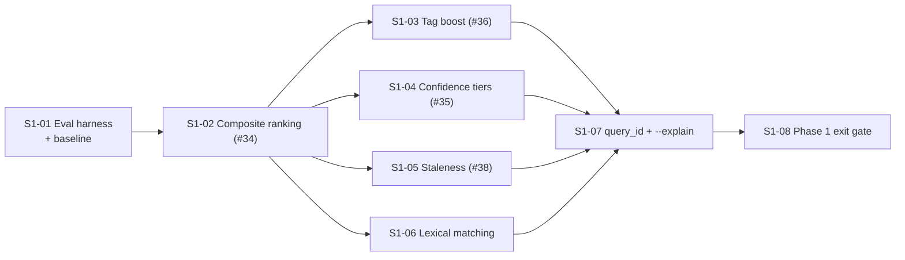

# User Stories — PRD-004 Phase 1: Trustworthy Retrieval

## Changelog

| Version | Date       | Summary                                                                                              | Author           |
| ------- | ---------- | ---------------------------------------------------------------------------------------------------- | ---------------- |
| 1.0     | 2026-09-19 | Initial Phase 1 stories (S1-01 … S1-08) with coverage validation against PRD-004 v1.4 Phase 1 scope. | product-engineer |

## Scope

Phase 1 of PRD-004: make retrieval measurable and trustworthy before any memory-model change. Covers FR-1.1 through FR-1.5 and acceptance criteria AC-1.1 through AC-1.5 plus AC-0.1/AC-0.2.

Phase 1 changes **no payload data**. It adds two Qdrant payload indexes, an optional `ranking` config block, and additive JSON output keys. No migration artifact is required (documented opt-out in every story).

- PRD: [`docs/requirements/prd-004-long-lived-agent-memory.md`](../docs/requirements/prd-004-long-lived-agent-memory.md) v1.4
- Spec: [`specification-prd-004-long-lived-agent-memory.md`](./specification-prd-004-long-lived-agent-memory.md) v1.1, §5.3, §6.1, §8.2, §14
- Prior refinement (still binding): [`issue-34-composite-ranking-score-refinement.md`](./issue-34-composite-ranking-score-refinement.md)

## Existing GitHub Issues

| Issue                                              | Title                           | Phase 1 story              | Disposition                                                                                      |
| -------------------------------------------------- | ------------------------------- | -------------------------- | ------------------------------------------------------------------------------------------------ |
| [#34](https://github.com/llipe/memo-cli/issues/34) | Composite ranking score         | S1-02                      | **Reuse.** Refinement doc remains binding; add a Refined Scope comment pointing at PRD-004 §8.2. |
| [#36](https://github.com/llipe/memo-cli/issues/36) | Tag overlap boosting            | S1-03                      | **Reuse.** Add note: boost is additive with `lexical_boost` (S1-06).                             |
| [#35](https://github.com/llipe/memo-cli/issues/35) | Dynamic confidence tiers        | S1-04                      | **Reuse** unchanged.                                                                             |
| [#38](https://github.com/llipe/memo-cli/issues/38) | Staleness detection             | S1-05                      | **Reuse with correction.** Output field renamed `stale_by` (see S1-05 D-1).                      |
| [#37](https://github.com/llipe/memo-cli/issues/37) | `memo ask`                      | —                          | **Defer to Phase 5** (PRD FR-5.2). Comment on the issue, keep open.                              |
| new                                                | Eval harness, lexical, query_id | S1-01, S1-06, S1-07, S1-08 | **Create** four new issues.                                                                      |

## Dependency Map

## Recommended Implementation Order

1. **S1-01** — measurement must exist before anything changes ranking.
2. **S1-02** — the scoring foundation every later story consumes.
3. **S1-03**, **S1-04**, **S1-05** — sequential, all touch `ranking.ts` or `search.ts` (parallel work will conflict).
4. **S1-06** — largest change; depends on the candidate pipeline from S1-02.
5. **S1-07** — thin, needs every factor to exist for `--explain`.
6. **S1-08** — gate, not a feature.

---

### Story S1-01: Relevance evaluation harness and recorded baseline

**Priority:** Critical
**Estimated Size:** M
**Dependencies:** none

#### User Story

As a maintainer of memo-cli,
I want a versioned evaluation set and a repeatable script that measures top-3 retrieval relevance,
So that every later ranking change is judged against evidence instead of intuition.

#### Context

PRD-004's first goal is measured retrieval quality (FR-1.1, AC-1.1, AC-1.5). Every Phase 1 story after this one changes ordering; without a recorded baseline there is no way to tell improvement from regression. This story changes no production ranking behavior.

#### Acceptance Criteria

- [ ] **AC1** — `tests/fixtures/relevance/entries.json` holds ≥ 40 seed entries with stable UUIDs, covering: architectural decisions, integration points, structure entries, intent/outcome-style entries, entries naming specific files in `files_modified`, and entries from at least two repos.
- [ ] **AC2** — `tests/fixtures/relevance/queries.json` holds 20–30 query objects `{ id, query, expected_ids[], category }` with categories `concept`, `identifier`, `cross-repo`, `recency`. At least 6 are `identifier` queries naming a file, flag, or issue reference.
- [ ] **AC3** — `pnpm run eval:relevance` runs every query against a live Qdrant plus embeddings provider, prints per-category and overall top-3 hit rate, and exits 0 regardless of score (it reports, it does not gate).
- [ ] **AC4** — `pnpm run eval:relevance --seed` upserts the fixture entries into the evaluation collection and is idempotent (fixed ids, re-runnable).
- [ ] **AC5** — `pnpm run eval:relevance --record` writes `tests/fixtures/relevance/candidates.json` (per query: candidate id, Qdrant score, and the payload fields ranking needs) and `tests/fixtures/relevance/baseline.json` (`{ recorded_at, overall_top3, by_category, ranking_config }`).
- [ ] **AC6** — `tests/relevance/replay.test.ts` replays `candidates.json` through the current ranking path with no network access and asserts overall top-3 hit rate ≥ `baseline.json.overall_top3`.
- [ ] **AC7** — The evaluation collection is isolated: `QdrantRepository` resolves its collection name from `MEMO_COLLECTION` (default `decisions`), and the eval script sets `MEMO_COLLECTION=memo_eval`. A run with no `MEMO_COLLECTION` never writes fixtures into `decisions`.
- [ ] **AC8** — The measured baseline is recorded as a new changelog row in `docs/requirements/prd-004-long-lived-agent-memory.md` with the overall and per-category top-3 hit rate.
- [ ] **AC9** — `pnpm test` passes with the replay test included; the replay test requires no `QDRANT_URL` or `EMBEDDINGS_API_KEY`.

#### Business Rules

- The evaluation set is versioned with the code; changing an expected id is a reviewed change, not a convenience.
- `--record` is manual. CI never records; CI only replays.
- The baseline is a floor, never a ceiling: AC-1.5 in the PRD compares against it at phase exit.
- Fixture entries carry `source` values spread across `agent`, `manual`, and `scan` so source weighting is observable.

#### Technical Notes

- Spec §14 ("Relevance replay" and "Relevance live" rows). Guidelines §11 for test layout.
- `scripts/eval-relevance.ts` follows the pattern of `scripts/validate-bootstrap.ts` (standalone, run via `node --loader ts-node/esm` or `tsx` through a `package.json` script).
- The replay path **MUST** call the same `rankResults` the command calls. Until S1-02 lands, `rankResults` is the identity ordering by `similarity`, which is exactly the baseline to record.
- Timestamps in `entries.json` are relative offsets resolved at seed time (`{ "age_days": 200 }`), so recency behavior does not rot as the fixture ages.
- `MEMO_COLLECTION` is read once in `src/lib/qdrant.ts`; it is a test/eval affordance, documented in `README.md` under development, not advertised as a product feature.

#### Testing Requirements

- **Unit Tests:** hit-rate computation (`computeTop3HitRate`) for: all hits, no hits, partial, duplicate expected ids, query with empty `expected_ids`; fixture schema validation (Zod) rejecting a query without `expected_ids`.
- **Integration Tests:** replay test over a small committed `candidates.json` slice asserting a known hit rate exactly.
- **Manual/UI Testing:** `MEMO_COLLECTION=memo_eval pnpm run eval:relevance --seed && pnpm run eval:relevance` against local Docker Qdrant; confirm `decisions` is untouched (`memo inspect` before and after).
- **Edge-Case Matrix:** empty `candidates.json`; query whose expected entry was deleted from the fixture (must fail loudly, not silently pass); `MEMO_COLLECTION` unset during `--seed` (must refuse and exit 1); Qdrant unreachable (exit 2, `QDRANT_UNREACHABLE`).
- **Acceptance-Criteria Mapping:** AC1–AC2 → fixture schema test; AC3–AC5 → manual run + `eval-relevance.test.ts`; AC6 → `tests/relevance/replay.test.ts`; AC7 → `qdrant.test.ts` collection-name test; AC8 → PRD diff in the PR; AC9 → `pnpm test`.
- **Execution Commands:** `pnpm run eval:relevance`, `pnpm test -- --testPathPattern="relevance|eval"`, `pnpm run validate`.

#### Migration Requirements

- Migration artifact: **not required** — no payload, schema, or index change. Documented opt-out: this story adds fixtures, a script, and one environment-variable read.
- Rollback/impact notes: removing the script and fixtures restores the prior state; no stored data is affected.

#### Implementation Steps

1. Add `MEMO_COLLECTION` resolution to `src/lib/qdrant.ts` and a unit test.
2. Author `entries.json` (≥ 40) and `queries.json` (20–30) with a Zod schema in `scripts/eval-relevance.ts`.
3. Implement seed, run, and record modes plus `computeTop3HitRate` in `src/lib/eval.ts` (pure, so it is unit-testable).
4. Add the `eval:relevance` script to `package.json`.
5. Run `--seed`, `--record` against local Qdrant; commit `candidates.json` and `baseline.json`.
6. Add `tests/relevance/replay.test.ts`.
7. Record the baseline in the PRD changelog; note the eval workflow in `README.md` (Development).

#### Files to Create/Modify

- `scripts/eval-relevance.ts` — CLI: seed / run / record
- `src/lib/eval.ts` — pure hit-rate and report computation
- `src/lib/qdrant.ts` — `MEMO_COLLECTION` resolution
- `tests/fixtures/relevance/{entries,queries,candidates,baseline}.json`
- `tests/relevance/replay.test.ts`
- `tests/unit/lib/eval.test.ts`
- `package.json` — `eval:relevance` script
- `README.md`, `docs/requirements/prd-004-long-lived-agent-memory.md`

#### Definition of Done Checklist

- [ ] Code implemented per technical guidelines
- [ ] Unit/integration/manual/edge-case tests written and passing
- [ ] Quality gates passing (`lint`, `format:check`, `typecheck`, `test`, `audit`)
- [ ] Code reviewed and approved
- [ ] Acceptance criteria verified and mapped to test evidence
- [ ] Migration opt-out documented
- [ ] Baseline recorded in the PRD changelog
- [ ] Pull Request created and merged

---

### Story S1-02: Composite ranking score (#34)

**Priority:** Critical
**Estimated Size:** M
**Dependencies:** S1-01

#### User Story

As an AI agent consuming `memo search`,
I want results ordered by a composite of similarity, recency, and source reliability,
So that the most actionable and trustworthy decision surfaces first instead of merely the most similar one.

#### Context

The foundation of PRD-004 §8.2. Every later factor (tag boost, tiers, staleness, lexical, and in later phases retention and use) multiplies or adds into the score this story establishes. Issue #34's refinement doc is binding, including its two documented defects.

#### Acceptance Criteria

All acceptance criteria AC1–AC18 of [`issue-34-composite-ranking-score-refinement.md`](./issue-34-composite-ranking-score-refinement.md) apply verbatim, plus:

- [ ] **AC19** — `rankResults` accepts a factor bag and returns `{ ...entry, final_score, similarity, recency_score, source_score, factors }`, with unimplemented factors (tag, lexical, retention, use, links) defaulting to their neutral values per PRD §8.2.
- [ ] **AC20** — `src/lib/ranking.ts` is pure: no I/O, no `Date.now()` inside scoring functions; `now` is an injected parameter.
- [ ] **AC21** — Replaying `tests/fixtures/relevance/candidates.json` through the new ranking yields an overall top-3 hit rate ≥ the recorded baseline; the PR body states the before and after numbers.

#### Business Rules

- Weights sum to `1.0 ± 0.001`; each weight in `[0,1]`; invalid config fails fast with `CONFIG_INVALID` (#34 D7), never silently defaults.
- `source_score`: `agent` 1.0, `manual` 0.8, `scan` 0.5, unknown or missing 0.5 (D5).
- `similarity` is clamped to `[0,1]` before compositing (D8); `final_score` is always within `[0,1]`.
- Missing or malformed `timestamp_utc` yields `recency_score = 0`; the entry is still returned (D4).
- Ties break by `final_score` desc, `timestamp_utc` desc, `id` asc (R9).
- `similarity` is retained in output alongside `final_score` (D3). Only ordering and the human percentage change.
- `memo list` is chronological by design and is not re-ranked.

#### Technical Notes

- Spec §8.2. Over-fetch `max(limit, min(limit * 3, 50))` computed in `src/commands/search.ts`; `QdrantRepository.search` keeps its signature (refinement "Repository boundary" constraint).
- DEF-1: existing search tests change only their over-fetch limit assertion and ordering expectations; no test is deleted or weakened.
- DEF-2: assert `≈ 0.125` at 3× half-life; `< 0.1` only at 4× or more.
- Zod v3 style matching `src/types/config.ts` (`.passthrough()`, `.superRefine()`, `.default()`); `exactOptionalPropertyTypes` requires the `...(x ? { x } : {})` idiom.
- Human output keeps its layout; only the percentage source changes (D6).

#### Testing Requirements

- **Unit Tests:** `computeRecencyScore` at 0/45/90/180/270/360 days, future timestamp, missing, malformed; `computeSourceScore` for all sources plus unknown and undefined; `computeCompositeScore` with default and custom weights, bounded output, negative similarity; `rankResults` ordering, the AC2 newer-beats-older scenario, tiebreak, empty and single input.
- **Integration Tests:** `search.test.ts` over-fetch assertions (`--limit 3` → 9, `--limit 20` → 50, `--limit 100` → 100), slicing to `--limit` after ranking, JSON shape, empty-result path; `config.test.ts` and `setup.test.ts` for the `ranking` block.
- **Manual/UI Testing:** `memo search "auth roles" --limit 5` (composite %), `--json` (four score fields, descending `final_score`), `memo setup validate` with a valid then an invalid weight sum.
- **Edge-Case Matrix:** all candidates same score; single candidate; `half_life_days` 0 or negative (rejected by Zod, R10); individual weight outside `[0,1]` (R11); partial `ranking` block (rejected, AC11); clock skew producing future timestamps (clamped, R4).
- **Acceptance-Criteria Mapping:** the refinement doc's AC-to-test table applies as written; AC19–AC20 → `ranking.test.ts`; AC21 → replay test output in the PR body.
- **Execution Commands:** `pnpm test -- --testPathPattern="ranking|search|setup|config"`, `pnpm run eval:relevance`, `pnpm run validate`.

#### Migration Requirements

- Migration artifact: **not required** — per the refinement's Migration Assessment, no collection, index, or payload change; `timestamp_utc` is already present and indexed.
- Rollback/impact notes: reverting restores similarity ordering; stored data is untouched. Consumers reading `similarity` keep working.

#### Implementation Steps

1. Add `RankingConfig` to `src/types/config.ts` with weight-sum and range refinements.
2. Create `src/lib/ranking.ts` with the four pure functions and the neutral-factor bag.
3. Load and validate `ranking` in `src/lib/config.ts`; extend `memo setup validate`.
4. Apply over-fetch and `rankResults` in `src/commands/search.ts`; slice to `--limit`.
5. Point `output.searchResults` at `final_score`.
6. Write `tests/unit/lib/ranking.test.ts`; update existing search tests per DEF-1.
7. Run the replay test and `eval:relevance`; document the `ranking` block in `README.md` and `docs/data-model.md`.

#### Files to Create/Modify

- `src/lib/ranking.ts`, `tests/unit/lib/ranking.test.ts` — new
- `src/types/config.ts`, `src/lib/config.ts`, `src/commands/setup.ts`, `src/commands/search.ts`, `src/lib/output.ts`
- `tests/unit/commands/search.test.ts`, `tests/unit/lib/config.test.ts`, `tests/unit/lib/output.test.ts`
- `README.md`, `docs/data-model.md`, `docs/system-overview.md`

#### Definition of Done Checklist

- [ ] Code implemented per technical guidelines
- [ ] Unit/integration/manual/edge-case tests written and passing
- [ ] Quality gates passing (`lint`, `format:check`, `typecheck`, `test`, `audit`)
- [ ] Code reviewed and approved
- [ ] Acceptance criteria verified and mapped to test evidence
- [ ] Migration opt-out documented
- [ ] Eval replay ≥ baseline, numbers in the PR body
- [ ] Pull Request created and merged

---

### Story S1-03: Tag overlap boosting (#36)

**Priority:** High
**Estimated Size:** S
**Dependencies:** S1-02

#### User Story

As a developer searching the knowledge base,
I want entries whose tags match my query terms to rank higher,
So that direct categorical relevance is rewarded without an extra query or extra latency.

#### Context

Cheap precision: the tags are already in the payload and the query is already parsed. PRD §8.2 adds `tag_boost` to the base score before the multiplicative factors.

#### Acceptance Criteria

- [ ] **AC1** — `tag_boost = matched_tags / total_query_terms * boost_factor`, default `boost_factor = 0.05`, configurable under `ranking.tag_boost_factor`.
- [ ] **AC2** — Setting `tag_boost_factor: 0` disables boosting entirely and yields `tag_boost: 0` on every result.
- [ ] **AC3** — Matching is case-insensitive and whole-word; the stopword list (`a, the, is, for, of, in, to, with`) is excluded from `total_query_terms`.
- [ ] **AC4** — `tag_boost` appears on every result in `--json`; human output format is unchanged by this story.
- [ ] **AC5** — `boosted = min(1, base + tag_boost)`; a result already at `base = 1.0` cannot exceed 1.0.
- [ ] **AC6** — A query with only stopwords yields `tag_boost = 0` and never divides by zero.
- [ ] **AC7** — Replay hit rate ≥ baseline; PR body states before and after.

#### Business Rules

- The boost is additive with `lexical_boost` (S1-06), not multiplicative; both apply before the cap.
- Kebab-case tags match on their whole token (`rate-limiting` matches the query word `rate-limiting`, not `rate`).
- Tag boosting never changes which candidates are retrieved, only how they score.

#### Technical Notes

- Spec §8.2 `computeTagBoost`. Lives in `src/lib/ranking.ts` alongside the other pure functions.
- Issue #36 notes a merge-conflict risk with #34 in the same file; S1-02 lands first by construction.
- Normalize the query once per invocation, not per candidate.

#### Testing Requirements

- **Unit Tests:** exact single-tag match; multiple matches; no match; stopword-only query; mixed case; punctuation; hyphenated tag; `boost_factor = 0`; cap at 1.0; empty tags array.
- **Integration Tests:** `search.test.ts` asserts `tag_boost` presence and that a tag-matching entry outranks an equal-similarity non-matching one.
- **Manual/UI Testing:** `memo search "rate limiting strategy" --json | jq '.results[].tag_boost'`.
- **Edge-Case Matrix:** query with 1 term; query with 50 terms; tag list at the 5-tag maximum; unicode in query.
- **Acceptance-Criteria Mapping:** AC1–AC3, AC5–AC6 → `ranking.test.ts`; AC4 → `search.test.ts`; AC7 → replay output.
- **Execution Commands:** `pnpm test -- --testPathPattern="ranking|search"`, `pnpm run validate`.

#### Migration Requirements

- Migration artifact: **not required** — output-only additive key, one optional config field.
- Rollback/impact notes: reverting removes `tag_boost` from output; ordering returns to S1-02 behavior.

#### Implementation Steps

1. Add `tag_boost_factor` to `RankingConfig`.
2. Implement `computeTagBoost` with normalization and the stopword list.
3. Apply in `rankResults` before the cap; attach `tag_boost` to each result.
4. Pass the raw query into `rankResults` from `src/commands/search.ts`.
5. Extend tests; run the replay; document the field in `README.md`.

#### Files to Create/Modify

- `src/lib/ranking.ts`, `src/types/config.ts`, `src/commands/search.ts`
- `tests/unit/lib/ranking.test.ts`, `tests/unit/commands/search.test.ts`
- `README.md`

#### Definition of Done Checklist

- [ ] Code implemented per technical guidelines
- [ ] Unit/integration/manual/edge-case tests written and passing
- [ ] Quality gates passing (`lint`, `format:check`, `typecheck`, `test`, `audit`)
- [ ] Code reviewed and approved
- [ ] Acceptance criteria verified and mapped to test evidence
- [ ] Migration opt-out documented
- [ ] Pull Request created and merged

---

### Story S1-04: Dynamic confidence tiers (#35)

**Priority:** High
**Estimated Size:** S
**Dependencies:** S1-02

#### User Story

As an AI agent deciding whether to act on a search result,
I want a computed confidence tier on every result,
So that I can programmatically choose to act, verify, or discard instead of interpreting a raw float.

#### Context

Today every entry carries a static `confidence: "high"` inherited from its source, which tells an agent nothing about this result for this query. Tiers derive from `final_score` and give agents a stable, configurable signal. PRD FR-1.2; the `recall` bundle in Phase 2 depends on tiers existing.

#### Acceptance Criteria

- [ ] **AC1** — `confidence_tier` is computed from `final_score`: `exact ≥ 0.88`, `high 0.75–0.87`, `medium 0.60–0.74`, `low < 0.60`.
- [ ] **AC2** — Thresholds are configurable under `ranking.confidence_thresholds`; `memo setup validate` and `loadConfig` reject non-descending ordering (`exact > high > medium`) with `CONFIG_INVALID` naming the offending path.
- [ ] **AC3** — `--json` exposes `confidence_tier` on every result.
- [ ] **AC4** — The static `confidence` field is **removed from search output** while remaining in the stored payload and in `memo read` output (it is still a write-path concept).
- [ ] **AC5** — Human output prefixes each result with `[tier]`.
- [ ] **AC6** — Boundary scores land in the documented tier: exactly `0.88` → `exact`; exactly `0.75` → `high`; exactly `0.60` → `medium`; `0.5999…` → `low`.
- [ ] **AC7** — Replay hit rate ≥ baseline (tiers do not reorder, so the number must be unchanged).

#### Business Rules

- Tiers are per result per query, never stored on the entry.
- `memo read`, `memo list`, and `memo write` output are unaffected; only `memo search` gains the tier.
- The distinct field name `confidence_tier` is deliberate (refinement R8): it never collides with the payload's `confidence`.

#### Technical Notes

- Spec §8.2 `computeConfidenceTier`. `src/lib/output.ts` renders the prefix; the color policy in guidelines §4 applies (`exact`/`high` green, `medium` yellow, `low` gray, with the text label always present).
- Existing search tests asserting `confidence` in search output are updated to assert `confidence_tier` (allowed under DEF-1's spirit; intent is preserved, not weakened).

#### Testing Requirements

- **Unit Tests:** tier for each band; all three boundaries exactly; custom thresholds; score 0 and 1; threshold ordering validation (valid, equal values, inverted).
- **Integration Tests:** `search.test.ts` asserts `confidence_tier` present and `confidence` absent in search results; `read.test.ts` asserts `confidence` still present.
- **Manual/UI Testing:** `memo search "auth" --limit 5` shows `[tier]` prefixes; `memo setup validate` with `exact: 0.5, high: 0.8` exits 1 with a clear message.
- **Edge-Case Matrix:** missing `confidence_thresholds` (defaults apply); partial thresholds object; `NO_COLOR` set (labels still readable); non-TTY output.
- **Acceptance-Criteria Mapping:** AC1, AC6 → `ranking.test.ts`; AC2 → `config.test.ts`, `setup.test.ts`; AC3–AC4 → `search.test.ts`, `read.test.ts`; AC5 → `output.test.ts`; AC7 → replay output.
- **Execution Commands:** `pnpm test -- --testPathPattern="ranking|search|setup|output|read"`, `pnpm run validate`.

#### Migration Requirements

- Migration artifact: **not required** — no stored data changes; the payload `confidence` field is preserved.
- Rollback/impact notes: consumers reading `confidence` from **search** output are affected; this is the one output removal in Phase 1 and is called out in `README.md` and the PR body.

#### Implementation Steps

1. Add `confidence_thresholds` to `RankingConfig` with ordering refinement.
2. Implement `computeConfidenceTier`; attach the tier in `rankResults`.
3. Remove `confidence` from the search result projection in `src/commands/search.ts`.
4. Add the `[tier]` prefix in `src/lib/output.ts`.
5. Update tests and docs (`README.md` search output section, `docs/system-overview.md` search flow).

#### Files to Create/Modify

- `src/lib/ranking.ts`, `src/types/config.ts`, `src/commands/search.ts`, `src/commands/setup.ts`, `src/lib/output.ts`
- `tests/unit/lib/ranking.test.ts`, `tests/unit/commands/search.test.ts`, `tests/unit/lib/output.test.ts`, `tests/unit/lib/config.test.ts`
- `README.md`, `docs/system-overview.md`

#### Definition of Done Checklist

- [ ] Code implemented per technical guidelines
- [ ] Unit/integration/manual/edge-case tests written and passing
- [ ] Quality gates passing (`lint`, `format:check`, `typecheck`, `test`, `audit`)
- [ ] Code reviewed and approved
- [ ] Acceptance criteria verified and mapped to test evidence
- [ ] Output removal of `confidence` documented in README and PR body
- [ ] Pull Request created and merged

---

### Story S1-05: Staleness detection (#38)

**Priority:** Medium
**Estimated Size:** M
**Dependencies:** S1-02

#### User Story

As an AI agent about to act on a retrieved decision,
I want a warning when that decision looks superseded by a newer one,
So that I verify before acting on knowledge the team has already moved past.

#### Context

A high-similarity decision from ten months ago can still rank well and still be wrong. Staleness is an annotation, never a filter: the result is returned, flagged, and left to the caller. PRD FR-1.2.

#### Resolved Decision

**D-1 — Output field renamed.** Issue #38 proposes `superseded_by` for the newer entry's id. PRD-004 Phase 2 introduces `superseded_by` as a **stored payload field** set by explicit supersession, with different semantics (authoritative, not inferred). To avoid a field whose meaning depends on which phase wrote it, the Phase 1 staleness annotation is named **`stale_by`**. Phase 2's payload `superseded_by` is unaffected, and a result may legitimately carry both.

#### Acceptance Criteria

- [ ] **AC1** — A result is flagged `stale: true` when `age_in_days > ranking.staleness_threshold_days` (default 120) **and** a newer entry in the same repo has Jaccard tag overlap ≥ `ranking.staleness_tag_overlap_threshold` (default 0.5).
- [ ] **AC2** — When stale, the result carries `stale_by` = the id of the newest overlapping entry.
- [ ] **AC3** — When not stale, the `stale` and `stale_by` keys are **omitted entirely** from JSON (not `false`, not `null`).
- [ ] **AC4** — Staleness never changes `final_score` or ordering; a stale result keeps its position.
- [ ] **AC5** — Detection requires **one** Qdrant scroll per `memo search` invocation, not per result; the candidate set is cached for the duration of the command.
- [ ] **AC6** — The scroll uses `scroll` (not `search`) and is filtered to the same repo scope as the query.
- [ ] **AC7** — Human output shows `⚠ STALE — superseded by <id>` inline under the flagged result.
- [ ] **AC8** — `memo search` stays under the 2.5 s target with staleness enabled on a 1,000-entry repo (measured and stated in the PR body).
- [ ] **AC9** — Jaccard overlap of identical tag sets is 1.0; of disjoint sets 0.0; an entry with no tags is never a superseder.

#### Business Rules

- Only entries **newer** than the candidate can supersede it; ties on `timestamp_utc` do not flag.
- An entry is never marked stale by itself.
- Cross-repo supersession is out of scope: comparison is same-repo only (Phase 2 makes it same-bank, same-repo).
- Staleness is advisory; nothing is hidden, archived, or deleted by it.

#### Technical Notes

- Spec §8.2 (`detectStaleness`). New pure module `src/lib/staleness.ts` with `computeJaccardOverlap` and `detectStaleness(candidates, corpus, config, now)`.
- `QdrantRepository` gains `fetchByRepo(repos: string[], limit)` built on the existing `scroll`; commands never call the client directly.
- The corpus fetch is bounded (default 1,000, ordered by `timestamp_utc` desc); the bound is a config-free constant documented in the code, revisited if repos grow.
- Pure detection keeps `now` injected, consistent with `ranking.ts`.

#### Testing Requirements

- **Unit Tests:** Jaccard for identical, disjoint, partial, empty-on-one-side, empty-on-both; `detectStaleness` for: older + overlapping newer → stale; older + non-overlapping newer → not stale; newer than everything → not stale; overlap exactly at threshold; age exactly at threshold; multiple superseders (newest wins); same-timestamp tie.
- **Integration Tests:** `search.test.ts` asserts exactly one `scroll` call regardless of result count; asserts `stale`/`stale_by` omitted when false; asserts ordering is unchanged with staleness on and off.
- **Manual/UI Testing:** seed an old and a newer overlapping entry in the eval collection; `memo search` shows the warning; `--json` shows `stale_by`.
- **Edge-Case Matrix:** empty corpus; corpus at the fetch bound; entry with malformed `timestamp_utc` (never stale, never throws); `--scope related` (corpus covers the resolved repo set); 0 results.
- **Acceptance-Criteria Mapping:** AC1–AC4, AC9 → `staleness.test.ts`; AC5–AC6 → `search.test.ts` call-count assertions; AC7 → `output.test.ts`; AC8 → manual timing in the PR body.
- **Execution Commands:** `pnpm test -- --testPathPattern="staleness|search|output"`, `pnpm run validate`.

#### Migration Requirements

- Migration artifact: **not required** — derived annotation only, no payload write.
- Rollback/impact notes: reverting removes the annotation; no stored data is affected.

#### Implementation Steps

1. Add `staleness_threshold_days` and `staleness_tag_overlap_threshold` to `RankingConfig`.
2. Create `src/lib/staleness.ts` (pure).
3. Add `fetchByRepo` to `QdrantRepository`.
4. Call it once in `src/commands/search.ts`, cache, and annotate results after ranking.
5. Render the warning in `src/lib/output.ts`.
6. Tests, timing measurement, docs (`README.md`, `docs/system-overview.md` search flow).

#### Files to Create/Modify

- `src/lib/staleness.ts`, `tests/unit/lib/staleness.test.ts` — new
- `src/lib/qdrant.ts`, `src/commands/search.ts`, `src/lib/output.ts`, `src/types/config.ts`
- `tests/unit/commands/search.test.ts`, `tests/unit/lib/output.test.ts`, `tests/unit/lib/qdrant.test.ts`
- `README.md`, `docs/system-overview.md`

#### Definition of Done Checklist

- [ ] Code implemented per technical guidelines
- [ ] Unit/integration/manual/edge-case tests written and passing
- [ ] Quality gates passing (`lint`, `format:check`, `typecheck`, `test`, `audit`)
- [ ] Code reviewed and approved
- [ ] Acceptance criteria verified and mapped to test evidence
- [ ] Latency measured against the 2.5 s target and stated in the PR body
- [ ] Pull Request created and merged

---

### Story S1-06: Lexical identifier matching

**Priority:** Critical
**Estimated Size:** L
**Dependencies:** S1-02

#### User Story

As a developer agent investigating unfamiliar code,
I want a search for an exact file name, flag, or issue reference to find the entry that names it,
So that identifier queries stop failing just because embeddings blur exact tokens.

#### Context

The single biggest concrete retrieval failure in the current tool: `memo search "why does search-filters.ts build should clauses"` does not reliably return the entry whose `files_modified` lists that file, because a dense vector treats the filename as noise. PRD FR-1.3. This is the story most likely to move the top-3 number.

#### Acceptance Criteria

- [ ] **AC1** — `ensureCollection()` is split so index creation is reconciled on every run: `ensureIndexes()` reads the collection's existing payload schema and creates any index declared in `PAYLOAD_INDEXES` that is missing. It is idempotent and safe on a pre-existing collection.
- [ ] **AC2** — `rationale` and `files_modified` carry Qdrant `text` indexes (`tokenizer: word`, `lowercase: true`, `min_token_len: 2`, `max_token_len: 20`).
- [ ] **AC3** — `extractIdentifierTokens(query)` returns tokens that contain `.`, `/`, `-`, or `_`, match `#\d+` or `[A-Z]+-\d+`, start with `--`, or are CamelCase; an ordinary prose query returns none.
- [ ] **AC4** — When identifiers are present and `ranking.lexical` is true, exactly **one** additional Qdrant scroll runs, with a `should` clause per identifier over `rationale` and `files_modified`, `min_should: 1`, the same pre-filters as the dense query, `limit 50`, and `with_vector: true`.
- [ ] **AC5** — Lexical-only candidates receive a locally computed cosine `similarity` against the query vector; dense candidates keep Qdrant's score; the union is deduplicated by id.
- [ ] **AC6** — `lexical_boost` = (identifiers fully matched in `rationale ∪ files_modified`) / (total identifiers) × `ranking.lexical_boost_factor` (default 0.15), and is added to the base score with `tag_boost` before the 1.0 cap.
- [ ] **AC7** — `--lexical off` (and `ranking.lexical: false`) skips the extra scroll entirely; behavior matches S1-05.
- [ ] **AC8** — A query with no identifier tokens issues no extra scroll (verified by call count).
- [ ] **AC9** — An `identifier` category query from the eval set returns its expected entry in the top 3 with lexical on, and the PR body shows the per-category hit rate with lexical on versus off.
- [ ] **AC10** — Overall replay hit rate ≥ baseline and ≥ the S1-05 number; `memo search` stays under 2.5 s with both the lexical and staleness scrolls active.
- [ ] **AC11** — An entry written **before** the text index existed is still matched (index creation backfills existing points; verified manually against a pre-existing collection).

#### Business Rules

- Lexical matching widens the candidate set; it never narrows it. Every dense candidate is still considered.
- Identifier matching is all-or-nothing per identifier: `search-filters.ts` matches only if every one of its word tokens is present.
- Local cosine is computed only for lexical-only candidates, never re-computed for dense hits.
- If the lexical scroll fails, the search still returns dense results; the failure is logged under `MEMO_DEBUG` and never changes the exit code.

#### Technical Notes

- Spec §8.2 (lexical candidate retrieval, steps 1–4) and §5.3 (index table). Decision A4: boost, not reciprocal rank fusion, because Qdrant text indexes return boolean matches rather than BM25 scores.
- Tokenization must mirror Qdrant's `word` tokenizer (lowercase, split on non-alphanumerics, drop tokens shorter than 2) so client-side boost computation agrees with server-side matching.
- `QdrantRepository.scroll` gains an options object with `withVector`; the existing call sites keep their behavior.
- Verify on the target Qdrant version that a `text` index on an array field (`files_modified`) tokenizes each element (spec §17 open question 2). If it does not, index `rationale` only and record the limitation.
- Cosine helper lives in `src/lib/lexical.ts` (pure); vectors are normalized by OpenAI, but normalize defensively.

#### Testing Requirements

- **Unit Tests:** `extractIdentifierTokens` for file paths, dotted names, kebab/snake, `#123`, `PROJ-45`, `--flag`, CamelCase, prose-only, empty, punctuation-heavy; tokenizer parity cases; `computeLexicalBoost` for full match, partial, none, multiple identifiers, factor 0; cosine for identical, orthogonal, opposite, zero-length vectors.
- **Integration Tests:** `search.test.ts` asserts scroll call count 1 with identifiers and 0 without; union dedupe when a candidate appears in both sets; `--lexical off` path; lexical scroll failure degrades gracefully; `qdrant.test.ts` asserts `ensureIndexes` creates only missing indexes and is idempotent.
- **Manual/UI Testing:** against the eval collection, run three identifier queries with `--lexical on` and `off` and compare top-3; run `ensureIndexes` against a collection created by v1.1.x and confirm the new indexes appear in `getCollection`.
- **Edge-Case Matrix:** identifier appearing in 100+ entries (limit 50 respected); query that is entirely identifiers; identifier shorter than `min_token_len`; entry with empty `files_modified`; Qdrant version lacking array text support (documented fallback); collection missing entirely (created, then indexed).
- **Acceptance-Criteria Mapping:** AC1–AC2, AC11 → `qdrant.test.ts` + manual; AC3, AC5–AC6 → `lexical.test.ts`; AC4, AC7–AC8 → `search.test.ts`; AC9–AC10 → eval output in the PR body.
- **Execution Commands:** `pnpm test -- --testPathPattern="lexical|search|qdrant"`, `pnpm run eval:relevance`, `pnpm run validate`.

#### Migration Requirements

- Migration artifact: **not required** — index creation is additive and reconciled at runtime by `ensureIndexes`; no payload is rewritten.
- Rollback/impact notes: reverting the code leaves two unused payload indexes in Qdrant, which are harmless and cost only disk. Document that removing them is optional and manual.
- Apply step: none beyond running any command once (indexes reconcile automatically). No user confirmation needed because nothing is destructive.
- Verification after apply: `getCollection` shows `rationale` and `files_modified` in `payload_schema`.

#### Implementation Steps

1. Split `ensureCollection` and add `ensureIndexes` with reconciliation; extend `PAYLOAD_INDEXES` with the two text entries.
2. Add `withVector` support to `QdrantRepository.scroll`.
3. Create `src/lib/lexical.ts`: identifier extraction, tokenizer parity, cosine, boost.
4. Add `lexical` and `lexical_boost_factor` to `RankingConfig`; add `--lexical <on|off>` to `memo search`.
5. Wire candidate union into `src/commands/search.ts` before `rankResults`; add `lexical_boost` to the composite.
6. Tests; run `eval:relevance` on and off; record per-category numbers.
7. Docs: `README.md` (flag + config), `docs/data-model.md` (index table), `docs/system-overview.md` (search flow).

#### Files to Create/Modify

- `src/lib/lexical.ts`, `tests/unit/lib/lexical.test.ts` — new
- `src/lib/qdrant.ts`, `src/lib/ranking.ts`, `src/commands/search.ts`, `src/types/config.ts`
- `tests/unit/lib/qdrant.test.ts`, `tests/unit/commands/search.test.ts`, `tests/integration/lib/qdrant.test.ts`
- `README.md`, `docs/data-model.md`, `docs/system-overview.md`

#### Definition of Done Checklist

- [ ] Code implemented per technical guidelines
- [ ] Unit/integration/manual/edge-case tests written and passing
- [ ] Quality gates passing (`lint`, `format:check`, `typecheck`, `test`, `audit`)
- [ ] Code reviewed and approved
- [ ] Acceptance criteria verified and mapped to test evidence
- [ ] Index reconciliation verified against a pre-existing collection
- [ ] Per-category eval numbers (lexical on vs off) in the PR body
- [ ] Pull Request created and merged

---

### Story S1-07: `query_id` and `--explain`

**Priority:** High
**Estimated Size:** S
**Dependencies:** S1-03, S1-04, S1-05, S1-06

#### User Story

As an agent harness and as a maintainer tuning ranking,
I want every search response to carry a correlation id and an optional factor breakdown,
So that feedback can be attached to a specific result set later and so that ranking decisions are inspectable now.

#### Context

`query_id` is inert in Phase 1 by design (PRD FR-1.4): it establishes the contract so Phase 3 can persist snapshots and accept `memo used` without another output change. `--explain` makes the composite auditable while weights are still being tuned. PRD FR-1.4, FR-1.5.

#### Acceptance Criteria

- [x] **AC1** — Every `memo search --json` response includes a `query_id` (UUID v4) at the envelope level.
- [x] **AC2** — A fresh `query_id` is generated per invocation; two identical queries produce different ids.
- [x] **AC3** — Phase 1 persists nothing for `query_id`: no file is written, no Qdrant payload changes (asserted on mocks).
- [x] **AC4** — Existing envelope keys (`query`, `filters`, `results`, `count`, `message`) keep their names, types, and positions; `query_id` is additive.
- [x] **AC5** — `memo search --explain` adds a `factors` object per result in JSON containing `similarity`, `recency_score`, `source_score`, `tag_boost`, `lexical_boost`, `retention` (1.0), `use_ratio` (0), `link_factor` (1.0), and `final_score`.
- [x] **AC6** — `--explain` in human mode prints an aligned factor table under each result; without `--explain` output is unchanged.
- [x] **AC7** — `--explain` adds no Qdrant or embeddings call.
- [x] **AC8** — Neutral factors are explicitly present and documented as neutral, so Phase 3 changes values rather than shapes.

#### Business Rules

- `query_id` appears in `--json` mode; human mode prints it only under `--explain` (a footer line), to keep default output clean.
- `--explain` is a diagnostic flag: it never changes ordering, scores, or which results return.

#### Technical Notes

- Spec §6.1 (Phase 1 row), §6.2 (JSON example), §10 (human rendering).
- `randomUUID` from `node:crypto`, matching the existing pattern in `src/commands/write.ts`.
- The factor bag already exists from S1-02 (AC19); this story surfaces it rather than computing anything new.
- Table alignment in `src/lib/output.ts`; gray metadata color per guidelines §4.

#### Testing Requirements

- **Unit Tests:** factor-table formatting for long and short values; UUID shape validation.
- **Integration Tests:** `search.test.ts` asserts `query_id` presence and uniqueness across two invocations; asserts no write calls in Phase 1; asserts envelope key order; `--explain` factor completeness; `--explain` adds no extra client calls.
- **Manual/UI Testing:** `memo search "caching" --explain` and `--explain --json | jq '.results[0].factors'`.
- **Edge-Case Matrix:** zero results with `--explain` (empty-state output unchanged, `query_id` still present in JSON); `--explain` with `--lexical off` (boost 0.0 present, not absent).
- **Acceptance-Criteria Mapping:** AC1–AC4 → `search.test.ts`; AC5, AC8 → `search.test.ts` factor assertions; AC6 → `output.test.ts`; AC7 → call-count assertion.
- **Execution Commands:** `pnpm test -- --testPathPattern="search|output"`, `pnpm run validate`.

#### Migration Requirements

- Migration artifact: **not required** — additive output keys only.
- Rollback/impact notes: reverting removes `query_id` and `factors`; consumers ignoring unknown keys are unaffected.

#### Implementation Steps

1. Generate `query_id` in `src/commands/search.ts`; add to the JSON envelope.
2. Add `--explain`; project the factor bag into results when set.
3. Render the factor table and the `query_id` footer in `src/lib/output.ts`.
4. Tests; document both in `README.md` (search flags and JSON contract).

#### Files to Create/Modify

- `src/commands/search.ts`, `src/lib/output.ts`
- `tests/unit/commands/search.test.ts`, `tests/unit/lib/output.test.ts`
- `README.md`

#### Definition of Done Checklist

- [x] Code implemented per technical guidelines
- [x] Unit/integration/edge-case tests written and passing; manual steps documented in README (not executable in this sandbox — no live Qdrant instance)
- [x] Quality gates passing (`lint`, `format:check`, `typecheck`, `test`, `audit`) — `format:check` passes on every file this story touches; its overall repo-wide failure is pre-existing and unrelated (58 files, none from this story)
- [ ] Code reviewed and approved
- [x] Acceptance criteria verified and mapped to test evidence
- [x] Migration opt-out documented
- [ ] Pull Request created and merged

---

### Story S1-08: Phase 1 exit gate — tune, measure, document

**Priority:** Critical
**Estimated Size:** S
**Dependencies:** S1-07

#### User Story

As the product owner of memo-cli,
I want Phase 1 to close only against a re-measured evaluation run and current documentation,
So that Phase 2 starts from a known-good retrieval layer rather than an assumed one.

#### Context

PRD AC-1.5 is a gate, not a feature: top-3 hit rate must be ≥ 80% or ≥ baseline + 15 points, whichever is lower, and never below baseline. Default weights were chosen analytically and have never been validated against data. This story is where they are tuned or confirmed.

#### Acceptance Criteria

- [ ] **AC1** — A live `pnpm run eval:relevance` run is executed against the seeded eval collection with every Phase 1 feature enabled; overall and per-category top-3 hit rates are recorded.
- [ ] **AC2** — The gate is met: overall ≥ 80% or ≥ baseline + 15 points, whichever is lower, and never below baseline. If it is not met, weight and factor tuning is performed and re-measured within this story.
- [ ] **AC3** — Any changed default (`w_similarity`, `w_recency`, `w_source`, `recency_half_life_days`, `tag_boost_factor`, `lexical_boost_factor`, thresholds) is justified in the PR body with the before and after hit rates.
- [ ] **AC4** — `candidates.json` and `baseline.json` are re-recorded so the replay test guards the new floor.
- [ ] **AC5** — `docs/data-model.md` (index table, output fields), `docs/system-overview.md` (search flow), `docs/technical-guidelines.md` (any new config surface), and `README.md` (search flags, config block, JSON contract) reflect the shipped behavior; no doc references a Phase 1 field that does not exist.
- [ ] **AC6** — `qa-engineer` is invoked, `/TESTING.md` is filled for this repository (layers, packages, runner, coverage tooling), and `coverage_gate: PASS | FAIL | SKIPPED(<reason>)` is recorded in the PR.
- [ ] **AC7** — `verifier` audit mode runs against Phase 1 delivery; drift findings are routed to `product-engineer` for reconciliation and do not block this story.
- [ ] **AC8** — The PRD changelog records the Phase 1 exit numbers; the PRD's Phase 1 acceptance criteria are checked off.
- [ ] **AC9** — Coverage ≥ 80% overall and ≥ 85% for `src/lib/`.

#### Business Rules

- The gate is measured, not asserted. A failing gate reopens tuning inside this story; it does not defer to Phase 2.
- Tuning changes defaults only. It never changes the formula shape, which is fixed by PRD §8.2.
- Documentation drift found here is fixed here, not carried forward.

#### Technical Notes

- Spec §14 (relevance live) and §15 (rollout, version 1.2.0).
- Tuning procedure: sweep one factor at a time over a small grid, keeping weights summing to 1.0; prefer the simplest configuration within 2 points of the best result.
- If per-category results diverge sharply (for example `identifier` high, `recency` low), record that in the PRD as input to Phase 3's retention-versus-recency open question (PRD §18 Q3).

#### Testing Requirements

- **Unit Tests:** none new; existing suites must pass unchanged.
- **Integration Tests:** full `pnpm test` plus the replay test against the re-recorded baseline.
- **Manual/UI Testing:** the live eval run; a smoke pass over `memo search`, `memo list`, `memo read`, `memo write` confirming no regression in default human output.
- **Edge-Case Matrix:** eval run with an empty collection (reports 0%, exits 0, does not crash); config with all defaults absent (all defaults apply).
- **Acceptance-Criteria Mapping:** AC1–AC4 → eval artifacts and PR body; AC5 → doc diff; AC6 → `/TESTING.md` diff and `coverage_gate` line; AC7 → verifier report path; AC8 → PRD diff; AC9 → `pnpm run test:coverage`.
- **Execution Commands:** `pnpm run eval:relevance`, `pnpm run test:coverage`, `pnpm run validate`.

#### Migration Requirements

- Migration artifact: **not required** — documentation, fixtures, and default values only.
- Rollback/impact notes: reverting restores the previous defaults; no stored data is affected.

#### Implementation Steps

1. Seed and run the live eval with all Phase 1 features on.
2. Tune defaults if the gate is not met; re-measure after each change.
3. Re-record `candidates.json` and `baseline.json`.
4. Sweep the four docs plus `README.md` for drift.
5. Invoke `qa-engineer`; fill `/TESTING.md`; record `coverage_gate`.
6. Invoke `verifier` audit mode; hand findings to `product-engineer`.
7. Update the PRD changelog and check off the Phase 1 criteria.

#### Files to Create/Modify

- `tests/fixtures/relevance/{candidates,baseline}.json`
- `src/types/config.ts` — default values only, if tuned
- `/TESTING.md`
- `README.md`, `docs/data-model.md`, `docs/system-overview.md`, `docs/technical-guidelines.md`, `docs/requirements/prd-004-long-lived-agent-memory.md`

#### Definition of Done Checklist

- [ ] Gate met and numbers recorded
- [ ] Quality gates passing (`lint`, `format:check`, `typecheck`, `test`, `audit`)
- [ ] Coverage thresholds held (overall ≥ 80%, `lib/` ≥ 85%)
- [ ] `coverage_gate` recorded
- [ ] `verifier` audit run and findings routed
- [ ] Docs and PRD synchronized
- [ ] Pull Request created and merged

---

## Coverage Validation

### Summary

- **Total PRD Phase 1 requirements:** 15 (FR-1.1 … FR-1.5, AC-1.1 … AC-1.5, AC-0.1, AC-0.2, and the three Phase 1 success metrics)
- **Total user stories:** 8
- **Coverage:** 100%
- **Status:** Complete

### Requirement Mapping

| PRD requirement                                         | Story ID(s)                          | Status     |
| ------------------------------------------------------- | ------------------------------------ | ---------- |
| FR-1.1 eval set, script, recorded baseline              | S1-01, S1-08                         | ✅ Covered |
| FR-1.2 composite ranking (#34)                          | S1-02                                | ✅ Covered |
| FR-1.2 tag overlap boosting (#36)                       | S1-03                                | ✅ Covered |
| FR-1.2 confidence tiers (#35)                           | S1-04                                | ✅ Covered |
| FR-1.2 staleness detection (#38)                        | S1-05                                | ✅ Covered |
| FR-1.3 lexical matching + text indexes + `--lexical`    | S1-06                                | ✅ Covered |
| FR-1.4 `query_id` in every search response              | S1-07                                | ✅ Covered |
| FR-1.5 `--explain` factor output                        | S1-07                                | ✅ Covered |
| AC-1.1 eval set ≥ 20 queries, baseline in changelog     | S1-01                                | ✅ Covered |
| AC-1.2 fresh mid-similarity beats stale high-similarity | S1-02 (AC2 of the refinement)        | ✅ Covered |
| AC-1.3 exact file name in top 3; not guaranteed off     | S1-06                                | ✅ Covered |
| AC-1.4 JSON carries all score fields, envelope stable   | S1-02, S1-03, S1-04, S1-05, S1-07    | ✅ Covered |
| AC-1.5 hit-rate gate at phase exit                      | S1-08                                | ✅ Covered |
| AC-0.1 quality gates and coverage                       | every story; enforced in S1-08       | ✅ Covered |
| AC-0.2 docs updated in the same PR as behavior          | every story; swept in S1-08          | ✅ Covered |
| Metric: top-3 relevance ≥ 80%                           | S1-08                                | ✅ Covered |
| Metric: `memo search` < 2.5 s                           | S1-05 (AC8), S1-06 (AC10)            | ✅ Covered |
| PRD §8.2 R1–R6 ranking rules                            | S1-02 (R1, R2, R4, R6), S1-03, S1-06 | ✅ Covered |

**Note on PRD §8.2 R3 and R5:** R3 (archived and superseded excluded before ranking) has no effect in Phase 1 because no entry carries those fields until Phase 2; it is implemented in Phase 2's filter work. R5 (issue #56's formula note is superseded) is a documentation rule already applied in the PRD.

### Gaps

None. One correction was made during generation rather than left as a gap:

- **Correction (S1-05 D-1):** issue #38's `superseded_by` output field would collide with the Phase 2 stored payload field of the same name and different semantics. The Phase 1 annotation is named `stale_by`. PRD AC-1.4 is updated in the same change to name the field correctly.

### Non-Goals Validation

- [ ] `memo ask` — confirmed NOT in any Phase 1 story (PRD FR-5.2, Phase 5).
- [ ] Memory banks, `kind`, sessions, `recall`, `timeline`, `migrate` — confirmed NOT in any Phase 1 story (Phase 2).
- [ ] `memo used`, retention counters, `decay`, `forget`, `restore`, `stats` — confirmed NOT in any Phase 1 story (Phase 3). S1-07 emits `query_id` but persists nothing (AC3).
- [ ] `memo consolidate`, LLM adapter, promotion — confirmed NOT in any Phase 1 story (Phase 4).
- [ ] Links, `--expand`, event journal — confirmed NOT in any Phase 1 story (Phase 5).
- [ ] Org policies (PRD-003) — confirmed NOT in any Phase 1 story.
- [ ] Layered credential configuration (#33) — confirmed NOT in any Phase 1 story.
- [ ] Any payload write or migration — confirmed: every story documents a migration opt-out; only two additive indexes are created.

## Execution Plan

| Step | Stories               | Parallel?       | Outcome                                                  |
| ---- | --------------------- | --------------- | -------------------------------------------------------- |
| 1    | S1-01                 | no              | Baseline exists; nothing else may start.                 |
| 2    | S1-02                 | no              | Composite scoring live; `similarity` retained.           |
| 3    | S1-03 → S1-04 → S1-05 | no (same files) | Boost, tiers, staleness annotations.                     |
| 4    | S1-06                 | no              | Identifier queries work; text indexes reconciled.        |
| 5    | S1-07                 | no              | `query_id` contract and `--explain`.                     |
| 6    | S1-08                 | no              | Gate met, docs and `/TESTING.md` current, release 1.2.0. |

Eight stories, each one pull request, estimated 11–15 working days total. S1-06 is the largest and the one most likely to need a second day of Qdrant behavior verification (spec §17 open question 2).
