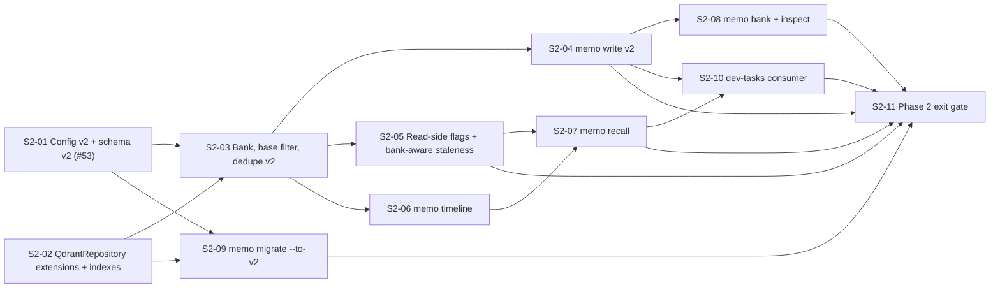

# User Stories — PRD-004 Phase 2: Banks, Kinds, Sessions, Recall

## Changelog

| Version | Date       | Summary                                                                                                                   | Author           |
| ------- | ---------- | ------------------------------------------------------------------------------------------------------------------------- | ---------------- |
| 1.0     | 2026-09-21 | Initial Phase 2 stories (S2-01 … S2-11) from spec v1.2 §18, with coverage validation against PRD-004 v1.12 Phase 2 scope. | product-engineer |

## Scope

Phase 2 of PRD-004: give memory a home (`bank`) and a lifecycle class (`kind`), add sessions, and replace the four-command session start with `memo recall`. Covers FR-2.1 through FR-2.10, acceptance criteria AC-2.1 through AC-2.9, plus AC-0.1/AC-0.2. Phase 1 is complete (v1.2.0, PR #74).

Phase 2 **changes payload data**: every new write carries `schema_version: "2"`, and `memo migrate --to-v2` rewrites existing points' payloads (never vectors, never deletes). Every story states its migration posture explicitly.

- PRD: [`docs/requirements/prd-004-long-lived-agent-memory.md`](../docs/requirements/prd-004-long-lived-agent-memory.md) v1.12 — §2.4–§2.6 and §8 normative
- Spec: [`specification-prd-004-long-lived-agent-memory.md`](./specification-prd-004-long-lived-agent-memory.md) v1.2 — **§18 is the implementation contract for every story below**; §5–§9 give the surrounding design
- Phase 1 record: [`fidelity-report-prd-004-phase-1-rollup.md`](./fidelity-report-prd-004-phase-1-rollup.md)

Decisions the stories rely on (spec §4): A1 one collection, A2 boolean state mirrors, A7 per-kind dedupe, A10 read-side normalization, A11 two scroll modes, A12 bank-aware staleness, A13 `bank init --set-default`, A14 no local snapshots in Phase 2.

## Existing GitHub Issues

| Issue                                              | Title                                        | Phase 2 story | Disposition                                                                                                                          |
| -------------------------------------------------- | -------------------------------------------- | ------------- | ------------------------------------------------------------------------------------------------------------------------------------ |
| [#53](https://github.com/llipe/memo-cli/issues/53) | Separate episodic and semantic memory stores | S2-01         | **Reuse.** Add a Refined Scope comment: `kind` (`self \| episodic \| semantic`) on one collection per PRD §2.5, not separate stores. |
| [#54](https://github.com/llipe/memo-cli/issues/54) | Stability-based decay                        | —             | Phase 3. Leave open; no comment needed now.                                                                                          |
| [#55](https://github.com/llipe/memo-cli/issues/55) | Track retrieval vs. actual use               | —             | Phase 3. Leave open.                                                                                                                 |
| [#56](https://github.com/llipe/memo-cli/issues/56) | Link-aware relevance                         | —             | Phase 5. Leave open.                                                                                                                 |
| [#57](https://github.com/llipe/memo-cli/issues/57) | Consolidation job                            | —             | Phase 4. Leave open.                                                                                                                 |
| [#58](https://github.com/llipe/memo-cli/issues/58) | Event-sourced storage                        | —             | Phase 5 (optional). Leave open.                                                                                                      |
| new                                                | S2-02 … S2-11                                | ten stories   | **Create** ten new issues, labels `story`, `memory-model`, plus `schema` / `cli` / `docs` as noted per story.                        |

## Dependency Map

## Recommended Implementation Order

1. **S2-01** and **S2-02** in parallel — pure foundations, no user-visible change.
2. **S2-03** — unblocks everything else.
3. **S2-04**, **S2-05**, **S2-06** — can proceed in parallel on separate branches; S2-04 and S2-05 both touch `search.ts`/`write.ts` only at distinct call sites.
4. **S2-07** — the headline feature; needs S2-05 and S2-06.
5. **S2-08**, **S2-09** — independent of each other.
6. **S2-10** — consumer side, after the CLI contract is stable.
7. **S2-11** — exit gate.

Target release: **memo-cli 1.3.0** (spec §15). Tagging and publishing remain human-run (`scripts/release.sh`).

---

### Story S2-01: Config v2 and payload schema v2 (#53)

**Priority:** Critical
**Estimated Size:** M
**Dependencies:** none

#### User Story

As a memo-cli maintainer,
I want the config and entry schemas to accept the v2 fields (`bank`, `kind`, sessions, validity, retention, archive state) with every PRD §2.5 rule enforced at validation time,
So that every later story builds on one typed contract instead of re-deriving the rules.

#### Context

Spec §18.2 and §18.3. Issue #53 asked for separate episodic/semantic stores; PRD-004 §2.5 resolves that as one collection with a `kind` field — this story is where that resolution lands. Nothing user-visible changes yet: v1 config files still parse, v1 writes still produce v1 payloads until S2-04.

#### Acceptance Criteria

- [ ] **AC1** — `MemoConfigSchema.schema_version` accepts `'1'` and `'2'`; a v1.2.0 `memo.config.json` parses unchanged and resolves `bank.default = 'kb'`, `recall.max_tokens = 2000`, and every `banks.*` value to the spec §8.4 table.
- [ ] **AC2** — `banks.kb.episodic.purge_after_days` and `banks.kb.semantic.purge_after_days` resolve to `undefined` when absent and to the explicit value when set; `banks.private.episodic.purge_after_days` defaults to `30`, `banks.private.semantic.purge_after_days` to `90`.
- [ ] **AC3** — `banks.private.self.soft_cap` defaults to `50`; `0` or a non-integer fails with `CONFIG_INVALID`.
- [ ] **AC4** — `recall.max_tokens` must be a positive integer; `0` fails with `CONFIG_INVALID`.
- [ ] **AC5** — `EntryPayloadV2Schema` rejects, with the named `path`, each of: `kind = self` in `bank = kb`; `kind = episodic` without `session_id`; `kind = semantic` with `source = agent` and empty `provenance`; `kind = self` carrying `stability`, `expires_at`, or `retrieval_count`; `seq` on a non-episodic entry.
- [ ] **AC6** — `entry_type` accepts `policy` and `observation`; `source` accepts `scan`; `sourceToConfidence('scan') === 'low'`.
- [ ] **AC7** — `normalizeEntry()` maps a v1 payload to `{ bank: 'kb', kind: 'semantic', schema_version: '1', archived: false, superseded: false, consolidated: false, pinned: false, pending_contradiction: false, valid_from: <timestamp_utc> }` and leaves every v2 payload field unchanged.
- [ ] **AC8** — `memo setup validate` on a v2 config prints the resolved default bank; `memo setup init --v2` writes `schema_version: "2"` with the default `bank`, `banks`, and `recall` blocks; without `--v2` it keeps writing `"1"`.
- [ ] **AC9** — The existing v1 `EntryPayloadSchema` export remains until S2-04 removes its last caller; no shipped command changes behavior in this story.

#### Business Rules

- PRD K1–K4 are schema rules, not command rules; commands may pre-check for friendlier messages but the schema is the backstop.
- `repo`/`org`/`domain` become optional at the schema level; K2 (required in `kb`) is enforced in the same `superRefine`.
- Defaults live in one place (`src/types/config.ts`) and are exported as constants, following the Phase 1 `DEFAULT_*` pattern.

#### Technical Notes

- Spec §18.2 for the exact Zod shapes; §18.3 for the rule table. `KebabOrUuid = KebabString.or(z.string().uuid())`.
- `normalizeEntry` lives in `src/lib/entry-normalize.ts` and is pure; it is the only place that knows "absent means v1".
- `setup.ts` currently `parse`s a literal `'1'` config (line 142); the `--v2` flag chooses which literal to write.

#### Testing Requirements

- **Unit Tests:** `config.test.ts` — v1 file unchanged; every §8.4 default; `kb` purge absence vs explicit value; `soft_cap`/`max_tokens` rejections; unknown keys preserved by `.passthrough()`. `entry.test.ts` (new) — one case per AC5 row, positive cases for each kind, `scan` source. `entry-normalize.test.ts` (new) — v1 → defaults; v2 untouched; missing `timestamp_utc` handled. `setup.test.ts` — `--v2` output shape.
- **Integration Tests:** `setup.test.ts` — `init --v2` then `validate` round-trips.
- **Manual/UI Testing:** `memo setup validate` on this repo's `memo.config.json` (v1) still passes.
- **Edge-Case Matrix:** `bank` as UUID; `bank = 'kb'` explicit in a v2 config; `banks.private` partially overridden; `contexts` with an invalid kebab value; `provenance` with a non-UUID.
- **Acceptance-Criteria Mapping:** AC1–AC4 → `config.test.ts`; AC5–AC6 → `entry.test.ts`; AC7 → `entry-normalize.test.ts`; AC8 → `setup.test.ts`; AC9 → full `pnpm test` unchanged.
- **Execution Commands:** `pnpm test -- --testPathPattern="config|entry|setup"`, `pnpm run validate`.

#### Migration Requirements

- Migration artifact: **not required** — schema definitions only; no stored data changes. Data migration is S2-09.
- Rollback/impact notes: reverting restores `literal('1')`; a `schema_version: "2"` config written by `--v2` would then fail `loadConfig` — document in the PR that users who opted in must revert their config too.
- Apply step: none.
- Verification after apply: `pnpm run validate` and `memo setup validate`.

#### Implementation Steps

1. Tests first: write `entry.test.ts`, `entry-normalize.test.ts`, and the new `config.test.ts` cases; confirm they fail.
2. Extend `src/types/config.ts` per §18.2; export defaults.
3. Add `EntryPayloadV2Schema` and shared enums to `src/types/entry.ts`; keep the v1 export.
4. Add `src/lib/entry-normalize.ts`.
5. Add `--v2` to `setup init`; print default bank in `setup validate`.
6. Update `docs/data-model.md` (config v2 table, payload v2 fields) in the same PR.

#### Files to Create/Modify

- `src/types/config.ts`, `src/types/entry.ts`, `src/lib/dedupe.ts` (`sourceToConfidence`), `src/commands/setup.ts`
- `src/lib/entry-normalize.ts`, `tests/unit/lib/entry-normalize.test.ts`, `tests/unit/types/entry.test.ts` — new
- `tests/unit/lib/config.test.ts`, `tests/unit/commands/setup.test.ts`, `tests/integration/commands/setup.test.ts`
- `docs/data-model.md`

#### Definition of Done Checklist

- [ ] Code implemented per technical guidelines
- [ ] Unit/integration/manual/edge-case tests written and passing
- [ ] Quality gates passing (`lint`, `format:check`, `typecheck`, `test`, `audit`)
- [ ] Code reviewed and approved
- [ ] Acceptance criteria verified and mapped to test evidence
- [ ] `setup.ts` coverage at or above `jest.config.ts` thresholds (spec §14)
- [ ] Refined Scope comment posted on #53
- [ ] Pull Request created and merged

---

### Story S2-02: `QdrantRepository` extensions and v2 payload indexes

**Priority:** Critical
**Estimated Size:** M
**Dependencies:** none

#### User Story

As a memo-cli maintainer,
I want the repository to offer ordered single-page scans, unordered full scans, counts, and payload updates, with every v2 filter field indexed,
So that `timeline`, `recall`, `bank`, and `migrate` can be written against one adapter without touching the Qdrant client directly.

#### Context

Spec §18.4 and decision A11. The shipped `scroll()` always sends `order_by: timestamp_utc desc`; Qdrant refuses `offset` alongside `order_by`, so a full-collection pass (migration) needs a second, unordered path. This story is pure adapter work with no user-visible change.

#### Acceptance Criteria

- [ ] **AC1** — `PAYLOAD_INDEXES` gains exactly twelve entries: `bank`, `kind`, `session_id`, `contexts` (keyword); `seq` (integer); `archived`, `superseded`, `consolidated`, `pinned` (bool); `valid_to`, `expires_at`, `archived_at` (datetime). `ensureIndexes()` creates only the missing ones and is idempotent (second run creates nothing).
- [ ] **AC2** — `scrollAll(filter, { batch, withVector }, onPage)` sends no `order_by`, follows `next_page_offset` until it is `null`, and invokes `onPage` once per page in order.
- [ ] **AC3** — `scrollOrdered(filter, { orderBy, limit, withVector })` sends `order_by` and never `offset`; it returns one page.
- [ ] **AC4** — `count(filter)` calls the client's `count` with `exact: true` and returns the number.
- [ ] **AC5** — `setPayload(id, payload)` and `batchSetPayload(ops)` call `setPayload` / `batchUpdate` with `wait: true`; `batchSetPayload` chunks at 256 operations; failures map to `QDRANT_OPERATION_FAILED`.
- [ ] **AC6** — `fetchStalenessCorpus({ bank, repos }, limit)` applies the spec §8.1 base filter for `bank` plus the `repo` any-match only when `bank = 'kb'`; `fetchByRepo` is deleted after `search.ts` moves to it (S2-05 may carry that call-site change if it merges first — either order is acceptable, the method must not survive Phase 2).
- [ ] **AC7** — Existing `scroll`, `search`, `getById`, `getByDedupeKey`, `deleteById`, `deleteByFilter`, `upsert` behave exactly as before (existing tests unchanged and passing).

#### Business Rules

- Commands never import `@qdrant/js-client-rest`; every Qdrant call goes through this class (technical guidelines §3).
- Ordered scans require a payload index on the `order_by` key — every key used by Phase 2 (`seq`, `timestamp_utc`) is indexed.

#### Technical Notes

- Spec §18.4 method list. `scrollAll` uses `offset: next_page_offset` from the previous response; `withVector` is forwarded.
- Keep `withRetry` on every call, matching the shipped methods.
- `batchUpdate` operation shape: `{ set_payload: { points: [id], payload } }`.

#### Testing Requirements

- **Unit Tests:** `qdrant.test.ts` — `scrollAll` over three mocked pages (`next_page_offset` → `null`), asserts no `order_by` and correct `offset` chaining; `scrollOrdered` request shape; `count`; `batchSetPayload` chunking (300 ops → 2 calls); `fetchStalenessCorpus` filter shape for `kb` vs private; error mapping.
- **Integration Tests:** `tests/integration/lib/qdrant.test.ts` — `ensureIndexes` on a mocked v1.2.0 `payload_schema` creates exactly 12 indexes; on a full schema creates 0.
- **Manual/UI Testing:** run any command against a pre-existing v1.2.0 collection and confirm `getCollection().payload_schema` lists the 12 new indexes; second run logs "no missing indexes" under `MEMO_DEBUG`.
- **Edge-Case Matrix:** empty collection (`scrollAll` calls `onPage` zero times); page exactly `batch` long; `batchSetPayload([])` is a no-op; `count` on a filter matching nothing returns 0; client throws mid-`scrollAll` (error propagates, pages already delivered are not retried).
- **Acceptance-Criteria Mapping:** AC1 → integration `qdrant.test.ts` + manual; AC2–AC6 → unit `qdrant.test.ts`; AC7 → existing suites.
- **Execution Commands:** `pnpm test -- --testPathPattern="qdrant"`, `pnpm run validate`.

#### Migration Requirements

- Migration artifact: **not required** — indexes are additive and reconciled at runtime; no payload rewritten.
- Rollback/impact notes: reverting leaves twelve unused indexes; harmless.
- Apply step: none (first command run reconciles).
- Verification after apply: `payload_schema` inspection as in manual testing.

#### Implementation Steps

1. Tests first for every new method and the index count.
2. Append the twelve indexes to `PAYLOAD_INDEXES`.
3. Implement `scrollOrdered`, `scrollAll`, `count`, `setPayload`, `batchSetPayload`, `fetchStalenessCorpus`.
4. Update `docs/data-model.md` index table and `docs/technical-guidelines.md` adapter method list.

#### Files to Create/Modify

- `src/lib/qdrant.ts`
- `tests/unit/lib/qdrant.test.ts`, `tests/integration/lib/qdrant.test.ts`
- `docs/data-model.md`, `docs/technical-guidelines.md`

#### Definition of Done Checklist

- [ ] Code implemented per technical guidelines
- [ ] Unit/integration/manual/edge-case tests written and passing
- [ ] Quality gates passing (`lint`, `format:check`, `typecheck`, `test`, `audit`)
- [ ] Code reviewed and approved
- [ ] Acceptance criteria verified and mapped to test evidence
- [ ] Index reconciliation verified live against a pre-existing collection
- [ ] Pull Request created and merged

---

### Story S2-03: Bank resolution, base filter, and dedupe v2

**Priority:** Critical
**Estimated Size:** M
**Dependencies:** S2-01, S2-02

#### User Story

As any caller,
I want one function that decides which bank a command targets and one that builds the bank/kind/state filter every read applies,
So that no two commands can disagree about isolation.

#### Context

Spec §8.1 and §18.5. PRD B1–B4 (banks) and R3 (default exclusions) are implemented here once; S2-04 through S2-09 compose these functions rather than restating them. Dedupe v2 (A7) also lands here because the write path (S2-04) depends on it.

#### Acceptance Criteria

- [ ] **AC1** — `resolveBank(flag, env, config)` returns, in order, `flag`, then `env.MEMO_BANK`, then `config.bank.default`, then `'kb'`; an invalid value at any level fails `VALIDATION_FAILED` naming the source (`--bank`, `MEMO_BANK`, `config.bank.default`).
- [ ] **AC2** — `defaultKind('kb') === 'semantic'`; `defaultKind(<anything else>) === 'episodic'`; `isPrivateBank`.
- [ ] **AC3** — `policyFor(config, bank, kind)` returns the `banks.kb.*` block for `kb` and `banks.private.*` for every other bank; `policyFor(_, 'kb', 'self')` throws `VALIDATION_FAILED`.
- [ ] **AC4** — `buildBaseFilter` for `bank = kb` produces `must: [{ should: [{ key: 'bank', match: { value: 'kb' } }, { is_empty: { key: 'bank' } }] }]`; for a private bank an exact `bank` match; `kind = all` adds `must_not kind = self`; a specific kind adds `must kind = <k>`; default exclusions add `must_not archived = true` and `must_not superseded = true`; `includeArchived` / `includeSuperseded` lift each independently; `session` adds `must session_id = <s>`; `asOf` adds the §8.1 `valid_from`/`valid_to` shape and implies `includeSuperseded`.
- [ ] **AC5** — `buildSearchFilters` and `buildListFilters` accept `base` and merge `must`/`must_not`/`should` by concatenation (never nesting); the `repo` clause is added only when `bank = 'kb'` or an explicit `--repo` was passed.
- [ ] **AC6** — `buildDedupeKeyV2` produces the §18.5 keys: semantic without `session`/`seq`; episodic including both; `self` returns a key that never collides (random per call).
- [ ] **AC7** — Two consecutive episodic writes with identical `repo/commit/story/session` and `seq` 0 and 1 produce different keys; the same inputs with the same `seq` produce the same key.

#### Business Rules

- v1 points (no `bank`) belong to `kb` (B1) — encoded by the `is_empty` clause, not by data rewriting.
- `self` is excluded by default from every ranked or listed read (PRD §2.5, K4).
- Archived and superseded entries are excluded before any ranking (R3).

#### Technical Notes

- Spec §8.1 function signatures; §18.5 for composition with the shipped `buildSearchFilters` / `buildListFilters` / `buildLexicalScrollFilter`.
- `filters.ts` is new; the two existing builders gain a `base` input and otherwise keep their signatures so Phase 1 tests keep passing with `base = buildBaseFilter({ bank: 'kb', kind: 'all' })`.
- Existing `getByDedupeKey` is reused; S2-04 adds the v1-key fallback for `kb` semantic writes.

#### Testing Requirements

- **Unit Tests:** `bank.test.ts` (new) — every resolution permutation of flag/env/config/default, invalid source naming, `defaultKind`, `policyFor` incl. the `kb/self` throw. `filters.test.ts` (new) — filter shape snapshot per AC4 combination (kb/private × kind × exclusions × session × asOf). `search-filters.test.ts`, `list-filters.test.ts` — merge semantics, conditional `repo` clause. `dedupe.test.ts` — v2 keys per kind, `self` uniqueness across 1,000 calls, `seq` sensitivity.
- **Integration Tests:** none (pure).
- **Manual/UI Testing:** none (no command changes).
- **Edge-Case Matrix:** `MEMO_BANK=""` (treated as unset); `MEMO_BANK=KB` (invalid, not kebab); `asOf` equal to `valid_from` (inclusive) and equal to `valid_to` (exclusive); `kind = self` with `includeSuperseded` (returns superseded self); `base` with empty arrays merges cleanly.
- **Acceptance-Criteria Mapping:** AC1–AC3 → `bank.test.ts`; AC4 → `filters.test.ts`; AC5 → `search-filters.test.ts` + `list-filters.test.ts`; AC6–AC7 → `dedupe.test.ts`.
- **Execution Commands:** `pnpm test -- --testPathPattern="bank|filters|dedupe"`, `pnpm run validate`.

#### Migration Requirements

- Migration artifact: **not required** — pure functions; no data change.
- Rollback/impact notes: none.
- Apply step: none.
- Verification after apply: `pnpm run validate`.

#### Implementation Steps

1. Tests first (`bank.test.ts`, `filters.test.ts`, dedupe v2 cases, builder merge cases).
2. Create `src/lib/bank.ts`, `src/lib/filters.ts`.
3. Extend `search-filters.ts`, `list-filters.ts` with `base`.
4. Add `buildDedupeKeyV2` to `dedupe.ts`.
5. `docs/technical-guidelines.md` architecture tree gains both modules.

#### Files to Create/Modify

- `src/lib/bank.ts`, `src/lib/filters.ts`, `tests/unit/lib/bank.test.ts`, `tests/unit/lib/filters.test.ts` — new
- `src/lib/search-filters.ts`, `src/lib/list-filters.ts`, `src/lib/dedupe.ts`
- `tests/unit/lib/search-filters.test.ts`, `tests/unit/lib/list-filters.test.ts`, `tests/unit/lib/dedupe.test.ts`
- `docs/technical-guidelines.md`

#### Definition of Done Checklist

- [ ] Code implemented per technical guidelines
- [ ] Unit/integration/manual/edge-case tests written and passing
- [ ] Quality gates passing (`lint`, `format:check`, `typecheck`, `test`, `audit`)
- [ ] Code reviewed and approved
- [ ] Acceptance criteria verified and mapped to test evidence
- [ ] Pull Request created and merged

---

### Story S2-04: `memo write` v2 — banks, kinds, sessions, supersede

**Priority:** Critical
**Estimated Size:** L
**Dependencies:** S2-01, S2-02, S2-03

#### User Story

As a long-lived agent,
I want to write `self`, `episodic`, and `semantic` entries into my own bank, with sessions, provenance, and explicit supersession,
So that my memories carry the fields the rest of Phase 2 filters and recalls on.

#### Context

Spec §18.6 (eleven-step order) and §8.3. This is the producer side of every Phase 2 acceptance criterion: AC-2.1, AC-2.2, and AC-2.8 are verified here. The `--supersedes` two-step is deliberately non-transactional; the failure message contract is part of the acceptance criteria.

#### Acceptance Criteria

- [ ] **AC1** — `memo write --kind self …` in bank `kb` exits 1 with `VALIDATION_FAILED`; with `MEMO_BANK=jarvis-memory` (no `--repo`) it succeeds and the stored payload carries `bank = jarvis-memory`, `kind = self`, `schema_version = "2"`, `valid_from`, and no retention fields. (PRD AC-2.1)
- [ ] **AC2** — `memo write` with no `--kind` produces `kind = episodic` in a private bank and `kind = semantic` in `kb`. (PRD AC-2.2)
- [ ] **AC3** — In `kb`, missing `repo/org/domain` still fails `REPO_CONTEXT_UNRESOLVED`; in a private bank they are optional and stored when given.
- [ ] **AC4** — An episodic write with `--session s-42` and no `--seq` receives `seq = (max existing seq in that bank+session) + 1`, `0` when none; `expires_at = timestamp_utc + policy.expires_in_days` (30 private, 90 kb) or `+ --expires-in` when given (`2d`, `12h`, `30m` accepted; anything else `VALIDATION_FAILED`).
- [ ] **AC5** — `entry_type` defaults to `observation` for episodic and `decision` otherwise; `--manual` forces `source = manual`; `--source scan` is accepted.
- [ ] **AC6** — `--kind semantic --source agent` without `--provenance` and without `--manual` fails `VALIDATION_FAILED` at `provenance`.
- [ ] **AC7** — `--supersedes <id>`: the new entry is stored, then the target receives `valid_to = now`, `superseded = true`, `superseded_by = <new id>`; a target in another bank, of another kind, or already superseded fails `VALIDATION_FAILED` before any write; a missing target fails `ENTRY_NOT_FOUND`. (PRD AC-2.8, write half)
- [ ] **AC8** — If the target update fails after the new entry was stored, the command exits 2 with `QDRANT_OPERATION_FAILED` and the message contains both the new id and the target id.
- [ ] **AC9** — A `self` write when the bank already holds `>= soft_cap` non-superseded `self` entries succeeds and emits the warning `self entries in <bank>: <n> (soft cap <cap>)` on stderr (human) or in `warnings: []` (JSON).
- [ ] **AC10** — Dedupe uses `buildDedupeKeyV2`; a `kb` semantic write also checks the v1 key so a pre-migration duplicate is detected; `self` writes never trigger duplicate handling; the existing `--on-duplicate` actions and TTY prompt behave as before.
- [ ] **AC11** — JSON result carries the full v2 payload plus `created`, `updated`, `duplicate_detected`, `superseded?`, `warnings?`; every pre-existing key is unchanged.

#### Business Rules

- PRD K1–K5 and B1–B3.
- Retention fields are set from policy and never user-settable (spec §5.2).
- The new entry is never rolled back on a failed supersede update (spec §18.6 step 10).

#### Technical Notes

- Spec §18.6 gives the exact step order; keep the shipped duplicate-prompt code untouched.
- `--context` is repeatable (Commander `collect`); `--provenance` is CSV of UUIDs.
- `nextSeq` uses `scrollOrdered` with `order_by: seq desc, limit 1` on `{ bank, kind: episodic, session_id }`.
- The soft-cap check is one `count()`; skip it entirely when `kind !== 'self'`.
- Duration parser lives in `src/lib/duration.ts` (pure, reused by Phase 3 `--older-than`).

#### Testing Requirements

- **Unit Tests:** `write.test.ts` — AC1–AC11 on the mocked repo, asserting call order (`getById` → `upsert` → `setPayload`), the exact stored payload per kind, warning text, error codes/messages; `duration.test.ts` (new).
- **Integration Tests:** `tests/integration/commands/write.test.ts` — supersede round-trip (write A, write B `--supersedes A`, `getById(A)` shows `valid_to`/`superseded_by`); v1-key fallback catches a duplicate written by v1.2.0; two-bank writes never share dedupe hits.
- **Manual/UI Testing:** against `memo_eval` (`MEMO_COLLECTION=memo_eval`): one `self`, three episodic with auto-`seq`, one semantic `--supersedes`; confirm with `memo read --id` (S2-05) or Qdrant UI.
- **Edge-Case Matrix:** `--seq` explicit lower than existing max (allowed, stored as given); `--expires-in 0d` (rejected); `--supersedes` pointing at itself (impossible pre-write, but guard `target.id === id`); soft cap exactly at `soft_cap` (warns) vs `soft_cap - 1` (silent); `--bank kb` explicit with `--kind self`; `--context` given twice with the same value (deduplicated); JSON mode duplicate error unchanged.
- **Acceptance-Criteria Mapping:** AC1–AC2, AC5–AC9, AC11 → unit `write.test.ts`; AC3 → unit + existing `REPO_CONTEXT_UNRESOLVED` case; AC4 → unit + `duration.test.ts`; AC7, AC10 → integration `write.test.ts`.
- **Execution Commands:** `pnpm test -- --testPathPattern="write|duration"`, `pnpm run validate`.

#### Migration Requirements

- Migration artifact: **not required by this story** — new writes are v2; existing points are untouched and remain readable (A10). Rewriting existing points is S2-09.
- Rollback/impact notes: v2 points written by 1.3.0 are read by 1.2.x as ordinary entries (read paths do not parse the schema); their extra fields are ignored. Reinstalling 1.2.x loses nothing.
- Apply step: none.
- Verification after apply: integration suite; manual `memo_eval` writes.

#### Implementation Steps

1. Tests first: unit cases per AC, integration supersede round-trip.
2. Add `src/lib/duration.ts`.
3. Add the ten flags to `write.ts`; replace the payload-building block with the §18.6 order.
4. Implement `nextSeq`, soft-cap warning, supersede update with the AC8 message.
5. Switch dedupe to v2 with the `kb` semantic v1 fallback.
6. Remove the v1 `EntryPayloadSchema` export if this was its last caller.
7. `README.md` write section, `docs/data-model.md` write-path notes.

#### Files to Create/Modify

- `src/commands/write.ts`, `src/lib/dedupe.ts`, `src/types/entry.ts`
- `src/lib/duration.ts`, `tests/unit/lib/duration.test.ts` — new
- `tests/unit/commands/write.test.ts`, `tests/integration/commands/write.test.ts`
- `README.md`, `docs/data-model.md`

#### Definition of Done Checklist

- [ ] Code implemented per technical guidelines
- [ ] Unit/integration/manual/edge-case tests written and passing
- [ ] Quality gates passing (`lint`, `format:check`, `typecheck`, `test`, `audit`)
- [ ] Code reviewed and approved
- [ ] Acceptance criteria verified and mapped to test evidence
- [ ] `write.ts` coverage at or above `jest.config.ts` thresholds (spec §14)
- [ ] Pull Request created and merged

---

### Story S2-05: Read-side flags on `search`, `list`, `tags`, `read`, and bank-aware staleness

**Priority:** Critical
**Estimated Size:** L
**Dependencies:** S2-02, S2-03

#### User Story

As any agent or human,
I want every read command to target a bank and a kind, optionally include archived or superseded entries, or query as of a date,
So that private banks are isolated and history stays queryable without changing what existing callers get back.

#### Context

Spec §18.7. Verifies PRD AC-2.3 (identical default results) and AC-2.4 (bank isolation). Also carries decision A12: staleness must compare within the bank, or a private bank's entries would be flagged stale by `kb` entries.

#### Acceptance Criteria

- [ ] **AC1** — `search`, `list`, `tags list`, and `read` accept `--bank`, `--kind self|episodic|semantic|all`, `--session`, `--include-archived`, `--include-superseded`, `--as-of <iso>`; invalid `--kind` or non-ISO `--as-of` fail `VALIDATION_FAILED`. `read` accepts only `--include-archived`/`--include-superseded` (an id is explicit).
- [ ] **AC2** — With no new flags, `memo search` and `memo list` return exactly the entries they returned in v1.2.0: the replay test feeds the recorded `candidates.json` ids through the v2 filter path and asserts the same top-N as the Phase 1 recording. (PRD AC-2.3)
- [ ] **AC3** — `memo search --bank a-memory` never returns an entry of `b-memory`, and vice versa, verified with two banks on the mocked repository and manually on `memo_eval`. (PRD AC-2.4)
- [ ] **AC4** — The dense query, the lexical scroll, and the staleness corpus all use the same base filter; the staleness corpus call is `fetchStalenessCorpus({ bank, repos })` and `fetchByRepo` no longer exists.
- [ ] **AC5** — `--kind self` returns `self` entries newest-first, unranked, with `final_score` absent; `self` never enters `rankResults` in any other mode.
- [ ] **AC6** — Included archived/superseded entries are prefixed `[archived]` / `[superseded]` in human output and carry `archived: true` / `superseded: true` in JSON.
- [ ] **AC7** — `--as-of <date>` returns only entries with `valid_from <= date` and (`valid_to` absent or `> date`), and implies `--include-superseded`.
- [ ] **AC8** — JSON results and `list` rows add `bank`, `kind`, `session_id?`, `seq?`, `valid_from?`, `valid_to?`, `superseded_by?`, `archived?`, `pinned?` from `normalizeEntry`; `filters` in the search envelope adds `bank`, `kind`, `session?`, `as_of?`. No existing key changes.
- [ ] **AC9** — `memo read --id` prints every v2 field present and renders `provenance` with one `scroll({ has_id })` call, suffixing missing ids `(deleted)`; JSON gives `provenance: [{ id, deleted }]`.

#### Business Rules

- Defaults: `bank` per B3, `kind = all` minus `self`, archived and superseded excluded (FR-2.4).
- No cross-bank search exists (B4).
- Ranking, tiers, staleness thresholds, and lexical matching are untouched — this story changes candidate sets, never scores.

#### Technical Notes

- `src/lib/read-flags.ts` (new, pure) parses and validates the shared flags once; each command calls it.
- `search.ts`: pass `base` into `buildSearchFilters` and `buildLexicalScrollFilter`; replace `fetchByRepo` with `fetchStalenessCorpus`.
- `read.ts`: `provenance` lookup is one scroll with `has_id: [...]`, capped at the array length.

#### Testing Requirements

- **Unit Tests:** `read-flags.test.ts` (new); `search.test.ts` — filter shapes passed to `search()`, lexical scroll, and `fetchStalenessCorpus` all share `base`; two-bank isolation; `--kind self` path skips `rankResults`; `--as-of` implies superseded; `list.test.ts`, `tags.test.ts`, `read.test.ts` — flags, JSON fields, `(deleted)` marker.
- **Integration Tests:** `tests/relevance/replay.test.ts` — AC2 identity assertion; `tests/integration/commands/search.test.ts` — two-bank mocked run; `read.test.ts` — provenance with one deleted id.
- **Manual/UI Testing:** on `memo_eval`: `memo search "<eval query>"` before/after this story produce identical ids; write to two private banks (S2-04) and search each; `memo read --id` on a semantic entry whose provenance names a deleted id.
- **Edge-Case Matrix:** `--kind all --include-archived` on a bank with only archived entries; `--as-of` in the future; `--as-of` before every `valid_from` (empty); `--session` on `search` with `kind = semantic` (empty, valid); `read` on a v1 point (normalized fields shown); `tags list --bank <private>` on an empty bank.
- **Acceptance-Criteria Mapping:** AC1 → `read-flags.test.ts`; AC2 → `replay.test.ts`; AC3 → `search.test.ts` + integration + manual; AC4–AC5, AC7–AC8 → `search.test.ts`/`list.test.ts`; AC6 → output tests; AC9 → `read.test.ts`.
- **Execution Commands:** `pnpm test -- --testPathPattern="read-flags|search|list|tags|read|replay"`, `pnpm run eval:relevance` (live, optional), `pnpm run validate`.

#### Migration Requirements

- Migration artifact: **not required** — read-only changes; v1 points pass the default filter via `is_empty`.
- Rollback/impact notes: none.
- Apply step: none.
- Verification after apply: AC2 replay identity.

#### Implementation Steps

1. Tests first, starting with the AC2 replay identity (must pass before and after).
2. Add `read-flags.ts`.
3. Wire `base` through `search.ts`, `list.ts`, `tags.ts`; switch staleness corpus; delete `fetchByRepo`.
4. Extend `read.ts` for v2 fields and provenance markers.
5. Output: prefixes, JSON fields.
6. `README.md` flag tables, `docs/system-overview.md` search flow.

#### Files to Create/Modify

- `src/lib/read-flags.ts`, `tests/unit/lib/read-flags.test.ts` — new
- `src/commands/search.ts`, `src/commands/list.ts`, `src/commands/tags.ts`, `src/commands/read.ts`, `src/lib/qdrant.ts` (`fetchByRepo` removal), `src/lib/output.ts`
- `tests/unit/commands/{search,list,tags,read}.test.ts`, `tests/integration/commands/{search,read}.test.ts`, `tests/relevance/replay.test.ts`
- `README.md`, `docs/system-overview.md`

#### Definition of Done Checklist

- [ ] Code implemented per technical guidelines
- [ ] Unit/integration/manual/edge-case tests written and passing
- [ ] Quality gates passing (`lint`, `format:check`, `typecheck`, `test`, `audit`)
- [ ] Code reviewed and approved
- [ ] Acceptance criteria verified and mapped to test evidence
- [ ] AC-2.3 identity evidence (before/after ids) in the PR body
- [ ] Pull Request created and merged

---

### Story S2-06: `memo timeline`

**Priority:** High
**Estimated Size:** S
**Dependencies:** S2-02, S2-03

#### User Story

As a long-lived agent,
I want to replay what I did in a session, in order,
So that I can resume work without similarity ranking reshuffling my own history.

#### Context

Spec §18.8; PRD FR-2.5, AC-2.5. Sequence order is the whole point — the command never embeds and never ranks.

#### Acceptance Criteria

- [ ] **AC1** — `memo timeline --bank x --session s-42` returns episodic entries ordered by `seq` asc, then `timestamp_utc` asc, regardless of content or similarity. (PRD AC-2.5)
- [ ] **AC2** — Without `--session`, entries are the most recent `--last` (default 50, max 500) by `timestamp_utc` desc, grouped by `session_id` in JSON (`sessions: [{ session_id, entries }]`) and with a header per session in human output.
- [ ] **AC3** — `--since <iso>` adds a lower bound on `timestamp_utc`; invalid ISO fails `VALIDATION_FAILED`.
- [ ] **AC4** — Only `kind = episodic` is returned; default archived/superseded exclusions apply; no embeddings adapter is constructed and `rankResults` is never called (asserted).
- [ ] **AC5** — Empty bank or session exits 0 with `count: 0`; JSON envelope `{ bank, session_id?, entries | sessions, count }`.
- [ ] **AC6** — Human output: `seq  timestamp  lead  id` per line (spec §10).

#### Business Rules

- Episodic memory is sequential (PRD §2.5): `timeline` is the only ordered view and it is never ranked.

#### Technical Notes

- `scrollOrdered` with `order_by: { key: 'seq', direction: 'asc' }` for the session shape; the shipped `scroll()` for the grouped shape. Both need the `seq` integer index (S2-02).
- Tie-break on `seq` client-side (only explicit `--seq` can collide).

#### Testing Requirements

- **Unit Tests:** `timeline.test.ts` (new) — mocked repo returns points in scrambled order → output sorted; grouping; `--last` clamp at 500; `--since` filter shape; no `createEmbeddings` call; empty results.
- **Integration Tests:** `tests/integration/commands/timeline.test.ts` — write three episodic entries (mocked upsert), timeline returns them in `seq` order.
- **Manual/UI Testing:** on `memo_eval`, after S2-04's manual writes: `memo timeline --bank <b> --session <s>` and without `--session`.
- **Edge-Case Matrix:** `--last 0` (rejected); `--last 501` (clamped to 500, warned); two entries with equal `seq`; a session id that exists in another bank only (empty).
- **Acceptance-Criteria Mapping:** AC1–AC5 → `timeline.test.ts`; AC1 → integration; AC6 → output snapshot.
- **Execution Commands:** `pnpm test -- --testPathPattern="timeline"`, `pnpm run validate`.

#### Migration Requirements

- Migration artifact: **not required** — read-only.
- Rollback/impact notes: none.
- Apply step: none.
- Verification after apply: unit suite.

#### Implementation Steps

1. Tests first.
2. `src/commands/timeline.ts`; register in `src/index.ts`.
3. Human/JSON output helpers.
4. `README.md` command section, `docs/system-overview.md`.

#### Files to Create/Modify

- `src/commands/timeline.ts`, `tests/unit/commands/timeline.test.ts`, `tests/integration/commands/timeline.test.ts` — new
- `src/index.ts`, `src/lib/output.ts`
- `README.md`, `docs/system-overview.md`

#### Definition of Done Checklist

- [ ] Code implemented per technical guidelines
- [ ] Unit/integration/manual/edge-case tests written and passing
- [ ] Quality gates passing (`lint`, `format:check`, `typecheck`, `test`, `audit`)
- [ ] Code reviewed and approved
- [ ] Acceptance criteria verified and mapped to test evidence
- [ ] Pull Request created and merged

---

### Story S2-07: `memo recall`

**Priority:** Critical
**Estimated Size:** L
**Dependencies:** S2-05, S2-06

#### User Story

As any agent starting a session,
I want one call that returns my self entries, applicable policies, relevant shared decisions, my own lessons, and my last session within a token budget,
So that I restore context without running four commands and synthesizing by hand.

#### Context

Spec §8.5 and §18.9; PRD FR-2.6, AC-2.6, goal 3. Per A14, Phase 2 `recall` is read-only: it emits a `query_id` but writes no snapshot and updates no counters.

#### Acceptance Criteria

- [ ] **AC1** — `memo recall "<task>" --bank x` returns sections in the order `SELF`, `POLICIES`, `SHARED`, `MINE`, `LAST SESSION`, `CONFLICTS`; `SELF` contains every non-superseded `self` entry of the bank, newest first, and omits superseded ones. (PRD AC-2.6)
- [ ] **AC2** — With `--max-tokens` smaller than `SELF` alone, `SELF` is returned intact, every other section is trimmed to empty and listed in `truncated`, and `budget.used_tokens > max_tokens` is reported honestly.
- [ ] **AC3** — Trimming proceeds `conflicts → last_session (oldest first) → mine → shared → policies`; the first budget that fits stops trimming; token estimate is `ceil(chars / 4)` of the rendered line.
- [ ] **AC4** — An id returned in an earlier section never appears in a later one; the bundle carries exactly one `query_id` (UUID v4).
- [ ] **AC5** — Section caps: `SHARED` 8, `MINE` 5, `LAST SESSION` 15 (most recent by `seq`), `CONFLICTS` 5, `POLICIES` all, `SELF` all (stderr warning above `soft_cap`).
- [ ] **AC6** — `SHARED` and `MINE` are ranked by `rankResults` with tiers and `stale`/`stale_by` exactly as `memo search` (same config, same corpus rules); `LAST SESSION` is `seq`-ordered; `SELF` lines carry no score or tier.
- [ ] **AC7** — With `bank = kb`, `SELF`, `MINE`, and `LAST SESSION` are omitted from both JSON and human output.
- [ ] **AC8** — One embeddings call per invocation; no `setPayload`/`batchSetPayload` and no filesystem write occur (asserted on mocks).
- [ ] **AC9** — `--max-tokens` defaults to `config.recall.max_tokens` (2000); `--scope repo|related` applies to `SHARED` only; JSON envelope per spec §6.1; human output per §10 with the `budget: used/max · truncated: …` footer.
- [ ] **AC10** — `POLICIES` is populated from `kb` semantic entries with `entry_type = policy` when any exist, else an empty array.

#### Business Rules

- `SELF` is never trimmed, never ranked (K4).
- Lower sections are trimmed first (FR-2.6).
- `recall` at `kb` is a bundle of `POLICIES`, `SHARED`, `CONFLICTS` only.

#### Technical Notes

- `assembleRecall(inputs, budget)` in `src/lib/recall.ts` is pure and is where AC2–AC5 live; the command gathers inputs per the §18.9 table (1 embed, ≤3 dense, ≤2 lexical, ≤4 scrolls).
- Reuse the search pipeline (`computeOverfetchLimit`, lexical union, `rankResults`, `detectStaleness`) by extracting a `rankCandidates()` helper from `search.ts` rather than copying it.
- Latency target `< 4 s` (spec §11); measure once live and record in the PR.

#### Testing Requirements

- **Unit Tests:** `recall.test.ts` (lib, new) — AC1–AC5, AC7 table-driven with synthetic sections; `recall.test.ts` (command, new) — call counts and shapes on mocked repo/embeddings, no write calls, `kb` mode, `--scope` reaching only the `SHARED` filter, `POLICIES` filter shape.
- **Integration Tests:** `tests/integration/commands/recall.test.ts` — seeded mock with two banks, one superseded `self`, a `policy` entry, and a two-session episodic history; assert the full JSON bundle.
- **Manual/UI Testing:** on `memo_eval` after S2-04 writes: `memo recall "plan the next story" --bank <b>` human and `--json`; `--max-tokens 200`; `--bank kb`. Record wall time.
- **Edge-Case Matrix:** bank with no episodic history (`last_session` null); `self` count above `soft_cap`; task string empty (rejected, `VALIDATION_FAILED`); identical entry in `SHARED` candidates and `MINE` (dedup keeps `SHARED`); `--max-tokens` huge (nothing truncated, `truncated: []`); embeddings failure surfaces `EMBEDDING_API_ERROR` and no partial bundle.
- **Acceptance-Criteria Mapping:** AC1–AC5, AC7 → lib `recall.test.ts`; AC6, AC8–AC10 → command `recall.test.ts` + integration; latency → manual, PR body.
- **Execution Commands:** `pnpm test -- --testPathPattern="recall"`, `pnpm run validate`.

#### Migration Requirements

- Migration artifact: **not required** — read-only.
- Rollback/impact notes: none.
- Apply step: none.
- Verification after apply: integration suite.

#### Implementation Steps

1. Tests first for `assembleRecall` (pure), then the command.
2. Extract `rankCandidates()` from `search.ts` (no behavior change; Phase 1 tests must stay green).
3. `src/lib/recall.ts`; `src/commands/recall.ts`; register.
4. Output renderer for sections and footer.
5. `README.md` (command + session protocol preview), `docs/system-overview.md` (recall flow diagram).

#### Files to Create/Modify

- `src/lib/recall.ts`, `src/commands/recall.ts`, `tests/unit/lib/recall.test.ts`, `tests/unit/commands/recall.test.ts`, `tests/integration/commands/recall.test.ts` — new
- `src/commands/search.ts` (helper extraction), `src/index.ts`, `src/lib/output.ts`
- `README.md`, `docs/system-overview.md`

#### Definition of Done Checklist

- [ ] Code implemented per technical guidelines
- [ ] Unit/integration/manual/edge-case tests written and passing
- [ ] Quality gates passing (`lint`, `format:check`, `typecheck`, `test`, `audit`)
- [ ] Code reviewed and approved
- [ ] Acceptance criteria verified and mapped to test evidence
- [ ] Live latency measurement in the PR body
- [ ] Pull Request created and merged

---

### Story S2-08: `memo bank init|list|show` and `inspect` banks facet

**Priority:** High
**Estimated Size:** M
**Dependencies:** S2-04

#### User Story

As an operator,
I want to create a bank, list every bank with counts per kind, and inspect one bank's self entries,
So that I can see whose memory exists and how much of it there is.

#### Context

Spec §18.10; PRD B5, FR-2.7 (`bank` half). Decision A13: `init` only writes `memo.config.json` under an explicit `--set-default`.

#### Acceptance Criteria

- [ ] **AC1** — `memo bank init --id <id>` validates the id (kebab or UUID; `kb` rejected with `VALIDATION_FAILED`), and when the bank is empty writes one `self` entry (`entry_type = structure`, `source = manual`, tags `bank,self` unless `--tags`, rationale `Bank <id> initialised.` unless `--rationale`) via the S2-04 write path; JSON `{ bank, created: true, self_id, default_set }`.
- [ ] **AC2** — A second `init` on the same id writes nothing, prints the existing summary, exits 0 with `created: false`.
- [ ] **AC3** — `--set-default` sets `config.bank.default = <id>` through `writeConfig`; without it `writeConfig` is never called (asserted).
- [ ] **AC4** — `memo bank list` shows every bank id with `self`/`episodic`/`semantic` counts and a total; v1 points without `bank` are counted under `kb`; JSON `{ banks: [...] }`.
- [ ] **AC5** — `memo bank show --id <id>` prints non-superseded `self` entries newest first, counts per kind and per state (`active`, `archived`, `superseded`), and `last_session_id`; unknown bank exits 0 with zero counts and a notice.
- [ ] **AC6** — `memo inspect` adds a `banks` facet (counts only); existing facets unchanged.

#### Business Rules

- Banks are created by writing their first `self` entry (B5); there is no bank registry.
- Bank ids are labels, not identities (PRD §9); no ownership check exists.

#### Technical Notes

- `list` uses `aggregateField(scroll, 'bank')` from the shipped `facets.ts`, folding `undefined` into `kb`; per-bank kind counts are three `count()` calls each — acceptable at the expected handful of banks (spec §18.10).
- `init` delegates to `handleWrite` with fixed flags rather than duplicating the write path.

#### Testing Requirements

- **Unit Tests:** `bank.test.ts` (command, new) — id validation, `kb` rejection, idempotent `init`, `writeConfig` gating, `list` folding and counts, `show` ordering and state counts; `inspect.test.ts` — `banks` facet present.
- **Integration Tests:** `tests/integration/commands/bank.test.ts` — init → list → show on a mocked repo with a v1 point present.
- **Manual/UI Testing:** on `memo_eval`: `memo bank init --id smoke-bank`, twice; `memo bank list`; `memo bank show --id smoke-bank`; `memo inspect`.
- **Edge-Case Matrix:** id as UUID; `--tags` with one tag (rejected by schema, 2–5 rule); `--set-default` when no `memo.config.json` exists (`CONFIG_NOT_FOUND`, nothing written to Qdrant either — validate config first); `show` on a bank with only archived entries.
- **Acceptance-Criteria Mapping:** AC1–AC5 → unit `bank.test.ts` + integration; AC6 → `inspect.test.ts`.
- **Execution Commands:** `pnpm test -- --testPathPattern="bank|inspect"`, `pnpm run validate`.

#### Migration Requirements

- Migration artifact: **not required** — writes go through the S2-04 path; no existing data changes.
- Rollback/impact notes: a bank created by 1.3.0 is one `self` point; 1.2.x ignores it in default searches only if the `kind` filter exists — it does not, so 1.2.x `memo list` would show the `self` entry as an ordinary entry. Document in the PR.
- Apply step: none.
- Verification after apply: `memo bank list`.

#### Implementation Steps

1. Tests first.
2. `src/commands/bank.ts` with three subcommands; register.
3. `inspect.ts` banks facet.
4. `README.md` command section, `docs/system-overview.md`.

#### Files to Create/Modify

- `src/commands/bank.ts`, `tests/unit/commands/bank.test.ts`, `tests/integration/commands/bank.test.ts` — new
- `src/commands/inspect.ts`, `src/index.ts`, `tests/unit/commands/inspect.test.ts`
- `README.md`, `docs/system-overview.md`

#### Definition of Done Checklist

- [ ] Code implemented per technical guidelines
- [ ] Unit/integration/manual/edge-case tests written and passing
- [ ] Quality gates passing (`lint`, `format:check`, `typecheck`, `test`, `audit`)
- [ ] Code reviewed and approved
- [ ] Acceptance criteria verified and mapped to test evidence
- [ ] Pull Request created and merged

---

### Story S2-09: `memo migrate --to-v2`

**Priority:** Critical
**Estimated Size:** M
**Dependencies:** S2-01, S2-02

#### User Story

As an operator,
I want to see how every existing entry will be classified before anything changes, then apply that classification idempotently,
So that legacy entries join the v2 model without a single one being archived, deleted, or misfiled silently.

#### Context

Spec §5.5 and §18.11; PRD FR-2.8, AC-2.7, §18 Q2 (rule 2 defaults to `semantic` because a misclassified decision would otherwise expire). This is the only Phase 2 story that rewrites stored payloads, and it is the one whose migration section is fully populated.

#### Acceptance Criteria

- [ ] **AC1** — `planMigration(points, now, rules, policies)` is pure: a point with `schema_version = "2"` is skipped; a point whose `tags` contain `intent` or `outcome` gets `kind = episodic`, `session_id = story ?? 'legacy'`, `expires_at = timestamp_utc + banks.kb.episodic.expires_in_days`; any other point gets `kind = semantic`, `valid_from = timestamp_utc`; every migrated point gets `bank = kb`, `schema_version = "2"`, `consolidated/archived/superseded/pinned = false`, `retrieval_count = used_count = 0`, `stability` from `banks.kb.<kind>.initial_stability_days`, `stability_since = now`, `dedupe_key_version` unchanged.
- [ ] **AC2** — `memo migrate --to-v2 --dry-run` scans with `scrollAll` over `is_empty schema_version`, prints `{ scanned, migrated, skipped, by_rule, dry_run: true }`, and issues zero `batchSetPayload`, `setPayload`, `upsert`, or `delete*` calls (asserted on the mock). (PRD AC-2.7)
- [ ] **AC3** — A real run issues one `batchSetPayload` per page; a second run reports `scanned: 0`, `migrated: 0`; no `delete*` call ever occurs; vectors are never sent. (PRD AC-2.7)
- [ ] **AC4** — `--rules <file>` replaces the default rules with the §18.11 JSON shape (`when`: `tags_any`, `tags_all`, `entry_type_in`, `source_in`, `repo_in`; `set.kind` required; `session_from`, `expires_in_days` episodic-only); a rule set with no catch-all rule fails `VALIDATION_FAILED` before any scan.
- [ ] **AC5** — Progress is printed to stderr per page unless `--json`; exit 0 on no-op.
- [ ] **AC6** — After migration, `memo search` with no flags returns the same ids as before migration (AC-2.3 holds across the rewrite), verified by the replay identity test with migrated payloads.

#### Business Rules

- Migration never archives, deletes, or re-embeds (PRD FR-2.8).
- Rule 2 defaults to `semantic` (PRD §7.2 rationale); a wrong episodic classification can be re-tagged, a wrong expiry cannot be undone once purged.
- `stability_since = now` at migration (A6) so the first Phase 3 `decay` does not archive legacy decisions.

#### Technical Notes

- `src/lib/migrate.ts` (pure planner + rules validator) and `src/commands/migrate.ts` (scan → plan → `batchSetPayload` per page).
- `scrollAll` batch 256; filter `must: [{ is_empty: { key: 'schema_version' } }]`.
- Rules file is parsed with a Zod schema; validation includes exhaustiveness (last rule has empty `when`).

#### Testing Requirements

- **Unit Tests:** `migrate.test.ts` (lib, new) — rule 1 vs rule 2 fixtures; `story` → `session_id`, absent → `legacy`; `expires_at` arithmetic; v2 skipped; every "all" field; custom rules incl. each `when` operator; exhaustiveness rejection; `migrate.test.ts` (command, new) — dry-run call assertions, page loop, JSON envelope.
- **Integration Tests:** `tests/integration/commands/migrate.test.ts` — three mocked pages of v1 points: dry-run (zero writes) → real (three `batchSetPayload`) → second real (zero scanned); no `delete*` ever; replay identity after migration.
- **Manual/UI Testing:** on `memo_eval` (44 fixture points): `--dry-run` counts (expect `by_rule` reflecting the fixture tags), real run, second run `scanned: 0`, then `pnpm run eval:relevance` unchanged at 96.4%. **Never run against `decisions` in this story** — that is the user's own apply step.
- **Edge-Case Matrix:** point with both `intent` and `outcome` tags (rule 1 once); point with `tags: ['intent']` but `story` absent (`legacy`); point already partially v2 (has `bank` but no `schema_version` — migrated, existing `bank` preserved); empty collection; rules file that is not an array; page boundary exactly at 256.
- **Acceptance-Criteria Mapping:** AC1, AC4 → lib `migrate.test.ts`; AC2, AC3, AC5 → command unit + integration; AC6 → integration replay identity + manual eval.
- **Execution Commands:** `pnpm test -- --testPathPattern="migrate|replay"`, `MEMO_COLLECTION=memo_eval pnpm run eval:relevance`, `pnpm run validate`.

#### Migration Requirements

- Migration artifact: **this story is the artifact** — `memo migrate --to-v2` with `--dry-run` and `--rules`.
- Rollback/impact notes: payload-only; vectors untouched. There is no automated rollback — the added fields are additive and 1.2.x ignores them, so the effective rollback is "reinstall 1.2.x" (spec §15). A `--rules` file can re-classify later by re-running against `schema_version = "2"` only if a future `--force` is added — out of scope; document.
- Apply step: **requires explicit user confirmation.** The developer runs it only against `memo_eval`. Applying to `decisions` is a separate, user-run step after the 1.3.0 release: `memo migrate --to-v2 --dry-run` → review counts → `memo migrate --to-v2`.
- Verification after apply: second run `scanned: 0`; `memo search` identity; `memo bank list` shows `kb` with all points.

#### Implementation Steps

1. Tests first (planner table, exhaustiveness, dry-run write assertions).
2. `src/lib/migrate.ts` + rules schema.
3. `src/commands/migrate.ts`; register.
4. Run against `memo_eval`; record counts and the eval number in the PR.
5. `README.md` migration section (dry-run first, what changes, what does not), `docs/data-model.md`.

#### Files to Create/Modify

- `src/lib/migrate.ts`, `src/commands/migrate.ts`, `tests/unit/lib/migrate.test.ts`, `tests/unit/commands/migrate.test.ts`, `tests/integration/commands/migrate.test.ts` — new
- `src/index.ts`
- `README.md`, `docs/data-model.md`

#### Definition of Done Checklist

- [ ] Code implemented per technical guidelines
- [ ] Unit/integration/manual/edge-case tests written and passing
- [ ] Quality gates passing (`lint`, `format:check`, `typecheck`, `test`, `audit`)
- [ ] Code reviewed and approved
- [ ] Acceptance criteria verified and mapped to test evidence
- [ ] Migration lifecycle complete: dry-run and real run recorded against `memo_eval`; `decisions` apply documented as a user step
- [ ] Pull Request created and merged

---

### Story S2-10: dev-tasks consumer — `MEMO_BANK`, `memo recall`, episodic writes

**Priority:** High
**Estimated Size:** M
**Dependencies:** S2-04, S2-07 (memo-cli 1.3.0 contract)

#### User Story

As a dev-tasks maintainer,
I want the agent definitions and the `memo-cli-usage` skill to use banks, `memo recall`, and episodic session writes,
So that long-lived agents start resuming as the same persona and their per-story chatter stops crowding the shared knowledge base.

#### Context

PRD FR-2.10, AC-2.9; spec §18.12. This is the consumer half of a cross-repo partition (RF-63): it targets `llipe/dev-tasks` and this repository's own `.claude/skills/memo-cli-usage/` copy, and its acceptance criteria reference only the memo-cli **1.3.0 `--json` contract**, never memo-cli internals. It **MUST NOT** start until S2-04 and S2-07 are merged.

#### Acceptance Criteria

- [ ] **AC1** — Each long-lived agent definition (`planner`, `product-engineer`; plus `developer`, `technical-writer` as workers) declares a bank id derived from its name (`<agent>-memory`) and exports it as `MEMO_BANK` for the session.
- [ ] **AC2** — Session start in the `developer` prompt is a single `memo recall "<task>" --bank $MEMO_BANK --json` replacing the four-command sequence; the old sequence remains documented as a fallback when `memo recall` is unavailable (`memo --version` < 1.3.0). (PRD AC-2.9)
- [ ] **AC3** — Intent and outcome entries are written as `memo write --kind episodic --session ISSUE-<n> --bank $MEMO_BANK …`; ADR and decision entries stay `memo write --kind semantic` in `kb` with `--provenance` or `--manual` per PRD K3. (PRD AC-2.9)
- [ ] **AC4** — Session close is documented as "no memo action in Phase 2; `memo used` and `memo decay` arrive with memo-cli 1.4.0".
- [ ] **AC5** — `memo-cli-usage` SKILL.md and REFERENCE.md document banks, kinds, `recall`, `timeline`, `bank`, `migrate`, the read-side flags, and the migration guidance (dry-run first), with every command example valid against the 1.3.0 `--help` output.
- [ ] **AC6** — The copy under this repository's `.claude/skills/memo-cli-usage/` is byte-identical to the dev-tasks version after the change.
- [ ] **AC7** — The "installed but unconfigured" and "not installed" behaviors are unchanged.

#### Business Rules

- Bank id derives from the agent definition name and is stable for the agent's life (PRD §15).
- Consumer acceptance references the boundary contract (1.3.0 JSON envelopes), not implementation (RF-63).

#### Technical Notes

- Boundary contract: spec §6.1 Phase 2 table and §18.6–§18.11 JSON envelopes at memo-cli 1.3.0.
- Skill edits are prose and command examples; verify each example by running it against a 1.3.0 build (`pnpm build && node dist/index.js <cmd> --help`).
- dev-tasks releases its own minor version aligned with memo-cli 1.3.0 (PRD §16).

#### Testing Requirements

- **Unit Tests:** none (documentation and prompts).
- **Integration Tests:** none.
- **Manual/UI Testing:** run one `developer` session end-to-end with `MEMO_BANK=developer-memory` against `memo_eval`: `recall` at start returns a bundle; two episodic writes land in the bank with `--session ISSUE-<n>`; `memo timeline` shows them; `kb` receives no episodic entry.
- **Edge-Case Matrix:** `MEMO_BANK` unset (falls back to `kb`; `recall` omits private sections — documented); memo-cli 1.2.x installed (fallback sequence used); `memo recall` exits 2 on embeddings failure (session continues without context, warning surfaced).
- **Acceptance-Criteria Mapping:** AC1–AC5 → prompt/skill diff review + manual session; AC6 → `diff` of the two skill directories; AC7 → existing skill wording unchanged.
- **Execution Commands:** `diff -r .claude/skills/memo-cli-usage <dev-tasks>/.claude/skills/memo-cli-usage`, `node dist/index.js recall --help`.

#### Migration Requirements

- Migration artifact: **not required** — no data model change in this repository; consumer prompts only.
- Rollback/impact notes: revert the dev-tasks release; memo-cli 1.3.0 keeps accepting the old command sequence.
- Apply step: none.
- Verification after apply: manual session.

#### Implementation Steps

1. Wait for S2-04 and S2-07 to merge; build 1.3.0 locally.
2. Update `memo-cli-usage` SKILL.md/REFERENCE.md in dev-tasks; copy to this repository's `.claude/skills/memo-cli-usage/`.
3. Update the four agent/command definitions in dev-tasks.
4. Run the manual session; attach the transcript summary to the PR.

#### Files to Create/Modify

- `llipe/dev-tasks`: `.claude/skills/memo-cli-usage/SKILL.md`, `REFERENCE.md`; `.claude/agents/developer.md`, `.claude/agents/technical-writer.md`; `.claude/commands/product-engineer.md`, `.claude/commands/planner.md` (and their `.github/` mirrors where present)
- `llipe/memo-cli`: `.claude/skills/memo-cli-usage/SKILL.md`, `REFERENCE.md`; `README.md` "for agents" section

#### Definition of Done Checklist

- [ ] Prompts and skill updated per the 1.3.0 contract
- [ ] Manual end-to-end session recorded
- [ ] Skill copies identical across both repositories
- [ ] Code reviewed and approved (both repositories)
- [ ] Acceptance criteria verified and mapped to evidence
- [ ] Pull Requests created and merged (one per repository)

---

### Story S2-11: Phase 2 exit gate — measure, document, release notes

**Priority:** High
**Estimated Size:** M
**Dependencies:** S2-01 … S2-10

#### User Story

As the tech lead,
I want the phase closed with the relevance floor re-verified, documentation matching what shipped, and coverage honestly recorded,
So that Phase 3 starts from a known-good state.

#### Context

PRD R6 (defaults re-validated at every phase exit), AC-0.1, AC-0.2; spec §14, §15. Mirrors S1-08. Tagging/publishing 1.3.0 is human-run via `scripts/release.sh` and is **not** part of this story.

#### Acceptance Criteria

- [ ] **AC1** — `MEMO_COLLECTION=memo_eval pnpm run eval:relevance` after `memo migrate --to-v2` on `memo_eval`, with every Phase 2 feature in place, measures overall top-3 ≥ the recorded **96.4%** floor; per-category numbers recorded in the PRD changelog. If lower, the phase does not close (R6).
- [ ] **AC2** — `tests/relevance/replay.test.ts` passes unweakened, including the S2-05 AC-2.3 identity assertion.
- [ ] **AC3** — `pnpm run validate` passes; `pnpm run test:coverage` results recorded; `coverage_gate` recorded as `PASS` or `FAIL` with numbers; `write.ts` and `setup.ts` are no longer below threshold (spec §14).
- [ ] **AC4** — `README.md`, `docs/data-model.md`, `docs/system-overview.md`, `docs/technical-guidelines.md`, `/TESTING.md`, and `.claude/skills/memo-cli-usage/` describe every Phase 2 command, flag, config key, index, and file; a drift sweep lists each fixed gap in the PR.
- [ ] **AC5** — `docs/adr/` gains one ADR for "one collection, `bank` + `kind` payload isolation" (A1/A2/A10) written by `technical-writer`, and one memo `kb` semantic entry per ADR.
- [ ] **AC6** — Manual smoke against `memo_eval`: `write` (three kinds), `search`/`list`/`read` with and without new flags, `timeline`, `recall` (private and `kb`), `bank list/show`, `migrate` second run `scanned: 0`; no regression in default human output.
- [ ] **AC7** — PRD changelog row for the Phase 2 exit; PRD §13 Phase 2 boxes AC-2.1 … AC-2.9 ticked with the story that proved each; `CHANGELOG`/release notes drafted for 1.3.0 with the migration instruction (`--dry-run` first).
- [ ] **AC8** — `verifier` audit (PRD-level rollup) requested and its drift findings routed to `product-engineer`.

#### Business Rules

- A phase that lowers the top-3 hit rate does not close (PRD R6).
- Docs ship in the same PR as the behavior they describe (AC-0.2).

#### Technical Notes

- Same procedure as S1-08 (`tasks-prd-004-phase-1-plan.md` task 8.0); reuse its checklist.
- If AC1 fails, the only tuning allowed is the S1-02 sweep methodology on `recency_half_life_days`; any weight change reopens PRD §8.2 and needs a PRD changelog row.

#### Testing Requirements

- **Unit Tests:** none new; full suite green.
- **Integration Tests:** none new.
- **Manual/UI Testing:** AC6 smoke list; AC1 live eval.
- **Edge-Case Matrix:** eval on an un-migrated `memo_eval` (must also pass — v1 points still rank identically); `memo_eval` with one private bank present (its entries never appear in eval results).
- **Acceptance-Criteria Mapping:** AC1 → eval output in PR + PRD changelog; AC2–AC3 → CI; AC4–AC5 → doc diff + ADR file; AC6 → transcript in PR; AC7 → PRD diff; AC8 → fidelity report path.
- **Execution Commands:** `MEMO_COLLECTION=memo_eval pnpm run eval:relevance`, `pnpm run validate`, `pnpm run test:coverage`.

#### Migration Requirements

- Migration artifact: **not required** — no new schema change; `memo_eval` migration was applied in S2-09.
- Rollback/impact notes: none.
- Apply step: the `decisions` migration remains the user's step post-release; the release notes say so.
- Verification after apply: n/a.

#### Implementation Steps

1. Migrate `memo_eval` (S2-09 already did; confirm `scanned: 0`), run the live eval, record numbers.
2. Full quality gates and coverage; record.
3. Doc sweep; ADR via `technical-writer`.
4. Manual smoke; transcript summary.
5. PRD changelog and §13 ticks; release notes draft.
6. Request `verifier` audit rollup.

#### Files to Create/Modify

- `docs/requirements/prd-004-long-lived-agent-memory.md` (changelog, §13)
- `README.md`, `docs/data-model.md`, `docs/system-overview.md`, `docs/technical-guidelines.md`, `TESTING.md`, `docs/adr/*`
- `.claude/skills/memo-cli-usage/*`
- `CHANGELOG.md` or release notes file per `scripts/release.sh` convention

#### Definition of Done Checklist

- [ ] Live eval ≥ 96.4% recorded in the PRD changelog
- [ ] Quality gates passing (`lint`, `format:check`, `typecheck`, `test`, `audit`); `coverage_gate` recorded
- [ ] Docs and skill match shipped behavior; ADR written
- [ ] PRD §13 Phase 2 criteria ticked with evidence
- [ ] `verifier` rollup requested
- [ ] Pull Request created and merged; 1.3.0 tag/publish left to the user

---

## Coverage Validation

### Summary

- **Total PRD Requirements (Phase 2 scope):** 10 functional (FR-2.1–FR-2.10) + 9 acceptance criteria (AC-2.1–AC-2.9) + 2 cross-phase (AC-0.1, AC-0.2) + 6 bank rules (B1–B6, B6 partial) + 5 kind rules (K1–K5) + 2 resolved open questions = **34**
- **Total User Stories:** 11
- **Coverage:** 100% of Phase 2 scope (B6 `memo forget --bank --purge` is Phase 3 by PRD §7.3 and is listed as intentionally deferred)
- **Status:** Complete

### Requirement Mapping

| PRD Requirement                                                   | Story ID(s)                                                         | Status                                                                                                                                           |
| ----------------------------------------------------------------- | ------------------------------------------------------------------- | ------------------------------------------------------------------------------------------------------------------------------------------------ |
| FR-2.1 payload v2 fields, indexed                                 | S2-01, S2-02                                                        | ✅ Covered                                                                                                                                       |
| FR-2.2 `memo write` flags, defaults, `--supersedes` semantics     | S2-04                                                               | ✅ Covered                                                                                                                                       |
| FR-2.3 kind-aware dedupe, v1 keys readable                        | S2-03, S2-04                                                        | ✅ Covered                                                                                                                                       |
| FR-2.4 read flags on `search`/`list`/`tags list`, defaults        | S2-05                                                               | ✅ Covered                                                                                                                                       |
| FR-2.5 `memo timeline` ordering                                   | S2-06                                                               | ✅ Covered                                                                                                                                       |
| FR-2.6 `memo recall` sections, budget, dedup, `query_id`, kb mode | S2-07                                                               | ✅ Covered                                                                                                                                       |
| FR-2.7 `memo bank init/list/show`                                 | S2-08                                                               | ✅ Covered                                                                                                                                       |
| FR-2.7 `memo restore --id`                                        | —                                                                   | ⏭ Deferred to Phase 3 (PRD §2.6 D3 and spec §6.1 place `restore` with `decay`/`forget`; nothing is archived in Phase 2, so it has no effect yet) |
| FR-2.8 `memo migrate --to-v2` rules, idempotent, dry-run          | S2-09                                                               | ✅ Covered                                                                                                                                       |
| FR-2.9 `memo read --id` v2 payload, `(deleted)` provenance        | S2-05                                                               | ✅ Covered                                                                                                                                       |
| FR-2.10 dev-tasks skill and prompts                               | S2-10                                                               | ✅ Covered                                                                                                                                       |
| AC-2.1 `--kind self` in kb fails; private succeeds                | S2-01, S2-04                                                        | ✅ Covered                                                                                                                                       |
| AC-2.2 default kind by bank                                       | S2-04                                                               | ✅ Covered                                                                                                                                       |
| AC-2.3 identical default search results                           | S2-05, S2-09, S2-11                                                 | ✅ Covered                                                                                                                                       |
| AC-2.4 two-bank isolation                                         | S2-03, S2-05                                                        | ✅ Covered                                                                                                                                       |
| AC-2.5 timeline ordering                                          | S2-06                                                               | ✅ Covered                                                                                                                                       |
| AC-2.6 recall SELF/trim/dedup/query_id                            | S2-07                                                               | ✅ Covered                                                                                                                                       |
| AC-2.7 migrate dry-run/real/idempotent/no delete                  | S2-09                                                               | ✅ Covered                                                                                                                                       |
| AC-2.8 supersede hides from recall/show; read shows `valid_to`    | S2-04, S2-05, S2-07, S2-08                                          | ✅ Covered                                                                                                                                       |
| AC-2.9 dev-tasks developer prompt                                 | S2-10                                                               | ✅ Covered                                                                                                                                       |
| AC-0.1 quality gates, coverage                                    | every story, S2-11                                                  | ✅ Covered                                                                                                                                       |
| AC-0.2 docs in the same PR                                        | every story, S2-11                                                  | ✅ Covered                                                                                                                                       |
| B1 `kb` default, existing callers unchanged                       | S2-03, S2-05                                                        | ✅ Covered                                                                                                                                       |
| B2 private banks not repo-scoped                                  | S2-03, S2-04                                                        | ✅ Covered                                                                                                                                       |
| B3 resolution order                                               | S2-03                                                               | ✅ Covered                                                                                                                                       |
| B4 no cross-bank search                                           | S2-03, S2-05                                                        | ✅ Covered                                                                                                                                       |
| B5 `bank init/list/show`                                          | S2-08                                                               | ✅ Covered                                                                                                                                       |
| B6 `memo forget --bank --purge`                                   | —                                                                   | ⏭ Phase 3 (FR-3.5)                                                                                                                               |
| K1 kind required/defaulted; self in kb fails                      | S2-01, S2-04                                                        | ✅ Covered                                                                                                                                       |
| K2 repo optional in private, required in kb                       | S2-01, S2-04                                                        | ✅ Covered                                                                                                                                       |
| K3 agent semantic needs provenance or `--manual`                  | S2-01, S2-04                                                        | ✅ Covered                                                                                                                                       |
| K4 self never ranked                                              | S2-03, S2-05, S2-07                                                 | ✅ Covered                                                                                                                                       |
| K5 kind never changes in place                                    | S2-04 (no flag to change kind); S2-09 (only sets kind where absent) | ✅ Covered                                                                                                                                       |
| §18 Q1 purge default (config value)                               | S2-01                                                               | ✅ Covered                                                                                                                                       |
| §18 Q5 self soft cap 50, configurable, warning                    | S2-01, S2-04, S2-07                                                 | ✅ Covered                                                                                                                                       |

### Gaps

None within Phase 2 scope. Two items are explicitly deferred with a stated reason rather than uncovered: `memo restore` (FR-2.7 second half) and `memo forget --bank --purge` (B6) — both act on archived state that Phase 2 cannot produce; they ship with Phase 3 alongside `decay`/`forget`. The `restore` deferral is recorded in PRD changelog 1.12; spec §6.1 already lists `memo restore` under Phase 3.

### Non-Goals Validation

- [x] RBAC / per-user identity between banks — not in any story (banks are labels; S2-08 states it)
- [x] Retention counters, stability updates, `memo used`, `memo decay`, `memo forget`, `memo stats` — none in any story (Phase 3); S2-07 asserts no counter writes
- [x] Consolidation, LLM adapter, promotion — none (Phase 4)
- [x] Links, `memo ask`, event journal — none (Phase 5)
- [x] Layered credential config (#33) — untouched
- [x] Multiple collections or another vector DB — S2-01/S2-02 keep one collection
- [x] Purpose-typed entries (profile/preference/goal/lesson) — schema adds only `kind`
- [x] `~/.memo/` local state — none written in Phase 2 (A14; S2-07 AC8)

## Execution Plan

| Step | Stories             | Parallel? | Exit signal                                                      |
| ---- | ------------------- | --------- | ---------------------------------------------------------------- |
| 1    | S2-01, S2-02        | yes       | Both merged; `pnpm run validate` green                           |
| 2    | S2-03               | —         | Merged                                                           |
| 3    | S2-04, S2-05, S2-06 | yes       | AC-2.1/2.2/2.3/2.4/2.5 evidence in PR bodies                     |
| 4    | S2-07               | —         | AC-2.6 evidence; live latency < 4 s                              |
| 5    | S2-08, S2-09        | yes       | AC-2.7 evidence; `memo_eval` migrated                            |
| 6    | S2-10               | —         | Manual dev-tasks session recorded (cross-repo)                   |
| 7    | S2-11               | —         | Eval ≥ 96.4%, docs swept, PRD §13 ticked, `verifier` rollup done |

Eleven stories; sizes S×1, M×6, L×4. Estimated 7 sequential steps; steps 1, 3, and 5 parallelize. Recommended runner: `/planner` on the Phase 2 task list once published, as in Phase 1, with `verifier` Design Mode run per story before `developer` starts.
